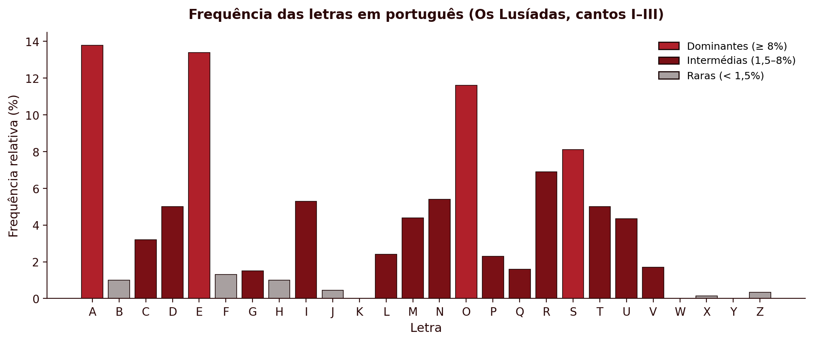
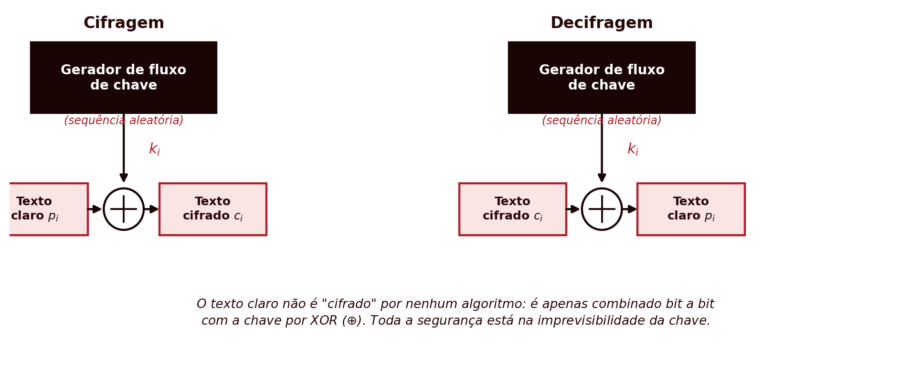

## Introdução {#sec-01-intro .unnumbered}

A criptografia é a disciplina que estuda técnicas de protecção da informação através da sua transformação numa forma ilegível a quem não possua a chave para a reverter. Este capítulo introduz os conceitos fundamentais que atravessam toda a disciplina, o modelo de cifra simétrica, o princípio de Kerckhoffs, a distinção entre força bruta e criptanálise, e depois percorre as cifras clássicas: sistemas de substituição e de transposição desenvolvidos ao longo de séculos, antes do aparecimento do computador.

Estas cifras estão hoje completamente obsoletas do ponto de vista da segurança prática, sendo triviais de quebrar com os meios computacionais actuais. O seu valor neste módulo é pedagógico: introduzem, de forma simples e manual, os conceitos de chave, espaço de chaves, ataque por força bruta e criptanálise que se aplicam, com a mesma lógica, aos sistemas modernos estudados nos capítulos seguintes.

## Fundamentos dos Sistemas Criptográficos {#sec-01-fundamentos}

### Classificação dos sistemas criptográficos {#sec-01-classificacao}

Os sistemas criptográficos classificam-se segundo três critérios independentes:

| Critério | Categorias |
|:--|:--|
| Número de chaves | **Simétrica** (uma única chave, partilhada entre emissor e receptor) ou **assimétrica** (duas chaves distintas, uma pública e outra privada) |
| Tipo de operação | **Substituição** (cada símbolo é substituído por outro) ou **transposição** (os símbolos mantêm-se, mas a sua ordem é alterada) |
| Processamento do texto | **Cifra de bloco** (o texto é processado em blocos de tamanho fixo) ou **cifra de fluxo** (o texto é processado continuamente, símbolo a símbolo) |

Este capítulo ocupa-se exclusivamente de sistemas **simétricos** e de **substituição** ou **transposição**. Os capítulos seguintes introduzem as cifras de bloco e de fluxo modernas.

### O modelo de cifra simétrica {#sec-01-modelo}

Um sistema criptográfico simétrico define-se por cinco componentes [@Stallings2020]:

- **Texto claro** ($X$): a mensagem original, ainda inteligível.
- **Algoritmo de cifragem** ($E$): o procedimento que transforma o texto claro em texto cifrado, através de substituições e transformações sucessivas.
- **Chave secreta** ($K$): um valor independente do texto claro e do algoritmo, partilhado entre emissor e receptor por um canal seguro. Chaves diferentes produzem resultados diferentes para o mesmo texto claro e o mesmo algoritmo.
- **Texto cifrado** ($Y$): o resultado da cifragem, aparentemente aleatório e, à partida, ininteligível.
- **Algoritmo de decifragem** ($D$): essencialmente o algoritmo de cifragem em sentido inverso, que usa a mesma chave $K$ para recuperar o texto claro a partir do texto cifrado.

Formalmente:

$$Y = E(K, X)$$
$$X = D(K, Y)$$

{#fig-01-modelo-simetrico}

Emissor e receptor têm de ter obtido cópias da mesma chave secreta por um meio seguro e mantê-la protegida (@fig-01-modelo-simetrico). Se alguém descobrir a chave e conhecer o algoritmo, toda a comunicação cifrada com essa chave torna-se legível.

### O princípio de Kerckhoffs {#sec-01-kerckhoffs}

Um pressuposto fundamental de toda a criptografia moderna, e já presente nestas cifras clássicas, é o **princípio de Kerckhoffs**, formulado em 1883 [@Kerckhoffs1883]: a segurança de uma cifra deve depender apenas do segredo da chave, nunca do segredo do algoritmo. Assume-se sempre que um atacante conhece perfeitamente o algoritmo de cifragem e decifragem, apenas desconhecendo a chave.

Esta convenção tem uma consequência prática importante: um algoritmo cuja segurança dependa de permanecer secreto (*security through obscurity*) não é considerado seguro em criptografia séria, precisamente porque essa condição é impossível de garantir a longo prazo. Os algoritmos estudados neste módulo são todos públicos e amplamente escrutinados: a sua segurança assenta inteiramente no tamanho e no segredo da chave.

### Força bruta e criptanálise {#sec-01-ataques}

Um atacante que pretenda recuperar o texto claro sem conhecer a chave dispõe de duas estratégias gerais:

- **Força bruta**: testar exaustivamente todas as chaves possíveis, até encontrar uma que produza um texto claro inteligível. Em média, é necessário testar cerca de metade do espaço total de chaves para obter um resultado.
- **Criptanálise**: explorar conhecimento adicional sobre partes do sistema, como pares de texto claro e texto cifrado já conhecidos, ou propriedades estatísticas do algoritmo, para deduzir a chave sem a testar exaustivamente.

A criptanálise clássica sobre as cifras estudadas neste capítulo baseia-se sobretudo em **análise de frequência**: a distribuição estatística das letras numa língua natural não é uniforme, e essa assimetria sobrevive, de formas variáveis, à cifragem.

Consoante a informação disponível ao criptanalista, distinguem-se vários tipos de ataque [@Stallings2020]:

| Tipo de ataque | O que o criptanalista conhece |
|:--|:--|
| Apenas texto cifrado | O algoritmo e o texto cifrado |
| Texto claro conhecido | O algoritmo, o texto cifrado, e um ou mais pares texto claro/texto cifrado formados com a mesma chave |
| Texto claro escolhido | O algoritmo, o texto cifrado, e um texto claro escolhido pelo próprio atacante, com o correspondente texto cifrado |
| Texto cifrado escolhido | O algoritmo, o texto cifrado, e um texto cifrado escolhido pelo próprio atacante, com o correspondente texto decifrado |
| Texto escolhido | O conhecimento acumulado dos dois ataques anteriores |

## Cifras de Substituição {#sec-01-substituicao}

Numa cifra de substituição, cada símbolo do texto claro é **substituído** por outro símbolo, segundo uma regra fixa determinada pela chave. A ordem dos símbolos mantém-se inalterada; o que muda é a sua identidade.

### A cifra de César {#sec-01-cesar}

A cifra de César, atribuída a Júlio César, é a cifra de substituição mais simples: cada letra é substituída pela letra que se encontra $k$ posições mais à frente no alfabeto, sendo $k$ a chave. Por exemplo, com $k = 3$:

::: {.httpmsg}
```
Texto claro:   G U A R D A   B E M   O   T E U   S E G R E D O
Texto cifrado: J X D U G D   E H P   R   W H X   V H J U H G R
```
:::

Numerando as letras do alfabeto de 0 (A) a 25 (Z), a cifra de César define-se formalmente por:

$$C = E(k, p) = (p + k) \bmod 26$$
$$p = D(k, C) = (C - k) \bmod 26$$

| A | B | C | D | E | F | G | H | I | J | K | L | M | N | O | P | Q | R | S | T | U | V | W | X | Y | Z |
|:-:|:-:|:-:|:-:|:-:|:-:|:-:|:-:|:-:|:-:|:-:|:-:|:-:|:-:|:-:|:-:|:-:|:-:|:-:|:-:|:-:|:-:|:-:|:-:|:-:|:-:|
| 0 | 1 | 2 | 3 | 4 | 5 | 6 | 7 | 8 | 9 | 10 | 11 | 12 | 13 | 14 | 15 | 16 | 17 | 18 | 19 | 20 | 21 | 22 | 23 | 24 | 25 |

A operação módulo 26 garante que o resultado se mantém sempre dentro do intervalo válido: quando a soma ultrapassa 25, o resto da divisão por 26 devolve-a ao alfabeto. Por exemplo, cifrando a letra "y" ($p = 24$) com $k = 3$: $C = (24 + 3) \bmod 26 = 27 \bmod 26 = 1$, que corresponde à letra "B".

**Espaço de chaves e força bruta.** A chave $k$ só pode tomar 25 valores distintos (excluindo $k = 0$, que não cifra nada, e $k = 26$, equivalente a $k = 0$). Um espaço de chaves tão reduzido torna a cifra de César trivialmente vulnerável a um ataque de força bruta: basta gerar as 25 hipóteses de texto decifrado e identificar a única que é inteligível.

**Criptanálise por análise de frequência.** Mesmo sem recorrer a força bruta, a cifra de César quebra-se facilmente por criptanálise, explorando duas fontes de informação: a estrutura do texto (os espaços entre palavras sobrevivem à cifragem, revelando o comprimento de cada palavra) e a língua do texto claro (permitindo procurar padrões de palavras curtas e frequentes, como "de", "que", "não", "para"). Combinando estas pistas com a frequência relativa de cada letra, que numa língua natural está longe de ser uniforme, um criptanalista consegue tipicamente recuperar a chave em poucos minutos.

::: {.callout-note}
#### Porque é tão fácil quebrar

A facilidade da criptanálise não está apenas no algoritmo em si, mas no facto de o atacante dispor de muito mais informação do que apenas o algoritmo e o texto cifrado: conhece a língua da mensagem e a sua estrutura (onde começam e acabam as palavras). Ocultar a estrutura, retirando os espaços do texto cifrado, dificulta o ataque manual, mas não o torna impossível: outros aspectos estatísticos da língua, como a frequência de pares de letras consecutivas, continuam disponíveis.
:::

**Exercício resolvido: criptanálise por dígrafos e trígrafos.** Uma palavra curta que se repita na mensagem, como palavra separada e completa, produz sempre o mesmo bloco de letras no texto cifrado, já que a cifra de César aplica um deslocamento fixo. Considere-se o seguinte texto cifrado:

::: {.httpmsg}
```
Texto cifrado: V   X B L   Z L   V B C L   U H V   L   V   X B L   Z L   C L
```
:::

O texto tem dois blocos que se repetem, cada um duas vezes: **XBL** e **ZL**. Em português, "QUE" é o trígrafo mais comum como palavra isolada, e "SE" um dos dígrafos mais comuns. Assumindo que XBL corresponde a "QUE" e ZL a "SE":

$$k = (\text{X} - \text{Q}) \bmod 26 = (23 - 16) \bmod 26 = 7$$
$$k = (\text{Z} - \text{S}) \bmod 26 = (25 - 18) \bmod 26 = 7$$

As duas hipóteses concordam no mesmo $k = 7$, o que confirma a correspondência sem qualquer tentativa de força bruta. Note-se que é essencial que "QUE" e "SE" apareçam como palavras separadas, nunca embutidas dentro de outra palavra maior (por exemplo, "SE" dentro de "SEGUNDA" não contaria), já que só uma palavra isolada repetida garante um bloco de texto cifrado idêntico.

Com $k = 7$ conhecido, o resto do texto decifra-se de imediato, palavra a palavra, incluindo os dois blocos ainda por identificar (**VBCL** e **CL**, ambos curtos e fáceis de confirmar assim que se sabe o deslocamento):

::: {.httpmsg}
```
Texto claro:   O   Q U E   S E   O U V E   N A O   E   O   Q U E   S E   V E
```
:::

"O que se ouve não é o que se vê."

::::: {.callout-tip}
#### Exercício: quebrar sem ajuda

Aplicando a mesma técnica, quebre o texto cifrado seguinte (desta vez sem espaços entre palavras):

::: {.httpmsg}
```
ZBFPDPGPYLZPZBFPDPZFGP
```
:::
:::::

### Cifra monoalfabética {#sec-01-monoalfabetica}

A cifra de César é um caso particular, muito restrito, de uma classe mais geral: a **cifra monoalfabética**, em que a chave é uma permutação arbitrária das 26 letras do alfabeto, não apenas um deslocamento fixo. O espaço de chaves cresce de 25 para $26! \approx 4 \times 10^{26}$, tornando um ataque de força bruta computacionalmente inviável. Por exemplo:

| A | B | C | D | E | F | G | H | I | J | K | L | M | N | O | P | Q | R | S | T | U | V | W | X | Y | Z |
|:-:|:-:|:-:|:-:|:-:|:-:|:-:|:-:|:-:|:-:|:-:|:-:|:-:|:-:|:-:|:-:|:-:|:-:|:-:|:-:|:-:|:-:|:-:|:-:|:-:|:-:|
| Q | M | J | Z | T | G | F | K | P | W | L | S | B | O | X | N | C | R | Y | E | V | H | I | A | D | U |

::: {.httpmsg}
```
F V Q R Z Q   M T B   X   E T V   Y T F R T Z X
```
:::

Apesar do espaço de chaves astronomicamente maior, a cifra monoalfabética continua vulnerável a criptanálise por análise de frequência: como cada letra do texto claro corresponde sempre à mesma letra no texto cifrado, a distribuição estatística das letras do texto claro transporta-se, intacta, para o texto cifrado, apenas com os símbolos trocados. Basta comparar a frequência das letras no texto cifrado com a frequência conhecida das letras na língua do texto claro para reconstruir grande parte da correspondência.

Em português, a distribuição das letras está longe de ser uniforme: A, E e O dominam claramente, seguidos por um grupo intermédio (S, R, I, N, D, M, U, T, C), e um conjunto de letras raras (Z, J, X e, sobretudo, K, W, Y, praticamente ausentes em palavras portuguesas). Os valores seguintes resultam de uma contagem real, sobre os três primeiros cantos d'*Os Lusíadas*, de Luís de Camões (**cerca de 103.000 caracteres alfabéticos**), com o alfabeto normalizado para `a`–`z`, sem acentuação nem cedilha. Serve aqui apenas de exemplo aproximado. Para um trabalho profissional convirá usar um *corpus* maior e mais atualizado:

{#fig-01-frequencia-letras}

Contando as letras do texto cifrado do exemplo anterior ("FVQRZQ MTB X ETV YTFRTZX", 20 letras):

| Letra cifrada | Ocorrências | Observado |
|:-:|:-:|:-:|
| T | 4 | 20,0% |
| F | 2 | 10,0% |
| V | 2 | 10,0% |
| Q | 2 | 10,0% |
| R | 2 | 10,0% |
| Z | 2 | 10,0% |
| X | 2 | 10,0% |
| M | 1 | 5,0% |
| B | 1 | 5,0% |
| E | 1 | 5,0% |
| Y | 1 | 5,0% |

Comparando esta lista com o gráfico de referência (@fig-01-frequencia-letras): T seria o candidato óbvio a corresponder a A ou E (as letras dominantes da língua), mas seis letras diferentes empatam logo a seguir a 10%, sem nenhuma se destacar como o esperado segundo lugar. Com apenas 20 letras, cada ocorrência isolada vale 5 pontos percentuais, o que basta para distorcer completamente o quadro — a conclusão de que este texto é curto demais para uma análise de frequência séria não é uma suposição, é o que a própria tabela mostra. Considere-se, em vez disso, um texto real e bastante mais longo, cifrado com a mesma chave: a primeira estrofe de *Os Lusíadas*, de Luís de Camões (1572).

> As armas e os barões assinalados,\
> Que da ocidental praia Lusitana,\
> Por mares nunca de antes navegados,\
> Passaram ainda além da Taprobana,\
> Em perigos e guerras esforçados,\
> Mais do que prometia a força humana,\
> E entre gente remota edificaram\
> Novo Reino, que tanto sublimaram.

Sem acentuação e sem espaços, as 221 letras deste excerto cifram-se, com a mesma chave usada acima, da seguinte forma:

::: {.httpmsg}
```
QYQRBQYTXYMQRXTYQYYPOQSQZXY
CVTZQXJPZTOEQSNRQPQSVYPEQOQ
NXRBQRTYOVOJQZTQOETYOQHTFQZXY
NQYYQRQBQPOZQQSTBZQEQNRXMQOQ
TBNTRPFXYTFVTRRQYTYGXRJQZXY
BQPYZXCVTNRXBTEPQQGXRJQKVBQOQ
TTOERTFTOETRTBXEQTZPGPJQRQB
OXHXRTPOXCVTEQOEXYVMSPBQRQB
```
:::

Contando agora as letras deste texto cifrado (221 letras):

| Letra cifrada | Ocorrências | Observado |
|:-:|:-:|:-:|
| Q | 42 | 19,00% |
| T | 25 | 11,31% |
| Y | 19 | 8,60% |
| R | 18 | 8,14% |
| X | 18 | 8,14% |
| O | 15 | 6,79% |
| B | 12 | 5,43% |
| P | 12 | 5,43% |
| Z | 10 | 4,52% |
| E | 10 | 4,52% |
| V | 8 | 3,62% |
| N | 6 | 2,71% |
| S | 5 | 2,26% |
| J | 5 | 2,26% |

Ao contrário do exemplo curto, o par dominante do texto cifrado (Q, T) corresponde de imediato ao par dominante da língua (A, E) — uma correspondência directa e segura, porque a distância entre estes dois valores e o terceiro colocado é grande o suficiente para não deixar dúvidas. A partir daí, porém, a correspondência directa deixa de ser fiável: tanto o texto cifrado como o gráfico de referência (@fig-01-frequencia-letras) têm vários valores muito próximos ou mesmo empatados a partir da 3.ª posição (8,14% e 8,14%; 5,43% e 5,43%; 4,52% e 4,52%), e com apenas 221 letras estas pequenas diferenças não são estatisticamente significativas. Fazendo a correspondência posição a posição de forma puramente mecânica, sem qualquer outra pista:

| # | Letra cifrada | Ref. PT | Candidato directo | Chave real | Acerto? |
|:-:|:-:|:-:|:-:|:-:|:-:|
| 1 | Q (19,00%) | A (13,80%) | Q→A | Q→A | sim |
| 2 | T (11,31%) | E (13,40%) | T→E | T→E | sim |
| 3 | Y (8,60%) | O (11,60%) | Y→O | Y→S | não |
| 4 | R (8,14%) | S (8,10%) | R→S | R→R | não |
| 5 | X (8,14%) | R (6,90%) | X→R | X→O | não |
| 6 | O (6,79%) | N (5,40%) | O→N | O→N | sim |
| 7 | B (5,43%) | I (5,30%) | B→I | B→M | não |
| 8 | P (5,43%) | D (5,00%) | P→D | P→I | não |
| 9 | Z (4,52%) | T (5,00%) | Z→T | Z→D | não |
| 10 | E (4,52%) | M (4,40%) | E→M | E→T | não |
| 11 | V (3,62%) | U (4,35%) | V→U | V→U | sim |
| 12 | N (2,71%) | C (3,20%) | N→C | N→P | não |
| 13 | S (2,26%) | L (2,40%) | S→L | S→L | sim |
| 14 | J (2,26%) | P (2,30%) | J→P | J→C | não |

Apenas 5 das 14 correspondências (36%) coincidem com a chave real, e a partir da 3.ª posição a hipótese directa já falha. Isto não é uma fraqueza deste exemplo em particular: é a situação real de qualquer texto intercetado de comprimento moderado. A análise de frequência sozinha nunca chega a decifrar uma mensagem: apenas estreita as hipóteses para as letras mais e menos comuns, deixando a maioria por resolver.

**Análise de dígrafos e trígrafos, outra vez.** Para ir mais além, o criptanalista volta à técnica já usada atrás com "QUE" e "SE": procurar blocos de letras que se repetem no texto cifrado e testá-los contra palavras curtas e frequentes da língua. Como se trata de uma substituição simples, uma palavra que se repita no texto claro produz sempre o mesmo bloco no texto cifrado, mesmo sem espaços visíveis a marcar onde ela começa e acaba. Contando os blocos de 3, 4 e 5 letras que se repetem nas 221 letras do texto cifrado, destacam-se quatro:

| Bloco cifrado | Repetições | Hipótese | Palavra(s) plausível(eis) |
|:-:|:-:|:-:|:-:|
| CVT | 3× | Q-U-E | "que" (aparece 3× na estrofe) |
| QZXY | 3× | A-D-?-S | sufixo "-ados" (assinalados, navegados, esforçados) |
| QRQB | 3× | A-R-A-? | sufixo "-aram" (passaram, edificaram, sublimaram) |
| GXRJQ | 2× | ?-O-R-?-A | "força" / "esforça-" |

Como já se sabe, do par dominante, que Q corresponde a A, as três primeiras hipóteses ficam de imediato confirmadas pela letra inicial comum a todas: CVT, QZXY e QRQB começam todas por um bloco já reconhecível. Isto dá, de uma só vez, mais oito correspondências — C→Q, V→U, Z→D, X→O, Y→S, R→R, B→M, G→F, J→C — que, juntas às duas já conhecidas (Q→A, T→E), totalizam onze letras da chave recuperadas sem qualquer tentativa de força bruta. Aplicando-as às duas primeiras linhas da estrofe:

::: {.httpmsg}
```
QYQRBQYTXYMQRXTYQYYPOQSQZXY  ->  ASARMASEOS_AROESASS__A_ADOS
CVTZQXJPZTOEQSNRQPQSVYPEQOQ  ->  QUEDAOC_DE__A__RA_A_US__A_A
```
:::

Os espaços em branco que restam fecham-se por vocabulário, não por frequência: "OS \_AROES" são provavelmente "OS BARÕES"; "ASS\_\_A\_ADOS" são provavelmente "ASSINALADOS"; "OC\_DENTAL" são provavelmente "OCIDENTAL"; "PRA\_A" são provavelmente "PRAIA"; "\_US\_TANA" são provavelmente "LUSITANA". O resultado final:

> As armas e os barões assinalados,\
> Que da ocidental praia Lusitana,

Note-se o essencial: chegou-se aqui combinando três fontes de informação diferentes — frequência de letras isoladas, repetição de blocos, e conhecimento da língua — nunca por uma correspondência mecânica única. É esta combinação, não qualquer técnica isolada, que faz da análise de frequência uma ferramenta eficaz na prática.

::: {.callout-note}
#### E se o texto cifrado preservasse os espaços?

Se, em vez de ocultar os espaços entre palavras, o texto cifrado os mantivesse, o ataque muda de método: as palavras curtas do português formam um vocabulário fechado e quase inconfundível. Cifrando a mesma estrofe, mas preservando os espaços:

::: {.httpmsg}
```
AS ARMAS E OS BAROES ASSINALADOS  ->  QY QRBQY T XY MQRXTY QYYPOQSQZXY
QUE DA OCIDENTAL PRAIA LUSITANA   ->  CVT ZQ XJPZTOEQS NRQPQ SVYPEQOQ
```
:::

Contando o comprimento das palavras cifradas ao longo de toda a estrofe: as de 1 letra só podem ser "e" ou "a" ou "o" (as únicas palavras de uma letra da língua); as de 2 letras pertencem a um conjunto pequeno e fechado ("as", "os", "da", "de", "em", "do",...); e a única palavra de 3 letras que se repete três vezes tem uma alta probabilidade de ser "que". Isto identifica de imediato dez letras da chave (A, E, S, O, D, M, Q, U, P, R), sem contar uma única frequência de letra isolada. Preservar os espaços facilita tanto o ataque que, na prática, qualquer cifra usada a sério os remove sempre.
:::

### Cifra de Playfair {#sec-01-playfair}

A cifra de Playfair reduz o problema anterior ao cifrar **pares de letras** (dígrafos), não letras isoladas, usando uma grelha $5 \times 5$ construída a partir de uma palavra-chave. Ao cifrar pares em vez de letras individuais, a distribuição de frequências de letras isoladas deixa de se transportar directamente para o texto cifrado, dificultando a análise de frequência simples.

**Construção da grelha.** Escolhe-se uma palavra-chave, escrevem-se as suas letras (sem repetições) nas primeiras posições da grelha, e completam-se as posições restantes com as letras do alfabeto por ordem, saltando as já usadas. Como a grelha só tem 25 posições para 26 letras, "I" e "J" partilham a mesma célula. Com a palavra-chave "REDIAL" (uma aldeia do concelho de Murça):

{#fig-01-playfair-grelha width=44%}

**Regras de cifragem**, aplicadas a cada par de letras do texto claro:

- Se as duas letras estão na **mesma linha**, cada uma é substituída pela letra imediatamente à sua direita (voltando ao início da linha, se necessário).
- Se as duas letras estão na **mesma coluna**, cada uma é substituída pela letra imediatamente abaixo (voltando ao topo, se necessário).
- Caso contrário, cada letra é substituída pela letra que está na sua própria linha, mas na coluna da outra letra (as duas letras e as suas substitutas formam um rectângulo na grelha).

Se as duas letras de um par forem iguais, ou se sobrar uma letra no fim de um texto com número ímpar de letras, insere-se uma letra de enchimento (aqui, "X").

Considere-se a frase "UTAD É FIXE". Sem espaços nem acentos, e dividida em pares (a última letra, sozinha, recebe um "X" de enchimento):

::: {.httpmsg}
```
UT AD EF IX EX
```
:::

Aplicando as regras: "UT" está na mesma linha (U e T na 4.ª linha) → PU. "AD" está na mesma linha (a 1.ª) → RI. "EF" não partilha linha nem coluna → forma-se o rectângulo, dando IB. "IX" e "EX", também sem linha nem coluna comuns, dão DY e DW, respectivamente. O texto cifrado final:

::: {.httpmsg}
```
PURIIBDYDW
```
:::

Ainda assim, a Playfair permanece vulnerável: a distribuição de frequências dos pares de letras (dígrafos) numa língua natural também não é uniforme, e essa assimetria sobrevive à cifragem de forma análoga à das letras isoladas. Um criptanalista com texto cifrado suficiente consegue reconstruir a grelha através de análise de frequência de dígrafos.

### Cifra polialfabética: Vigenère {#sec-01-vigenere}

As cifras anteriores partilham uma fragilidade estrutural: cada letra do texto claro corresponde sempre à mesma letra (ou par de letras) no texto cifrado, ao longo de toda a mensagem. As **cifras polialfabéticas** eliminam esta correspondência fixa, usando várias substituições diferentes ao longo do texto, alternadas segundo uma palavra-chave que se repete ciclicamente.

Na cifra de Vigenère, a palavra-chave define uma sequência de deslocamentos (cada letra da chave corresponde a um deslocamento de César diferente), aplicados ciclicamente às sucessivas letras do texto claro. Sendo $m$ o comprimento da palavra-chave, e $k_0, k_1, \dots, k_{m-1}$ os deslocamentos que ela define:

$$C_i = (p_i + k_{i \bmod m}) \bmod 26 \qquad p_i = (C_i - k_{i \bmod m}) \bmod 26$$

Como a chave é mais curta do que a mensagem ($m$ é tipicamente muito menor do que o número de letras do texto claro), o índice $i \bmod m$ garante que ela se repete ciclicamente até cobrir todo o texto. A mesma letra do texto claro pode assim corresponder a letras diferentes no texto cifrado, consoante a posição em que ocorre, o que achata consideravelmente a distribuição de frequências observável no texto cifrado.

A @fig-01-achatamento-frequencia mostra este efeito de forma directa: para cada cifra, ordenam-se as letras do texto cifrado da mais para a menos frequente e normaliza-se pela frequência da letra mais comum. O texto claro produz uma curva muito inclinada, com um pequeno número de letras a dominar. A Playfair achata-a moderadamente, ao substituir pares de letras em vez de letras isoladas. A Vigenère achata-a ainda mais, precisamente pelo mecanismo descrito acima. Uma cifra polialfabética com uma chave tão longa quanto (pseudo)aleatória aproxima-se de uma recta praticamente horizontal, sem qualquer letra a destacar-se — é essa recta que o One-Time Pad, mais adiante, atinge de forma perfeita.

{#fig-01-achatamento-frequencia width=70%}

Usando de novo a chave "REDIAL", repetida tantas vezes quantas as necessárias para cobrir todo o texto claro, e o trava-línguas "Três tigres tristes dormem":

::: {.httpmsg}
```
Chave:          R E D I A L R E D I A L R E D I A L R E D I A
Texto claro:    T R E S T I G R E S T R I S T E S D O R M E M
Texto cifrado:  K V H A T T X V H A T C Z W W M S O F V P M M
                  ^ ^ ^       ^ ^ ^
```
:::

Repare-se no bloco **VHA**, que aparece duas vezes no texto cifrado. Não é uma palavra repetida desta vez, é uma coincidência genuína do próprio trava-línguas: a sequência "RES" surge em "T**RES**" e, por acaso, também em "tig**RES**", exactamente 6 posições depois. Como a chave "REDIAL" também tem 6 letras, as duas ocorrências de "RES" alinham-se com a chave da mesma forma, produzindo o mesmo bloco cifrado. Este é o princípio por trás do exame de Kasiski: sempre que um trecho do texto claro se repete a uma distância múltipla do comprimento da chave, mesmo por coincidência, o texto cifrado correspondente repete-se também, e essa repetição visível é uma pista directa sobre o comprimento da chave — aqui, 6.

A cifra de Vigenère resistiu a criptanálise sistemática durante séculos, mas não é inquebrável: se a chave for curta e repetida muitas vezes ao longo de um texto suficientemente longo, técnicas como o exame de Kasiski (identificação de repetições no texto cifrado, que revelam múltiplos do comprimento da chave) permitem recuperar o comprimento da chave e, a partir daí, tratar o texto como várias cifras de César independentes, uma por posição dentro do ciclo da chave.

Sabendo já, só pelo exame de Kasiski, que a chave tem 6 letras (sem ainda saber quais), o criptanalista reagrupa o texto cifrado: todas as letras nas posições 1, 7, 13, 19, ... formam um primeiro grupo; as posições 2, 8, 14, 20, ... formam um segundo grupo; e assim sucessivamente até ao sexto grupo. Cada grupo, tomado isoladamente, é uma cifra de César comum, com um único $k$ fixo, exactamente o tipo de problema já resolvido na secção anterior:

::: {.httpmsg}
```
Grupo 1 (pos. 1, 7, 13, 19):  K X Z F
Grupo 2 (pos. 2, 8, 14, 20):  V V W V
Grupo 3 (pos. 3, 9, 15, 21):  H H W P
Grupo 4 (pos. 4, 10, 16, 22): A A M M
Grupo 5 (pos. 5, 11, 17, 23): T T S M
Grupo 6 (pos. 6, 12, 18):     T C O
```
:::

Note-se que isto não contradiz o que se disse atrás sobre a Vigenère achatar a distribuição de frequências: essa distorção afecta o texto cifrado *como um todo*, onde letras cifradas com deslocamentos diferentes se misturam. Dentro de cada grupo isolado, porém, foi sempre usado o mesmo deslocamento, pelo que a distribuição volta a ser a de uma César normal, sem achatamento nenhum. O exame de Kasiski e a análise de frequência resolvem, por isso, dois problemas diferentes e complementares: um dá o número de grupos a formar (o comprimento da chave); o outro, aplicado depois a cada grupo separadamente, dá o deslocamento de cada um.

A cada grupo aplica-se, isoladamente, a mesma análise de frequência de letra única usada contra a cifra de César: qual a letra mais frequente deste grupo, e a que letra da língua deverá corresponder? Neste exemplo, com apenas 3 a 4 letras por grupo, não há dados suficientes para essa análise ser fiável, tal como já se viu antes com textos curtos; num texto real, bastante mais longo, cada grupo teria dezenas ou centenas de letras, e o método funciona tão bem quanto funcionou contra a César.

### Cifra de Vernam {#sec-01-vernam}

Antes de se chegar à solução definitiva, vale a pena um passo intermédio. A **cifra de Vernam**, criada por Gilbert Vernam nos laboratórios AT&T em 1918 para telegrafia [@Stallings2020], generaliza a Vigenère de duas formas: substitui a soma modular por uma operação **XOR** ao nível dos bits, e usa uma chave muito mais longa do que a palavra-chave curta típica da Vigenère, ao ponto de, na prática, ser tão longa quanto a própria fita de papel perfurado que a implementava.

$$C_i = P_i \oplus K_{i \bmod m} \qquad P_i = C_i \oplus K_{i \bmod m}$$

{#fig-01-vernam-gerador width=95%}

Uma chave muito mais longa dificulta consideravelmente o exame de Kasiski, já que as repetições no texto cifrado tornam-se muito mais raras. Mas o problema de fundo não desaparece: mais cedo ou mais tarde, mesmo uma fita de chave muito longa esgota-se e tem de recomeçar, voltando a introduzir um ciclo, ainda que muito maior do que o de uma palavra-chave Vigenère. A cifra de Vernam é, por isso, uma melhoria substancial sobre a Vigenère, mas não uma solução definitiva: continua vulnerável, em princípio, ao mesmo tipo de criptanálise, apenas exigindo mensagens interceptadas muito mais longas para se tornar praticável.

Note-se uma limitação estrutural da cifra de Vernam, tal como concebida originalmente: usa apenas uma chave, sem qualquer outro valor que distinga uma mensagem da seguinte. É precisamente essa ausência que obriga a fita de chave a repetir-se assim que se esgota. As cifras de fluxo modernas, retomadas no capítulo 4, resolvem este problema introduzindo um segundo valor, o *nonce*, único por mensagem mas não secreto, que permite reutilizar a mesma chave em segurança de mensagem para mensagem, sem nunca repetir o fluxo de chave.

### One-Time Pad {#sec-01-otp}

O **One-Time Pad** (cifra de utilização única) resolve definitivamente a fragilidade que a cifra de Vernam apenas atenuava: usa uma chave verdadeiramente aleatória, do mesmo comprimento que a mensagem, nunca reutilizada noutra mensagem, e por isso nunca sujeita a ciclo nenhum. Cada letra do texto claro é combinada com a letra correspondente da chave, tal como no Vigenère, mas sem qualquer ciclo, uma vez que a chave é tão longa quanto o próprio texto.

Claude Shannon demonstrou, em 1949, que o One-Time Pad, quando usado correctamente, é **matematicamente inquebrável**: o texto cifrado não revela nenhuma informação sobre o texto claro, mesmo com poder computacional ilimitado [@Shannon1949]. Esta propriedade chama-se **segredo perfeito**.

**Um exemplo concreto de segredo perfeito.** Para qualquer texto cifrado $C$ e qualquer texto claro $P$ do mesmo comprimento, existe sempre exactamente uma chave $K = (C - P) \bmod 26$ que os liga. Como todas as chaves são, à partida, igualmente prováveis, o texto cifrado não favorece nenhuma leitura em detrimento de outra: para um mesmo texto cifrado, existe sempre uma chave que o decifra em qualquer texto claro que se queira, do mesmo comprimento.

Isto demonstra-se de forma concreta. Fixando um único texto cifrado de 16 letras, encontram-se três chaves diferentes que o decifram em três frases portuguesas plausíveis, sobre o mesmo assunto e mutuamente incompatíveis entre si:

::: {.httpmsg}
```
Texto cifrado (fixo):                 Q X B Z R P P N M N R S X S N J

Chave 1: Q F X M K P L V T N Z O R Y W J
Decifra para: A SENHA ESTA SEGURA

Chave 2: Q V U Z W L K Z E W D Y W S K J
Decifra para: A CHAVE FOI ROUBADA

Chave 3: C E N P N C C T Z L R G D P Z P
Decifra para: O TOKEN NUNCA MUDOU
```
:::

As três decifragens são correctas: cada uma resulta de aplicar $p = (C - K) \bmod 26$, letra a letra, com a respectiva chave. Um atacante que intercepte apenas `QXBZRPPNMNRSXSNJ`, sem conhecer a chave, não tem forma alguma de saber se a senha está segura, foi roubada, ou se, afinal, o assunto era antes o token, e nunca a senha. As três leituras, e infinitas outras do mesmo comprimento, são igualmente compatíveis com o texto cifrado.

O mesmo efeito reproduz-se em qualquer língua. Com um texto cifrado diferente, de 19 letras, obtêm-se três leituras em inglês, também mutuamente incompatíveis:

::: {.httpmsg}
```
Ciphertext (fixed):                     J O B P D C R H E U G R W H U X Z G H

Key 1: X Q M P L K V T N R O Y W J C F Z B D
Decrypts to: MY PASSWORD STAYS SAFE

Key 2: Q H T X L Y P Q A B A D D P B J O C U
Decrypts to: THIS SECRET GOT STOLEN

Key 3: Q H T X D N J X A W K R E P N X I C E
Decrypts to: THIS API KEY WAS SHARED
```
:::

Apesar desta garantia teórica absoluta, o One-Time Pad é impraticável na generalidade dos cenários reais, por três exigências difíceis de satisfazer em simultâneo:

- a chave tem de ser tão longa quanto a mensagem;
- a chave tem de ser genuinamente aleatória, não gerada por um algoritmo determinístico;
- a chave nunca pode ser reutilizada, nem parcialmente.

Distribuir e armazenar chaves deste tamanho, de forma segura, é tão difícil quanto distribuir a própria mensagem em segurança. A isto acresce um custo menos óbvio: gerar, de forma genuinamente aleatória, e depois gerir com segurança um grande volume de chaves desta dimensão tem também um custo computacional apreciável, que pode tornar o processo lento de mais para a generalidade das aplicações práticas. Estas exigências combinadas limitam o uso do One-Time Pad a cenários muito específicos, como certas comunicações diplomáticas ou militares de importância excepcional.

## Cifras de Transposição {#sec-01-transposicao}

Ao contrário das cifras de substituição, as **cifras de transposição** não alteram a identidade dos símbolos do texto claro, apenas a sua ordem. O texto cifrado contém exactamente as mesmas letras do texto claro, apenas reorganizadas segundo uma regra determinada pela chave.

### A técnica rail fence {#sec-01-rail-fence}

A forma mais simples de transposição é a técnica **rail fence** (cerca de caminho de ferro): o texto claro escreve-se alternadamente em duas linhas, formando um ziguezague, e o texto cifrado obtém-se lendo primeiro a linha de cima, depois a linha de baixo, sem interrupções.

Para o texto claro "ESCONDE BEM A CHAVE" (sem espaços, 16 letras):

{#fig-01-rail-fence width=80%}

Lendo a Linha 1 seguida da Linha 2, obtém-se o texto cifrado `ECNEEAHVSODBMCAE`. Todas as letras do texto cifrado pertencem ao texto claro, apenas reordenadas, pelo que a criptanálise estatística sobre a frequência de letras isoladas continua perfeitamente viável, tal como se discutirá adiante nesta secção.

### Transposição colunar {#sec-01-transposicao-colunar}

Uma técnica mais elaborada é a **transposição colunar**: o texto claro é escrito numa grelha com um número de colunas igual ao comprimento da palavra-chave, e o texto cifrado obtém-se lendo as colunas pela ordem alfabética das letras da palavra-chave, em vez da ordem original em que foram escritas.

Usando de novo a palavra-chave "REDIAL" — agora não para deslocar nem substituir, mas para ordenar colunas — e a frase "Isto fica só entre nós" (18 letras, exactamente três linhas de seis colunas, sem necessidade de enchimento). A cada letra da chave associa-se a sua posição na ordem alfabética (A=1, D=2, E=3, I=4, L=5, R=6), e o texto claro escreve-se por linhas, coluna a coluna, por baixo da chave:

{#fig-01-transposicao-grelha width=60%}

O texto cifrado obtém-se lendo as colunas pela ordem numérica das suas posições (não pela ordem em que aparecem na grelha): primeiro a coluna sob "A" (posição 1), depois a coluna sob "D" (posição 2), e assim sucessivamente até à coluna sob "R" (posição 6):

::: {.httpmsg}
```
FEO TSE SAR OON INS ICT
```
:::

Ou seja, "FEOTSESAROONINSICT". Note-se que todas as letras do texto claro continuam presentes no texto cifrado, na mesma quantidade; só a ordem mudou.

Uma única transposição colunar é vulnerável a criptanálise, uma vez que a distribuição de frequência de letras isoladas se mantém inteiramente inalterada, apenas a sua posição relativa muda. Há aqui uma diferença importante em relação à substituição: numa substituição, a frequência serve para adivinhar que letra do texto claro corresponde a cada letra do texto cifrado, um problema de mapeamento; numa transposição, não há mapeamento nenhum para adivinhar, já que uma letra "E" no texto cifrado é mesmo um "E" do texto original, apenas deslocado de posição. A letra mais frequente do texto cifrado é, por isso, directamente a letra mais frequente da língua, sem qualquer hipótese intermédia — o que permite, inclusive, **distinguir** uma transposição de uma substituição só pela frequência: se a letra mais frequente do texto cifrado coincide com a esperada para a língua (A ou E, em português), é sinal de transposição, não de substituição. O que a frequência de letras isoladas não revela, sozinha, é a ordem de leitura das colunas: para isso são necessárias outras pistas, como dígrafos e trígrafos frequentes partidos ao meio pela grelha, ou testar várias larguras de coluna. Repetir a transposição várias vezes, com chaves diferentes (**transposição dupla** ou múltipla), dificulta consideravelmente a reconstrução manual, ainda que continue vulnerável a ataques computacionais modernos.

Historicamente, a combinação de substituição e transposição, cada uma delas fraca isoladamente, mas fortes quando combinadas, é o princípio que dá origem aos conceitos modernos de **confusão** e **difusão**, introduzidos por Shannon e centrais no desenho das cifras de bloco modernas estudadas no capítulo seguinte.

## Síntese do Capítulo {#sec-01-sintese}

Este capítulo estabeleceu o vocabulário e os princípios fundamentais que atravessam toda a disciplina de criptografia:

1. Um sistema criptográfico simétrico define-se pelos seus cinco componentes, texto claro, algoritmo de cifragem, chave secreta, texto cifrado e algoritmo de decifragem, relacionados por $Y = E(K, X)$ e $X = D(K, Y)$
2. O **princípio de Kerckhoffs** estabelece que a segurança de uma cifra deve depender apenas do segredo da chave, nunca do segredo do algoritmo
3. Um atacante dispõe de duas estratégias gerais: **força bruta** (testar exaustivamente o espaço de chaves) e **criptanálise** (explorar informação adicional para deduzir a chave sem a testar exaustivamente)
4. As **cifras de substituição** (César, monoalfabética, Playfair, Vigenère) substituem símbolos do texto claro por outros símbolos, com vulnerabilidades decrescentes, mas nunca totalmente eliminadas, a ataques de análise de frequência
5. A **cifra de Vernam** generaliza a Vigenère com XOR e uma chave muito mais longa, atenuando mas não eliminando o problema da chave que se repete; o **One-Time Pad** elimina-o por completo, sendo a única cifra clássica matematicamente inquebrável, ao custo de exigências de gestão de chaves impraticáveis na generalidade dos cenários reais
6. As **cifras de transposição** reordenam os símbolos do texto claro sem alterar a sua identidade, sendo a base histórica dos conceitos modernos de confusão e difusão

## Para Pensar {#sec-01-reflexao}

Porque é que o One-Time Pad, apesar de matematicamente inquebrável, não é a solução universal para todos os problemas de comunicação segura? Que outro problema, tão difícil quanto o da própria mensagem, a sua utilização acaba por introduzir?

## Referências {#sec-01-referencias .unnumbered}

::: {#refs}
:::
