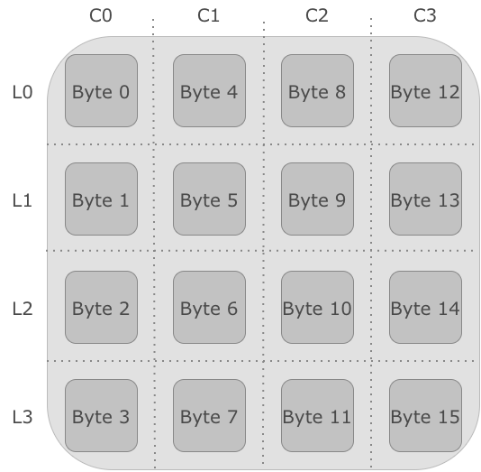
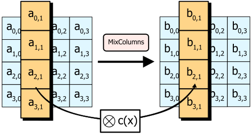
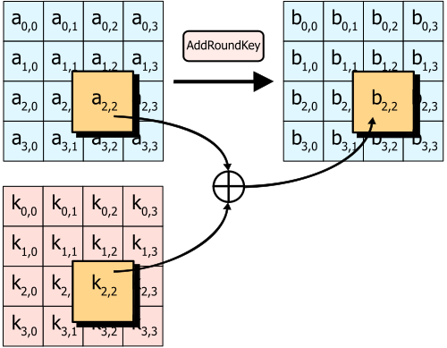

## Introdução {#sec-03-intro .unnumbered}

O capítulo anterior terminou com uma conclusão incómoda: o DES, durante décadas o pilar da cifra simétrica, está obsoleto, e o 3DES, a solução de recurso, é lento e continua limitado pelo bloco de 64 bits herdado do original. Era necessário um sucessor desenhado de raiz, não remendado. Este capítulo apresenta esse sucessor: o **AES** (*Advanced Encryption Standard*), o algoritmo de cifra simétrica hoje universalmente adoptado, de aplicações bancárias a comunicações protegidas por TLS. A segunda parte do capítulo trata de uma questão distinta, mas igualmente prática: uma cifra de bloco só cifra um bloco de cada vez, então como se cifra uma mensagem real, quase sempre maior do que isso?

## Do DES ao AES: um Novo Paradigma {#sec-03-contexto}

Em 1997, o *National Institute of Standards and Technology* (NIST) dos Estados Unidos lançou um concurso público e aberto para escolher o sucessor do DES, ao contrário do processo fechado que tinha originado o próprio DES duas décadas antes. Qualquer equipa, de qualquer país, podia submeter um algoritmo, que seria depois escrutinado publicamente por toda a comunidade criptográfica mundial.

Quinze algoritmos foram submetidos. Cinco chegaram à fase final: MARS, RC6, Rijndael, Serpent e Twofish. Em Outubro de 2000, o NIST anunciou o vencedor: **Rijndael**, desenhado pelos criptógrafos belgas Joan Daemen e Vincent Rijmen. O algoritmo foi formalizado como norma federal em 2001, sob o nome AES [@FIPS197].

**A diferença estrutural mais importante em relação ao DES não é o tamanho da chave ou do bloco, é a arquitectura interna.** O DES, como se viu, é uma rede de Feistel: em cada ronda, apenas metade do bloco atravessa a função não linear $F$, enquanto a outra metade passa praticamente incólume, apenas combinada por XOR. O AES abandona esta estrutura. É uma **rede de substituição-permutação** (*substitution-permutation network*, SPN): em cada ronda, o **bloco inteiro** é transformado, através de uma sequência de quatro operações distintas aplicadas a todos os seus bytes.

## Estrutura Geral do AES {#sec-03-estrutura}

Ao contrário do DES, em que o tamanho do bloco (64 bits) e o da chave (56 bits efectivos) estão fixados pela norma, o AES separa estas duas dimensões:

- **Bloco**: sempre **128 bits** (16 bytes), independentemente do tamanho da chave.
- **Chave**: **128, 192 ou 256 bits**, dando origem a três variantes — AES-128, AES-192 e AES-256.
- **Número de rondas**: depende do tamanho da chave — **10 rondas** para AES-128, **12** para AES-192, **14** para AES-256. Chaves maiores implicam mais rondas, porque cada ronda adicional dificulta ainda mais qualquer tentativa de análise estatística ou algébrica do algoritmo.

Internamente, o bloco de 128 bits organiza-se numa matriz $4 \times 4$ de bytes, a que se chama **estado** (*state*), preenchida coluna a coluna: os primeiros 4 bytes do bloco ocupam a primeira coluna, os 4 seguintes a segunda, e assim sucessivamente. Todas as transformações de ronda operam sobre esta matriz.

{#fig-03-aes-estado width=45%}

O AES puro é **determinístico**: o mesmo bloco de texto claro, com a mesma chave, produz sempre o mesmo bloco de texto cifrado. Esta previsibilidade é inaceitável na prática — é precisamente o problema que, como se verá adiante, obriga a recorrer a um modo de operação, que introduz aleatoriedade através de um vector de inicialização ou *nonce*.

## As Quatro Transformações de Ronda {#sec-03-transformacoes}

Cada ronda do AES (excepto a última) aplica, por esta ordem, quatro transformações à matriz de estado. Antes da primeira ronda, aplica-se ainda um `AddRoundKey` inicial, e a última ronda omite o `MixColumns`. O objectivo destas quatro operações não é apenas ocultar o texto original, mas fazê-lo de forma que uma alteração mínima, um único bit, na mensagem ou na chave, produza alterações significativas e imprevisíveis no texto cifrado — o chamado **efeito avalanche**.

### SubBytes {#sec-03-subbytes}

`SubBytes` é a única operação não linear do AES, e é ela que fornece a **confusão**: cada byte do estado é substituído pelo byte correspondente numa tabela fixa de substituição, a **S-box**, construída a partir do inverso multiplicativo no corpo finito $GF(2^8)$ seguido de uma transformação afim. Ao contrário do DES, que usa oito S-boxes diferentes (uma por grupo de 6 bits), o AES usa uma **única S-box**, reaplicada byte a byte a toda a matriz de estado.

{#fig-03-subbytes width=60%}

### ShiftRows {#sec-03-shiftrows}

`ShiftRows` desloca ciclicamente cada linha da matriz de estado para a esquerda: a linha 0 não se altera, a linha 1 desloca-se 1 posição, a linha 2 desloca-se 2 posições, a linha 3 desloca-se 3 posições. Esta operação é simples, mas essencial: garante que os bytes de uma coluna deixam de pertencer todos à mesma coluna, espalhando a influência de cada byte por várias colunas nas rondas seguintes.

{#fig-03-shiftrows width=75%}

### MixColumns {#sec-03-mixcolumns}

`MixColumns` opera sobre cada coluna da matriz de estado independentemente, tratando-a como um polinómio de grau 3 sobre $GF(2^8)$ e multiplicando-a por um polinómio fixo $c(x)$, módulo $x^4+1$. O efeito prático é que cada byte de saída de uma coluna passa a depender dos quatro bytes de entrada dessa mesma coluna. Combinado com o `ShiftRows` anterior, garante que, ao fim de poucas rondas, cada byte de saída depende de todos os bytes de entrada do bloco: é a **difusão** do AES. Esta transformação omite-se na última ronda.

{#fig-03-mixcolumns width=75%}

### AddRoundKey {#sec-03-addroundkey}

`AddRoundKey` é a única transformação que envolve a chave: cada byte do estado combina-se por XOR com o byte correspondente da subchave dessa ronda, derivada da chave principal pelo **esquema de expansão de chave** (*key schedule*). É também a única transformação que, isoladamente, seria trivial de inverter sem conhecer a chave, o que confirma que a segurança do AES depende da combinação das quatro transformações, e não de nenhuma isoladamente.

{#fig-03-addroundkey width=60%}

## A Ronda Completa e a Expansão de Chave {#sec-03-ronda-expansao}

Uma ronda intermédia do AES aplica, por esta ordem, `SubBytes`, `ShiftRows`, `MixColumns` e `AddRoundKey`. A última ronda omite o `MixColumns`, e há ainda um `AddRoundKey` inicial, antes de qualquer ronda, usando a própria chave original sem expansão.

{#fig-03-rondas-estrutura width=75%}

Isto significa que um AES de $N_r$ rondas precisa de $N_r+1$ subchaves de 128 bits: uma para o `AddRoundKey` inicial, mais uma por ronda. Estas subchaves não são fragmentos independentes da chave original, mas são geradas por um **esquema de expansão de chave**: a chave original é processada palavra a palavra (grupos de 4 bytes), envolvendo rotações, substituições pela mesma S-box do `SubBytes` e combinação com constantes de ronda fixas, produzindo a sequência completa de subchaves necessárias. O detalhe exacto deste esquema foge ao âmbito deste capítulo; o essencial é reter que todas as subchaves derivam de uma única chave secreta, e que a sua geração é determinística e pública, tal como toda a restante estrutura do algoritmo — a segurança do AES reside inteiramente na chave, nunca no segredo do desenho, tal como o princípio de Kerckhoffs exige.

## Segurança do AES {#sec-03-seguranca}

Desde a sua normalização em 2001, o AES foi sujeito a um escrutínio criptanalítico intenso e contínuo, sem que se tenha encontrado qualquer ataque prático capaz de o quebrar mais rapidamente do que a força bruta. O espaço de chaves mínimo, $2^{128}$, torna a força bruta pura astronomicamente inviável, muito além do que já era o caso para o DES.

Na prática, as vulnerabilidades reais associadas ao AES não são matemáticas, mas de implementação: **ataques de canal lateral** (*side-channel*), que exploram informação indirecta como o tempo de execução ou o consumo energético de um dispositivo a cifrar, em vez de atacar o algoritmo em si. É por esta razão que os processadores modernos incluem instruções dedicadas ao AES (como o conjunto AES-NI), que executam as transformações em tempo constante, precisamente para eliminar esta classe de ataques.

Vale ainda a pena antecipar uma questão sobre computação quântica: o algoritmo de Grover permite, em teoria, reduzir a segurança efectiva de uma pesquisa por força bruta para aproximadamente metade do número de bits da chave, o que tornaria o AES-128 equivalente a cerca de 64 bits de segurança clássica, um valor hoje considerado insuficiente. É por isso que o AES-256, apesar de mais lento, é a opção recomendada para dados que devam permanecer protegidos a muito longo prazo. O capítulo dedicado à criptografia pós-quântica, mais adiante, retoma esta questão em detalhe.

## Modos de Operação {#sec-03-modos}

Uma cifra de bloco, seja o AES ou o DES, cifra exactamente um bloco de cada vez. Uma mensagem real quase nunca tem exactamente o tamanho de um bloco (128 bits, no caso do AES) — normalmente é maior, por vezes muito maior. Um **modo de operação** define como aplicar repetidamente a mesma cifra de bloco a uma sequência de blocos, de forma a cifrar uma mensagem de qualquer tamanho.

### ECB — Electronic Codebook {#sec-03-ecb}

O modo mais simples divide a mensagem em blocos e cifra cada um independentemente, com a mesma chave: $C_i = E_K(P_i)$. É simples e paralelizável, mas tem um defeito grave: **blocos de texto claro idênticos produzem sempre blocos de texto cifrado idênticos**. Isto é exactamente o mesmo problema de fundo já visto na cifra monoalfabética, só que ao nível de blocos de 128 bits em vez de letras individuais: qualquer padrão ou repetição estrutural da mensagem original permanece visível no texto cifrado, mesmo sem se decifrar nada.

{#fig-03-modo-ecb width=90%}

{#fig-03-ecb-cbc width=95%}

### CBC — Cipher Block Chaining {#sec-03-cbc}

O **CBC** resolve este problema encadeando os blocos: antes de cifrar cada bloco de texto claro, combina-se por XOR com o bloco de texto cifrado anterior.

$$C_i = E_K(P_i \oplus C_{i-1})$$

Como não existe um "bloco anterior" para o primeiro bloco da mensagem, usa-se um **vector de inicialização** (*initialization vector*, IV): um bloco aleatório, gerado de novo em cada mensagem, que substitui $C_0$. O IV não precisa de ser secreto, apenas único e imprevisível, e é normalmente transmitido em claro junto com o texto cifrado.

{#fig-03-modo-cbc width=95%}

Como cada bloco cifrado depende de todos os blocos de texto claro anteriores (através da cadeia de XORs), blocos de texto claro idênticos deixam de produzir blocos de texto cifrado idênticos, como se vê na Figura [-@fig-03-ecb-cbc]: o padrão original desaparece completamente. A decifragem inverte exactamente este processo:

$$P_i = D_K(C_i) \oplus C_{i-1}$$

Note-se uma assimetria entre as duas direcções: a **decifragem** em CBC é paralelizável, porque cada bloco decifrado só depende do bloco de texto cifrado anterior, já disponível na totalidade; a **cifragem**, pelo contrário, não é, porque cada bloco só pode ser cifrado depois de o anterior estar pronto, uma vez que é o seu resultado que entra na cadeia seguinte.

### CFB — Cipher Feedback Mode {#sec-03-cfb}

O **CFB** consegue um efeito semelhante ao CBC, eliminar o padrão do ECB, mas por um caminho diferente: em vez de cifrar o texto claro directamente, cifra-se o bloco de texto cifrado anterior, e o resultado combina-se por XOR com o texto claro para produzir o bloco seguinte.

$$C_i = P_i \oplus E_K(C_{i-1})$$

com $C_0 = \text{IV}$. Tal como no CBC, o IV não pode ser reutilizado, mas pode ser público.

{#fig-03-modo-cfb width=95%}
 O CFB comporta-se, na prática, como uma **cifra de pseudo-fluxo**: em vez de cifrar blocos completos, pode operar sobre segmentos mais pequenos (por exemplo, byte a byte), o que o torna útil para fluxos de dados de comprimento variável. Tal como no CBC, a cifragem não é paralelizável, mas a decifragem é.

### CTR — Counter Mode {#sec-03-ctr}

O **CTR** segue uma abordagem diferente: em vez de cifrar o texto claro directamente, cifra-se um contador (combinado com um valor único por mensagem, o *nonce*), e o resultado combina-se por XOR com o texto claro:

$$C_i = P_i \oplus E_K(\text{nonce} \mathbin\Vert i)$$

{#fig-03-modo-ctr width=95%}

Isto transforma, na prática, uma cifra de bloco numa cifra de fluxo, tema do próximo capítulo: cada bloco de saída de $E_K$ funciona como uma sequência de bits pseudo-aleatória, gerada independentemente do texto claro. A vantagem prática mais relevante é que, ao contrário do CBC e do CFB, tanto a cifragem como a decifragem em CTR são inteiramente **paralelizáveis**: o bloco $i$ não depende do bloco $i-1$, apenas do próprio contador, o que se traduz em desempenho significativamente superior em hardware moderno com múltiplos núcleos.

Este ganho de desempenho tem duas contrapartidas importantes. Primeiro, **reutilizar o mesmo nonce é catastrófico**: tal como numa cifra de fluxo genuína (capítulo seguinte), reutilizá-lo produz o mesmo fluxo pseudo-aleatório para duas mensagens diferentes, expondo-as ao ataque do *two-time pad*. Segundo, o CTR é **maleável**: como a cifragem actua sobre o contador, não sobre o texto claro, a propriedade de difusão do AES nunca chega a actuar sobre a relação entre texto cifrado e texto claro. Um atacante que altere um bit do texto cifrado altera exactamente o bit correspondente do texto claro decifrado, de forma previsível, sem que nada no CTR o detecte.

### GCM — Galois/Counter Mode {#sec-03-gcm}

Nenhum dos modos apresentados até aqui, ECB, CBC, CFB ou CTR, protege a **integridade** da mensagem: um atacante que intercepte o texto cifrado pode alterá-lo (o CTR, como se viu, é particularmente vulnerável a isto), e nenhum destes modos detecta a alteração — só garantem que o atacante não consegue ler o conteúdo original, não que não o consiga adulterar.

O **GCM** (*Galois/Counter Mode*) resolve isto: estende o modo CTR (do qual herda a confidencialidade e a total paralelização) com um mecanismo de autenticação baseado numa função de hash sobre um corpo finito, o **GHASH**. O resultado é uma **cifra autenticada** (*AEAD*, *Authenticated Encryption with Associated Data*): produz, além do texto cifrado, uma marca de autenticação (*tag*) de 128 bits, calculada não só sobre o texto cifrado mas também sobre eventuais **dados associados** não cifrados (*additional authenticated data*, AAD), como cabeçalhos de rede ou metadados que precisam de ser autenticados mas não escondidos. Qualquer alteração, ao texto cifrado ou ao AAD, invalida a marca.

Tal como no CTR, a reutilização do *nonce* (recomendado a 96 bits) em GCM é catastrófica, e já foi explorada em ataques práticos de falsificação contra implementações reais de TLS [@Bock2016]. Por combinar confidencialidade, integridade e paralelização total, o GCM é hoje o modo **recomendado** para a generalidade das aplicações novas, usado, entre outros, no TLS 1.3, no SSH, no IPsec e no QUIC.

### Comparação dos modos de operação {#sec-03-modos-comparacao}

| Modo | IV / nonce | Paralelizável (cifra / decifra) | Autenticação nativa | Uso recomendado |
|---|---|---|---|---|
| ECB | Nenhum | Sim / Sim | Não | Nunca (revela padrões) |
| CBC | IV aleatório | Não / Sim | Não | Uso legado; substituir por AEAD |
| CFB | IV aleatório | Não / Sim | Não | Fluxos de dados de comprimento variável |
| CTR | Nonce único | Sim / Sim | Não | Alto débito, sem necessidade de autenticação |
| GCM | Nonce único (96 bits) | Sim / Sim | Sim (GHASH, 128 bits) | Recomendado (TLS 1.3, SSH, IPsec, QUIC) |

: Comparação dos modos de operação apresentados neste capítulo [@NIST80038A; @NIST80038D] {#tbl-03-modos}

## Padding {#sec-03-padding}

Uma cifra de bloco, como o AES, cifra sempre um bloco de tamanho fixo, 128 bits (16 bytes). Nem todas as mensagens têm um comprimento múltiplo exacto desse tamanho: quando o último bloco de uma mensagem não está completo, o algoritmo de cifragem não tem bytes suficientes para o processar.

O **padding** resolve isto acrescentando bytes extra ao fim da mensagem, antes da cifragem, até completar esse último bloco. O esquema mais comum é o **PKCS#7**: se faltam $n$ bytes para completar o bloco, preenchem-se esses $n$ bytes com o valor $n$ (em hexadecimal, `0xN`). Por exemplo, se faltam 10 bytes para completar o bloco, acrescentam-se dez bytes, todos com o valor `0xA`. Do lado da decifragem, basta ler o valor do último byte recebido para saber exactamente quantos bytes de *padding* remover, sem qualquer ambiguidade.

Nem todos os modos apresentados neste capítulo precisam de *padding*: só os que cifram o texto claro directamente, bloco a bloco, como o **ECB** e o **CBC** (Tabela [-@tbl-03-modos]). O **CTR** e o **GCM**, por transformarem a cifra de bloco numa espécie de cifra de fluxo, combinando-a com o texto claro por XOR em vez de a aplicar directamente, dispensam-no inteiramente: podem cifrar mensagens de qualquer comprimento, byte a byte, sem nunca precisar de completar um bloco final.

Vale a pena assinalar desde já uma consequência de segurança importante: uma validação de *padding* mal implementada, que revele a um atacante, através de uma mensagem de erro ou de uma diferença de tempo de resposta, se o *padding* recebido era ou não válido, pode ser explorada para decifrar mensagens inteiras sem nunca conhecer a chave, byte a byte, através do chamado **ataque de oráculo de padding** (*padding oracle attack*). A lição de fundo é uma que se repete ao longo deste livro: um mecanismo matematicamente correcto pode ainda assim falhar por causa de como é implementado.

## Síntese do Capítulo {#sec-03-sintese}

Este capítulo apresentou o algoritmo que hoje ocupa o lugar do DES, e a forma como se aplica a mensagens de qualquer tamanho:

1. O **AES** resultou de um concurso público do NIST, vencido pelo algoritmo **Rijndael**, e normalizado em 2001
2. Ao contrário do DES, o AES **não é uma rede de Feistel**: é uma **rede de substituição-permutação** (SPN), em que cada ronda transforma o bloco inteiro
3. O bloco é sempre de **128 bits**; a chave pode ser de **128, 192 ou 256 bits**, com **10, 12 ou 14 rondas**, respectivamente
4. Cada ronda aplica quatro transformações: **SubBytes** (confusão, via S-box não linear), **ShiftRows** e **MixColumns** (difusão, entre e dentro de colunas), e **AddRoundKey** (mistura com a subchave)
5. Não existe, até hoje, nenhum ataque criptanalítico prático contra o AES; as vulnerabilidades reais são de implementação (ataques de canal lateral), não do algoritmo em si
6. Um **modo de operação** define como aplicar uma cifra de bloco a mensagens maiores do que um bloco: o **ECB** é simples mas revela padrões estruturais; o **CBC** e o **CFB** encadeiam os blocos e eliminam-os, à custa da cifragem não ser paralelizável; o **CTR** transforma a cifra de bloco numa cifra de fluxo, totalmente paralelizável, mas maleável
7. Nenhum destes modos protege a integridade da mensagem; o **GCM** resolve isto combinando o CTR com autenticação (GHASH), numa construção **AEAD** que é hoje o modo recomendado para a generalidade das aplicações novas
8. O **padding** (nomeadamente o esquema PKCS#7) permite aos modos que cifram directamente bloco a bloco, como o ECB e o CBC, processar mensagens de qualquer comprimento; o CTR e o GCM dispensam-no. Uma implementação incorrecta da validação de *padding* pode originar ataques de oráculo de *padding*

## Para Pensar {#sec-03-reflexao}

O DES combina confusão e difusão através de uma única função $F$, aplicada apenas a metade do bloco por ronda. O AES separa estas duas propriedades em transformações distintas (`SubBytes` para a confusão, `ShiftRows`/`MixColumns` para a difusão), aplicadas ao bloco inteiro. Que vantagens pode trazer esta separação explícita, tanto para a análise de segurança do algoritmo como para o seu desempenho em hardware?

## Referências {#sec-03-referencias .unnumbered}

::: {#refs}
:::
