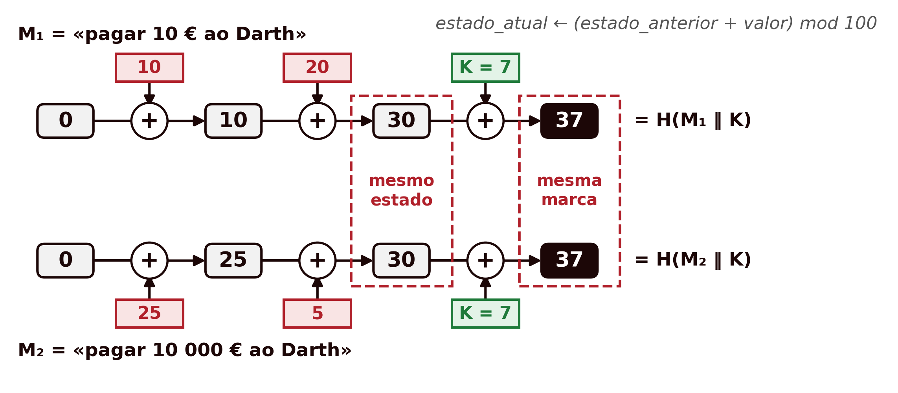

## Introdução {#sec-05-intro .unnumbered}

Os capítulos anteriores trataram sempre de **confidencialidade**: como transformar uma mensagem de forma que só quem possui a chave certa a consiga ler. Mas confidencialidade não é a única propriedade que uma comunicação segura precisa de garantir. Uma mensagem pode viajar perfeitamente cifrada e, ainda assim, ser alterada a meio do caminho, ou não vir de quem diz vir. Este capítulo muda de problema: trata da **integridade** (a garantia de que os dados não foram alterados) e da **autenticação** (a garantia de que os dados vêm de quem se espera), e da ferramenta que serve de base a ambas, a **função de *hash***.

## O Que é uma Função de *Hash* {#sec-05-conceito}

Uma **função de *hash*** transforma uma entrada de tamanho arbitrário numa saída de tamanho fixo, geralmente muito mais curta:

$$h = H(x)$$

onde $x$ é o valor (ou mensagem) a que se aplica a função, $H$ é a função de *hash*, e $h$ é o **valor de *hash*** (também chamado *digest*). $x$ é conhecido como a **pré-imagem** de $h$.

Duas características, à partida simples, definem o essencial de uma função de *hash*: é **determinística** (a mesma entrada produz sempre a mesma saída) e é uma **função de compressão** (entradas de qualquer tamanho, potencialmente enormes, produzem sempre uma saída do mesmo tamanho fixo, tipicamente entre 128 e 512 bits). Esta segunda característica tem uma consequência matemática inevitável: como o conjunto de entradas possíveis é infinito e o conjunto de saídas é finito, **têm de existir colisões**, pares de entradas diferentes que produzem o mesmo valor de *hash*. A segurança de uma função de *hash* nunca pode assentar em evitá-las por completo, isso é impossível, mas sim em torná-las computacionalmente impossíveis de encontrar deliberadamente. É exactamente isso que a secção seguinte formaliza.

## Propriedades de uma Função de *Hash* {#sec-05-propriedades}

Nem toda a função que comprime dados é útil em criptografia. As propriedades seguintes [@Stallings2020] distinguem uma função de *hash* **fraca** de uma **forte**:

| Requisito | Descrição |
|---|---|
| Tamanho de entrada variável | $H$ pode ser aplicada a um bloco de dados de qualquer tamanho |
| Tamanho de saída fixo | $H$ produz sempre uma saída de comprimento fixo |
| Eficiência | $H(x)$ é fácil de calcular para qualquer $x$, tornando praticáveis implementações em hardware e em software |
| Resistência a pré-imagem (*one-way*) | Dado um valor de *hash* $h$, é computacionalmente inviável encontrar $y$ tal que $H(y) = h$ |
| Resistência a segunda pré-imagem (colisão fraca) | Dado um bloco $x$, é computacionalmente inviável encontrar $y \neq x$ com $H(y) = H(x)$ |
| Resistência a colisões (colisão forte) | É computacionalmente inviável encontrar qualquer par $(x,y)$, com $x \neq y$, tal que $H(x) = H(y)$ |
| Pseudoaleatoriedade | A saída de $H$ cumpre os testes estatísticos padrão de aleatoriedade |

: Propriedades de uma função de *hash* [@Stallings2020] {#tbl-05-propriedades}

Uma função que cumpra as cinco primeiras propriedades, até à resistência a segunda pré-imagem, diz-se um ***hash* fraco**; se for também resistente a colisões, a sexta propriedade, diz-se um ***hash* forte**, o único adequado a usos criptográficos [@Stallings2020]. A pseudoaleatoriedade é um requisito à parte: uma alteração mínima na entrada deve mudar cerca de metade dos bits da saída (o chamado efeito avalanche). Vale a pena não confundir as duas últimas propriedades de resistência a colisões, que são fáceis de trocar:

- **Segunda pré-imagem**: o atacante já tem um $x$ específico (por exemplo, um contrato original) e quer encontrar outro documento $y$ com o mesmo *hash*, para o substituir sem que a substituição seja detectada.
- **Colisão**: o atacante não tem nenhum documento de partida fixo, só quer encontrar **um par qualquer** $(x,y)$ que colida, o que é estruturalmente mais fácil de conseguir.

Esta diferença tem uma consequência prática importante, que se percebe melhor com um problema clássico de probabilidades, o **paradoxo do aniversário**. Quantas pessoas são precisas numa sala para que haja 50% de probabilidade de duas delas fazerem anos no mesmo dia do ano, ou seja, no mesmo dia e no mesmo mês? A resposta habitual anda à volta de 180, metade de 365, mas a resposta certa é apenas 23: com 23 pessoas, a probabilidade é de 50,7%. Não há nenhuma contradição lógica; chama-se paradoxo apenas porque o resultado contraria a intuição. A intuição falha porque, sem dar por isso, se responde a outra pergunta: quantas pessoas são precisas para que alguém faça anos no mesmo dia que eu? Para essa, são precisas 253. Na pergunta original, porém, serve qualquer par de pessoas, e o que conta é o número de pares. Cada uma das 23 pessoas pode formar par com cada uma das outras 22, o que dá $23 \times 22$, mas assim cada par é contado duas vezes (o par «Ana e Bruno» aparece uma vez a partir da Ana e outra a partir do Bruno), pelo que há $23 \times 22 / 2 = 253$ pares diferentes. Com quatro pessoas, A, B, C e D, há $4 \times 3 / 2 = 6$ pares: AB, AC, AD, BC, BD e CD. O número de pessoas cresce devagar, mas o número de pares cresce com o quadrado, e cada par é uma oportunidade de coincidência: é por isso que a coincidência aparece tão cedo. O valor exato de 50,7% obtém-se calculando a probabilidade de todos os aniversários serem diferentes, $\frac{365}{365} \times \frac{364}{365} \times \dots \times \frac{343}{365}$, e subtraindo-a de 1.

Com os *hashes* passa-se o mesmo. Os 365 dias são os $2^n$ valores possíveis de um *hash* de $n$ bits, as pessoas são as mensagens que o atacante experimenta, e duas pessoas com o mesmo aniversário são uma colisão. Encontrar uma colisão qualquer custa, por isso, apenas cerca de $\sqrt{2^n} = 2^{n/2}$ tentativas, muito menos do que os cerca de $2^n$ necessários para acertar no *hash* de uma mensagem dada, que é o que exige quebrar a resistência a pré-imagem ou a segunda pré-imagem (o equivalente à pergunta «no mesmo dia que eu»). É por esta razão que o tamanho da saída de uma função de *hash* tem de ser aproximadamente o dobro do nível de segurança pretendido: um *hash* de 256 bits dá apenas $2^{128}$ de segurança contra colisões, não $2^{256}$.

## A Família SHA {#sec-05-sha}

Ao longo das últimas três décadas, várias famílias de funções de *hash* disputaram o lugar de norma de facto. As primeiras, o **MD4** e o **MD5** (*Message Digest*, Ron Rivest, 1990 e 1992), com saídas de apenas 128 bits, acabaram formalmente quebradas: Wang e Yu apresentaram um método prático para gerar colisões em MD5 em 2005 [@Wang2005], e hoje o MD5 não deve ser usado para nenhum fim criptográfico, apenas para verificações de integridade não adversariais (por exemplo, confirmar que uma transferência de ficheiro não foi corrompida por erro).

O **SHA** (*Secure Hash Algorithm*), normalizado pelo NIST, tornou-se a família de referência [@FIPS1804]. O **SHA-1** (160 bits, 1995) manteve-se em uso generalizado durante duas décadas, apesar de fragilidades teóricas conhecidas desde 2005, até a Google e o CWI Amsterdam publicarem, em 2017, a primeira colisão prática (o ataque **SHAttered**), dois PDFs distintos com o mesmo *hash* SHA-1 [@Stevens2017]. Desde então, o SHA-1 está formalmente desaconselhado para qualquer uso que dependa de resistência a colisões, incluindo certificados digitais e assinaturas.

A família actualmente recomendada é o **SHA-2**, que agrupa várias variantes consoante o tamanho da saída e da estrutura interna:

| Algoritmo | Tamanho da mensagem | Tamanho do bloco | Tamanho da palavra | Tamanho do *hash* |
|---|---|---|---|---|
| SHA-1 | $< 2^{64}$ | 512 | 32 | 160 |
| SHA-224 | $< 2^{64}$ | 512 | 32 | 224 |
| SHA-256 | $< 2^{64}$ | 512 | 32 | 256 |
| SHA-384 | $< 2^{128}$ | 1024 | 64 | 384 |
| SHA-512 | $< 2^{128}$ | 1024 | 64 | 512 |
| SHA-512/224 | $< 2^{128}$ | 1024 | 64 | 224 |
| SHA-512/256 | $< 2^{128}$ | 1024 | 64 | 256 |

: Parâmetros das variantes da família SHA (todos os tamanhos em bits) [@FIPS1804] {#tbl-05-sha}

O **SHA-256** é hoje a escolha por omissão para a generalidade das aplicações novas, usado, entre outros, no TLS, no Git e no Bitcoin. Na prática, calcular um *hash* é uma operação trivial em qualquer sistema Unix:

```bash
$ echo "Olá Mundo!  João Pavão" > hashtext.txt
$ openssl md5 hashtext.txt
MD5(hashtext.txt)= dafa6ed4f172ed103c577334bdfa375d
$ openssl sha1 hashtext.txt
SHA1(hashtext.txt)= f8372d55ba7ae3655ec0f886ef658f94879646c1
```

Note-se que os dois *hashes*, apesar de calculados sobre o mesmo ficheiro, não têm nenhuma relação visível entre si, precisamente o comportamento pseudoaleatório exigido na Tabela [-@tbl-05-propriedades].

## Verificar a Integridade — e os Seus Limites {#sec-05-integridade}

O uso mais directo de uma função de *hash* é verificar se um dado se manteve íntegro: o emissor calcula $h = H(\text{dados})$ e envia os dois juntos; o receptor recalcula o *hash* sobre os dados recebidos e compara com o valor recebido. Qualquer alteração aos dados, ainda que de um único bit, muda o valor de *hash* de forma imprevisível (propriedade de pseudoaleatoriedade), tornando a alteração detectável.

Mas este esquema tem uma falha grave, que só se torna visível quando se considera um atacante activo, capaz de intervir no canal de comunicação, e não apenas um erro acidental de transmissão:

{#fig-05-integridade-ataque width=100%}

A raiz do problema: $H$ é **pública**. Não há nenhum segredo envolvido no cálculo do *hash*, por isso um atacante capaz de alterar os dados em trânsito é igualmente capaz de recalcular o *hash* correspondente aos dados alterados. O valor de *hash*, sozinho, prova que os dados não sofreram um erro acidental, mas não prova nem que os dados vêm de quem diz vir, nem que não foram deliberadamente adulterados por alguém no meio do caminho. Falta um ingrediente que só o emissor e o receptor legítimos possuam, e que um atacante não consiga reproduzir: um **segredo partilhado**.

## Autenticação de Mensagens: o MAC {#sec-05-mac}

A solução mais simples para o problema identificado na secção anterior é introduzir uma chave secreta $K$, partilhada apenas entre emissor e receptor, no próprio cálculo do *hash*. Um **MAC** (*Message Authentication Code*) é exactamente isto: uma função que recebe a mensagem **e** uma chave secreta, e produz uma marca (*tag*) curta que só quem conhece a chave consegue calcular ou verificar corretamente.

$$T = \text{MAC}_K(\text{dados})$$

![Com uma chave secreta $K$, partilhada apenas entre emissor e receptor, o mesmo ataque da Figura [-@fig-05-integridade-ataque] falha: o atacante consegue alterar os dados, mas não consegue calcular a marca correspondente sem conhecer $K$, e o receptor rejeita a mensagem adulterada.](../assets/images/fig-05-mac-generico.png){#fig-05-mac-generico width=100%}

Um exemplo concreto ajuda a fixar a ideia. Suponha-se uma ordem de transferência bancária, "Transferir 100€ para o IBAN PT50...", protegida com $\text{MAC}_K$. O banco recebe a mensagem e a marca, recalcula $\text{MAC}_K$ sobre a mensagem recebida com a mesma chave $K$ (combinada previamente com o cliente, por exemplo ao activar o cartão) e compara. Se um atacante intercepta a mensagem e altera "100€" para "10000€", a marca antiga deixa de corresponder à mensagem alterada, e calcular a marca correcta para a nova mensagem exigiria conhecer $K$, exactamente o que faltava ao atacante na Figura [-@fig-05-integridade-ataque].

Note-se a diferença fundamental em relação a um *hash* simples: um MAC garante **duas** propriedades de uma só vez, integridade (os dados não foram alterados) e **autenticidade** (os dados só podem ter vindo de alguém que conhece $K$, ou seja, do emissor legítimo). É por isto que os MAC partilham o mesmo modelo de confiança das cifras simétricas: exigem uma chave previamente combinada entre as duas partes, através de um canal seguro.

A ideia mais directa para construir um MAC a partir de uma função de *hash* já existente é combinar a mensagem com a chave secreta antes de a passar por $H$. Não é por acaso que esta é exactamente a lógica de vários desenhos clássicos: cifrar o *hash* da mensagem com uma chave simétrica, cifrar só o *hash* em vez da mensagem inteira, ou, na sua forma mais simples, calcular $H(\text{dados} \Vert S)$ usando apenas um valor secreto $S$ partilhado, sem qualquer cifra envolvida, o suficiente para autenticação e integridade, ainda que sem confidencialidade. Esta última construção, um *hash* simples com um segredo concatenado à mensagem, parece resolver o problema, mas esconde uma armadilha que a secção seguinte desmonta.

## HMAC {#sec-05-hmac}

Concatenar ingenuamente uma chave a uma mensagem antes de a passar por uma função de *hash* parece razoável, mas as duas formas óbvias de o fazer têm problemas distintos [@PreneelOorschot1995].

**Prefixo, $H(K \Vert M)$.** As funções da família MD5/SHA (SHA-1 e SHA-2 incluídos) processam a entrada em blocos, actualizando um estado interno bloco a bloco, e o valor de *hash* final **é** literalmente esse estado interno, sem qualquer passo final de fecho. Isto permite um **ataque de extensão de comprimento** (*length-extension attack*): conhecendo apenas $H(K \Vert M)$ (não $K$), um atacante consegue calcular $H(K \Vert M \Vert M')$, uma marca válida para uma mensagem estendida, para qualquer $M'$ à sua escolha.

Um exemplo simplificado torna isto concreto (não é assim que o SHA-256 funciona por dentro, mas ilustra exactamente a estrutura do problema). Imagine-se uma função de *hash* simplificada que processa a entrada um valor de cada vez, somando-o ao estado anterior a partir de um estado inicial 0, e devolve o último estado directamente como resultado final:

$$\text{estado\_atual} \leftarrow (\text{estado\_anterior} + \text{valor}) \bmod 100$$

Seja a chave secreta $K=7$ e a mensagem $M=42$, que entram por esta ordem. A marca calculada pelo emissor é:

$$H(K \Vert M) = (0 + 7 + 42) \bmod 100 = 49$$

Um atacante que intercepte a mensagem e a marca $49$ não precisa de conhecer $K$ para forjar uma marca válida para a mensagem estendida $M \Vert M'$, com $M'=13$ à sua escolha: basta continuar o mesmo cálculo a partir do estado que já conhece, $49$:

$$(49 + 13) \bmod 100 = 62$$

que é exactamente o valor que o receptor obteria ao calcular $H(K \Vert M \Vert M')$ do zero, com a chave verdadeira ($0+7+42+13=62$). O atacante não precisou de saber que $K=7$. Neste exemplo simplificado até o poderia deduzir, porque a soma se inverte facilmente ($49-42=7$), mas numa função de *hash* real isso é inviável, e o ataque funciona na mesma: só precisou de saber que a marca antiga **era** o estado interno, e que continuar o cálculo a partir dela é tão fácil como calculá-lo da primeira vez. É exactamente esta propriedade, o valor de *hash* final ser reutilizável como ponto de partida para continuar o cálculo, que o MD5, o SHA-1 e o SHA-256 partilham genuinamente (a única complicação real nestes algoritmos é um bloco extra de *padding*, que o atacante também consegue reconstruir a partir do comprimento conhecido de $K \Vert M$), e que torna este ataque prático, não apenas um exercício académico.

Para perceber o perigo na prática, considere-se uma aplicação de um banco que envia pedidos ao servidor do banco, cada um acompanhado de uma marca $H(K \Vert M)$; a chave $K$ só é conhecida da aplicação e do servidor. Um pedido é um texto simples, formado por pares `nome=valor` separados pelo símbolo `&`. Quando o João consulta o saldo, a aplicação envia:

```
utilizador=joao&acao=consultar_saldo
```

O Darth interceta este pedido e a respetiva marca, e cola-lhe no fim um texto seu, ficando com:

```
utilizador=joao&acao=consultar_saldo&acao=transferir&valor=1000&destino=darth
```

Com o ataque de extensão de comprimento, calcula a marca correta para este pedido maior, sem nunca conhecer $K$. O servidor recebe o pedido, verifica a marca, vê que está certa e conclui que o pedido veio da aplicação. Só que o pedido traz agora duas ações: se o servidor, perante um nome repetido, ficar com o último valor (como acontece, por exemplo, em PHP), executa a transferência de 1000 € para o Darth.

Há dois pormenores que o exemplo numérico acima não mostra. O primeiro é que, nos algoritmos reais, o atacante não consegue colar o seu texto imediatamente a seguir a $M$. Antes de calcular o *hash*, o MD5, o SHA-1 e o SHA-256 acrescentam sempre à entrada um enchimento (*padding*), formado por um byte `0x80`, uma sequência de zeros e o comprimento da entrada; esse enchimento fica a fazer parte da mensagem forjada, entre $M$ e $M'$. No pedido do exemplo, estes bytes ficam agarrados ao valor `consultar_saldo`, e o resto do pedido continua a ser lido normalmente. O segundo é que, como o enchimento depende do comprimento de $K \Vert M$, o atacante precisa de saber o comprimento da chave; se não o souber, experimenta os valores possíveis, um de cada vez.

O cenário não é hipotético: em 2009, Duong e Rizzo mostraram que a API do Flickr, que autenticava os pedidos com MD5 aplicado a um segredo seguido dos parâmetros do pedido, permitia exatamente este tipo de falsificação [@DuongRizzo2009].

**Sufixo, $H(M \Vert K)$.** Colocar a chave no fim, em vez de no início, evita o ataque anterior: o estado final já inclui a chave, e o atacante não consegue continuar o cálculo a partir dele sem a conhecer. Mas surge outro problema, que se percebe com a mesma função de *hash* simplificada. Como a mensagem é processada antes da chave, tudo o que acontece até a chave entrar depende apenas da mensagem, e qualquer pessoa o pode calcular. Suponha-se que o Darth escreve duas ordens de pagamento: $M_1$ = «pagar 10 € ao Darth», que a função processa como os valores 10 e 20, e $M_2$ = «pagar 10 000 € ao Darth», processada como 25 e 5. As duas chegam ao mesmo estado antes de a chave entrar, porque $10+20 = 25+5 = 30$; por isso, depois de somada a chave $K=7$, as duas dão a mesma marca, 37 (@fig-05-sufixo).

{#fig-05-sufixo width=100%}

O ataque decorre então assim. A Alice concorda com a ordem de 10 €, calcula a marca $H(M_1 \Vert K) = 37$ e envia-a ao banco. O Darth interceta a ordem, troca-a por $M_2$ e mantém a marca. O banco calcula $H(M_2 \Vert K)$, obtém também 37, aceita a ordem e paga 10 000 €. O Darth nunca precisou de conhecer $K$: bastou-lhe encontrar duas mensagens que chegam ao mesmo estado antes da chave, ou seja, uma colisão na parte do cálculo que não depende de $K$. No exemplo isso é trivial, mas no MD5 e no SHA-1 também já se sabe construir colisões (Secção 5.3). Esta construção fica, assim, tão segura quanto a resistência a colisões de $H$, precisamente a propriedade que caiu nestas duas funções.

Fica por explicar como é que o Darth encontra duas mensagens que chegam ao mesmo estado. A resposta está no facto de, em $H(M \Vert K)$, nada do que acontece antes da chave ser secreto: o algoritmo de $H$ é público, o estado inicial é um valor fixo e conhecido, e o cálculo até a chave entrar depende apenas da mensagem. O Darth pode, por isso, calcular no seu próprio computador o estado a que chega qualquer mensagem, tantas vezes quantas quiser, e procurar uma colisão de duas formas. A primeira é por tentativas: escreve muitas variantes das duas ordens, todas com o mesmo significado («pagar 10 € ao Darth», «pagar 10 euros ao Darth», «pague-se 10 € ao Darth», e o mesmo para a ordem de 10 000 €), calcula o estado de cada uma e procura uma variante de cada ordem com o mesmo estado. Pelo paradoxo do aniversário, com um *hash* de $n$ bits isso acontece ao fim de cerca de $2^{n/2}$ variantes [@Stallings2020]. A segunda é explorar fraquezas do próprio algoritmo, como as que permitiram construir colisões no MD5 e no SHA-1 com muito menos trabalho (Secção 5.3). Os blocos que colidem nestes ataques não são texto legível, parecem bytes ao acaso, e por isso escondem-se em ficheiros onde não se veem, como documentos PDF. Nos ataques mais poderosos, chamados de prefixo escolhido, o atacante pode até partir de dois inícios diferentes à sua escolha: foi assim que, em 2008, uma equipa de investigadores falsificou, a partir de uma colisão no MD5, um certificado digital, o documento em que os navegadores se apoiam para confiar num site [@Stevens2009], e que, em 2020, se obteve a primeira colisão deste tipo no SHA-1 [@LeurentPeyrin2020]. No HMAC nada disto é possível, porque o *hash* interior começa com a chave: sem a conhecer, o atacante não consegue calcular o estado de nenhuma mensagem, e por isso não consegue procurar colisões.

A construção **HMAC** (*Hash-based MAC*), proposta por Bellare, Canetti e Krawczyk [@BellareCanettiKrawczyk1996] e normalizada no RFC 2104 [@RFC2104], evita os dois problemas ao aplicar $H$ **duas vezes**, numa estrutura aninhada, em vez de concatenar a chave uma única vez:

$$\text{HMAC}(K, M) = H\big((K' \oplus \text{opad}) \,\Vert\, H((K' \oplus \text{ipad}) \,\Vert\, M)\big)$$

onde $K'$ é a chave ajustada ao tamanho do bloco de $H$ (completada com zeros se for mais curta, ou ela própria substituída pelo seu *hash* se for mais comprida), e `ipad` e `opad` são duas constantes fixas e públicas (o byte `0x36` e o byte `0x5C`, repetidos até ao tamanho do bloco), escolhidas apenas por terem uma distância de Hamming grande entre si, de forma a que as duas chaves internas, $K' \oplus \text{ipad}$ e $K' \oplus \text{opad}$, se comportem como duas chaves independentes:

{#fig-05-hmac-construcao width=95%}

Esta estrutura em duas camadas resolve os dois ataques da lista anterior, e o essencial está em $K' \oplus \text{ipad}$ e $K' \oplus \text{opad}$ ocuparem cada uma um bloco inteiro de $H$: depois de processar esse primeiro bloco, o estado interno de $H$ já depende da chave, e cada camada arranca de um ponto de partida que só quem conhece $K$ consegue calcular. A extensão de comprimento deixa de funcionar porque o *hash* interior nunca é visível, só o resultado do exterior; e continuar o cálculo do *hash* exterior acrescentaria blocos depois do *hash* interior, quando um HMAC válido não tem nada depois dele, pelo que o resultado não seria o HMAC de nenhuma mensagem. Quanto às colisões, se duas mensagens $M_1$ e $M_2$ tivessem o mesmo *hash* interior, teriam também o mesmo HMAC, porque o *hash* exterior receberia exatamente a mesma entrada: o que protege o HMAC não é o segundo $H$, é a impossibilidade de encontrar esse par. Em $H(M \Vert K)$, o atacante procura colisões no seu próprio computador, porque tudo o que vem antes de $K$ é público; no HMAC, o *hash* interior começa num estado secreto, e sem conhecer $K$ o atacante não consegue calcular nenhum *hash* interior, logo não consegue procurar colisões. Os ataques de colisão conhecidos contra o MD5 e o SHA-1 partem precisamente do estado inicial público destas funções, e deixam de se aplicar quando esse estado é secreto.

Um resultado notável do trabalho original de Bellare, Canetti e Krawczyk é que a segurança do HMAC **não depende da resistência a colisões** de $H$, depende de uma propriedade mais fraca e mais robusta da sua função de compressão interna. É por isto que o **HMAC-MD5** e o **HMAC-SHA1** continuam, na prática, a não ter nenhum ataque conhecido, apesar de o MD5 e o SHA-1 estarem formalmente quebrados como funções de *hash* de uso geral (Secção 5.3): quebrar o HMAC exigiria um tipo de ataque bastante diferente, e mais difícil, do que simplesmente encontrar colisões em $H$. Ainda assim, a recomendação prática é usar sempre **HMAC-SHA256** ou superior em sistemas novos, por prudência e para evitar depender de subtilezas desta natureza.

O HMAC é hoje um dos mecanismos de autenticação mais usados na prática: protege registos do TLS em versões anteriores à 1.3, autentica pacotes no IPsec, assina *tokens* **JWT** (*JSON Web Tokens*, no algoritmo `HS256`), e é a base da assinatura de pedidos em APIs como as da AWS.

## Síntese do Capítulo {#sec-05-sintese}

Este capítulo mudou de confidencialidade para integridade e autenticação:

1. Uma **função de *hash*** comprime uma entrada de qualquer tamanho numa saída fixa, de forma determinística; como o domínio é infinito e o contradomínio finito, colisões existem sempre, o objectivo é torná-las difíceis de encontrar
2. Um *hash* **forte** exige, além da eficiência e do tamanho fixo de saída, resistência a **pré-imagem**, a **segunda pré-imagem**, e a **colisões**; esta última é a mais fraca das três, e cai ao fim de apenas $2^{n/2}$ tentativas (paradoxo do aniversário), não $2^n$
3. A família **SHA** é a referência actual; o **MD5** e o **SHA-1** têm colisões práticas conhecidas (Wang e Yu, 2005; SHAttered, 2017) e estão desaconselhados; o **SHA-256** é hoje a escolha recomendada
4. Uma função de *hash* **sem chave** não resiste a um atacante activo: qualquer pessoa consegue recalculá-la, por isso não prova nem integridade nem autenticidade contra um adversário capaz de intervir no canal
5. Um **MAC** resolve isto introduzindo uma chave secreta partilhada no cálculo da marca, dando simultaneamente integridade e autenticidade
6. Concatenar ingenuamente a chave à mensagem (`H(K‖M)` ou `H(M‖K)`) tem problemas conhecidos, extensão de comprimento no primeiro caso, dependência total da resistência a colisões no segundo
7. O **HMAC** resolve ambos aplicando $H$ duas vezes, numa estrutura aninhada com duas chaves derivadas (`ipad`/`opad`); a sua segurança não depende da resistência a colisões de $H$, o que explica porque o HMAC-SHA1 continua sem ataques práticos conhecidos, apesar de o SHA-1 já não ser seguro como *hash* de uso geral

## Para Pensar {#sec-05-reflexao}

O SHA-1 já não é seguro contra colisões, e está formalmente desaconselhado para assinaturas digitais e certificados. Ainda assim, o HMAC-SHA1 continua em uso em vários sistemas legados sem ser considerado uma falha crítica. Tendo em conta a distinção entre as propriedades de um *hash* (Secção 5.2) e o que a demonstração de segurança do HMAC efectivamente exige (Secção 5.6), porque é que a quebra da resistência a colisões de uma função de *hash* não implica automaticamente a quebra do MAC construído sobre ela?

## Referências {#sec-05-referencias .unnumbered}

::: {#refs}
:::
