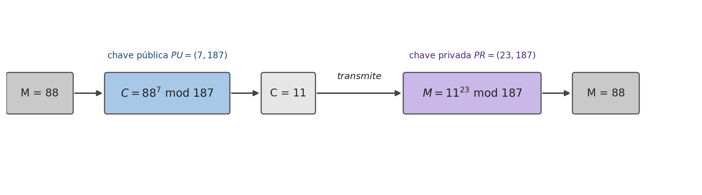

## Introdução {#sec-06-intro .unnumbered}

Todos os capítulos anteriores, das cifras clássicas ao HMAC, partilham uma limitação estrutural: exigem uma chave secreta **partilhada previamente** entre emissor e receptor. Mas como é que dois desconhecidos, que nunca se encontraram e não têm nenhum canal seguro entre si, combinam essa chave em primeiro lugar? Este é o **problema da distribuição de chaves**, e durante décadas não teve resposta satisfatória. A solução, proposta por Diffie e Hellman em 1976 e concretizada por Rivest, Shamir e Adleman em 1977 com o algoritmo que dá nome a este capítulo, é radical: em vez de uma chave partilhada, cada participante passa a ter **duas chaves matematicamente relacionadas**, uma que pode divulgar livremente e outra que nunca revela a ninguém.

## Criptografia Assimétrica: o Conceito {#sec-06-conceito}

Um sistema de chave pública assenta em seis componentes [@Stallings2020]: um algoritmo de cifragem, um algoritmo de decifragem, uma mensagem em texto claro, uma mensagem cifrada, e as duas chaves de cada participante, a **chave pública** ($PU$), livremente distribuída, e a **chave privada** ($PR$), mantida secreta pelo seu dono. A propriedade que torna isto útil é puramente matemática: o que quer que se cifre com uma das chaves de um par, só se decifra com a outra, nunca com a mesma.

Esta simples inversão de "que chave usar para quê" dá origem a dois esquemas distintos, com propósitos opostos:

{#fig-06-confid-autent width=100%}

**Confidencialidade.** Para enviar uma mensagem confidencial a Bob, Alice cifra-a com a **chave pública de Bob** ($PU_b$), que qualquer pessoa conhece:

$$Y = E[PU_b, X] \qquad X = D[PR_b, Y]$$

Só Bob consegue decifrar $Y$, porque só ele tem $PR_b$. Note-se que isto resolve exactamente o problema identificado na introdução: Alice nunca precisou de combinar nenhum segredo com Bob antecipadamente, só precisou de conhecer uma chave pública dele.

**Autenticação.** Para provar que uma mensagem vem mesmo de Alice, ela cifra-a com a sua própria **chave privada** ($PR_a$):

$$Y = E[PR_a, X] \qquad X = D[PU_a, Y]$$

Qualquer pessoa pode decifrar $Y$ com a chave pública de Alice, $PU_a$, que também é livremente conhecida, mas é precisamente por isso que este esquema não dá confidencialidade nenhuma. O que dá é a garantia de que **só Alice** podia ter produzido $Y$, já que só ela possui $PR_a$: é a base conceptual da assinatura digital, retomada num capítulo posterior.

Nada impede combinar os dois esquemas para obter ambas as propriedades ao mesmo tempo: Alice primeiro cifra com a sua própria chave privada (assina), e depois cifra o resultado com a chave pública de Bob (garante confidencialidade):

$$Z = E[PU_b,\, E[PR_a, X]]$$

Bob inverte as duas operações pela ordem inversa, $X = D[PU_a,\, D[PR_b, Z]]$, obtendo simultaneamente a certeza de que a mensagem só podia ter vindo de Alice, e a garantia de que mais ninguém a conseguiu ler pelo caminho.

## Categorias e Aplicações {#sec-06-categorias}

Nem todos os algoritmos de chave pública servem os três usos possíveis (encriptação, assinatura digital, troca de chaves) igualmente bem:

| Algoritmo | Encriptação/Decriptação | Assinatura Digital | Troca de Chaves |
|---|---|---|---|
| RSA | Sim | Sim | Sim |
| Curva Elíptica | Sim | Sim | Sim |
| Diffie-Hellman | Não | Não | Sim |
| DSS | Não | Sim | Não |

: Aplicações dos principais algoritmos de chave pública [@Stallings2020] {#tbl-06-aplicacoes}

O RSA, apresentado neste capítulo, é o único, ao lado da criptografia de curva elíptica, capaz de servir os três papéis. O Diffie-Hellman, capítulo seguinte, serve apenas para combinar uma chave partilhada; o DSS existe apenas para assinar.

## RSA: Geração de Chaves {#sec-06-rsa-geracao}

O **RSA** (Rivest, Shamir e Adleman, 1977) continua a ser o algoritmo de chave pública mais usado na prática, apesar de assentar num único problema matemático difícil: a **factorização de números inteiros muito grandes**. A geração do par de chaves segue cinco passos:

{#fig-06-rsa-infografico width=100%}

1. Escolhem-se dois números primos grandes e aleatórios, $p$ e $q$.
2. Calcula-se $n = p \cdot q$ (o **módulo**, que será público) e $\phi(n) = (p-1)(q-1)$ (a função totiente de Euler, que tem de se manter secreta).
3. Escolhe-se $e$ tal que $1 < e < \phi(n)$ e $\text{mdc}(e, \phi(n)) = 1$ (isto garante que $e$ é invertível módulo $\phi(n)$).
4. Calcula-se $d$, o inverso modular de $e$: $d \cdot e \equiv 1 \pmod{\phi(n)}$.
5. A **chave pública** é o par $(e, n)$; a **chave privada** é o par $(d, n)$. O módulo $n$ é público, mas $p$, $q$, $\phi(n)$ e $d$ nunca são revelados.

## RSA: Cifragem e Decifragem {#sec-06-rsa-cifra}

Com as chaves geradas, cifrar e decifrar um bloco $M$ (um número, $0 \le M < n$) resume-se a uma exponenciação modular:

$$C = M^e \bmod n \qquad\qquad M = C^d \bmod n = (M^e)^d \bmod n = M^{e \cdot d} \bmod n$$

Isto funciona porque $e$ e $d$ foram escolhidos de forma a serem **inversos multiplicativos módulo $\phi(n)$** ($e \cdot d \equiv 1 \bmod \phi(n)$), tal como, na aritmética normal, $3$ e $\frac{1}{3}$ são inversos porque $3 \cdot \frac{1}{3} = 1$: elevar a $e$ e depois a $d$ (ou vice-versa) devolve sempre o valor original.

Um exemplo completo, com números pequenos apenas para ilustrar o mecanismo:

1. Escolhem-se $p=17$ e $q=11$.
2. $n = 17 \times 11 = 187$; $\phi(n) = 16 \times 10 = 160$.
3. Escolhe-se $e=7$ (relativamente primo com 160).
4. Calcula-se $d=23$, porque $(23 \times 7) \bmod 160 = 161 \bmod 160 = 1$.
5. Chave pública $= \{7, 187\}$; chave privada $= \{23, 187\}$.

{#fig-06-rsa-exemplo width=100%}

Para enviar a mensagem $M=88$: $C = 88^7 \bmod 187 = 11$. Para a recuperar: $M = 11^{23} \bmod 187 = 88$.

## Segurança: o que Torna o RSA Difícil de Quebrar — e Fácil de Usar Mal {#sec-06-rsa-seguranca}

O exemplo da secção anterior usa números pequenos só para tornar as contas possíveis à mão, mas isso tem um preço: com $n=187$ (8 bits), factorizar $n$ de volta em $p=17$ e $q=11$ é trivial, o que anula por completo a segurança do esquema. Na prática, recomenda-se $n$ com pelo menos 2048 a 4096 bits, tornando a factorização computacionalmente inviável com os métodos e o poder de computação actualmente conhecidos, o **problema da factorização de inteiros**, do qual depende toda a segurança do RSA.

Vale a pena perceber porque é que este tamanho de chave é tão maior do que o de uma cifra simétrica (128 ou 256 bits, capítulos 3 e 4) para um nível de segurança comparável. O melhor algoritmo conhecido para factorizar inteiros grandes, o *general number field sieve* (GNFS), tem complexidade **subexponencial**: cresce mais lentamente do que uma pesquisa exaustiva (que custaria $2^n$ operações para um valor de $n$ bits), mas mais depressa do que um algoritmo polinomial, o que o torna significativamente mais rápido do que a força bruta pura, ainda que continue impraticável para módulos de milhares de bits [@Stallings2020]. É precisamente esta existência de um atalho, mais rápido do que a força bruta mas não polinomial, que obriga o RSA a compensar com chaves muito maiores do que as de uma cifra simétrica: um módulo de 3072 bits é necessário para atingir o mesmo nível de segurança prático de uma chave simétrica de apenas 128 bits (Tabela [-@tbl-08-tamanhos], Capítulo 8).

Mesmo com um $n$ suficientemente grande, usar o RSA exactamente como descrito acima, o chamado **RSA "textbook"**, não é seguro: é determinístico (a mesma mensagem produz sempre o mesmo texto cifrado, permitindo a um atacante reconhecer mensagens repetidas) e não oferece segurança semântica. Por isso, nenhuma biblioteca criptográfica séria implementa o RSA cru:

- Para **encriptação**, usa-se um esquema de *padding* como o **RSA-OAEP** (*Optimal Asymmetric Encryption Padding*), que introduz aleatoriedade antes de cifrar, garantindo que a mesma mensagem nunca produz o mesmo texto cifrado duas vezes.
- Para **assinaturas**, usa-se o **RSA-PSS** (*Probabilistic Signature Scheme*), que garante segurança contra falsificação de assinaturas, uma propriedade que o esquema simples da Secção 6.2 não oferece por si só.

Do lado do desempenho, é comum substituir $\phi(n)$ por $\lambda(n) = \text{mmc}(p-1, q-1)$ (a condição $e \cdot d \equiv 1 \bmod \lambda(n)$ também é suficiente, e produz um $d$ tipicamente mais pequeno), e usar o **Teorema Chinês do Resto** para acelerar a decifragem, resolvendo $M = C^d \bmod n$ separadamente módulo $p$ e módulo $q$, e combinando os resultados, uma operação várias vezes mais rápida do que a exponenciação directa módulo $n$.

## Síntese do Capítulo {#sec-06-sintese}

Este capítulo introduziu a segunda grande família da criptografia moderna:

1. A **criptografia assimétrica** resolve o problema da distribuição de chaves: cada participante tem uma chave pública, livremente distribuída, e uma chave privada, nunca partilhada
2. Cifrar com a **chave pública** do destinatário garante **confidencialidade**; cifrar com a **chave privada** do próprio garante **autenticação**; combinar as duas garante ambas
3. O RSA, a curva elíptica, o Diffie-Hellman e o DSS não servem todos os mesmos propósitos: só o RSA e a curva elíptica servem encriptação, assinatura e troca de chaves em simultâneo
4. O **RSA** gera as suas chaves a partir de dois primos grandes $p$ e $q$: $n=pq$, $\phi(n)=(p-1)(q-1)$, $e$ coprimo com $\phi(n)$, e $d$ o seu inverso modular; cifra e decifra por exponenciação modular, $C=M^e \bmod n$ e $M=C^d \bmod n$
5. A segurança do RSA depende inteiramente da dificuldade de **factorizar** $n$ em $p$ e $q$; com $n$ pequeno (como no exemplo didáctico $n=187$), a factorização é trivial, por isso a norma actual exige $n$ de pelo menos 2048 a 4096 bits
6. O **RSA "textbook"** não é seguro por si só: usos reais exigem **RSA-OAEP** para encriptação e **RSA-PSS** para assinaturas

## Para Pensar {#sec-06-reflexao}

O exemplo resolvido da Secção 6.4 usa $n=187$ (8 bits), trivialmente factorizável, o que anula a sua segurança; a norma actual recomenda $n$ de 2048 a 4096 bits. Em implementações reais de RSA, o expoente público $e$ é normalmente um número pequeno e fixo (o valor $e=65537$ é o mais comum), o mesmo em milhões de chaves diferentes por esse mundo fora, sem que isso comprometa a segurança de nenhuma delas. Tendo em conta de onde vem toda a segurança do RSA (Secção 6.5), porque é que aumentar o tamanho de $e$, mantendo $n$ pequeno, não tornaria o exemplo da Secção 6.4 mais seguro?

## Referências {#sec-06-referencias .unnumbered}

::: {#refs}
:::
