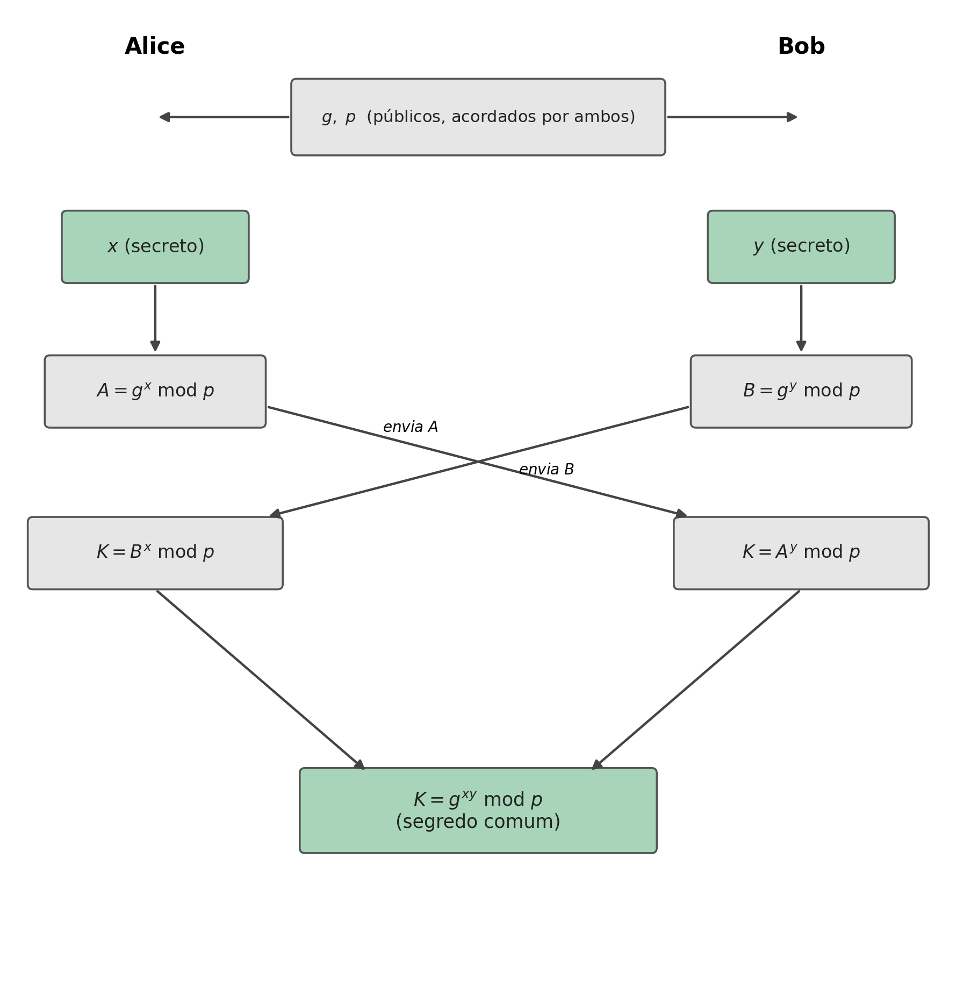
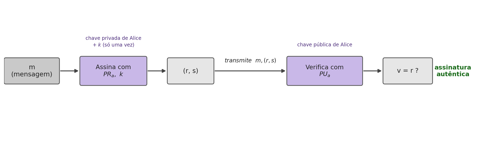

## Introdução {#sec-07-intro .unnumbered}

O capítulo anterior resolveu a confidencialidade e a autenticação assumindo que cada participante já tem um par de chaves RSA. Este capítulo trata de dois problemas relacionados, mas distintos. Primeiro, como combinar uma **chave simétrica partilhada** entre duas pessoas que nunca se encontraram, sem que ela seja exposta a quem intercepte a comunicação, o problema que o **Diffie-Hellman** resolve. Segundo, como provar, de forma verificável por qualquer pessoa, que um documento foi mesmo produzido por quem diz tê-lo produzido, sem possibilidade de negação posterior, o problema das **assinaturas digitais**.

## Diffie-Hellman: Combinar uma Chave em Público {#sec-07-dh-conceito}

O **Diffie-Hellman** é um método para combinar em segurança uma chave partilhada, destinada a um sistema de cifra **simétrica**, mesmo através de um canal completamente aberto e observado por terceiros. Este método é um sistema de chave pública, embora não seja usado para a função de encriptação ou de assinatura [@Du2022].

## O Problema Matemático: Logaritmos Discretos {#sec-07-dh-matematica}

A segurança do Diffie-Hellman assenta num problema matemático concreto. Suponha-se um número da forma $A = g^x$. Encontrar $x$ a partir de $A$ e $g$ é, em princípio, trivial: basta calcular $\log_g A = \log_g g^x = x$. Mas se, em vez disso, se tiver $g^x \bmod n$, com $g$ e $n$ suficientemente grandes, esse cálculo deixa de ser viável, mesmo para um computador poderoso. A este problema chama-se o **problema do logaritmo discreto**, e é nele que assenta toda a segurança do método.

Tal como a factorização de inteiros de que depende o RSA (Secção 6.5), o logaritmo discreto módulo um primo também admite um ataque mais rápido do que a força bruta pura: uma variante do *general number field sieve* resolve-o em tempo **subexponencial** [@Stallings2020]. É por esta razão, e não apenas por "ser grande", que o módulo $p$ do Diffie-Hellman clássico precisa de ter, tal como o $n$ do RSA, pelo menos 2048 a 3072 bits para um nível de segurança prático razoável.

## O Algoritmo {#sec-07-dh-algoritmo}

Alice e Bob combinam publicamente dois valores, $g$ e $p$ (um número primo grande), que não precisam de ser secretos. Cada um escolhe depois um número secreto, que nunca revela: Alice escolhe $x$, Bob escolhe $y$.

{#fig-07-dh width=85%}

Cada um calcula então um valor a partir do seu segredo, $A = g^x \bmod p$ (Alice) e $B = g^y \bmod p$ (Bob), e envia-o ao outro, em claro, pelo canal aberto: estes são as **chaves públicas** de Alice e de Bob. Ao receberem o valor um do outro, cada um eleva-o ao seu próprio segredo:

$$K = B^x \bmod p = (g^y)^x \bmod p = g^{xy} \bmod p \qquad \text{(Alice)}$$
$$K = A^y \bmod p = (g^x)^y \bmod p = g^{xy} \bmod p \qquad \text{(Bob)}$$

Ambos chegam exactamente ao mesmo valor, $K = g^{xy} \bmod p$, a **chave secreta comum**, sem que $x$, $y$, ou o próprio $K$ tenham alguma vez atravessado o canal. Um atacante que intercepte $g$, $p$, $A$ e $B$, tudo o que é trocado em claro, teria de resolver o problema do logaritmo discreto para recuperar $x$ ou $y$ a partir daí, exactamente o problema que a Secção 7.2 já identificou como inviável.

## Assinaturas Digitais: o Conceito {#sec-07-assinaturas-conceito}

O capítulo anterior já introduziu a ideia essencial de uma assinatura digital: cifrar com a **chave privada** do emissor, de forma que qualquer pessoa a consiga verificar com a sua chave pública, mas só o dono da chave privada a consiga produzir. A forma mais directa de aplicar isto a uma mensagem é cifrar o seu **hash** com a chave privada, em vez da mensagem inteira (o que seria muito mais lento): usar, por exemplo, o RSA para cifrar $H(m)$.

Existe também um algoritmo desenhado especificamente para este único propósito, sem servir para encriptação, o **DSA** (*Digital Signature Algorithm*). Tal como o Diffie-Hellman, usa criptografia de chave pública baseada nas propriedades da exponenciação modular e no problema do logaritmo discreto, é computacionalmente complexo, e fornece três garantias em simultâneo: **autenticação** (o receptor consegue verificar a origem da mensagem), **integridade**, e **não repúdio** (o autor não consegue negar credivelmente ter assinado).

## DSA: Parâmetros e Chaves {#sec-07-dsa-parametros}

A definição dos parâmetros iniciais do DSA segue estes passos:

1. Escolher uma **função de hash aprovada** $H$ (por exemplo, SHA-512).
2. Escolher um comprimento de chave $L$ e um comprimento de módulo $N$, com $N<L$ e $L \le$ o comprimento da saída de $H$. Os pares $(L,N)$ normalizados são $(1024,160)$, $(2048,224)$, $(2048,256)$ ou $(3072,256)$.
3. Escolher $q$, um primo de $N$ bits.
4. Escolher $p$, um primo de $L$ bits, tal que $p-1$ seja múltiplo de $q$.
5. Escolher um inteiro aleatório $h$ entre $2$ e $p-2$, e calcular $g = h^{(p-1)/q} \bmod p$ (se $g=1$, escolhe-se outro $h$).

Os três valores $p$, $q$ e $g$ são **partilhados publicamente**, tal como o $g$ e o $p$ do Diffie-Hellman. A partir deles, cada participante gera o seu próprio par de chaves: a **chave privada** é um número aleatório $x$, entre $1$ e $q-1$; a **chave pública** é $y = g^x \bmod p$. O mesmo par $(x,y)$ pode ser reutilizado para qualquer número de assinaturas.

## DSA: Assinar e Verificar {#sec-07-dsa-assinar}

Para assinar uma mensagem $m$, escolhe-se primeiro $k$, um número aleatório entre $1$ e $q-1$. Ao contrário de $x$, este $k$ é **efémero**: secreto, e usado **uma única vez**, apenas nessa assinatura, exactamente pela mesma razão que uma cifra de fluxo nunca pode reutilizar o par (chave, *nonce*), reutilizá-lo permitiria a um atacante recuperar $x$ a partir de duas assinaturas distintas. Calcula-se então:

$$r = (g^k \bmod p) \bmod q \qquad\qquad s = k^{-1}(H(m) + xr) \bmod q$$

e a assinatura é o par $(r,s)$. O valor $s$ tem de satisfazer requisitos exigentes ao mesmo tempo: depender da mensagem $m$, provar o uso da chave privada $x$, nunca revelar nem $x$ nem $k$, e ainda assim permitir a verificação sem que o verificador precise de conhecer nenhum dos dois.

{#fig-07-dsa-verificar width=100%}

Para verificar, o receptor conhece $p$, $q$, $g$ e a chave pública $y$, e recebe $m$ e $(r,s)$:

1. Confirma que $r$ e $s$ são positivos e menores do que $q$.
2. Calcula $w = s^{-1} \bmod q$.
3. Calcula $u_1 = H(m) \cdot w \bmod q$ e $u_2 = r \cdot w \bmod q$.
4. Calcula $v = (g^{u_1} y^{u_2} \bmod p) \bmod q$.
5. Se $v = r$, a assinatura é válida.

## Um Problema em Aberto: Confiar na Chave Pública {#sec-07-confianca}

Alice envia uma mensagem a Bob, assinada com a sua chave privada; Bob verifica a assinatura com a chave pública de Alice, e o cálculo confirma que é válida. Mas isto levanta uma questão que nem o Diffie-Hellman nem o DSA respondem sozinhos: **como sabe Bob que aquela chave pública é mesmo de Alice, e não de outra pessoa a fazer-se passar por ela?**

O problema é geral, e afecta qualquer troca de chaves públicas feita sem mais garantias, incluindo o próprio Diffie-Hellman: um atacante posicionado em qualquer ponto da rede entre Alice e Bob, por exemplo num router comprometido, pode interceptar $g$, $p$ e os valores trocados, e substituir-se a cada um deles perante o outro, um **ataque do intermediário** (*man-in-the-middle*, MITM). A vítima nunca percebe, porque cada lado continua a receber valores que parecem legítimos, só que gerados pelo atacante. Este ataque quebra qualquer algoritmo de chave pública que não tenha forma de confirmar, de forma independente, que uma chave pública pertence mesmo a quem diz pertencer.

## Síntese do Capítulo {#sec-07-sintese}

Este capítulo respondeu a duas perguntas deixadas em aberto pela criptografia assimétrica:

1. O **Diffie-Hellman** permite a duas partes combinarem uma chave secreta comum através de um canal completamente aberto, sem nunca a transmitir directamente
2. A sua segurança assenta no **problema do logaritmo discreto**: calcular $g^x \bmod p$ é fácil, mas recuperar $x$ a partir do resultado é computacionalmente inviável para valores suficientemente grandes
3. Cada parte troca um valor público ($g^x \bmod p$ ou $g^y \bmod p$), calculado a partir de um segredo que nunca revela; ambas chegam ao mesmo segredo comum $g^{xy} \bmod p$
4. Uma **assinatura digital** pode ser construída cifrando o hash de uma mensagem com a chave privada do autor (usando RSA, por exemplo), ou com um algoritmo dedicado como o **DSA**
5. O DSA assina com uma chave privada $x$ e um valor efémero $k$, usado uma única vez por assinatura; qualquer pessoa verifica depois com a chave pública correspondente, sem nunca ter acesso a $x$ nem a $k$
6. Nenhum destes dois mecanismos resolve, sozinho, o problema de **confiar** que uma chave pública pertence mesmo a quem diz pertencer: sem essa garantia, um atacante posicionado no meio do canal (MITM) consegue substituir-se a qualquer uma das partes

## Para Pensar {#sec-07-reflexao}

No DSA, o valor efémero $k$ tem de ser secreto e usado uma única vez por assinatura, tal como o par (chave, *nonce*) de uma cifra de fluxo nunca pode repetir-se. Nas cifras de fluxo, reutilizar o par expõe o XOR dos dois textos claros (o ataque do *two-time pad*, Secção 4.1). No DSA, $r = (g^k \bmod p) \bmod q$ depende só de $k$, por isso duas assinaturas com o mesmo $k$ produzem o mesmo $r$, e um atacante que reconheça essa repetição fica com duas equações, $s_1 = k^{-1}(H(m_1)+xr) \bmod q$ e $s_2 = k^{-1}(H(m_2)+xr) \bmod q$, com apenas duas incógnitas, $k$ e $x$. Que operação simples entre estas duas equações elimina $k$ e permite isolar directamente a chave privada $x$?

::: {.callout-note}
#### Solução

A operação é a **subtracção** das duas equações:

$$s_1 - s_2 = k^{-1}\big[(H(m_1)+xr) - (H(m_2)+xr)\big] \bmod q = k^{-1}\big(H(m_1)-H(m_2)\big) \bmod q$$

O termo $xr$ é igual nas duas equações (mesmo $r$, porque depende só do $k$ reutilizado, e a mesma chave $x$), por isso cancela-se por completo na subtracção, deixando uma equação com uma única incógnita, $k$:

$$k = \big(H(m_1)-H(m_2)\big)\,(s_1-s_2)^{-1} \bmod q$$

Com $k$ recuperado, basta substituir numa das equações originais para isolar a chave privada:

$$x = (s_1 k - H(m_1))\, r^{-1} \bmod q$$

Este não é um ataque só teórico: foi exactamente desta forma que a Sony Computer Entertainment perdeu, em 2010, a chave privada de assinatura de código da PlayStation 3. A implementação da Sony usava sempre o mesmo valor de $k$ em vez de gerar um novo, aleatório, para cada assinatura, e um grupo de investigadores (o *fail0verflow*, seguido por George Hotz) explorou exactamente esta reutilização para recuperar a chave privada da consola, permitindo assinar e executar código não autorizado em qualquer PS3.
:::

## Referências {#sec-07-referencias .unnumbered}

::: {#refs}
:::
