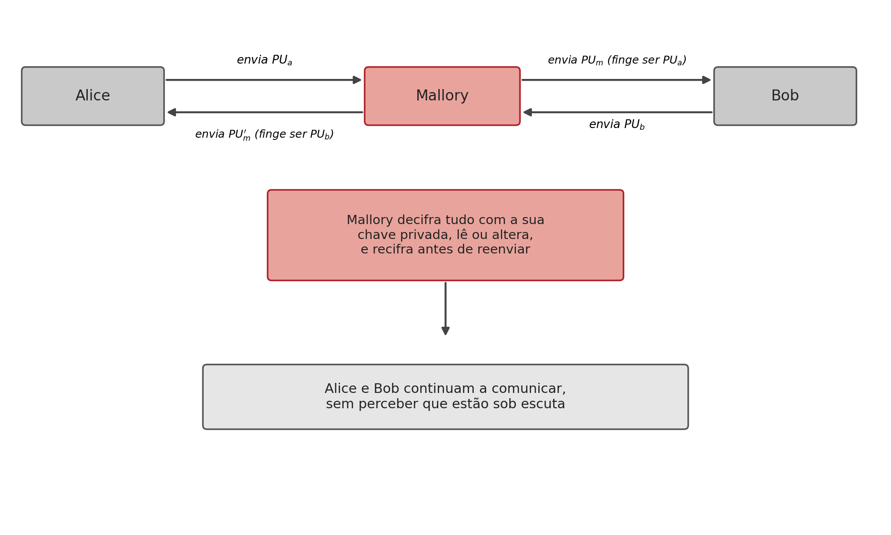

## Introdução {#sec-09-intro .unnumbered}

O capítulo anterior terminou com uma pergunta em aberto: como sabe alguém que uma chave pública pertence mesmo a quem diz pertencer? Sem resposta a esta pergunta, todo o edifício da criptografia assimétrica, confidencialidade, autenticação, assinaturas, Diffie-Hellman, fica exposto a um único tipo de ataque. Este capítulo examina esse ataque em detalhe, e a solução de engenharia que se tornou o padrão da indústria para o resolver: a **infraestrutura de chave pública**.

## O Ataque do Intermediário em Detalhe {#sec-09-mitm}

No **ataque do intermediário** (*man-in-the-middle*, MITM), um atacante posicionado em qualquer ponto da rede entre as duas partes, por exemplo num router comprometido, intercepta e substitui as chaves públicas trocadas, sem que nenhuma das vítimas se aperceba [@Stallings2020]:

{#fig-09-mitm width=85%}

O ataque funciona porque uma chave pública, por definição, não tem nada que a ligue de forma inseparável ao seu dono: é apenas um número, e um número não tem identidade própria. Quando Alice recebe algo que parece ser a chave pública de Bob, não tem, por si só, nenhuma forma de confirmar essa origem.

Vale a pena notar que este ataque **quebra qualquer** algoritmo de chave pública, não é uma fraqueza do RSA, do Diffie-Hellman ou do DSA em particular. No caso específico do Diffie-Hellman (Secção 7.3), o ataque tem uma consequência particularmente insidiosa: Mallory estabelece **duas** trocas de chave distintas, uma com Alice e outra com Bob, e passa a decifrar e recifrar cada mensagem trocada entre eles, sem que nenhum dos dois consiga sequer detectar que a chave "comum" que pensam partilhar não é, de facto, partilhada com o outro, mas sim com Mallory de ambos os lados.

## A Solução: uma Entidade de Confiança {#sec-09-solucao}

A solução passa por introduzir uma terceira parte, uma **entidade de confiança**, que ambas as partes reconheçam antecipadamente, e que testemunhe a ligação entre uma identidade e uma chave pública. Se Alice e Bob confiarem na mesma entidade, cada um pode perguntar-lhe, "esta chave pública pertence mesmo à outra parte?", sem que essa pergunta precise de passar pelo canal, potencialmente comprometido, entre os dois [@Stallings2020; @Martin2017].

Esta é exactamente a função de uma **infraestrutura de chave pública** (*Public Key Infrastructure*, PKI): um conjunto de entidades, processos e normas que ligam formalmente identidades a chaves públicas, através de **certificados digitais**. Ao contrário de uma verificação pontual, o certificado é um objecto assinado, verificável de forma independente e reutilizável por qualquer parte que confie na entidade que o emitiu.

## O Certificado X.509 {#sec-09-x509}

A norma **X.509**, hoje universal na Web, define a estrutura de um certificado de chave pública. Um certificado X.509 contém, no essencial, os dados de identificação do titular e a assinatura de quem os certifica [@RFC5280]:

{#fig-09-x509 width=55%}

- **Identidade** (*Subject*): a quem pertence o certificado, tipicamente um domínio, uma organização, ou uma pessoa.
- **Chave pública**: a chave que o certificado atesta pertencer a essa identidade.
- **Validade**: um intervalo de datas fora do qual o certificado deixa de ser considerado válido.
- **Emissor** (*Issuer*): a identidade da entidade certificadora que o assinou.
- **Número de série**: um identificador único do certificado, essencial para o processo de revogação.
- **Assinatura da CA**: a **entidade certificadora** (*Certificate Authority*, CA) assina, com a sua própria chave privada, o hash de todos os campos anteriores: $\mathrm{Sign}(sk_{CA}, H(\text{dados do titular}))$.

Esta última linha é o que transforma os dados de identificação numa afirmação verificável: qualquer pessoa com a chave pública da CA consegue confirmar que foi mesmo aquela CA, e não outra entidade, a atestar a ligação entre aquela identidade e aquela chave pública.

## A Cadeia de Certificação {#sec-09-cadeia}

Um único par de chaves de CA a certificar directamente cada site da Internet seria impraticável e frágil (um único ponto de compromisso comprometeria tudo). Em vez disso, a confiança organiza-se numa **cadeia de certificação**: cada certificado é assinado por outro, até chegar a uma **CA raiz** (*Root CA*), cuja chave pública vem pré-instalada no sistema operativo ou no navegador [@Stallings2020]:

{#fig-09-cadeia-ca width=85%}

Confiar apenas na CA raiz, um número relativamente pequeno de entidades, cuidadosamente auditadas, é suficiente para validar qualquer certificado emitido em qualquer ponto da cadeia, por mais intermediários que existam entre a raiz e o titular final.

## Como Funciona a Verificação {#sec-09-verificacao}

Quando Bob recebe o certificado de Alice, verifica-o seguindo estes passos [@Stallings2020]:

1. Lê o campo **Emissor** do certificado, identificando qual CA o assinou.
2. Obtém a chave pública dessa CA, $pk_{CA}$ (a partir do certificado da própria CA, já conhecido e confiado, ou seguindo a cadeia até uma raiz que o seja).
3. Verifica a assinatura: $\mathrm{Verify}(pk_{CA}, \text{dados do certificado}, \text{assinatura}_{CA})$.
4. Se a assinatura for válida, a chave pública de Alice está confirmada como genuína.
5. Verifica ainda o **período de validade**, o estado de **revogação** (através de uma lista de revogação, *Certificate Revocation List*, ou do protocolo em tempo real *Online Certificate Status Protocol*, OCSP), e o **uso permitido** do certificado.

Só depois de todos estes passos passarem é que Bob tem uma garantia fundamentada de que a chave pública recebida é mesmo de Alice, e não de um atacante interposto.

## Na Prática: Inspeccionar um Certificado {#sec-09-pratica}

Qualquer certificado X.509 usado num servidor público pode ser inspeccionado directamente:

```bash
$ openssl s_client -showcerts -connect www.exemplo.com:443 >> cert.pem
$ openssl x509 -in cert.pem -text -noout
```

O primeiro comando estabelece uma ligação TLS e regista a cadeia de certificados enviada pelo servidor; o segundo lê o certificado e apresenta, em texto legível, exactamente os campos discutidos na Secção 9.3, incluindo o titular, o emissor, o período de validade e o algoritmo de assinatura usado.

## Síntese do Capítulo {#sec-09-sintese}

Este capítulo resolveu o problema deixado em aberto no capítulo anterior:

1. O **ataque do intermediário** (MITM) quebra qualquer algoritmo de chave pública, substituindo as chaves trocadas por outras, controladas pelo atacante, sem que nenhuma das vítimas o perceba
2. A solução é introduzir uma **entidade de confiança** partilhada, capaz de atestar formalmente a ligação entre uma identidade e uma chave pública
3. Um **certificado X.509** contém a identidade do titular, a sua chave pública, um período de validade, o emissor, e a assinatura desse emissor sobre um hash de todos estes dados
4. A confiança organiza-se numa **cadeia de certificação**, da CA raiz (pré-instalada no sistema) até ao titular final, através de CAs intermédias
5. Verificar um certificado exige confirmar a assinatura da CA emissora, o período de validade, e o estado de revogação, não basta confirmar só a assinatura

## Para Pensar {#sec-09-reflexao}

A cadeia de certificação (Secção 9.4) resolve o problema de confiar numa chave pública introduzindo confiança numa CA raiz, pré-instalada no sistema operativo ou no navegador. Isto desloca o problema original (como confiar numa chave pública?) para um problema ligeiramente diferente. Qual é esse novo problema, e porque é que confiar numa dezena de CAs raiz pré-instaladas é uma solução mais praticável do que pedir a cada utilizador da Internet que confirme manualmente a chave pública de cada site que visita?

## Referências {#sec-09-referencias .unnumbered}

::: {#refs}
:::
