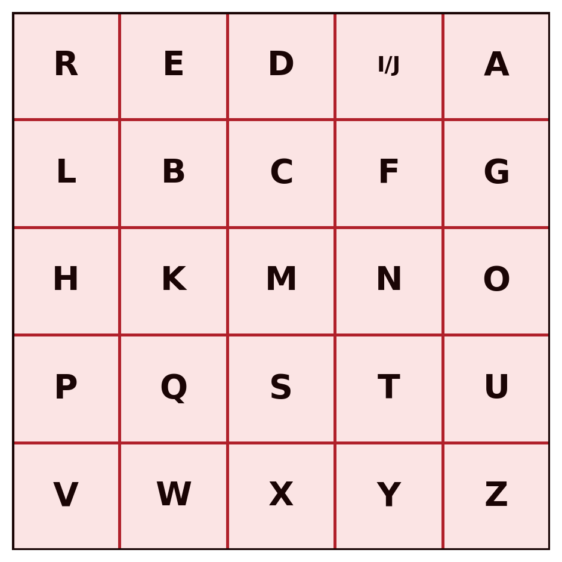
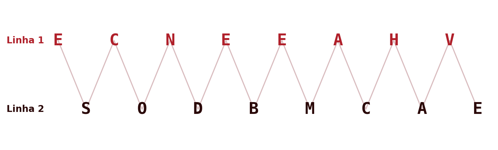
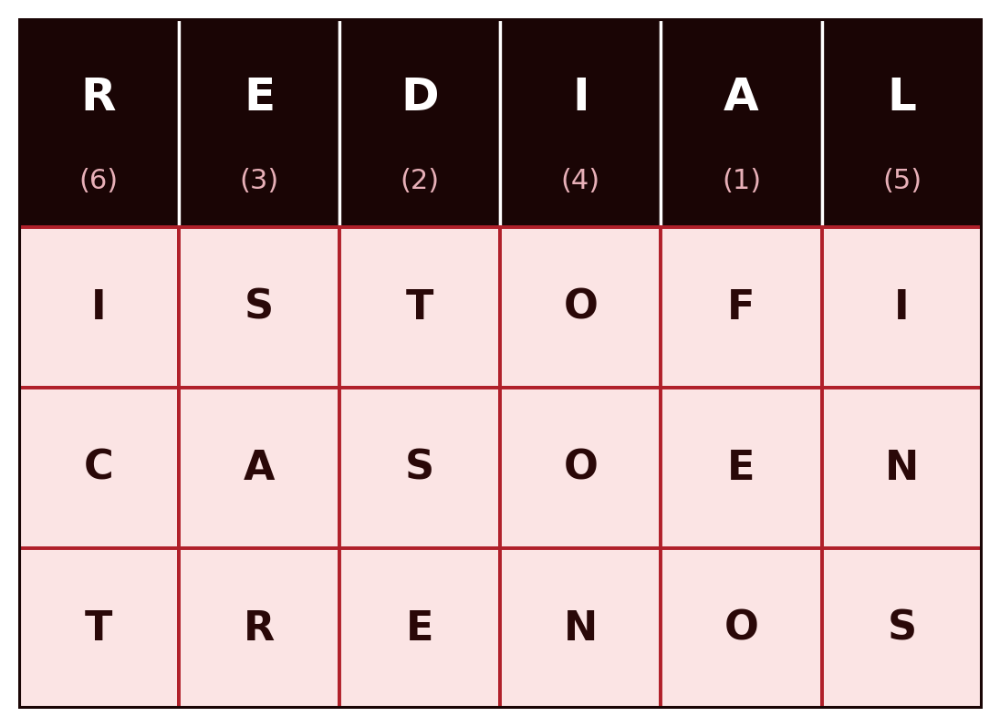

## Introduction {#sec-01-intro .unnumbered}

Cryptography is the discipline that studies techniques for protecting information by transforming it into a form that is unreadable to anyone who does not possess the key needed to reverse that transformation. This chapter introduces the fundamental concepts that run through the entire discipline, the symmetric cipher model, Kerckhoffs's principle, the distinction between brute force and cryptanalysis, and then walks through the classical ciphers: substitution and transposition systems developed over centuries, long before the appearance of the computer.

These ciphers are today completely obsolete from the standpoint of practical security, and are trivial to break with modern computational means. Their value in this module is pedagogical: they introduce, in a simple and manual way, the concepts of key, key space, brute-force attack and cryptanalysis that apply, with the same underlying logic, to the modern systems studied in the following chapters.

## Foundations of Cryptographic Systems {#sec-01-fundamentos}

### Classification of cryptographic systems {#sec-01-classificacao}

Cryptographic systems are classified according to three independent criteria:

| Criterion | Categories |
|:--|:--|
| Number of keys | **Symmetric** (a single key, shared between sender and receiver) or **asymmetric** (two distinct keys, one public and one private) |
| Type of operation | **Substitution** (each symbol is replaced by another) or **transposition** (the symbols themselves stay the same, but their order is changed) |
| Text processing | **Block cipher** (the text is processed in fixed-size blocks) or **stream cipher** (the text is processed continuously, symbol by symbol) |

This chapter deals exclusively with **symmetric** systems, of the **substitution** or **transposition** kind. The following chapters introduce modern block and stream ciphers.

### The symmetric cipher model {#sec-01-modelo}

A symmetric cryptographic system is defined by five components [@Stallings2020]:

- **Plaintext** ($X$): the original message, still intelligible.
- **Encryption algorithm** ($E$): the procedure that transforms the plaintext into ciphertext, through successive substitutions and transformations.
- **Secret key** ($K$): a value independent of the plaintext and of the algorithm, shared between sender and receiver over a secure channel. Different keys produce different results for the same plaintext and the same algorithm.
- **Ciphertext** ($Y$): the result of encryption, apparently random and, on the face of it, unintelligible.
- **Decryption algorithm** ($D$): essentially the encryption algorithm run in reverse, which uses the same key $K$ to recover the plaintext from the ciphertext.

Formally:

$$Y = E(K, X)$$
$$X = D(K, Y)$$

{#fig-01-modelo-simetrico}

Sender and receiver must have obtained copies of the same secret key by some secure means, and must keep it protected (@fig-01-modelo-simetrico). If anyone discovers the key and knows the algorithm, all communication encrypted with that key becomes readable.

### Kerckhoffs's principle {#sec-01-kerckhoffs}

A fundamental assumption of all modern cryptography, already present in these classical ciphers, is **Kerckhoffs's principle**, formulated in 1883 [@Kerckhoffs1883]: the security of a cipher must depend solely on the secrecy of the key, never on the secrecy of the algorithm. It is always assumed that an attacker knows the encryption and decryption algorithm perfectly, and is only ignorant of the key.

This convention has an important practical consequence: an algorithm whose security depends on remaining secret (*security through obscurity*) is not considered secure in serious cryptography, precisely because that condition is impossible to guarantee in the long run. The algorithms studied in this module are all public and widely scrutinised: their security rests entirely on the size and the secrecy of the key.

### Brute force and cryptanalysis {#sec-01-ataques}

An attacker seeking to recover the plaintext without knowing the key has two general strategies available:

- **Brute force**: exhaustively test every possible key, until one is found that produces intelligible plaintext. On average, roughly half of the total key space must be tested before a result is obtained.
- **Cryptanalysis**: exploit additional knowledge about parts of the system, such as already-known plaintext/ciphertext pairs, or statistical properties of the algorithm, to deduce the key without testing it exhaustively.

Classical cryptanalysis of the ciphers studied in this chapter relies chiefly on **frequency analysis**: the statistical distribution of letters in a natural language is not uniform, and that asymmetry survives, in varying degrees, the encryption process.

Depending on the information available to the cryptanalyst, several types of attack are distinguished [@Stallings2020]:

| Type of attack | What the cryptanalyst knows |
|:--|:--|
| Ciphertext only | The algorithm and the ciphertext |
| Known plaintext | The algorithm, the ciphertext, and one or more plaintext/ciphertext pairs formed with the same key |
| Chosen plaintext | The algorithm, the ciphertext, and a plaintext chosen by the attacker, together with the corresponding ciphertext |
| Chosen ciphertext | The algorithm, the ciphertext, and a ciphertext chosen by the attacker, together with the corresponding decrypted plaintext |
| Chosen text | The combined knowledge of the two previous attacks |

## Substitution Ciphers {#sec-01-substituicao}

In a substitution cipher, each symbol of the plaintext is **replaced** by another symbol, according to a fixed rule determined by the key. The order of the symbols stays unchanged; what changes is their identity.

### The Caesar cipher {#sec-01-cesar}

The Caesar cipher, attributed to Julius Caesar, is the simplest substitution cipher: each letter is replaced by the letter found $k$ positions further ahead in the alphabet, with $k$ being the key. For example, with $k = 3$ (illustrated here on the original Portuguese-language example, "GUARDA BEM O TEU SEGREDO", "guard your secret well"):

::: {.httpmsg}
```
Texto claro:   G U A R D A   B E M   O   T E U   S E G R E D O
Texto cifrado: J X D U G D   E H P   R   W H X   V H J U H G R
```
:::

Numbering the letters of the alphabet from 0 (A) to 25 (Z), the Caesar cipher is formally defined by:

$$C = E(k, p) = (p + k) \bmod 26$$
$$p = D(k, C) = (C - k) \bmod 26$$

| A | B | C | D | E | F | G | H | I | J | K | L | M | N | O | P | Q | R | S | T | U | V | W | X | Y | Z |
|:-:|:-:|:-:|:-:|:-:|:-:|:-:|:-:|:-:|:-:|:-:|:-:|:-:|:-:|:-:|:-:|:-:|:-:|:-:|:-:|:-:|:-:|:-:|:-:|:-:|:-:|
| 0 | 1 | 2 | 3 | 4 | 5 | 6 | 7 | 8 | 9 | 10 | 11 | 12 | 13 | 14 | 15 | 16 | 17 | 18 | 19 | 20 | 21 | 22 | 23 | 24 | 25 |

The modulo-26 operation guarantees that the result always stays within the valid range: whenever the sum exceeds 25, the remainder of division by 26 brings it back into the alphabet. For example, encrypting the letter "y" ($p = 24$) with $k = 3$: $C = (24 + 3) \bmod 26 = 27 \bmod 26 = 1$, which corresponds to the letter "B".

**Key space and brute force.** The key $k$ can only take 25 distinct values (excluding $k = 0$, which encrypts nothing, and $k = 26$, equivalent to $k = 0$). Such a small key space makes the Caesar cipher trivially vulnerable to a brute-force attack: it suffices to generate all 25 candidate decryptions and identify the single one that is intelligible.

**Cryptanalysis by frequency analysis.** Even without resorting to brute force, the Caesar cipher is easily broken by cryptanalysis, by exploiting two sources of information: the structure of the text (spaces between words survive encryption, revealing the length of each word) and the language of the plaintext (allowing the cryptanalyst to look for patterns of short, frequent words). Combining these clues with the relative frequency of each letter, which in a natural language is far from uniform, a cryptanalyst can typically recover the key within a few minutes.

::: {.callout-note}
#### Why it is so easy to break

The ease of cryptanalysis lies not only in the algorithm itself, but in the fact that the attacker has access to far more information than just the algorithm and the ciphertext: they know the language of the message and its structure (where words begin and end). Hiding that structure, by removing the spaces from the ciphertext, makes a manual attack harder, but not impossible: other statistical features of the language, such as the frequency of consecutive letter pairs, remain available.
:::

**Worked exercise: cryptanalysis via digraphs and trigraphs.** A short word that repeats in the message, as a separate, complete word, always produces the same block of letters in the ciphertext, since the Caesar cipher applies a fixed shift. Consider the following ciphertext (encrypting a Portuguese-language example, since the digraph/trigraph frequency argument below depends on the statistics of the Portuguese language):

::: {.httpmsg}
```
Texto cifrado: V   X B L   Z L   V B C L   U H V   L   V   X B L   Z L   C L
```
:::

The text has two blocks that repeat, each one twice: **XBL** and **ZL**. In Portuguese, "QUE" ("that") is the most common trigraph occurring as an isolated word, and "SE" ("if"/reflexive "se") is one of the most common digraphs. Assuming that XBL corresponds to "QUE" and ZL to "SE":

$$k = (\text{X} - \text{Q}) \bmod 26 = (23 - 16) \bmod 26 = 7$$
$$k = (\text{Z} - \text{S}) \bmod 26 = (25 - 18) \bmod 26 = 7$$

The two hypotheses agree on the same $k = 7$, which confirms the correspondence without any brute-force attempt. Note that it is essential for "QUE" and "SE" to appear as separate words, never embedded inside a larger word (for instance, "SE" inside "SEGUNDA" would not count), since only a repeated, isolated word guarantees an identical block of ciphertext.

With $k = 7$ known, the rest of the text decrypts immediately, word by word, including the two blocks not yet identified (**VBCL** and **CL**, both short and easy to confirm once the shift is known):

::: {.httpmsg}
```
Texto claro:   O   Q U E   S E   O U V E   N A O   E   O   Q U E   S E   V E
```
:::

"O que se ouve não é o que se vê" ("What is heard is not what is seen").

::::: {.callout-tip}
#### Exercise: break it unaided

Applying the same technique, break the following ciphertext (this time without spaces between words):

::: {.httpmsg}
```
ZBFPDPGPYLZPZBFPDPZFGP
```
:::
:::::

### Monoalphabetic cipher {#sec-01-monoalfabetica}

The Caesar cipher is a very restricted special case of a more general class: the **monoalphabetic cipher**, in which the key is an arbitrary permutation of the 26 letters of the alphabet, not merely a fixed shift. The key space grows from 25 to $26! \approx 4 \times 10^{26}$, making a brute-force attack computationally infeasible. For example:

| A | B | C | D | E | F | G | H | I | J | K | L | M | N | O | P | Q | R | S | T | U | V | W | X | Y | Z |
|:-:|:-:|:-:|:-:|:-:|:-:|:-:|:-:|:-:|:-:|:-:|:-:|:-:|:-:|:-:|:-:|:-:|:-:|:-:|:-:|:-:|:-:|:-:|:-:|:-:|:-:|
| Q | M | J | Z | T | G | F | K | P | W | L | S | B | O | X | N | C | R | Y | E | V | H | I | A | D | U |

::: {.httpmsg}
```
F V Q R Z Q   M T B   X   E T V   Y T F R T Z X
```
:::

Despite the astronomically larger key space, the monoalphabetic cipher remains vulnerable to cryptanalysis by frequency analysis: since each plaintext letter always corresponds to the same ciphertext letter, the statistical distribution of plaintext letters carries over, intact, into the ciphertext, with only the symbols swapped. It is enough to compare the frequency of the letters in the ciphertext with the known letter frequencies of the plaintext language, to reconstruct much of the mapping.

The example above encrypts Portuguese plaintext ("FVQRZQ MTB X ETV YTFRTZX", corresponding to "GUARDA BEM A TUA SENHA", "guard your password well"), so the frequency analysis that follows is carried out against the letter distribution of Portuguese, not English. In Portuguese, the distribution of letters is far from uniform: A, E and O clearly dominate, followed by an intermediate group (S, R, I, N, D, M, U, T, C), and a set of rare letters (Z, J, X and, above all, K, W, Y, virtually absent from Portuguese words). The following values result from an actual count, taken over the first three cantos of *Os Lusíadas*, by Luís de Camões (roughly 103 thousand alphabetic characters), with the alphabet normalised to `a`–`z`, without diacritics or cedilla. It serves here only as an approximate example of counts taken from larger corpora:

{#fig-01-frequencia-letras}

Counting the letters of the ciphertext from the previous example ("FVQRZQ MTB X ETV YTFRTZX", 20 letters):

| Cipher letter | Occurrences | Observed |
|:-:|:-:|:-:|
| T | 4 | 20.0% |
| F | 2 | 10.0% |
| V | 2 | 10.0% |
| Q | 2 | 10.0% |
| R | 2 | 10.0% |
| Z | 2 | 10.0% |
| X | 2 | 10.0% |
| M | 1 | 5.0% |
| B | 1 | 5.0% |
| E | 1 | 5.0% |
| Y | 1 | 5.0% |

Comparing this list with the reference chart (@fig-01-frequencia-letras): T would be the obvious candidate to correspond to A or E (the dominant letters of the language), but six different letters tie immediately afterwards at 10%, with none standing out as the expected runner-up. With only 20 letters, each single occurrence is worth 5 percentage points, which is enough to completely distort the picture — the conclusion that this text is too short for a serious frequency analysis is not a supposition, it is exactly what the table itself shows. Consider instead a real, considerably longer text, encrypted with the same key: the first stanza of *Os Lusíadas*, by Luís de Camões (1572).

> As armas e os barões assinalados,\
> Que da ocidental praia Lusitana,\
> Por mares nunca de antes navegados,\
> Passaram ainda além da Taprobana,\
> Em perigos e guerras esforçados,\
> Mais do que prometia a força humana,\
> E entre gente remota edificaram\
> Novo Reino, que tanto sublimaram.

*(Roughly: "The arms, and the barons who, from the western Lusitanian shore, through seas never before navigated, passed even beyond Taprobana... and among peoples remote built a new kingdom, which they so exalted.")*

Without diacritics or spaces, the 221 letters of this excerpt encrypt, with the same key used above, as follows:

::: {.httpmsg}
```
QYQRBQYTXYMQRXTYQYYPOQSQZXY
CVTZQXJPZTOEQSNRQPQSVYPEQOQ
NXRBQRTYOVOJQZTQOETYOQHTFQZXY
NQYYQRQBQPOZQQSTBZQEQNRXMQOQ
TBNTRPFXYTFVTRRQYTYGXRJQZXY
BQPYZXCVTNRXBTEPQQGXRJQKVBQOQ
TTOERTFTOETRTBXEQTZPGPJQRQB
OXHXRTPOXCVTEQOEXYVMSPBQRQB
```
:::

Counting the letters of this ciphertext now (221 letters):

| Cipher letter | Occurrences | Observed |
|:-:|:-:|:-:|
| Q | 42 | 19.00% |
| T | 25 | 11.31% |
| Y | 19 | 8.60% |
| R | 18 | 8.14% |
| X | 18 | 8.14% |
| O | 15 | 6.79% |
| B | 12 | 5.43% |
| P | 12 | 5.43% |
| Z | 10 | 4.52% |
| E | 10 | 4.52% |
| V | 8 | 3.62% |
| N | 6 | 2.71% |
| S | 5 | 2.26% |
| J | 5 | 2.26% |

Unlike the short example, the observed order now matches the reference order (@fig-01-frequencia-letras), position by position: the dominant pair (Q, T) corresponds exactly to the dominant pair of the language (A, E); the following group (Y, R, X, O, B, P, Z, E, V) corresponds, with small ordering deviations, to the intermediate group (S, R, I, N, D, M, U, T, C). A cryptanalyst with no access to the plaintext, only this table and the reference chart, would have solid grounds to guess $\text{Q} \leftrightarrow \text{A}$ and $\text{T} \leftrightarrow \text{E}$ right away, and would resolve most of the key by this process, word by word, exactly as was done above with "QUE" and "SE". The essential difference from the 20-letter example is not the method, it is the reliability of the numbers the method starts from. This is a statistics-based cryptanalysis: the longer the message, the more accurate the process becomes.

### Playfair cipher {#sec-01-playfair}

The Playfair cipher reduces the previous problem by encrypting **pairs of letters** (digraphs), rather than isolated letters, using a $5 \times 5$ grid built from a keyword. By encrypting pairs instead of individual letters, the frequency distribution of isolated letters no longer carries over directly into the ciphertext, making simple frequency analysis harder.

**Building the grid.** A keyword is chosen; its letters (without repetitions) are written into the first positions of the grid, and the remaining positions are filled with the letters of the alphabet in order, skipping those already used. Since the grid has only 25 positions for 26 letters, "I" and "J" share the same cell. With the keyword "REDIAL" (a village in the municipality of Murça, Portugal):

{#fig-01-playfair-grelha width=44%}

**Encryption rules**, applied to each pair of plaintext letters:

- If the two letters are in the **same row**, each is replaced by the letter immediately to its right (wrapping around to the start of the row, if necessary).
- If the two letters are in the **same column**, each is replaced by the letter immediately below it (wrapping around to the top, if necessary).
- Otherwise, each letter is replaced by the letter that sits in its own row, but in the column of the other letter (the two letters and their replacements form a rectangle in the grid).

If the two letters of a pair are identical, or if a single letter is left over at the end of a text with an odd number of letters, a filler letter is inserted (here, "X").

Consider the phrase "UTAD É FIXE" ("UTAD is cool"). Without spaces or accents, and split into pairs (the last, unpaired letter receives a filler "X"):

::: {.httpmsg}
```
UT AD EF IX EX
```
:::

Applying the rules: "UT" is in the same row (U and T on row 4) → PU. "AD" is in the same row (row 1) → RI. "EF" shares neither row nor column → the rectangle rule applies, giving IB. "IX" and "EX", likewise sharing neither row nor column, give DY and DW, respectively. The final ciphertext:

::: {.httpmsg}
```
PURIIBDYDW
```
:::

Even so, Playfair remains vulnerable: the frequency distribution of letter pairs (digraphs) in a natural language is likewise non-uniform, and this asymmetry survives encryption in a manner analogous to that of isolated letters. A cryptanalyst with enough ciphertext can reconstruct the grid through digraph frequency analysis.

### Polyalphabetic cipher: Vigenère {#sec-01-vigenere}

The ciphers seen so far share a structural weakness: each letter of the plaintext always corresponds to the same letter (or pair of letters) in the ciphertext, throughout the whole message. **Polyalphabetic ciphers** eliminate this fixed correspondence, using several different substitutions across the text, alternated according to a keyword that repeats cyclically.

In the Vigenère cipher, the keyword defines a sequence of shifts (each letter of the key corresponds to a different Caesar shift), applied cyclically to successive letters of the plaintext. With $m$ the length of the keyword, and $k_0, k_1, \dots, k_{m-1}$ the shifts it defines:

$$C_i = (p_i + k_{i \bmod m}) \bmod 26 \qquad p_i = (C_i - k_{i \bmod m}) \bmod 26$$

Since the key is shorter than the message ($m$ is typically much smaller than the number of plaintext letters), the index $i \bmod m$ ensures that it repeats cyclically until it covers the whole text. The same plaintext letter can thus correspond to different ciphertext letters, depending on the position at which it occurs, which considerably flattens the frequency distribution observable in the ciphertext.

Using the keyword "REDIAL" once again, repeated as many times as necessary to cover the whole plaintext, and the Portuguese tongue-twister "Três tigres tristes dormem" ("Three sad tigers sleep"):

::: {.httpmsg}
```
Chave:          R E D I A L R E D I A L R E D I A L R E D I A
Texto claro:    T R E S T I G R E S T R I S T E S D O R M E M
Texto cifrado:  K V H A T T X V H A T C Z W W M S O F V P M M
                  ^ ^ ^       ^ ^ ^
```
:::

Notice the block **VHA**, which appears twice in the ciphertext. This is not a repeated word this time, but a genuine coincidence in the tongue-twister itself: the sequence "RES" occurs in "T**RES**" and, by chance, also in "tig**RES**", exactly 6 positions later. Since the keyword "REDIAL" also has 6 letters, the two occurrences of "RES" line up with the key in the same way, producing the same encrypted block. This is the principle behind the Kasiski examination: whenever a stretch of plaintext repeats at a distance that is a multiple of the key length, even by coincidence, the corresponding ciphertext repeats too, and that visible repetition is a direct clue to the length of the key — here, 6.

The Vigenère cipher resisted systematic cryptanalysis for centuries, but it is not unbreakable: if the key is short and repeated many times over a sufficiently long text, techniques such as the Kasiski examination (identifying repetitions in the ciphertext, which reveal multiples of the key length) allow the length of the key to be recovered and, from there, allow the text to be treated as several independent Caesar ciphers, one per position within the key's cycle.

Already knowing, from the Kasiski examination alone, that the key has 6 letters (without yet knowing which ones), the cryptanalyst regroups the ciphertext: all the letters in positions 1, 7, 13, 19, ... form a first group; positions 2, 8, 14, 20, ... form a second group; and so on up to the sixth group. Each group, taken in isolation, is an ordinary Caesar cipher, with a single fixed $k$, exactly the kind of problem already solved in the previous section:

::: {.httpmsg}
```
Grupo 1 (pos. 1, 7, 13, 19):  K X Z F
Grupo 2 (pos. 2, 8, 14, 20):  V V W V
Grupo 3 (pos. 3, 9, 15, 21):  H H W P
Grupo 4 (pos. 4, 10, 16, 22): A A M M
Grupo 5 (pos. 5, 11, 17, 23): T T S M
Grupo 6 (pos. 6, 12, 18):     T C O
```
:::

Note that this does not contradict what was said earlier about Vigenère flattening the frequency distribution: that distortion affects the ciphertext *as a whole*, where letters encrypted with different shifts are mixed together. Within each isolated group, however, the same shift was always used, so the distribution reverts to that of an ordinary Caesar cipher, with no flattening at all. The Kasiski examination and frequency analysis therefore solve two different, complementary problems: one gives the number of groups to form (the length of the key); the other, applied afterwards to each group separately, gives the shift of each one.

To each group is applied, in isolation, the same single-letter frequency analysis used against the Caesar cipher: which is the most frequent letter of this group, and which letter of the language should it correspond to? In this example, with only 3 to 4 letters per group, there is not enough data for this analysis to be reliable, exactly as already seen with short texts; in a real, considerably longer text, each group would have dozens or hundreds of letters, and the method would work just as well as it did against the Caesar cipher.

### Vernam cipher {#sec-01-vernam}

Before reaching the definitive solution, an intermediate step is worthwhile. The **Vernam cipher**, created by Gilbert Vernam at AT&T's laboratories in 1918 for telegraphy [@Stallings2020], generalises Vigenère in two ways: it replaces modular addition with a bitwise **XOR** operation, and it uses a key far longer than Vigenère's typically short keyword, to the point of being, in practice, as long as the very punched paper tape that implemented it.

$$C_i = P_i \oplus K_{i \bmod m} \qquad P_i = C_i \oplus K_{i \bmod m}$$

{#fig-01-vernam-gerador width=95%}

A much longer key considerably hampers the Kasiski examination, since repetitions in the ciphertext become much rarer. But the underlying problem does not disappear: sooner or later, even a very long key tape runs out and has to start again, reintroducing a cycle, albeit a much longer one than that of a Vigenère keyword. The Vernam cipher is, therefore, a substantial improvement over Vigenère, but not a definitive solution: it remains vulnerable, in principle, to the same kind of cryptanalysis, merely requiring much longer intercepted messages to become practicable.

Note a structural limitation of the Vernam cipher, as originally conceived: it uses only a key, with no other value to distinguish one message from the next. It is precisely this absence that forces the key tape to repeat once it runs out. Modern stream ciphers, revisited in Chapter 4, solve this problem by introducing a second value, the *nonce*, unique per message but not secret, which allows the same key to be reused safely from message to message, without ever repeating the keystream.

### One-Time Pad {#sec-01-otp}

The **One-Time Pad** definitively resolves the weakness that the Vernam cipher only mitigated: it uses a genuinely random key, of the same length as the message, never reused for another message, and therefore never subject to any cycle. Each letter of the plaintext is combined with the corresponding letter of the key, just as in Vigenère, but without any cycle, since the key is as long as the text itself.

Claude Shannon proved, in 1949, that the One-Time Pad, when used correctly, is **mathematically unbreakable**: the ciphertext reveals no information whatsoever about the plaintext, even given unlimited computational power [@Shannon1949]. This property is called **perfect secrecy**.

**A concrete example of perfect secrecy.** For any ciphertext $C$ and any plaintext $P$ of the same length, there is always exactly one key $K = (C - P) \bmod 26$ linking them. Since all keys are, a priori, equally likely, the ciphertext favours no one reading over another: for a given ciphertext, there is always some key that decrypts it into any plaintext one wishes, of the same length.

This can be demonstrated concretely. Fixing a single 16-letter ciphertext, three different keys can be found that decrypt it into three plausible Portuguese sentences, on the same subject and mutually incompatible with one another:

::: {.httpmsg}
```
Texto cifrado (fixo):                 Q X B Z R P P N M N R S X S N J

Chave 1: Q F X M K P L V T N Z O R Y W J
Decifra para: A SENHA ESTA SEGURA

Chave 2: Q V U Z W L K Z E W D Y W S K J
Decifra para: A CHAVE FOI ROUBADA

Chave 3: C E N P N C C T Z L R G D P Z P
Decifra para: O TOKEN NUNCA MUDOU
```
:::

(The three Portuguese plaintexts decrypted above read: "THE PASSWORD IS SAFE", "THE KEY WAS STOLEN", and "THE TOKEN NEVER CHANGED" — three mutually incompatible claims about the same system.)

All three decryptions are correct: each results from applying $p = (C - K) \bmod 26$, letter by letter, with the respective key. An attacker who intercepts only `QXBZRPPNMNRSXSNJ`, without knowing the key, has no way whatsoever of knowing whether the password is safe, has been stolen, or whether, in fact, the subject was the token all along, and never the password. These three readings, and infinitely many others of the same length, are equally compatible with the ciphertext.

The same effect reproduces in any language. With a different, 19-letter ciphertext, three mutually incompatible readings in English are obtained:

::: {.httpmsg}
```
Ciphertext (fixed):                     J O B P D C R H E U G R W H U X Z G H

Key 1: X Q M P L K V T N R O Y W J C F Z B D
Decrypts to: MY PASSWORD STAYS SAFE

Key 2: Q H T X L Y P Q A B A D D P B J O C U
Decrypts to: THIS SECRET GOT STOLEN

Key 3: Q H T X D N J X A W K R E P N X I C E
Decrypts to: THIS API KEY WAS SHARED
```
:::

Despite this absolute theoretical guarantee, the One-Time Pad is impractical for most real-world scenarios, owing to three demands that are difficult to satisfy simultaneously:

- the key must be as long as the message;
- the key must be genuinely random, not generated by a deterministic algorithm;
- the key can never be reused, not even partially.

Distributing and storing keys of this size, securely, is as difficult as distributing the message itself securely. On top of this comes a less obvious cost: genuinely randomly generating, and then securely managing, a large volume of keys of this size also carries an appreciable computational cost, which can make the process too slow for the generality of practical applications. These combined requirements limit the use of the One-Time Pad to very specific scenarios, such as certain diplomatic or military communications of exceptional importance.

## Transposition Ciphers {#sec-01-transposicao}

Unlike substitution ciphers, **transposition ciphers** do not alter the identity of the plaintext symbols, only their order. The ciphertext contains exactly the same letters as the plaintext, merely rearranged according to a rule determined by the key.

### The rail fence technique {#sec-01-rail-fence}

The simplest form of transposition is the **rail fence** technique: the plaintext is written alternately across two lines, forming a zigzag, and the ciphertext is obtained by reading the top line first, then the bottom line, without interruption.

For the plaintext "ESCONDE BEM A CHAVE" ("hide the key well", without spaces, 16 letters):

{#fig-01-rail-fence width=80%}

Reading Line 1 followed by Line 2 yields the ciphertext `ECNEEAHVSODBMCAE`. Every letter of the ciphertext belongs to the plaintext, merely reordered, so statistical cryptanalysis based on isolated-letter frequency remains perfectly viable, as will be discussed further in this section.

### Columnar transposition {#sec-01-transposicao-colunar}

A more elaborate technique is **columnar transposition**: the plaintext is written into a grid with a number of columns equal to the length of the keyword, and the ciphertext is obtained by reading the columns in the alphabetical order of the keyword's letters, rather than in the original order in which they were written.

Using the keyword "REDIAL" once again — now not to shift or substitute, but to order columns — and the Portuguese phrase "Isto fica só entre nós" ("this stays just between us", 18 letters, exactly three rows of six columns, with no need for padding). Each letter of the key is assigned its position in alphabetical order (A=1, D=2, E=3, I=4, L=5, R=6), and the plaintext is written row by row, column by column, underneath the key:

{#fig-01-transposicao-grelha width=60%}

The ciphertext is obtained by reading the columns in the numerical order of their positions (not the order in which they appear in the grid): first the column under "A" (position 1), then the column under "D" (position 2), and so on up to the column under "R" (position 6):

::: {.httpmsg}
```
FEO TSE SAR OON INS ICT
```
:::

That is, "FEOTSESAROONINSICT". Note that all the letters of the plaintext are still present in the ciphertext, in the same quantity; only the order has changed.

A single columnar transposition is vulnerable to cryptanalysis, since the frequency distribution of isolated letters remains entirely unchanged, only their relative position changes. There is an important difference here from substitution: in a substitution, frequency is used to guess which plaintext letter corresponds to each ciphertext letter, a mapping problem; in a transposition, there is no mapping to guess, since an "E" in the ciphertext really is an "E" from the original text, merely shifted in position. The most frequent letter of the ciphertext is, therefore, directly the most frequent letter of the language, without any intermediate hypothesis — which even makes it possible to **distinguish** a transposition from a substitution purely from frequency: if the most frequent letter of the ciphertext coincides with the one expected for the language (A or E, in Portuguese), that is a sign of transposition, not substitution. What isolated-letter frequency does not reveal, on its own, is the reading order of the columns: for that, other clues are needed, such as frequent digraphs and trigraphs split in half by the grid, or trying various column widths. Repeating the transposition several times, with different keys (**double** or multiple transposition), considerably hinders manual reconstruction, although it remains vulnerable to modern computational attacks.

Historically, the combination of substitution and transposition, each weak in isolation but strong when combined, is the principle that gives rise to the modern concepts of **confusion** and **diffusion**, introduced by Shannon and central to the design of the modern block ciphers studied in the next chapter.

## Chapter Summary {#sec-01-sintese}

This chapter established the vocabulary and the fundamental principles that run through the whole discipline of cryptography:

1. A symmetric cryptographic system is defined by its five components, plaintext, encryption algorithm, secret key, ciphertext and decryption algorithm, related by $Y = E(K, X)$ and $X = D(K, Y)$
2. **Kerckhoffs's principle** establishes that the security of a cipher must depend solely on the secrecy of the key, never on the secrecy of the algorithm
3. An attacker has two general strategies available: **brute force** (exhaustively testing the key space) and **cryptanalysis** (exploiting additional information to deduce the key without testing it exhaustively)
4. **Substitution ciphers** (Caesar, monoalphabetic, Playfair, Vigenère) replace plaintext symbols with other symbols, with decreasing, but never entirely eliminated, vulnerability to frequency-analysis attacks
5. The **Vernam cipher** generalises Vigenère with XOR and a much longer key, mitigating but not eliminating the problem of a key that repeats; the **One-Time Pad** eliminates it entirely, being the only classical cipher that is mathematically unbreakable, at the cost of key-management requirements that are impractical in most real-world scenarios
6. **Transposition ciphers** reorder the symbols of the plaintext without altering their identity, and form the historical basis of the modern concepts of confusion and diffusion

## Food for Thought {#sec-01-reflexao}

Why is the One-Time Pad, despite being mathematically unbreakable, not the universal solution to every secure-communication problem? What other problem, just as difficult as that of the message itself, does its use end up introducing?

## References {#sec-01-referencias .unnumbered}

::: {#refs}
:::
