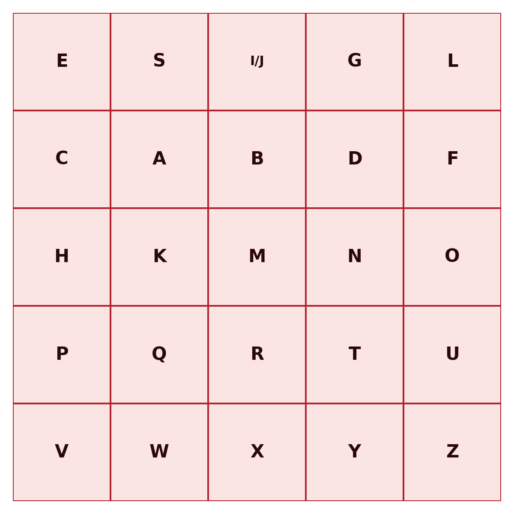
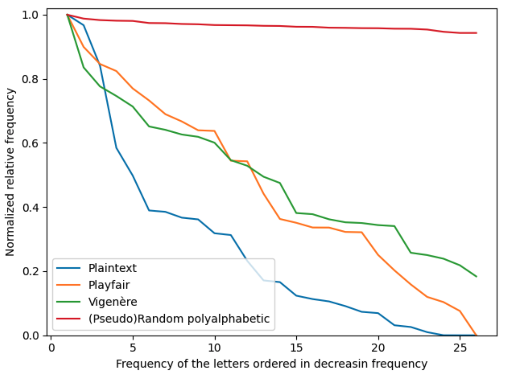
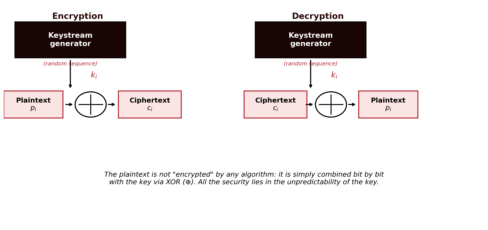
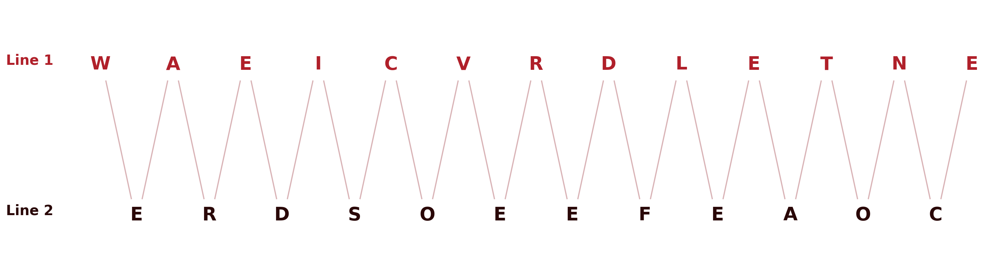
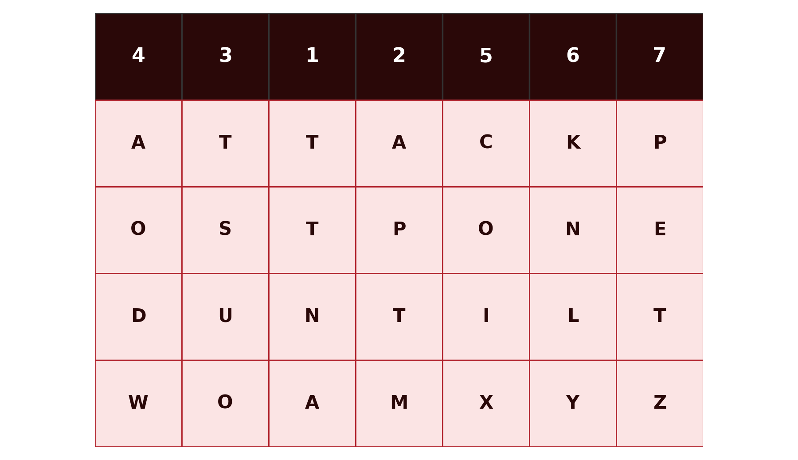

## Introduction {#sec-01-intro .unnumbered}

Cryptography is the discipline that studies techniques for protecting information by transforming it into a form unreadable to anyone who does not possess the key needed to reverse that transformation. This chapter introduces the fundamental concepts that run through the entire discipline, the symmetric cipher model, Kerckhoffs's principle, the distinction between brute force and cryptanalysis, and then works through the classical ciphers: substitution and transposition systems developed over centuries, well before the appearance of the computer.

These ciphers are, from the point of view of practical security, completely obsolete today, trivial to break with modern computational resources. Their value in this module is pedagogical: they introduce, in a simple and manual way, the concepts of key, key space, brute-force attack and cryptanalysis that apply, with exactly the same logic, to the modern systems studied in the following chapters.

## Fundamentals of Cryptographic Systems {#sec-01-fundamentos}

### Classifying cryptographic systems {#sec-01-classificacao}

Cryptographic systems are classified according to three independent criteria:

| Criterion | Categories |
|:--|:--|
| Number of keys | **Symmetric** (a single key, shared between sender and receiver) or **asymmetric** (two distinct keys, one public and one private) |
| Type of operation | **Substitution** (each symbol is replaced by another) or **transposition** (the symbols themselves stay the same, but their order is changed) |
| Text processing | **Block cipher** (the text is processed in fixed-size blocks) or **stream cipher** (the text is processed continuously, symbol by symbol) |

This chapter deals exclusively with **symmetric** systems, of the **substitution** or **transposition** kind. The following chapters introduce modern block and stream ciphers.

### The symmetric cipher model {#sec-01-modelo}

A symmetric cryptographic system is defined by five components [@Stallings2020]:

- **Plaintext** ($X$): the original message, still intelligible.
- **Encryption algorithm** ($E$): the procedure that transforms plaintext into ciphertext, through successive substitutions and transformations.
- **Secret key** ($K$): a value independent of the plaintext and of the algorithm, shared between sender and receiver over a secure channel. Different keys produce different results for the same plaintext and the same algorithm.
- **Ciphertext** ($Y$): the result of encryption, apparently random and, at first sight, unintelligible.
- **Decryption algorithm** ($D$): essentially the encryption algorithm run in reverse, which uses the same key $K$ to recover the plaintext from the ciphertext.

Formally:

$$Y = E(K, X)$$
$$X = D(K, Y)$$

{#fig-01-modelo-simetrico}

Sender and receiver must have obtained copies of the same secret key by some secure means, and kept it protected (@fig-01-modelo-simetrico). If someone discovers the key and knows the algorithm, all communication encrypted with that key becomes readable.

### Kerckhoffs's principle {#sec-01-kerckhoffs}

A fundamental assumption of all modern cryptography, already present in these classical ciphers, is **Kerckhoffs's principle**, formulated in 1883 [@Kerckhoffs1883]: the security of a cipher must depend solely on the secrecy of the key, never on the secrecy of the algorithm. It is always assumed that an attacker knows the encryption and decryption algorithm perfectly, only the key is unknown.

This convention has an important practical consequence: an algorithm whose security depends on remaining secret (*security through obscurity*) is not considered secure in serious cryptography, precisely because that condition is impossible to guarantee in the long run. The algorithms studied in this module are all public and widely scrutinised: their security rests entirely on the size and the secrecy of the key.

### Brute force and cryptanalysis {#sec-01-ataques}

An attacker who wants to recover the plaintext without knowing the key has two general strategies available:

- **Brute force**: exhaustively test every possible key, until one is found that produces intelligible plaintext. On average, roughly half of the total key space must be tested to obtain a result.
- **Cryptanalysis**: exploit additional knowledge about parts of the system, such as already-known plaintext/ciphertext pairs, or statistical properties of the algorithm, to deduce the key without testing it exhaustively.

Classical cryptanalysis of the ciphers studied in this chapter relies chiefly on **frequency analysis**: the statistical distribution of letters in a natural language is not uniform, and that asymmetry survives, in varying degrees, the encryption process.

Depending on the information available to the cryptanalyst, several types of attack are distinguished [@Stallings2020]:

| Type of attack | What the cryptanalyst knows |
|:--|:--|
| Ciphertext only | The algorithm and the ciphertext |
| Known plaintext | The algorithm, the ciphertext, and one or more plaintext/ciphertext pairs formed with the same key |
| Chosen plaintext | The algorithm, the ciphertext, and a plaintext chosen by the attacker, with the corresponding ciphertext |
| Chosen ciphertext | The algorithm, the ciphertext, and a ciphertext chosen by the attacker, with the corresponding decrypted plaintext |
| Chosen text | The combined knowledge of the two previous attacks |

## Substitution Ciphers {#sec-01-substituicao}

In a substitution cipher, each symbol of the plaintext is **replaced** by another symbol, according to a fixed rule determined by the key. The order of the symbols stays unchanged; what changes is their identity.

### The Caesar cipher {#sec-01-cesar}

The Caesar cipher, attributed to Julius Caesar, is the simplest substitution cipher: each letter is replaced by the letter found $k$ positions further down the alphabet, with $k$ the key. For example, with $k = 3$, encrypting the instruction "meet me under the bridge" [@Stallings2020]:

::: {.httpmsg}
```
Plain:   M E E T   M E   U N D E R   T H E   B R I D G E
Cipher:  P H H W   P H   X Q G H U   W K H   E U L G J H
```
:::

Numbering the letters of the alphabet from 0 (A) to 25 (Z), the Caesar cipher is formally defined by:

$$C = E(k, p) = (p + k) \bmod 26$$
$$p = D(k, C) = (C - k) \bmod 26$$

| A | B | C | D | E | F | G | H | I | J | K | L | M | N | O | P | Q | R | S | T | U | V | W | X | Y | Z |
|:-:|:-:|:-:|:-:|:-:|:-:|:-:|:-:|:-:|:-:|:-:|:-:|:-:|:-:|:-:|:-:|:-:|:-:|:-:|:-:|:-:|:-:|:-:|:-:|:-:|:-:|
| 0 | 1 | 2 | 3 | 4 | 5 | 6 | 7 | 8 | 9 | 10 | 11 | 12 | 13 | 14 | 15 | 16 | 17 | 18 | 19 | 20 | 21 | 22 | 23 | 24 | 25 |

The modulo-26 operation guarantees that the result always stays within the valid range: when the sum exceeds 25, the remainder of division by 26 brings it back into the alphabet. For example, encrypting the letter "y" ($p = 24$) with $k = 3$: $C = (24 + 3) \bmod 26 = 27 \bmod 26 = 1$, which corresponds to the letter "B".

**Key space and brute force.** The key $k$ can only take 25 distinct values (excluding $k = 0$, which encrypts nothing, and $k = 26$, equivalent to $k = 0$). Such a small key space makes the Caesar cipher trivially vulnerable to a brute-force attack: simply generate all 25 candidate decryptions and identify the one that is intelligible.

**Cryptanalysis by frequency analysis.** Even without resorting to brute force, the Caesar cipher is easily broken by cryptanalysis, by exploiting two sources of information: the structure of the text (spaces between words survive encryption, revealing the length of each word) and the language of the plaintext (allowing a search for patterns of short, frequent words, such as "to", "be", "as", "is", "it", "the"). Combining these clues with the relative frequency of each letter, which in a natural language is far from uniform, a cryptanalyst can typically recover the key within a few minutes [@Stallings2020].

::: {.callout-note}
#### Why it is so easy to break

The ease of the cryptanalysis lies not only in the algorithm itself, but in the fact that the attacker has access to far more information than just the algorithm and the ciphertext: they know the language of the message and its structure (where words begin and end). Hiding that structure, by removing the spaces from the ciphertext, makes a manual attack harder, but not impossible: other statistical features of the language, such as the frequency of consecutive letter pairs, remain available.
:::

**Worked exercise: cryptanalysis via digraphs and trigraphs.** A short word that repeats in the message, as a separate, complete word, always produces the same block of letters in the ciphertext, since the Caesar cipher applies a fixed shift. Consider the following ciphertext [@Stallings2020]:

::: {.httpmsg}
```
Ciphertext:  YT GJ TW STY YT GJ YMFY NX YMJ VZJXYNTS
```
:::

The text has two blocks that repeat, each one twice: **YT** and **GJ**. In English, "to" is one of the most common two-letter words, and "the" one of the most common three-letter words. A natural first guess is that "YT" corresponds to "to"; trying that hypothesis against the rest of the ciphertext already reveals a partial, encouraging pattern. Adding the guess that a further three-letter block corresponds to "the" completes the picture. Assuming that YT corresponds to "TO" and the block YMJ to "THE":

$$k = (\text{Y} - \text{T}) \bmod 26 = (24 - 19) \bmod 26 = 5$$

Note that it is essential for "to" and "the" to appear as separate words, never embedded inside a larger word, since only a repeated, isolated word guarantees an identical block of ciphertext.

With $k = 5$ known, the rest of the text decrypts immediately, word by word:

::: {.httpmsg}
```
Plaintext:  TO BE OR NOT TO BE THAT IS THE QUESTION
```
:::

"To be, or not to be, that is the question" — the opening line of Hamlet's soliloquy, from Shakespeare's *Hamlet* (Act 3, Scene 1).

::::: {.callout-tip}
#### Exercise: break it yourself

Applying the same technique, break the following ciphertext (this time with no spaces between words):

::: {.httpmsg}
```
JUURBFNUUCQJCNWMBFNUU
```
:::
:::::

### The monoalphabetic cipher {#sec-01-monoalfabetica}

The Caesar cipher is a very restricted special case of a more general class: the **monoalphabetic cipher**, in which the key is an arbitrary permutation of the 26 letters of the alphabet, not merely a fixed shift. The key space grows from 25 to $26! \approx 4 \times 10^{26}$, making a brute-force attack computationally infeasible. For example:

| A | B | C | D | E | F | G | H | I | J | K | L | M | N | O | P | Q | R | S | T | U | V | W | X | Y | Z |
|:-:|:-:|:-:|:-:|:-:|:-:|:-:|:-:|:-:|:-:|:-:|:-:|:-:|:-:|:-:|:-:|:-:|:-:|:-:|:-:|:-:|:-:|:-:|:-:|:-:|:-:|
| J | G | I | U | Z | M | V | B | L | X | W | C | E | D | H | Y | T | K | Q | N | P | R | A | F | S | O |

Despite the astronomically larger key space, the monoalphabetic cipher remains vulnerable to cryptanalysis by frequency analysis: since each plaintext letter always corresponds to the same ciphertext letter, the statistical distribution of the plaintext letters carries over, intact, into the ciphertext, with only the symbols swapped. Comparing the frequency of the letters in the ciphertext with the known letter frequencies of the plaintext's language is enough to reconstruct much of the correspondence, even without ever recovering the full permutation directly.

In English, the distribution of letters is far from uniform: E, T and A clearly dominate, followed by an intermediate group (O, I, N, S, H, R, D, L), and a set of rare letters (above all J, X, Q, Z, virtually absent as anything but the rare, distinctive appearance):

![Letter frequency in English, as standardly published in the cryptographic literature [@Stallings2020].](../assets/images/fig-01-frequencia-letras-en.png){#fig-01-frequencia-letras}

**Worked exercise: a classic ciphertext.** Consider the following ciphertext, 120 letters long, encrypted with a single, fixed monoalphabetic substitution [@Stallings2020]:

::: {.httpmsg}
```
UZQSOVUOHXMOPVGPOZPEVSGZWSZOPFPESXUDBMETSXAIZ
VUEPHZHMDZSHZOWSFPAPPDTSVPQUZWYMXUZUHSX
EPYEPOPDZSZUFPOMBZWPFUPZHMDJUDTMOHMQ
```
:::

Counting the letters of this ciphertext gives the following frequency table (the most frequent letters only):

| Ciphertext letter | Observed frequency |
|:-:|:-:|
| P | 13.33% |
| Z | 11.67% |
| S | 8.33% |
| U | 8.33% |
| O | 7.50% |
| M | 6.67% |
| H | 5.83% |
| D | 5.00% |
| E | 5.00% |

Comparing this table with the reference chart (@fig-01-frequencia-letras): P, the most frequent ciphertext letter by a wide margin, is the natural candidate for E (12.7%), the most frequent letter of English; Z, the second most frequent, is the natural candidate for T (9.1%), the second most frequent letter of the language — a direct and safe correspondence, because the gap between these two values and the third-placed letter is wide enough to leave no doubt. From here, however, direct correspondence stops being reliable: both the ciphertext and the reference chart have several values that are close together or effectively tied from the 3rd position onward (8.33% vs. 8.33%; 5.00% vs. 5.00%; 4.17% vs. 4.17%), and with only 120 letters these small differences carry little statistical weight. Matching position by position, purely mechanically, with no other clue:

| # | Ciphertext | English ref. | Direct guess | Real key | Hit? |
|:-:|:-:|:-:|:-:|:-:|:-:|
| 1 | P (13.33%) | E (12.70%) | P→E | P→E | yes |
| 2 | Z (11.67%) | T (9.06%) | Z→T | Z→T | yes |
| 3 | U (8.33%) | A (8.17%) | U→A | U→I | no |
| 4 | S (8.33%) | O (7.51%) | S→O | S→A | no |
| 5 | O (7.50%) | I (6.97%) | O→I | O→S | no |
| 6 | M (6.67%) | N (6.75%) | M→N | M→O | no |
| 7 | H (5.83%) | S (6.33%) | H→S | H→C | no |
| 8 | E (5.00%) | H (6.09%) | E→H | E→R | no |
| 9 | D (5.00%) | R (5.99%) | D→R | D→N | no |
| 10 | V (4.17%) | D (4.25%) | V→D | V→D | yes |
| 11 | X (4.17%) | L (4.03%) | X→L | X→L | yes |
| 12 | W (3.33%) | C (2.78%) | W→C | W→H | no |
| 13 | F (3.33%) | U (2.76%) | F→U | F→V | no |
| 14 | Q (2.50%) | M (2.41%) | Q→M | Q→W | no |

Only 4 of these 14 correspondences (29%) coincide with the real key, and the mismatches start right after the dominant pair. This is not a weakness of this particular example: it is the realistic situation for any intercepted message of moderate length. Frequency analysis alone never fully decrypts a message on its own; it only narrows the field for the most and least common letters, leaving most of the alphabet unresolved.

**Digraphs and trigraphs, once more.** To go further, the cryptanalyst falls back on the technique already used above with "to" and "the": look for blocks of letters that repeat in the ciphertext, and test them against short, frequent words or word fragments of the language. Because this is a simple substitution, a repeated sequence of letters produces the same ciphertext block wherever it occurs — even when the repetition straddles a word boundary rather than reproducing a whole word. Counting the 3- to 5-letter blocks that repeat across the 120 letters of ciphertext, one stands out immediately: **ZHMD**, which occurs twice.

Since Z is already known to correspond to T, a natural hypothesis is that ZHMD begins a word starting with "T". A second repeated block, **DZS** (also twice), shares the same D and Z, and decodes consistently as "...NTA..." once D is guessed as N — exactly the pattern found inside "co**nta**cts" and "represe**nta**tives". Testing ZHMD as "TCON" — the fragment shared by "direc**TCON**tacts" and "vie**TCON**g" — fits both repeated occurrences perfectly and yields three new letters at once: H→C, M→O, D→N. Combined with S→A (confirmed by the "NTA" pattern) and the two already known (P→E, Z→T), six letters of the key are now fixed without any brute force. Applying them to the ciphertext already makes the message legible in patches:

::: {.httpmsg}
```
...UEPHZHMDZSHZOWSFPAPPDTSVPQUZWYMXUZUHSX...
...___ECTCONTACT__A_E_EEN_A_E__T__O__T_CA_...
```
:::

"\_\_ECT CONTACT\_\_A\_E \_EEN \_A\_E \_\_T\_ \_O\_\_T\_CA\_" is already unmistakably "...irect contacts have been made with...ical...". The remaining gaps close by vocabulary, exactly as before, revealing the full sentence:

> "It was disclosed yesterday that several informal but direct contacts have been made with political representatives of the Viet Cong in Moscow."

::: {.callout-note}
#### What if the ciphertext kept the spaces?

If word boundaries were visible, the attack would change shape again. This particular sentence has no single-letter words, and none of its three short words repeats (**IT**, **OF**, **IN**; **WAS**, **BUT**, **THE**). But spaces still help decisively: once the dominant pair P→E and Z→T is known, a 3-letter word beginning with Z and ending in P is almost certainly "the" — by far the most common three-letter word in English — without needing to search the ciphertext for any hidden repetition. Here that word is ciphered as "ZWP", so that single, targeted test gives W→H immediately, a letter the boundary-spanning "TCON" crib above never touched.
:::

### The Playfair cipher {#sec-01-playfair}

The Playfair cipher reduces the problem above by encrypting **pairs of letters** (digraphs), rather than isolated letters, using a $5 \times 5$ grid built from a keyword. By encrypting pairs instead of individual letters, the frequency distribution of isolated letters no longer carries over directly into the ciphertext, making simple frequency analysis harder.

**Building the grid.** A keyword is chosen, its letters (without repetitions) are written into the first positions of the grid, and the remaining positions are filled with the letters of the alphabet in order, skipping those already used. Since the grid has only 25 positions for 26 letters, "I" and "J" share the same cell. With the keyword "ESIGELEC" (a partner's French Engineering School), after removing its repeated letters:

{#fig-01-playfair-grelha width=44%}

**Encryption rules**, applied to each pair of plaintext letters:

- If the two letters are in the **same row**, each is replaced by the letter immediately to its right (wrapping around to the start of the row, if necessary).
- If the two letters are in the **same column**, each is replaced by the letter immediately below it (wrapping around to the top, if necessary).
- Otherwise, each letter is replaced by the letter on its own row, but in the column of the other letter (the two letters and their replacements form a rectangle in the grid).

If the two letters of a pair are identical, or if a single letter is left over at the end of a text with an odd number of letters, a filler letter is inserted (here, "X").

Consider the phrase "ALL IS WELL". Without spaces, and split into pairs (a repeated letter within a pair is separated with a filler "X"):

::: {.httpmsg}
```
AL LI SW EL LX
```
:::

Applying the rules: "AL" shares no row or column, so the rectangle rule gives FS. "LI" is in the same row, giving EG. "SW" is in the same column, giving AS. "EL" is in the same row, giving SE. "LX" shares no row or column, giving IZ. The final ciphertext:

::: {.httpmsg}
```
FSEGASSEIZ
```
:::

Even so, Playfair remains vulnerable: the frequency distribution of letter pairs (digraphs) in a natural language is likewise non-uniform, and this asymmetry survives encryption in a manner analogous to that of isolated letters. A cryptanalyst with enough ciphertext can reconstruct the grid through digraph frequency analysis.

### Polyalphabetic cipher: Vigenère {#sec-01-vigenere}

The ciphers above share a structural weakness: each plaintext letter always corresponds to the same letter (or pair of letters) in the ciphertext, throughout the whole message. **Polyalphabetic ciphers** remove this fixed correspondence, using several different substitutions across the text, cycled according to a keyword that repeats itself.

In the Vigenère cipher, the keyword defines a sequence of shifts (each letter of the key corresponds to a different Caesar shift), applied cyclically to the successive letters of the plaintext. With $m$ the length of the keyword, and $k_0, k_1, \dots, k_{m-1}$ the shifts it defines:

$$C_i = (p_i + k_{i \bmod m}) \bmod 26 \qquad p_i = (C_i - k_{i \bmod m}) \bmod 26$$

Since the key is shorter than the message ($m$ is typically much smaller than the number of plaintext letters), the index $i \bmod m$ makes it repeat cyclically until it covers the whole text. The same plaintext letter can thus correspond to different ciphertext letters, depending on the position at which it occurs, which considerably flattens the frequency distribution observable in the ciphertext.

@fig-01-achatamento-frequencia shows this effect directly: for each cipher, the ciphertext letters are ranked from most to least frequent and normalised against the most common letter's frequency. Plaintext produces a steeply sloped curve, with a small number of letters dominating. Playfair flattens it moderately, by substituting pairs of letters rather than single letters. Vigenère flattens it further still, precisely through the mechanism described above. A polyalphabetic cipher with a key as long as it is (pseudo)random approaches a nearly horizontal line, with no letter standing out at all — that is the line the One-Time Pad, further ahead, reaches perfectly.

{#fig-01-achatamento-frequencia width=70%}

Using the keyword "deceptive" and the plaintext "we are discovered save yourself" [@Stallings2020]:

::: {.httpmsg}
```
Key:         D E C E P T I V E D E C E P T I V E D E C E P T I V E
Plaintext:   W E A R E D I S C O V E R E D S A V E Y O U R S E L F
Ciphertext:  Z I C V T W Q N G R Z G V T W A V Z H C Q Y G L M G J
                    ^ ^ ^                 ^ ^ ^
```
:::

Notice the block **VTW**, which appears twice in the ciphertext, 9 positions apart. This is not a repeated word this time, it is a genuine coincidence of the plaintext itself: the sequence "red" appears once spanning the boundary between "wea**re**" and "**d**iscovered", and again inside "disco**vered**" itself, exactly 9 letters later. Since the keyword "deceptive" also has 9 letters, both occurrences of "red" align with the key in exactly the same way, producing the same ciphertext block. This is the principle behind the Kasiski examination: whenever a stretch of plaintext repeats at a distance that is a multiple of the key length, even by coincidence, the corresponding ciphertext repeats too, and that visible repetition is a direct clue to the length of the key, here, 9.

The Vigenère cipher resisted systematic cryptanalysis for centuries, but it is not unbreakable: if the key is short and repeated many times over a sufficiently long text, techniques such as the Kasiski examination (identifying repetitions in the ciphertext, which reveal multiples of the key length) allow the key length to be recovered, and from there the text can be treated as several independent Caesar ciphers, one for each position within the key's cycle.

Knowing already, from the Kasiski examination alone, that the key has 9 letters (without yet knowing which ones), the cryptanalyst regroups the ciphertext: all the letters in positions 1, 10, 19, ... form a first group; positions 2, 11, 20, ... form a second group; and so on up to the ninth group. Each group, taken in isolation, is an ordinary Caesar cipher, with a single fixed $k$, exactly the kind of problem already solved in the previous section:

::: {.httpmsg}
```
Group 1 (pos. 1, 10, 19):  Z R H
Group 2 (pos. 2, 11, 20):  I Z C
Group 3 (pos. 3, 12, 21):  C G Q
Group 4 (pos. 4, 13, 22):  V V Y
Group 5 (pos. 5, 14, 23):  T T G
Group 6 (pos. 6, 15, 24):  W W L
Group 7 (pos. 7, 16, 25):  Q A M
Group 8 (pos. 8, 17, 26):  N V G
Group 9 (pos. 9, 18, 27):  G Z J
```
:::

Note that this does not contradict what was said above about Vigenère flattening the frequency distribution: that distortion affects the ciphertext *as a whole*, where letters encrypted with different shifts are mixed together. Within each isolated group, however, the same shift was always used, so the distribution reverts to that of an ordinary Caesar cipher, with no flattening at all. The Kasiski examination and frequency analysis therefore solve two different, complementary problems: one gives the number of groups to form (the key length); the other, applied afterwards to each group separately, gives the shift of each one.

To each group is applied, in isolation, the same single-letter frequency analysis used against the Caesar cipher: which is the most frequent letter of this group, and which letter of the language should it correspond to? In this example, with only 3 letters per group, there is not enough data for that analysis to be reliable; in a real, considerably longer text, each group would have dozens or hundreds of letters, and the method would work just as well as it did against the Caesar cipher.

### The Vernam cipher {#sec-01-vernam}

Before reaching the definitive solution, it is worth taking one intermediate step. The **Vernam cipher**, created by Gilbert Vernam at AT&T laboratories in 1918 for telegraphy [@Stallings2020], generalises Vigenère in two ways: it replaces modular addition with a bitwise **XOR** operation, and it uses a key much longer than the short keyword typical of Vigenère, to the point of being, in practice, as long as the punched paper tape that implemented it.

$$C_i = P_i \oplus K_{i \bmod m} \qquad P_i = C_i \oplus K_{i \bmod m}$$

{#fig-01-vernam-gerador width=95%}

A much longer key considerably hinders the Kasiski examination, since repetitions in the ciphertext become much rarer. But the underlying problem does not disappear: sooner or later, even a very long key tape runs out and has to start again, reintroducing a cycle, albeit a much larger one than a Vigenère keyword's. The Vernam cipher is therefore a substantial improvement over Vigenère, but not a definitive solution: it remains vulnerable, in principle, to the same kind of cryptanalysis, only requiring much longer intercepted messages to become practicable.

Note a structural limitation of the Vernam cipher as originally conceived: it uses only a key, with no other value to distinguish one message from the next. It is precisely this absence that forces the key tape to repeat once it runs out. Modern stream ciphers, taken up again in Chapter 4, solve this problem by introducing a second value, the *nonce*, unique per message but not secret, which allows the same key to be reused safely from message to message, without ever repeating the keystream.

### The One-Time Pad {#sec-01-otp}

The **One-Time Pad** definitively resolves the weakness that the Vernam cipher only mitigated: it uses a genuinely random key, the same length as the message, never reused for another message, and therefore never subject to any cycle at all. Each plaintext letter is combined with the corresponding key letter, just as in Vigenère, but without any cycle, since the key is exactly as long as the text itself.

Claude Shannon proved, in 1949, that the One-Time Pad, when used correctly, is **mathematically unbreakable**: the ciphertext reveals no information whatsoever about the plaintext, even with unlimited computational power [@Shannon1949]. This property is called **perfect secrecy**.

**A concrete example of perfect secrecy.** For any ciphertext $C$ and any plaintext $P$ of the same length, there is always exactly one key $K = (C - P) \bmod 26$ linking them. Since every key is, a priori, equally likely, the ciphertext does not favour any one reading over another: for a given ciphertext, there is always some key that decrypts it into any plaintext one likes, of the same length.

This can be demonstrated concretely. Fixing a single 22-letter ciphertext, three different keys decrypt it into three plausible, mutually exclusive solutions:

::: {.httpmsg}
```
Ciphertext (fixed):    G L S P A J H V I H O Q Z P L U F S V A K O

Key 1: U D A X I H H E X D V X R C S N B A C G H Q
Decrypts to: MISS SCARLETT IN THE STUDY

Key 2: U U A A W J F H G X G D G I H J X R E A T Q
Decrypts to: MRS PEACOCK IN THE LIBRARY

Key 3: E X H B N F W J O P V Q I M D H M L R X G B
Decrypts to: COLONEL MUSTARD IN THE DEN
```
:::

All three decryptions are correct: each results from applying $p = (C - K) \bmod 26$, letter by letter, with the respective key. An attacker who intercepts only `GLSPAJHVIHOQZPLUFSVAKO`, without knowing the key, has no way whatsoever of knowing whether the culprit is in the study, the library, or the den. These three readings, and infinitely many others of the same length, are all equally compatible with the ciphertext.

Despite this absolute theoretical guarantee, the One-Time Pad is impractical in most real-world scenarios, for three requirements that are hard to satisfy simultaneously:

- the key must be as long as the message;
- the key must be genuinely random, not generated by a deterministic algorithm;
- the key can never be reused, not even partially.

Distributing and storing keys of this size, securely, is just as hard as securely distributing the message itself. There is also a less obvious cost: generating, in a genuinely random way, and then securely managing a large volume of keys of this size also carries a non-trivial computational cost, which can make the process too slow for most practical applications. These combined requirements limit the use of the One-Time Pad to very specific scenarios, such as certain diplomatic or military communications of exceptional importance.

### The Enigma machine {#sec-01-enigma}

Enigma, used by Germany before and during the Second World War, is also a polyalphabetic cipher: as in Vigenère, the same plaintext letter corresponds to different ciphertext letters depending on the position at which it occurs. The difference lies in how that variation is generated. In Vigenère, a short keyword, repeated cyclically, determines the shift applied at each position; in Enigma, that role falls to a set of electromechanical **rotors** that advance one position with every keystroke, altering the electrical circuit that connects each input letter to its corresponding output letter. The effect is the same as in Vigenère (a different substitution at every position), but the "key length" before the cycle repeats grows from a handful of memorable letters to tens of thousands of positions — impractical to exploit through classical frequency analysis, though, unlike the One-Time Pad, far from mathematically unbreakable.

It is important not to confuse the rotors with the key itself. Enigma's key, changed daily, was the set of settings that sender and receiver had to share in advance: which rotors to use and in what order, their initial position, the internal ring setting of each rotor, and the plugboard connections (which swapped pairs of letters before and after the rotors). The rotors do not generate this key: it is the key that determines how the rotors (and the plugboard) behave. What the rotors generate, mechanically, letter by letter, is the sequence of substitutions that this initial key sets in motion — the mechanical counterpart of the sequence of shifts that, in Vigenère, the keyword generates by repeating itself.

Enigma was never broken by conventional frequency analysis: the period was far too long for any letter count to be useful. It was broken instead by a combination of a structural design flaw (the internal wiring guaranteed that no letter could ever be enciphered as itself, which eliminated hypotheses and made testing easier) and the very same probable-word ("*crib*") technique already used in this chapter: certain German messages almost always contained the same words in the same positions, such as the daily weather report ("*Wetterbericht*"), which allowed strong hypotheses about fragments of plaintext to be formed without any statistical analysis at all. Testing those hypotheses against the enormous space of possible settings, however, demanded an amount of computation impractical by hand; the Bombe, developed by Alan Turing and Gordon Welchman at Bletchley Park building on earlier mathematical work by Polish cryptanalysts [@Rejewski1981], mechanised exactly that test at scale, anticipating many of the principles of the electronic computers that would follow [@Kahn1967].

## Transposition Ciphers {#sec-01-transposicao}

Unlike substitution ciphers, **transposition ciphers** do not change the identity of the plaintext symbols, only their order. The ciphertext contains exactly the same letters as the plaintext, merely rearranged according to a rule determined by the key.

### The rail fence technique {#sec-01-rail-fence}

The simplest form of transposition is the **rail fence** technique: the plaintext is written alternately across two lines, forming a zigzag, and the ciphertext is obtained by reading first the top line, then the bottom line, without interruption.

For the plaintext "WE ARE DISCOVERED FLEE AT ONCE" (without spaces, 25 letters):

{#fig-01-rail-fence width=80%}

Reading Line 1 followed by Line 2 gives the ciphertext `WAEICVRDLETNEERDSOEEFEAOC`. Every letter of the ciphertext belongs to the plaintext, merely reordered, so statistical cryptanalysis based on isolated-letter frequency remains perfectly viable, as will be discussed further in this section.

### Columnar transposition {#sec-01-transposicao-colunar}

A more elaborate technique is **columnar transposition**: the plaintext is written into a grid with a number of columns equal to the length of the keyword, and the ciphertext is obtained by reading the columns in the alphabetical order of the keyword's letters, rather than the original order in which they were written.

Consider the key `4312567` and the plaintext "attack postponed until two am" [@Stallings2020], padded with "xyz" to complete the final row (28 letters, arranged in four rows of seven columns):

{#fig-01-transposicao-grelha width=68%}

The ciphertext is obtained by reading the columns in the numerical order of their key digit (not the order in which they appear in the grid): first the column under key digit 1, then under digit 2, and so on up to the column under digit 7:

::: {.httpmsg}
```
TTNAAPTMTSUOAODWCOIXKNLYPETZ
```
:::

Note that every letter of the plaintext is still present in the ciphertext, in the same quantity; only the order has changed.

A single columnar transposition is vulnerable to cryptanalysis, since the frequency distribution of isolated letters remains entirely unchanged, only their relative position changes. There is an important difference here compared with substitution: in a substitution, frequency is used to guess which plaintext letter corresponds to each ciphertext letter, a mapping problem; in a transposition, there is no mapping to guess at all, since an "E" in the ciphertext really is an "E" from the original text, merely shifted in position. The most frequent letter of the ciphertext is, therefore, directly the most frequent letter of the language, with no intermediate hypothesis needed — which even makes it possible to **distinguish** a transposition from a substitution purely from frequency: if the most frequent letter of the ciphertext coincides with the one expected for the language (E, in English), that is a sign of transposition, not substitution. What isolated-letter frequency does not reveal, on its own, is the reading order of the columns: for that, other clues are needed, such as frequent digraphs and trigraphs split in half by the grid, or trying various column widths. Repeating the transposition several times, with different keys (**double** or multiple transposition), considerably hinders manual reconstruction, although it remains vulnerable to modern computational attacks.

Historically, the combination of substitution and transposition, each weak in isolation but strong when combined, is the principle that gives rise to the modern concepts of **confusion** and **diffusion**, introduced by Shannon and central to the design of the modern block ciphers studied in the next chapter.

## Chapter Summary {#sec-01-sintese}

This chapter established the vocabulary and fundamental principles that run through the whole discipline of cryptography:

1. A symmetric cryptographic system is defined by its five components, plaintext, encryption algorithm, secret key, ciphertext and decryption algorithm, related by $Y = E(K, X)$ and $X = D(K, Y)$
2. **Kerckhoffs's principle** establishes that the security of a cipher must depend solely on the secrecy of the key, never on the secrecy of the algorithm
3. An attacker has two general strategies available: **brute force** (exhaustively testing the key space) and **cryptanalysis** (exploiting additional information to deduce the key without testing it exhaustively)
4. **Substitution ciphers** (Caesar, monoalphabetic, Playfair, Vigenère) replace plaintext symbols with other symbols, with decreasing, but never entirely eliminated, vulnerability to frequency-analysis attacks
5. The **Vernam cipher** generalises Vigenère with XOR and a much longer key, mitigating but not eliminating the problem of a repeating key; the **One-Time Pad** eliminates it completely, being the only classical cipher that is mathematically unbreakable, at the cost of key-management requirements that are impractical in most real-world scenarios
6. **Enigma** mechanised the polyalphabetic principle on an industrial scale, replacing Vigenère's short keyword with electromechanical rotors; it fell not to frequency analysis, but to a structural design flaw combined with probable words ("*cribs*") tested at scale by the Bombe
7. **Transposition ciphers** reorder the symbols of the plaintext without changing their identity, and form the historical basis of the modern concepts of confusion and diffusion

## Discussion Question {#sec-01-reflexao}

Why is it that the One-Time Pad, despite being mathematically unbreakable, is not the universal solution to every problem of secure communication? What other problem, just as hard as that of the message itself, does its use end up introducing?

## References {#sec-01-referencias .unnumbered}

::: {#refs}
:::
