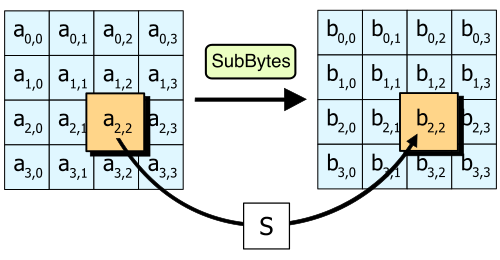
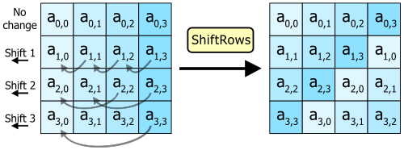
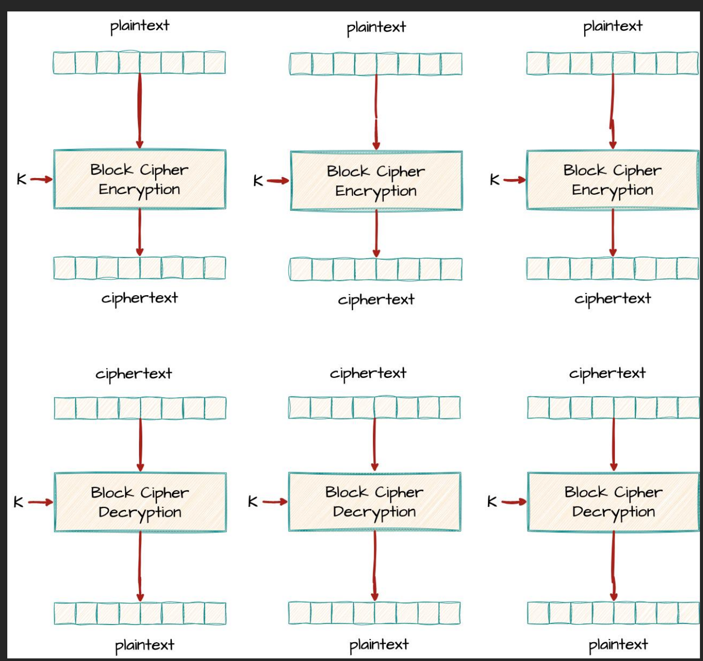

## Introduction {#sec-03-intro .unnumbered}

The previous chapter ended with an uncomfortable conclusion: DES, for decades the pillar of symmetric encryption, is obsolete, and 3DES, the stopgap solution, is slow and remains constrained by the 64-bit block inherited from the original. A successor designed from scratch, not patched together, was needed. This chapter presents that successor: **AES** (*Advanced Encryption Standard*), the symmetric cipher algorithm now universally adopted, from banking applications to communications protected by TLS. The second part of the chapter deals with a distinct, but equally practical question: a block cipher only encrypts one block at a time, so how does one encrypt a real message, almost always larger than that?

## From DES to AES: a New Paradigm {#sec-03-contexto}

In 1997, the United States' *National Institute of Standards and Technology* (NIST) launched a public, open competition to choose the successor to DES, unlike the closed process that had originated DES itself two decades earlier. Any team, from any country, could submit an algorithm, which would then be publicly scrutinised by the entire worldwide cryptographic community.

Fifteen algorithms were submitted. Five reached the final round: MARS, RC6, Rijndael, Serpent and Twofish. In October 2000, NIST announced the winner: **Rijndael**, designed by the Belgian cryptographers Joan Daemen and Vincent Rijmen. The algorithm was formalised as a federal standard in 2001, under the name AES [@FIPS197].

**The most important structural difference from DES is not the size of the key or the block, it is the internal architecture.** DES, as seen, is a Feistel network: in each round, only half of the block passes through the non-linear function $F$, while the other half passes through virtually unscathed, merely combined by XOR. AES abandons this structure. It is a **substitution-permutation network** (SPN): in each round, the **entire block** is transformed, through a sequence of four distinct operations applied to all of its bytes.

## Overall Structure of AES {#sec-03-estrutura}

Unlike DES, in which the block size (64 bits) and the key size (56 effective bits) are fixed by the standard, AES separates these two dimensions:

- **Block**: always **128 bits** (16 bytes), regardless of key size.
- **Key**: **128, 192 or 256 bits**, giving rise to three variants — AES-128, AES-192 and AES-256.
- **Number of rounds**: depends on the key size — **10 rounds** for AES-128, **12** for AES-192, **14** for AES-256. Larger keys entail more rounds, because each additional round further hinders any attempt at statistical or algebraic analysis of the algorithm.

Internally, the 128-bit block is organised into a $4 \times 4$ matrix of bytes, called the **state**, filled column by column: the first 4 bytes of the block occupy the first column, the next 4 the second, and so on. All round transformations operate on this matrix.

{#fig-03-aes-estado width=45%}

Pure AES is **deterministic**: the same plaintext block, with the same key, always produces the same ciphertext block. This predictability is unacceptable in practice — it is precisely the problem that, as will be seen later, requires resorting to a mode of operation, which introduces randomness through an initialization vector or *nonce*.

## The Four Round Transformations {#sec-03-transformacoes}

Each round of AES (except the last) applies, in this order, four transformations to the state matrix. Before the first round, an initial `AddRoundKey` is also applied, and the last round omits `MixColumns`. The purpose of these four operations is not merely to hide the original text, but to do so in such a way that a minimal change, a single bit, in the message or in the key, produces significant, unpredictable changes in the ciphertext — the so-called **avalanche effect**.

### SubBytes {#sec-03-subbytes}

`SubBytes` is the only non-linear operation in AES, and it is the one that provides **confusion**: each byte of the state is replaced by the corresponding byte in a fixed substitution table, the **S-box**, constructed from the multiplicative inverse in the finite field $GF(2^8)$ followed by an affine transformation. Unlike DES, which uses eight different S-boxes (one per group of 6 bits), AES uses a **single S-box**, reapplied byte by byte across the entire state matrix.

{#fig-03-subbytes width=60%}

### ShiftRows {#sec-03-shiftrows}

`ShiftRows` cyclically shifts each row of the state matrix to the left: row 0 is unchanged, row 1 shifts by 1 position, row 2 by 2 positions, row 3 by 3 positions. This operation is simple, but essential: it ensures that the bytes of a column no longer all belong to the same column, spreading the influence of each byte across several columns in subsequent rounds.

{#fig-03-shiftrows width=75%}

### MixColumns {#sec-03-mixcolumns}

`MixColumns` operates on each column of the state matrix independently, treating it as a degree-3 polynomial over $GF(2^8)$ and multiplying it by a fixed polynomial $c(x)$, modulo $x^4+1$. The practical effect is that each output byte of a column comes to depend on all four input bytes of that same column. Combined with the preceding `ShiftRows`, this ensures that, after just a few rounds, each output byte depends on every input byte of the block: this is the **diffusion** of AES. This transformation is omitted in the last round.

{#fig-03-mixcolumns width=75%}

### AddRoundKey {#sec-03-addroundkey}

`AddRoundKey` is the only transformation that involves the key: each byte of the state is combined by XOR with the corresponding byte of that round's subkey, derived from the main key by the **key expansion schedule** (*key schedule*). It is also the only transformation that, in isolation, would be trivial to invert without knowing the key, which confirms that the security of AES depends on the combination of all four transformations, not on any single one in isolation.

{#fig-03-addroundkey width=60%}

## The Complete Round and Key Expansion {#sec-03-ronda-expansao}

An intermediate AES round applies, in this order, `SubBytes`, `ShiftRows`, `MixColumns` and `AddRoundKey`. The last round omits `MixColumns`, and there is also an initial `AddRoundKey`, before any round, using the original key itself, unexpanded.

{#fig-03-rondas-estrutura width=75%}

This means that an AES with $N_r$ rounds needs $N_r+1$ 128-bit subkeys: one for the initial `AddRoundKey`, plus one per round. These subkeys are not independent fragments of the original key, but are generated by a **key expansion schedule**: the original key is processed word by word (groups of 4 bytes), involving rotations, substitutions through the same S-box used in `SubBytes`, and combination with fixed round constants, producing the complete sequence of subkeys required. The exact detail of this schedule falls outside the scope of this chapter; what matters is to retain that all subkeys derive from a single secret key, and that their generation is deterministic and public, just like the rest of the algorithm's structure — the security of AES resides entirely in the key, never in the secrecy of the design, exactly as Kerckhoffs's principle demands.

## Security of AES {#sec-03-seguranca}

Since its standardisation in 2001, AES has been subjected to intense, ongoing cryptanalytic scrutiny, without any practical attack being found capable of breaking it faster than brute force. The minimum key space, $2^{128}$, makes pure brute force astronomically infeasible, far beyond what was already the case for DES.

In practice, the real vulnerabilities associated with AES are not mathematical, but implementation-related: **side-channel attacks**, which exploit indirect information such as the execution time or the energy consumption of a device performing the encryption, rather than attacking the algorithm itself. This is why modern processors include instructions dedicated to AES (such as the AES-NI set), which execute the transformations in constant time, precisely to eliminate this class of attacks.

It is also worth anticipating a question about quantum computing: Grover's algorithm allows, in theory, the effective security of a brute-force search to be reduced to approximately half the number of bits of the key, which would make AES-128 equivalent to about 64 bits of classical security, a value now considered insufficient. This is why AES-256, despite being slower, is the recommended choice for data that must remain protected over the very long term. The chapter dedicated to post-quantum cryptography, later in this book, revisits this question in detail.

## Modes of Operation {#sec-03-modos}

A block cipher, whether AES or DES, encrypts exactly one block at a time. A real message almost never has exactly the size of a block (128 bits, in the case of AES) — it is usually larger, sometimes much larger. A **mode of operation** defines how to repeatedly apply the same block cipher to a sequence of blocks, so as to encrypt a message of any size.

### ECB — Electronic Codebook {#sec-03-ecb}

The simplest mode splits the message into blocks and encrypts each one independently, with the same key: $C_i = E_K(P_i)$. It is simple and parallelisable, but has a serious flaw: **identical plaintext blocks always produce identical ciphertext blocks**. This is exactly the same underlying problem already seen in the monoalphabetic cipher, only at the level of 128-bit blocks instead of individual letters: any pattern or structural repetition in the original message remains visible in the ciphertext, even without decrypting anything.

{#fig-03-modo-ecb width=90%}

{#fig-03-ecb-cbc width=95%}

### CBC — Cipher Block Chaining {#sec-03-cbc}

**CBC** solves this problem by chaining the blocks together: before encrypting each plaintext block, it is combined by XOR with the previous ciphertext block.

$$C_i = E_K(P_i \oplus C_{i-1})$$

Since there is no "previous block" for the first block of the message, an **initialization vector** (IV) is used: a random block, generated afresh for each message, which stands in for $C_0$. The IV need not be secret, only unique and unpredictable, and is normally transmitted in the clear alongside the ciphertext.

{#fig-03-modo-cbc width=95%}

Since each encrypted block depends on all the preceding plaintext blocks (through the chain of XORs), identical plaintext blocks no longer produce identical ciphertext blocks, as seen in Figure [-@fig-03-ecb-cbc]: the original pattern disappears completely. Decryption reverses exactly this process:

$$P_i = D_K(C_i) \oplus C_{i-1}$$

Note an asymmetry between the two directions: **decryption** in CBC is parallelisable, because each decrypted block only depends on the previous ciphertext block, already available in full; **encryption**, by contrast, is not, because each block can only be encrypted once the previous one is ready, since it is its result that feeds into the next link of the chain.

### CFB — Cipher Feedback Mode {#sec-03-cfb}

**CFB** achieves an effect similar to CBC, eliminating the ECB pattern, but by a different route: instead of encrypting the plaintext directly, the previous ciphertext block is encrypted, and the result is combined by XOR with the plaintext to produce the next block.

$$C_i = P_i \oplus E_K(C_{i-1})$$

with $C_0 = \text{IV}$. As in CBC, the IV cannot be reused, but it may be public.

{#fig-03-modo-cfb width=95%}
 In practice, CFB behaves like a **pseudo-stream cipher**: instead of encrypting complete blocks, it can operate on smaller segments (for example, byte by byte), which makes it useful for data streams of variable length. As in CBC, encryption is not parallelisable, but decryption is.

### CTR — Counter Mode {#sec-03-ctr}

**CTR** follows a different approach: instead of encrypting the plaintext directly, a counter is encrypted (combined with a value unique to the message, the *nonce*), and the result is combined by XOR with the plaintext:

$$C_i = P_i \oplus E_K(\text{nonce} \mathbin\Vert i)$$

{#fig-03-modo-ctr width=95%}

This effectively turns a block cipher into a stream cipher, the subject of the next chapter: each output block of $E_K$ acts as a pseudo-random bit sequence, generated independently of the plaintext. The most relevant practical advantage is that, unlike CBC and CFB, both encryption and decryption in CTR are entirely **parallelisable**: block $i$ does not depend on block $i-1$, only on the counter itself, which translates into significantly higher performance on modern, multi-core hardware.

This performance gain has two important trade-offs. First, **reusing the same nonce is catastrophic**: just as in a genuine stream cipher (next chapter), reusing it produces the same pseudo-random stream for two different messages, exposing them to the *two-time pad* attack. Second, CTR is **malleable**: since encryption acts on the counter, not on the plaintext, the diffusion property of AES never gets to act on the relationship between ciphertext and plaintext. An attacker who alters a bit of the ciphertext alters exactly the corresponding bit of the decrypted plaintext, in a predictable way, with nothing in CTR to detect it.

### GCM — Galois/Counter Mode {#sec-03-gcm}

None of the modes presented so far, ECB, CBC, CFB or CTR, protects the **integrity** of the message: an attacker who intercepts the ciphertext can alter it (CTR, as seen, is particularly vulnerable to this), and none of these modes detects the alteration — they only guarantee that the attacker cannot read the original content, not that they cannot tamper with it.

**GCM** (*Galois/Counter Mode*) solves this: it extends CTR mode (from which it inherits confidentiality and full parallelisation) with an authentication mechanism based on a hash function over a finite field, **GHASH**. The result is an **authenticated cipher** (*AEAD*, *Authenticated Encryption with Associated Data*): it produces, besides the ciphertext, a 128-bit authentication tag, computed not only over the ciphertext but also over any unencrypted **associated data** (*additional authenticated data*, AAD), such as network headers or metadata that need to be authenticated but not hidden. Any alteration, to either the ciphertext or the AAD, invalidates the tag.

As in CTR, reusing the *nonce* (recommended at 96 bits) in GCM is catastrophic, and has already been exploited in practical forgery attacks against real TLS implementations [@Bock2016]. By combining confidentiality, integrity and full parallelisation, GCM is today the **recommended** mode for the generality of new applications, used, among others, in TLS 1.3, SSH, IPsec and QUIC.

### Comparison of modes of operation {#sec-03-modos-comparacao}

| Mode | IV / nonce | Parallelisable (encrypt / decrypt) | Native authentication | Recommended use |
|---|---|---|---|---|
| ECB | None | Yes / Yes | No | Never (reveals patterns) |
| CBC | Random IV | No / Yes | No | Legacy use; replace with AEAD |
| CFB | Random IV | No / Yes | No | Variable-length data streams |
| CTR | Unique nonce | Yes / Yes | No | High throughput, no authentication needed |
| GCM | Unique nonce (96 bits) | Yes / Yes | Yes (GHASH, 128 bits) | Recommended (TLS 1.3, SSH, IPsec, QUIC) |

: Comparison of the modes of operation presented in this chapter [@NIST80038A; @NIST80038D] {#tbl-03-modos}

## Padding {#sec-03-padding}

A block cipher, such as AES, always encrypts a fixed-size block, 128 bits (16 bytes). Not every message has a length that is an exact multiple of that size: when the last block of a message is incomplete, the encryption algorithm does not have enough bytes to process it.

**Padding** solves this by adding extra bytes to the end of the message, before encryption, to complete that last block. The most common scheme is **PKCS#7**: if $n$ bytes are missing to complete the block, those $n$ bytes are filled with the value $n$ (in hexadecimal, `0xN`). For example, if 10 bytes are missing to complete the block, ten bytes are appended, all with the value `0xA`. On the decryption side, it is enough to read the value of the last received byte to know exactly how many padding bytes to remove, with no ambiguity whatsoever.

Not all the modes presented in this chapter need *padding*: only those that encrypt the plaintext directly, block by block, such as **ECB** and **CBC** (Table [-@tbl-03-modos]). **CTR** and **GCM**, by turning the block cipher into a kind of stream cipher, combining it with the plaintext via XOR instead of applying it directly, dispense with it entirely: they can encrypt messages of any length, byte by byte, without ever needing to complete a final block.

It is worth flagging, at this point, an important security consequence: a poorly implemented padding validation, one that reveals to an attacker, through an error message or a difference in response time, whether the received padding was valid or not, can be exploited to decrypt entire messages without ever knowing the key, byte by byte, through the so-called **padding oracle attack**. The underlying lesson is one that recurs throughout this book: a mathematically correct mechanism can still fail because of how it is implemented.

## Chapter Summary {#sec-03-sintese}

This chapter presented the algorithm that today occupies the place of DES, and the way it is applied to messages of any size:

1. **AES** resulted from a public NIST competition, won by the **Rijndael** algorithm, and standardised in 2001
2. Unlike DES, AES **is not a Feistel network**: it is a **substitution-permutation network** (SPN), in which every round transforms the entire block
3. The block is always **128 bits**; the key may be **128, 192 or 256 bits**, with **10, 12 or 14 rounds**, respectively
4. Each round applies four transformations: **SubBytes** (confusion, via a non-linear S-box), **ShiftRows** and **MixColumns** (diffusion, between and within columns), and **AddRoundKey** (mixing with the subkey)
5. To date, there is no practical cryptanalytic attack against AES; the real vulnerabilities are implementation-related (side-channel attacks), not in the algorithm itself
6. A **mode of operation** defines how to apply a block cipher to messages larger than a single block: **ECB** is simple but reveals structural patterns; **CBC** and **CFB** chain the blocks and eliminate them, at the cost of encryption not being parallelisable; **CTR** turns the block cipher into a stream cipher, fully parallelisable, but malleable
7. None of these modes protects the integrity of the message; **GCM** solves this by combining CTR with authentication (GHASH), in an **AEAD** construction that is today the recommended mode for the generality of new applications
8. **Padding** (namely the PKCS#7 scheme) allows the modes that encrypt directly, block by block, such as ECB and CBC, to process messages of any length; CTR and GCM dispense with it. An incorrect implementation of padding validation can give rise to padding oracle attacks

## Discussion Question {#sec-03-reflexao}

DES combines confusion and diffusion through a single function $F$, applied to only half the block per round. AES separates these two properties into distinct transformations (`SubBytes` for confusion, `ShiftRows`/`MixColumns` for diffusion), applied to the entire block. What advantages might this explicit separation bring, both for the security analysis of the algorithm and for its performance in hardware?

## References {#sec-03-referencias .unnumbered}

::: {#refs}
:::
