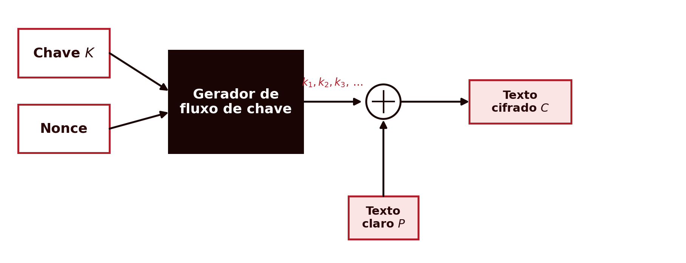
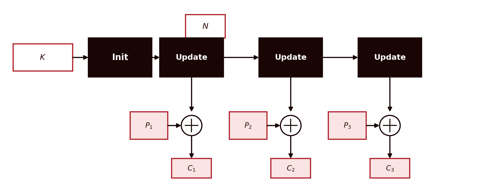
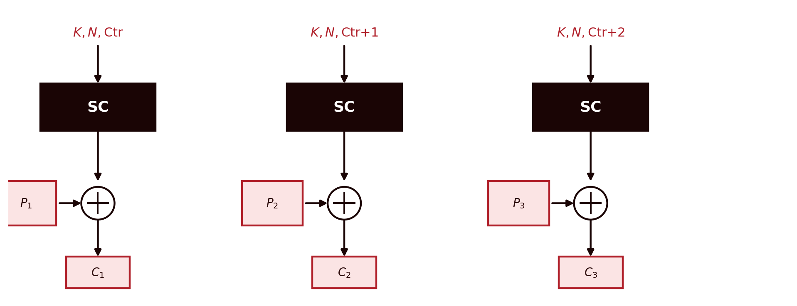
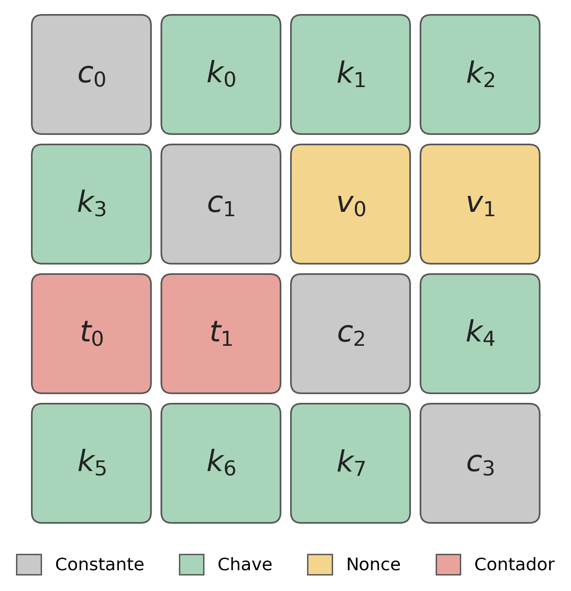

## Introduction {#sec-04-intro .unnumbered}

The previous chapters always dealt with **block ciphers**: DES and AES process the message in fixed-size fragments, 64 or 128 bits at a time, and needed a mode of operation to handle messages of any length. This chapter introduces the other major family of symmetric ciphers, **stream ciphers**, which dispense with that mechanism entirely: they generate a pseudo-random sequence of bits, byte by byte, as long as the message, and combine it with the plaintext by XOR, with no notion of a block at all. Stream ciphers have gained renewed relevance in recent years, precisely because they are fast at processing continuous data streams and work well on resource-constrained devices, such as wireless sensors or RFID tags in *Internet of Things* systems [@Martin2017]. There is also a second, less technical reason: the widespread discrediting of block ciphers in CBC mode, precisely because of the padding oracle attacks already mentioned in the previous chapter, has pushed many modern systems towards stream ciphers (and the AEAD constructions built on them) [@Aumasson2017].

## Stream Ciphers: the General Concept {#sec-04-conceito}

CTR mode, presented in the previous chapter, already anticipated this idea: using a block cipher to generate a sequence of pseudo-random values, and combining it with the plaintext by XOR, exactly like a genuine stream cipher. A **stream cipher** can be seen as a special case of a **deterministic random bit generator** (DRBG): the difference is that a generic DRBG only receives one input value (a seed), whereas a stream cipher always receives two, the key $K$ (secret, typically 128 or 256 bits) and the *nonce* $N$ (need not be secret, but must be unique for each key, typically between 64 and 128 bits) [@Aumasson2017]. From these two values, a **keystream generator** produces a sequence of bits $k_1, k_2, k_3, \dots$, the **keystream**, as long as necessary, and encryption is a simple XOR combination, bit by bit or byte by byte:

$$C_i = P_i \oplus k_i$$

{#fig-04-cifra-fluxo width=85%}

This construction should look familiar: it is exactly the structure of the **One-Time Pad**, already mentioned in Chapter 1 and revisited in Chapter 2 as the only system with perfect secrecy demonstrated by Shannon. A stream cipher can therefore be seen as the **pseudo-random equivalent of a One-Time Pad** [@Martin2017; @Aumasson2017]: the difference, and it is a crucial one, is that the One-Time Pad requires a genuinely random key, as long as the message, and never reused, whereas a stream cipher trades that impractical requirement for a short, reusable key, at the cost of losing perfect secrecy: security now depends entirely on the **computational unpredictability** of the generator, that is, on it being infeasible to distinguish its output stream from a genuinely random sequence without knowing the key.

**This trade-off has an unforgiving consequence**: the (key, *nonce*) pair can never be reused. Note that this is more permissive than it might first appear: encrypting one message with $(K_1, N_1)$ and another with the same $K_1$ but a different $N_1$ is safe, as is encrypting with a different $K_2$ and the same $N_1$; what can never happen is encrypting again with exactly the same pair $(K_1, N_1)$ already used before [@Aumasson2017]. If that happens, the generator produces exactly the same keystream for two different messages. An attacker who intercepts both ciphertexts can XOR them together, and the keystream cancels out completely:

$$C_1 \oplus C_2 = (P_1 \oplus k) \oplus (P_2 \oplus k) = P_1 \oplus P_2$$

The result, the XOR of the two plaintexts, no longer depends on the key, and is often enough to recover both messages through statistical analysis of the language, much as was done with the Kasiski method in Chapter 1. This is the so-called **two-time pad attack**, and it was exactly the kind of failure, in the reuse of initialization values, that rendered the WEP protocol (the first Wi-Fi security standard) practically useless.

## RC4 {#sec-04-rc4}

**RC4**, designed by Ron Rivest at RSA Security in 1987, was kept as a trade secret until it was leaked, without authorization, in 1994. It accepts variable-length keys, between 40 and 2048 bits, and maintains a 256-byte internal state (an array $S$, with two auxiliary pointers $i$ and $j$). It is byte-oriented (not bit-oriented), and is organized into two phases:

- **KSA** (*Key Scheduling Algorithm*): from the key, it builds and permutes the 256-value array $S$ (initially $S[i]=i$), repeatedly mixing it with the bytes of the key.
- **PRGA** (*Pseudo-Random Generation Algorithm*): at each iteration, it updates the two pointers $i$ and $j$, swaps $S[i]$ with $S[j]$, and produces one byte of the keystream.

![The internal mechanism of RC4: the KSA permutes the 256-byte array $S$ from the key; the PRGA, at each iteration, updates the indices $i$ and $j$, swaps $S[i]$ with $S[j]$, and extracts one byte of the keystream, combined by XOR with the plaintext.](../assets/images/fig-rc4-prga.png){#fig-04-rc4-prga width=95%}

One detail of RC4's design is worth pointing out: **there is no nonce mechanism built into the algorithm at all** — "as would not happen in a decent stream cipher", in the words of cryptographer Jean-Philippe Aumasson [@Aumasson2017]. Any nonce has to be added externally, by whoever implements the protocol, and this is precisely where WEP failed: it prefixed the key with a short, predictable nonce before each KSA, making the system vulnerable to the **Fluhrer, Mantin and Shamir attack** (2001) [@FMS2001], which exploits the fact that the first bytes of RC4's keystream are not statistically uniform. The best-known case: the **second byte** of the keystream equals zero with probability $1/128$, twice what would be expected ($1/256$) for a truly random byte [@Aumasson2017] — a small deviation, but enough that, with millions of intercepted messages, it statistically distinguishes RC4 from a random source and, under certain conditions, recovers plaintext bytes without ever discovering the key. The proposed mitigation, discarding the first 3072 bytes of the stream before using it (RC4-drop3072), reduces but does not eliminate the problem. A second practical attack, against TLS itself, was published in 2013 [@AlFardan2013]. Faced with these accumulated weaknesses, RC4 was formally banned from TLS by the *Internet Engineering Task Force* in 2015 [@RFC7465], and must not be used in any new system.

## Two Architectures: Stateful vs. Counter-Based {#sec-04-arquitecturas}

Before moving on to Salsa20 and ChaCha20, it is worth placing RC4 within a more general classification. Stream ciphers fall into two broad architectures, depending on how they produce the keystream [@Aumasson2017].

A **stateful stream cipher** initializes an internal state from the key and the nonce (the `Init` phase), and then **keeps updating that state** for each new block of keystream (the `Update` phase, repeated), sequentially: each update depends on the previous one. RC4, already presented, is exactly this: the KSA initializes the array $S$, and each PRGA iteration updates $S$ before producing the next byte of the stream.

{#fig-04-fluxo-stateful width=90%}

A **counter-based stream cipher** follows a different logic: it keeps no secret state between blocks, beyond the value of a public counter. Each block of keystream is computed anew, directly from the key, the nonce, and the counter value for that block — without depending on the result of the previous block.

{#fig-04-fluxo-contador width=90%}

This architectural difference has a direct practical consequence, already mentioned regarding CTR mode in the previous chapter: since each block of a counter-based cipher is independent of the others, it can be computed **in parallel**, unlike a stateful cipher, in which each update must wait for the previous one. Salsa20 and ChaCha20, presented next, follow exactly this second architecture.

## Salsa20 {#sec-04-salsa20}

In response to RC4's weaknesses, Daniel J. Bernstein designed **Salsa20** in 2005, submitted to the *eSTREAM* competition (the European ECRYPT project for stream ciphers), where it was selected for the final portfolio of algorithms recommended for software.

Unlike RC4, Salsa20 does not maintain a state that evolves byte by byte, nor does it use S-boxes or substitution tables. It relies exclusively on three operations, **addition, bit rotation, and XOR** — hence called an **ARX** construction (*Add-Rotate-XOR*). Its internal state is a $4\times4$ matrix of 32-bit words (512 bits, 64 bytes in total), organized into four groups: four fixed **constants** ($c_0$–$c_3$), the 128- or 256-bit **key**, split into eight words ($k_0$–$k_7$), the 64-bit ***nonce***, in two words ($v_0$, $v_1$), and a 64-bit **counter**, also in two words ($t_0$, $t_1$):

{#fig-04-salsa20-matriz width=55%}

The four constants ($c_0,c_1,c_2,c_3$) are neither part of the key nor of the nonce: they are fixed values, identical for every run of the algorithm (the ASCII constant `expand 32-byte k`, split across the four words), and their purpose is purely structural — to guarantee that the initial state is never entirely predictable from the key and nonce alone, even before any round is applied. To generate each 64-byte block of keystream, 20 rounds of a **quarter-round function**, $Q_R(a,b,c,d)$ (10 over rows and 10 over columns), are applied:

$$b \mathrel{\oplus}= (a+d) \lll 7 \qquad c \mathrel{\oplus}= (b+a) \lll 9$$
$$d \mathrel{\oplus}= (c+b) \lll 13 \qquad a \mathrel{\oplus}= (d+c) \lll 18$$

and the final result is added (modulo $2^{32}$, word by word) to the initial state.

{#fig-04-salsa20-esquema width=45%}

Note the distinction between the two operations in the figure: the final sum with the initial state (square) is **modular addition**, not XOR, and this is precisely what makes the transformation impossible to invert without knowing the key. Why? Because modular binary addition is not a linear operation. If Salsa20 returned the core's permutation directly, without this sum, it would be trivially invertible. Only after this sum is the result combined by XOR (circle) with the plaintext.

Since each 64-byte block is generated independently of the others (from the key, the nonce, and the counter value for that block), Salsa20 is entirely **parallelizable**, both in encryption and in decryption.

The best known attack against Salsa20 reduces to 15 of the 20 rounds [@Aumasson2017]; the full 20-round version has, to date, no known practical attack, and is considered secure.

## ChaCha20 {#sec-04-chacha20}

**ChaCha20**, also designed by Bernstein, in 2008, is a variant of Salsa20 with a modified quarter-round function that achieves better diffusion per round: each 32-bit word participates in both an addition and a rotation at every one of the four steps, which makes the effect of each bit spread through the rest of the state more quickly. It is today the reference stream cipher, used, among others, in TLS 1.3, QUIC, WireGuard, SSH, and by default in OpenSSH since 2014.

$$a \mathrel{+}= b;\ d \mathrel{\oplus}= a;\ d \lll 16 \qquad c \mathrel{+}= d;\ b \mathrel{\oplus}= c;\ b \lll 12$$
$$a \mathrel{+}= b;\ d \mathrel{\oplus}= a;\ d \lll 8 \qquad c \mathrel{+}= d;\ b \mathrel{\oplus}= c;\ b \lll 7$$

The rotation constants (16, 12, 8, 7) and the order of operations differ from those of Salsa20 (7, 9, 13, 18), precisely to achieve this faster diffusion. Compared with Salsa20, the IETF-standardized ChaCha20 also uses a larger nonce, of 96 bits (instead of 64), and a smaller counter, of 32 bits — enough to generate up to 256 GB of keystream from a single nonce.

ChaCha20 is frequently combined with a message authentication mechanism, **Poly1305**, in the **ChaCha20-Poly1305** construction, standardized in RFC 8439 [@RFC8439].

Poly1305 [@Bernstein2005Poly1305] does not encrypt anything: its sole job is to compute a 128-bit authentication tag over the ciphertext and over any unencrypted associated data (*additional authenticated data*, AAD, such as network headers), which the receiver uses to confirm that nothing was altered.

The most important particularity of Poly1305, even without going into detail about its internal mechanism, is that its key **can only be used once, for a single message** — it is a **one-time authenticator**, just as a stream cipher can never reuse the (key, nonce) pair. Reusing the same Poly1305 key across two messages allows an attacker to forge future tags under that key. This is exactly the requirement that the ChaCha20-Poly1305 construction resolves: the first block generated by ChaCha20 (block 0) derives a fresh Poly1305 key from the key and nonce of that message, automatically guaranteeing a disposable key per message, even if the ChaCha20 key itself is reused across many successive messages. The subsequent ChaCha20 blocks (1 through $N$) supply the keystream that encrypts the message by XOR, and only afterwards does Poly1305 come into play, computing the tag over the result.

Being nothing more than multiplication and modular reduction, with no S-boxes or cipher rounds, Poly1305 is extremely fast even in pure software, without dedicated hardware — unlike AES-GCM, which typically depends on instructions such as AES-NI to achieve good performance. It was this advantage that led Google to promote ChaCha20-Poly1305 in TLS before AES-NI became universal on mobile devices.

{#fig-04-chacha20-poly1305 width=90%}

This is an **authenticated cipher** (*AEAD*, *Authenticated Encryption with Associated Data*), the same concept already introduced regarding GCM mode in the previous chapter: it guarantees confidentiality and integrity simultaneously, in a single construction. ChaCha20, like Salsa20, has, to date, no known statistical weakness that makes it distinguishable from a random source.

## Chapter Summary {#sec-04-sintese}

This chapter presented the second major family of symmetric ciphers:

1. A **stream cipher** generates a pseudo-random keystream, combined with the plaintext by XOR, byte by byte, with no notion of a block — the pseudo-random equivalent of the One-Time Pad
2. **Never reuse the same (key, nonce) pair**: doing so enables the *two-time pad* attack, which cancels the keystream and exposes the XOR of the two plaintexts
3. **RC4**, with no built-in nonce and a keystream that is statistically biased in its first bytes, accumulated weaknesses (Fluhrer–Mantin–Shamir, 2001; AlFardan et al., 2013) that made it insecure, and it is now banned from standards such as TLS
4. **Salsa20** and **ChaCha20**, ARX constructions (addition, rotation, XOR) designed by Bernstein, have no known practical weaknesses; ChaCha20, with better diffusion per round, is today the reference stream cipher, frequently used together with Poly1305 in an AEAD construction

## Food for Thought {#sec-04-reflexao}

RC4 has no built-in nonce mechanism; ChaCha20 requires a 96-bit nonce for every message. Bearing in mind the two-time pad attack presented in this chapter, what practical consequence does this difference in design have for someone implementing a communication protocol with either of these two ciphers?

## References {#sec-04-referencias .unnumbered}

::: {#refs}
:::
