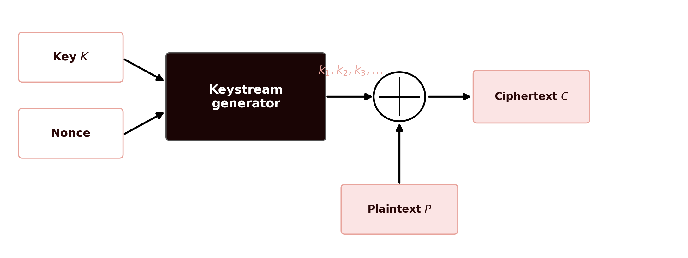
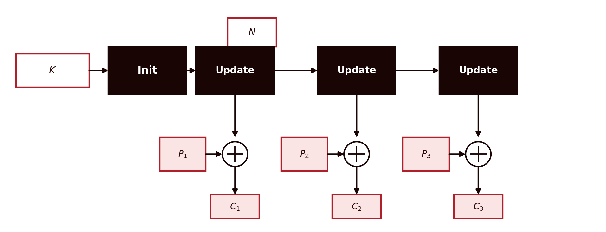
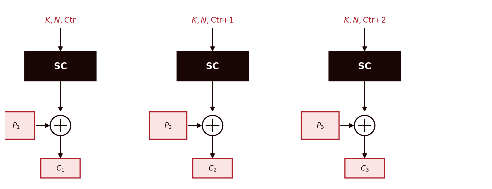
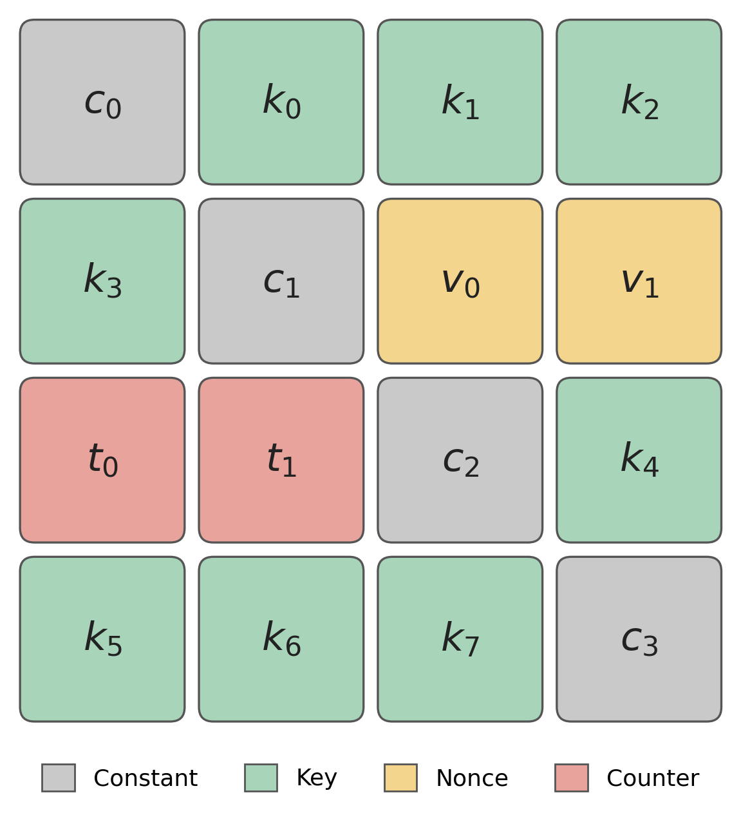

## Introduction {#sec-04-intro .unnumbered}

The previous chapters always dealt with **block ciphers**: DES and AES process the message in fixed-size fragments, 64 or 128 bits at a time, and needed a mode of operation to handle messages of any length. This chapter introduces the other major family of symmetric ciphers, **stream ciphers**, which dispense with that mechanism entirely: they generate a pseudo-random sequence of bits, byte by byte, as long as the message, and combine it with the plaintext by XOR, with no notion of a block at all. Stream ciphers have gained renewed relevance in recent years, precisely because they are fast at processing continuous data streams and work well on resource-constrained devices, such as wireless sensors or RFID tags in *Internet of Things* systems [@Martin2017]. There is also a second, less technical reason: the widespread discrediting of block ciphers in CBC mode, precisely because of the padding oracle attacks already mentioned in the previous chapter, has pushed many modern systems towards stream ciphers (and the AEAD constructions built on them) [@Aumasson2017].

## Stream Ciphers: the General Concept {#sec-04-conceito}

CTR mode, presented in the previous chapter, already anticipated this idea: using a block cipher to generate a sequence of pseudo-random values, and combining it with the plaintext by XOR, exactly like a genuine stream cipher. A **stream cipher** can be seen as a special case of a **deterministic random bit generator** (DRBG): the difference is that a generic DRBG only receives one input value (a seed), whereas a stream cipher always receives two, the key $K$ (secret, typically 128 or 256 bits) and the *nonce* $N$ (need not be secret, but must be unique for each key, typically between 64 and 128 bits) [@Aumasson2017]. From these two values, a **keystream generator** produces a sequence of bits $k_1, k_2, k_3, \dots$, the **keystream**, as long as necessary, and encryption is a simple XOR combination, bit by bit or byte by byte:

$$C_i = P_i \oplus k_i$$

{#fig-04-cifra-fluxo width=85%}

This construction should look familiar: it is exactly the structure of the **One-Time Pad**, already mentioned in Chapter 1 and revisited in Chapter 2 as the only system with perfect secrecy demonstrated by Shannon. A stream cipher can therefore be seen as the **pseudo-random equivalent of a One-Time Pad** [@Martin2017; @Aumasson2017]: the difference, and it is a crucial one, is that the One-Time Pad requires a genuinely random key, as long as the message, and never reused, whereas a stream cipher trades that impractical requirement for a short, reusable key, at the cost of losing perfect secrecy: security now depends entirely on the **computational unpredictability** of the generator, that is, on it being infeasible to distinguish its output stream from a genuinely random sequence without knowing the key.

**This trade-off has an unforgiving consequence**: the (key, *nonce*) pair can never be reused. Note that this is more permissive than it might first appear: encrypting one message with $(K_1, N_1)$ and another with the same $K_1$ but a different $N_1$ is safe, as is encrypting with a different $K_2$ and the same $N_1$; what can never happen is encrypting again with exactly the same pair $(K_1, N_1)$ already used before [@Aumasson2017]. If that happens, the generator produces exactly the same keystream for two different messages. An attacker who intercepts both ciphertexts can XOR them together, and the keystream cancels out completely:

$$C_1 \oplus C_2 = (P_1 \oplus k) \oplus (P_2 \oplus k) = P_1 \oplus P_2$$

The result, the XOR of the two plaintexts, no longer depends on the key, and is often enough to recover both messages through statistical analysis of the language, much as was done with the Kasiski method in Chapter 1. This is the so-called **two-time pad attack**, and it was exactly the kind of failure, in the reuse of initialization values, that rendered the WEP protocol (the first Wi-Fi security standard) practically useless.

## RC4 {#sec-04-rc4}

**RC4**, designed by Ron Rivest at RSA Security in 1987, was kept as a trade secret until it was leaked, without authorization, in 1994. It accepts variable-length keys, between 40 and 2048 bits, and maintains a 256-byte internal state (an array $S$, with two auxiliary pointers $i$ and $j$). It is byte-oriented (not bit-oriented), and is organized into two phases:

- **KSA** (*Key Scheduling Algorithm*): from the key, it builds and permutes the 256-value array $S$ (initially $S[i]=i$), repeatedly mixing it with the bytes of the key.
- **PRGA** (*Pseudo-Random Generation Algorithm*): at each iteration, it updates the two pointers $i$ and $j$, swaps $S[i]$ with $S[j]$, and produces one byte of the keystream.

![The internal mechanism of RC4: the KSA permutes the 256-byte array $S$ from the key; the PRGA, at each iteration, updates the indices $i$ and $j$, swaps $S[i]$ with $S[j]$, and extracts one byte of the keystream, combined by XOR with the plaintext.](../assets/images/fig-04-rc4-prga-en.png){#fig-04-rc4-prga width=95%}

One detail of RC4's design is worth pointing out: **there is no nonce mechanism built into the algorithm at all**, unlike any decent stream cipher, as cryptographer Jean-Philippe Aumasson puts it [@Aumasson2017]. Any nonce has to be added externally, by whoever implements the protocol, and this is precisely where WEP failed. WEP used a nonce (called the IV) of only 24 bits, sent in the clear in the header of each packet, and prepended it to the shared secret key to form the RC4 key [@Aumasson2017]. This creates two problems. The first is size: with randomly chosen IVs, the first repetition occurs after about $2^{12}$ packets, a few megabytes of traffic, and even if the IV works as a counter, it runs out after a few gigabytes; a repeated IV gives the same keystream, that is, a two-time pad. The second is more serious: since all RC4 keys share the same secret part and differ only in the three public IV bytes, the attacker knows the state of the KSA after its first three iterations. This is what the **Fluhrer, Mantin and Shamir attack** (2001) [@FMS2001] exploits: for certain so-called weak IVs, the first keystream byte depends strongly on the first byte of the secret key. Since the beginning of the plaintext of almost every packet is known (a fixed header), the attacker obtains the first keystream byte by XORing it with the ciphertext and, by accumulating enough packets, **recovers the key itself**, byte by byte. Today, tools such as `aircrack-ng` automate the entire attack, from traffic capture to cryptanalysis [@Aumasson2017].

RC4 has a second weakness, independent of WEP and of the nonce: its keystream is not statistically uniform. The best-known case, described by Mantin and Shamir also in 2001 [@MantinShamir2001], is the **second byte** of the keystream, which equals zero with probability $1/128$, twice what would be expected ($1/256$) for a truly random byte [@Aumasson2017]. This deviation does not reveal the key, but it statistically distinguishes RC4 from a random source and, if the same message is encrypted under many different keys, recovers plaintext bytes without ever discovering the key. The proposed mitigation, discarding the first 3072 bytes of the stream before using it (RC4-drop3072), reduces but does not eliminate the problem. A second practical attack, against TLS itself, was published in 2013 [@AlFardan2013]. Faced with these accumulated weaknesses, RC4 was formally banned from TLS by the *Internet Engineering Task Force* in 2015 [@RFC7465], and must not be used in any new system.

## Two Architectures: Stateful vs. Counter-Based {#sec-04-arquitecturas}

Before moving on to Salsa20 and ChaCha20, it is worth placing RC4 within a more general classification. Stream ciphers fall into two broad architectures, depending on how they produce the keystream [@Aumasson2017].

A **stateful stream cipher** initializes an internal state from the key and the nonce (the `Init` phase); from then on, the key and the nonce are no longer used directly, and all the secret information is contained in the state. The `Update` phase follows, repeated as many times as needed: each `Update` takes the current state and produces two things, the **next state**, which is passed on to the following `Update`, and a **chunk of keystream**, which is XORed with the plaintext. The process is therefore sequential: each update depends on the previous one.

The figure shows only this **structure**, common to all stateful ciphers; the actual `Update` algorithm (like the `Init` algorithm) is specific to each cipher. In RC4, already presented, the state is the array $S$ together with the indices $i$ and $j$: `Init` is the KSA, and each `Update` is one PRGA iteration, which updates $i$ and $j$, swaps $S[i]$ with $S[j]$ (the next state) and returns the byte $S[(S[i]+S[j]) \bmod 256]$ (the chunk of keystream).

{#fig-04-fluxo-stateful width=90%}

A **counter-based stream cipher** follows a different logic: it keeps no secret state between blocks, beyond the value of a public counter. Each block of keystream is computed anew, directly from the key, the nonce, and the counter value for that block — without depending on the result of the previous block.

{#fig-04-fluxo-contador width=90%}

This architectural difference has a direct practical consequence, already mentioned regarding CTR mode in the previous chapter: since each block of a counter-based cipher is independent of the others, it can be computed **in parallel**, unlike a stateful cipher, in which each update must wait for the previous one. Salsa20 and ChaCha20, presented next, follow exactly this second architecture.

## Salsa20 {#sec-04-salsa20}

In response to RC4's weaknesses, Daniel J. Bernstein designed **Salsa20** in 2005, submitted to the *eSTREAM* competition (the European ECRYPT project for stream ciphers), where it was selected for the final portfolio of algorithms recommended for software.

Unlike RC4, Salsa20 does not maintain a state that evolves byte by byte, nor does it use S-boxes or substitution tables. It relies exclusively on three operations, **addition, bit rotation, and XOR** — hence called an **ARX** construction (*Add-Rotate-XOR*). Its internal state is a $4\times4$ matrix of 32-bit words (512 bits, 64 bytes in total), organized into four groups: four fixed **constants** ($c_0$–$c_3$), the 128- or 256-bit **key**, split into eight words ($k_0$–$k_7$), the 64-bit ***nonce***, in two words ($v_0$, $v_1$), and a 64-bit **counter**, also in two words ($t_0$, $t_1$):

{#fig-04-salsa20-matriz width=55%}

The four constants ($c_0,c_1,c_2,c_3$) are neither part of the key nor of the nonce: they are the ASCII text `expand 32-byte k` (or `expand 16-byte k`, with a 128-bit key). This text is exactly 16 characters long, that is, 16 bytes or 128 bits, and therefore fills exactly the four 32-bit words of the diagonal, four characters each: `expa` ($c_0$ = `0x61707865`), `nd 3` ($c_1$ = `0x3320646e`), `2-by` ($c_2$ = `0x79622d32`) and `te k` ($c_3$ = `0x6b206574`).

The constants are public and identical in every run, so in the normal case they add nothing: the key, the nonce and the counter already make the state varied. They are there for the bad cases. The nonce and the counter are public and can be influenced by an attacker, and the key may be weak; without constants, the starting state could end up all zeros, and since addition, rotation and XOR of zeros always give zero, the keystream would come out all zeros. With four of the sixteen words always fixed, this becomes impossible, whatever the rest: the attacker controls only part of the starting state [@Bernstein2005SalsaSecurity].

To generate each 64-byte block of keystream, Salsa20 applies to the state 20 rounds of a **quarter-round function**, $Q_R(a,b,c,d)$, which transforms four 32-bit words:

$$b \mathrel{\oplus}= (a+d) \lll 7 \qquad c \mathrel{\oplus}= (b+a) \lll 9$$
$$d \mathrel{\oplus}= (c+b) \lll 13 \qquad a \mathrel{\oplus}= (d+c) \lll 18$$

Each line performs the same kind of operation: it adds two words (modulo $2^{32}$), rotates the result left by a number of bits (7, 9, 13 and 18) and XORs it into a third word. The lines are computed from top to bottom, so each new word depends on the ones that have just been changed. A **column-round** applies $Q_R$ to the four columns of the matrix independently, and a **row-round** applies it to the four rows; together they form a **double-round**, and Salsa20 repeats 10 double-rounds, for 20 rounds in total [@Aumasson2017].

The effect of these simple operations is very fast diffusion: if two initial states differ in a single bit, after only four rounds about half of the 512 state bits differ, as much as between two states chosen at random. The mix of addition and XOR is also what makes the rounds nonlinear: with XOR alone, differences would still propagate, but the process would be linear and therefore insecure [@Aumasson2017].

Once the 20 rounds are done, the result is added (modulo $2^{32}$, word by word) to the initial state, and only then is the keystream block obtained.

{#fig-04-salsa20-esquema width=45%}

This final addition is essential, and the reason has nothing to do with nonlinearity. The 20 rounds on their own use no key at all: they are a public permutation, and each of their steps can be undone, because it consists of XORing a word with a value computed from other words that the step does not change, and repeating the same XOR cancels it. If Salsa20 returned the result of the rounds directly, anyone could undo them, step by step, and recover the initial state, including the key. By adding the initial state to the result, the output mixes the permutation with the key itself, and undoing that addition would require knowing precisely what one is trying to find [@Aumasson2017]. Note, therefore, the distinction between the two operations in the figure: the final addition with the initial state (square) is modular addition, and only after it is the result combined by XOR (circle) with the plaintext.

Since each 64-byte block is generated independently of the others (from the key, the nonce, and the counter value for that block), Salsa20 is entirely **parallelizable**, both in encryption and in decryption.

The best known attack against Salsa20 only reaches the reduced 8-round version, Salsa20/8, and is mostly theoretical: it requires about $2^{251}$ operations, against $2^{256}$ for an exhaustive key search [@Aumasson2017]. The full 20-round version therefore has a wide security margin and has, to date, no known practical attack.

## ChaCha20 {#sec-04-chacha20}

**ChaCha20**, also designed by Bernstein, in 2008, is a variant of Salsa20 with a modified quarter-round function that achieves better diffusion per round: in each quarter-round, ChaCha20 changes each of the four words twice, whereas Salsa20 changes each only once, so the effect of each bit spreads through the rest of the state more quickly. It is today the reference stream cipher, used, among others, in TLS 1.3, QUIC, WireGuard, SSH, and by default in OpenSSH since 2014.

$$a \mathrel{+}= b;\ d \mathrel{\oplus}= a;\ d \lll 16 \qquad c \mathrel{+}= d;\ b \mathrel{\oplus}= c;\ b \lll 12$$
$$a \mathrel{+}= b;\ d \mathrel{\oplus}= a;\ d \lll 8 \qquad c \mathrel{+}= d;\ b \mathrel{\oplus}= c;\ b \lll 7$$

The rotation constants (16, 12, 8, 7) and the order of operations differ from those of Salsa20 (7, 9, 13, 18), precisely to achieve this faster diffusion.

There is a second difference, in how the state is divided. Bernstein's original ChaCha20 kept the Salsa20 layout, with a 64-bit nonce and a 64-bit counter; the version standardized by the IETF in RFC 8439 uses a 96-bit nonce and a 32-bit counter instead [@RFC8439]. Since the state block is still 512 bits long, the 32 bits gained by the nonce are taken from the counter.

The reason is the safety margin against nonce reuse. If nonces are chosen at random, with $n$ bits, the first repetition is expected after about $2^{n/2}$ messages, not $2^n$ [@Aumasson2017]: the number of possible pairs among the messages already sent grows with the square of the number of messages, and a single matching pair is enough. This is the same phenomenon as the so-called birthday paradox: in a group of only 23 people, it is more likely than not that two share a birthday, even though there are 365 possible days. With 64 bits, a repetition becomes likely after about $2^{32}$ messages, just over four billion, a number Aumasson considers unacceptably low [@Aumasson2017]; and every repetition is a two-time pad. With 96 bits, that threshold rises to about $2^{48}$ messages. The larger nonce also makes it possible to partition the nonce space when several senders share the same key: RFC 8439 suggests reserving the first 32 bits to identify the sender and using the remaining 64 as a message counter, which guarantees that two senders never produce the same nonce [@RFC8439].

The price is the smaller counter: with 32 bits, a single (key, nonce) pair can only generate $2^{32}$ blocks of 64 bytes, that is, 256 GB of keystream, a limit which, according to the RFC itself, is enough for most uses [@RFC8439].

All this attention to diffusion may seem wasted, since in the end the keystream is combined with the plaintext by a simple XOR, which spreads nothing: each ciphertext bit depends on a single plaintext bit. The contradiction is only apparent, because in a stream cipher diffusion serves a different purpose. Confidentiality does not need diffusion over the plaintext: the model is the One-Time Pad, in which XOR with a truly random sequence gives perfect secrecy without spreading anything at all. What must be guaranteed is that the keystream is indistinguishable from a random sequence, and that is where the diffusion of the rounds comes in. An attacker frequently obtains pieces of the keystream: it is enough to know part of the plaintext, such as a fixed header, and XOR it with the corresponding ciphertext. Diffusion guarantees that these pieces do not reveal the key, because each keystream bit depends, in a complex way, on all the bits of the key, the nonce and the counter; and it also guarantees that they do not reveal neighbouring blocks, because changing the counter by one changes, on average, half of the 512 bits of the keystream block. In block ciphers, by contrast, diffusion has to serve both purposes at once: each ciphertext bit depends on all the bits of the plaintext block and on all the bits of the key.

This lack of diffusion over the plaintext does, however, come at a price. A stream cipher on its own guarantees only **confidentiality**: it prevents the attacker from reading the message, but not from changing it. Since the plaintext is obtained as $P = C \oplus k$, flipping a bit of the ciphertext flips exactly the same bit of the decrypted plaintext. An attacker who knows the format of the message, for example `TRANSFER 100 EUR`, and where the amount is, can XOR the ciphertext with `100` $\oplus$ `900` at those positions, and the recipient will decrypt `TRANSFER 900 EUR`, without the attacker ever knowing the key. To detect changes of this kind, an **authentication tag** is attached to the message: a short value computed from the message and from a secret key known only to the sender and the recipient. The recipient recomputes the tag over the message received and compares it with the one attached: if the message has been changed, the two do not match, and the attacker, without the key, cannot compute the right tag for the changed message. An algorithm that computes such tags is called a **message authentication code** (MAC).

ChaCha20 is frequently combined with a MAC, **Poly1305**, in the **ChaCha20-Poly1305** construction, standardized in RFC 8439 [@RFC8439].

Poly1305 [@Bernstein2005Poly1305] does not encrypt anything: its sole job is to compute a 128-bit authentication tag. That tag covers the ciphertext and also the **additional authenticated data** (AAD): parts of the message that must travel in the clear but must not be changed. The typical example is the header of a network packet, with the destination address: it cannot be encrypted, because network equipment needs to read it to forward the packet, but if an attacker changes it, the tag no longer matches and the receiver detects the change.

The most important particularity of Poly1305, even without going into detail about its internal mechanism, is that its key **can only be used once, for a single message** — it is a **one-time authenticator**, just as a stream cipher can never reuse the (key, nonce) pair. Reusing the same Poly1305 key across two messages allows an attacker to forge future tags under that key. This is exactly the requirement that the ChaCha20-Poly1305 construction resolves: the first block generated by ChaCha20 (block 0) derives a fresh Poly1305 key from the key and nonce of that message, automatically guaranteeing a disposable key per message, even if the ChaCha20 key itself is reused across many successive messages. The subsequent ChaCha20 blocks (1 through $m$) supply the keystream that encrypts the message by XOR, and only afterwards does Poly1305 come into play, computing the tag over the result.

Being nothing more than multiplication and modular reduction, with no S-boxes or cipher rounds, Poly1305 is extremely fast even in pure software, without dedicated hardware — unlike AES-GCM, which typically depends on instructions such as AES-NI to achieve good performance. It was this advantage that led Google to promote ChaCha20-Poly1305 in TLS before AES-NI became universal on mobile devices.

{#fig-04-chacha20-poly1305 width=90%}

This is an **authenticated cipher** (*AEAD*, *Authenticated Encryption with Associated Data*), the same concept already introduced regarding GCM mode in the previous chapter: it guarantees confidentiality and integrity simultaneously, in a single construction. ChaCha20, like Salsa20, has, to date, no known statistical weakness that makes it distinguishable from a random source.

## Chapter Summary {#sec-04-sintese}

This chapter presented the second major family of symmetric ciphers:

1. A **stream cipher** generates a pseudorandom keystream, combined with the plaintext by XOR, byte by byte, with no notion of block: it is the pseudorandom equivalent of the One-Time Pad
2. **The same (key, nonce) pair must never be reused**: doing so enables the two-time pad attack, which cancels the keystream and exposes the XOR of the two plaintexts. With randomly chosen $n$-bit nonces, the first repetition occurs after about $2^{n/2}$ messages, which is why the standardized ChaCha20 uses a 96-bit nonce
3. **RC4** has no built-in nonce. In WEP, the 24-bit IV prepended to the key made possible the Fluhrer, Mantin and Shamir attack (2001), which recovers the key itself; RC4's keystream is, moreover, statistically biased (Mantin and Shamir, 2001; AlFardan et al., 2013), and the algorithm is now prohibited in TLS
4. Stream ciphers follow two architectures: **stateful**, like RC4, in which each update depends on the previous one, and **counter-based**, like Salsa20 and ChaCha20, Bernstein's ARX constructions (addition, rotation, XOR) in which each block is independent and the computation is parallelizable
5. A stream cipher guarantees **confidentiality**, but not **integrity**: an attacker can change the plaintext by changing the ciphertext, so an authentication tag must be added. **ChaCha20-Poly1305** combines both in an **AEAD** construction, and is today the reference in protocols such as TLS 1.3, QUIC, WireGuard and SSH

## Discussion Question {#sec-04-reflexao}

Salsa20 and ChaCha20 invest 20 rounds in the diffusion of the keystream, yet in the end the XOR with the plaintext spreads nothing: each ciphertext bit depends on a single plaintext bit. What, then, is that diffusion for? And what is the consequence of the lack of diffusion over the plaintext?

## References {#sec-04-referencias .unnumbered}

::: {#refs}
:::
