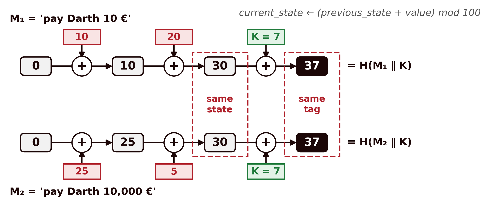

## Introduction {#sec-05-intro .unnumbered}

The previous chapters always dealt with **confidentiality**: how to transform a message so that only someone holding the right key can read it. But confidentiality is not the only property a secure communication needs to guarantee. A message can travel perfectly encrypted and still be altered along the way, or not actually come from whoever it claims to come from. This chapter changes problem: it deals with **integrity** (the guarantee that data has not been altered) and **authentication** (the guarantee that data comes from whom it is expected to), and with the tool that underlies both, the **hash function**.

## What Is a Hash Function {#sec-05-conceito}

A **hash function** transforms an input of arbitrary size into an output of fixed size, generally much shorter:

$$h = H(x)$$

where $x$ is the value (or message) to be digested, $H$ is the hash function, and $h$ is the **hash value** (also called the *digest*). $x$ is known as the **preimage** of $h$.

Two, at first sight simple, characteristics define the essence of a hash function: it is **deterministic** (the same input always produces the same output) and it is a **compression function** (inputs of any size, potentially huge, always produce an output of the same fixed size, typically between 128 and 512 bits). This second characteristic has an unavoidable mathematical consequence: since the set of possible inputs is infinite and the set of outputs is finite, **collisions must exist**, pairs of different inputs that produce the same hash value. The security of a hash function can never rest on avoiding them altogether, that is impossible, but rather on making them computationally infeasible to find deliberately. This is exactly what the next section formalizes.

## Properties of a Hash Function {#sec-05-propriedades}

Not every function that compresses data is useful in cryptography. The following properties [@Stallings2020] distinguish a **weak** hash function from a **strong** one:

| Requirement | Description |
|---|---|
| Variable input size | $H$ can be applied to a block of data of any size |
| Fixed output size | $H$ always produces an output of fixed length |
| Efficiency | $H(x)$ is easy to compute for any $x$, making hardware and software implementations practical |
| Preimage resistance (*one-way*) | Given a hash value $h$, it is computationally infeasible to find $y$ such that $H(y) = h$ |
| Second preimage resistance (weak collision resistance) | Given a block $x$, it is computationally infeasible to find $y \neq x$ with $H(y) = H(x)$ |
| Collision resistance (strong collision resistance) | It is computationally infeasible to find any pair $(x,y)$, with $x \neq y$, such that $H(x) = H(y)$ |
| Pseudorandomness | The output of $H$ meets the standard statistical tests for randomness |

: Properties of a hash function [@Stallings2020] {#tbl-05-propriedades}

A function that satisfies the first five properties, up to second preimage resistance, is called a **weak hash**; if it is also collision resistant, the sixth property, it is called a **strong hash**, the only kind suitable for cryptographic uses [@Stallings2020]. Pseudorandomness is a separate requirement: a minimal change to the input should flip about half of the output bits (the so-called avalanche effect). It is worth not confusing the last two collision-resistance properties, which are easy to mix up:

- **Second preimage**: the attacker already has a specific $x$ (for example, an original contract) and wants to find another document $y$ with the same hash, in order to substitute it without the substitution being detected.
- **Collision**: the attacker has no fixed starting document, they just want to find **any pair** $(x,y)$ that collides, which is structurally easier to achieve.

This difference has an important practical consequence, which is best understood through a classic probability problem, the **birthday paradox**. How many people are needed in a room for there to be a 50% probability that two of them share a birthday, that is, the same day and the same month? The usual answer is around 180, half of 365, but the correct answer is only 23: with 23 people, the probability is 50.7%. There is no logical contradiction; it is called a paradox only because the result runs against intuition. Intuition fails because, without noticing, people answer a different question: how many people are needed for someone to share my birthday? For that one, 253 are needed. In the original question, however, any pair of people will do, and what matters is the number of pairs. Each of the 23 people can pair up with each of the other 22, which gives $23 \times 22$, but this counts every pair twice (the pair 'Ana and Bruno' appears once from Ana and once from Bruno), so there are $23 \times 22 / 2 = 253$ different pairs. With four people, A, B, C and D, there are $4 \times 3 / 2 = 6$ pairs: AB, AC, AD, BC, BD and CD. The number of people grows slowly, but the number of pairs grows with the square, and each pair is a chance of a match: that is why a match appears so early. The exact value of 50.7% is obtained by computing the probability that all birthdays are different, $\frac{365}{365} \times \frac{364}{365} \times \dots \times \frac{343}{365}$, and subtracting it from 1.

The same happens with hashes. The 365 days are the $2^n$ possible values of an $n$-bit hash, the people are the messages the attacker tries, and two people with the same birthday are a collision. Finding any collision therefore costs only about $\sqrt{2^n} = 2^{n/2}$ attempts, far fewer than the roughly $2^n$ needed to hit the hash of a given message, which is what breaking preimage or second-preimage resistance requires (the equivalent of the question 'on my birthday'). This is why the output size of a hash function must be roughly double the intended security level: a 256-bit hash gives only $2^{128}$ of security against collisions, not $2^{256}$.

## The SHA Family {#sec-05-sha}

Over the last three decades, several families of hash functions have competed for the position of de facto standard. The earliest, **MD4** and **MD5** (*Message Digest*, Ron Rivest, 1990 and 1992), with outputs of only 128 bits, ended up formally broken: Wang and Yu presented a practical method for generating MD5 collisions in 2005 [@Wang2005], and today MD5 must not be used for any cryptographic purpose, only for non-adversarial integrity checks (for example, confirming that a file transfer was not corrupted by error).

**SHA** (*Secure Hash Algorithm*), standardized by NIST, became the reference family [@FIPS1804]. **SHA-1** (160 bits, 1995) remained in widespread use for two decades, despite theoretical weaknesses known since 2005, until Google and CWI Amsterdam published, in 2017, the first practical collision (the **SHAttered** attack), two distinct PDFs with the same SHA-1 hash [@Stevens2017]. Since then, SHA-1 has been formally discouraged for any use that relies on collision resistance, including digital certificates and signatures.

The currently recommended family is **SHA-2**, which groups several variants according to output size and internal structure:

| Algorithm | Message size | Block size | Word size | Digest size |
|---|---|---|---|---|
| SHA-1 | $< 2^{64}$ | 512 | 32 | 160 |
| SHA-224 | $< 2^{64}$ | 512 | 32 | 224 |
| SHA-256 | $< 2^{64}$ | 512 | 32 | 256 |
| SHA-384 | $< 2^{128}$ | 1024 | 64 | 384 |
| SHA-512 | $< 2^{128}$ | 1024 | 64 | 512 |
| SHA-512/224 | $< 2^{128}$ | 1024 | 64 | 224 |
| SHA-512/256 | $< 2^{128}$ | 1024 | 64 | 256 |

: Parameters of the SHA family variants (all sizes in bits) [@FIPS1804] {#tbl-05-sha}

**SHA-256** is today the default choice for the generality of new applications, used, among others, in TLS, Git, and Bitcoin. In practice, computing a digest is a trivial operation on any Unix system:

```bash
$ echo "Olá Mundo!  João Pavão" > hashtext.txt
$ openssl md5 hashtext.txt
MD5(hashtext.txt)= dafa6ed4f172ed103c577334bdfa375d
$ openssl sha1 hashtext.txt
SHA1(hashtext.txt)= f8372d55ba7ae3655ec0f886ef658f94879646c1
```

Note that the two digests, despite being computed over the same file, show no visible relationship to one another, precisely the pseudorandom behaviour required in Table [-@tbl-05-propriedades].

## Checking Integrity — and Its Limits {#sec-05-integridade}

The most direct use of a hash function is to check whether a piece of data has remained intact: the sender computes $h = H(\text{data})$ and sends both together; the receiver recomputes the hash over the data received and compares it with the value received. Any alteration to the data, even of a single bit, changes the hash value unpredictably (the pseudorandomness property), making the alteration detectable.

But this scheme has a serious flaw, which only becomes visible once an active attacker, capable of intervening on the communication channel, is considered, rather than just an accidental transmission error:

{#fig-05-integridade-ataque width=100%}

The root of the problem: $H$ is **public**. There is no secret involved in computing the hash, so an attacker capable of altering data in transit is equally capable of recomputing the hash corresponding to the altered data. The hash value, on its own, proves that the data did not suffer an accidental error, but it proves neither that the data comes from whoever claims to have sent it, nor that it was not deliberately tampered with by someone along the way. What is missing is an ingredient that only the legitimate sender and receiver possess, and that an attacker cannot reproduce: a **shared secret**.

## Message Authentication: the MAC {#sec-05-mac}

The simplest solution to the problem identified in the previous section is to introduce a secret key $K$, shared only between sender and receiver, into the computation of the digest itself. A **MAC** (*Message Authentication Code*) is exactly this: a function that takes the message **and** a secret key, and produces a short tag that only someone who knows the key can correctly compute or verify.

$$T = \text{MAC}_K(\text{data})$$

![With a secret key $K$, shared only between sender and receiver, the same attack from Figure [-@fig-05-integridade-ataque] fails: the attacker can alter the data, but cannot compute the corresponding tag without knowing $K$, and the receiver rejects the tampered message.](../assets/images/fig-05-mac-generico-en.png){#fig-05-mac-generico width=100%}

A concrete example helps fix the idea. Suppose a bank transfer order, "Transfer €100 to IBAN PT50...", protected with $\text{MAC}_K$. The bank receives the message and the tag, recomputes $\text{MAC}_K$ over the received message with the same key $K$ (previously agreed with the customer, for example when activating the card), and compares. If an attacker intercepts the message and changes "€100" to "€10000", the old tag no longer matches the altered message, and computing the correct tag for the new message would require knowing $K$, exactly what the attacker in Figure [-@fig-05-integridade-ataque] lacked.

Note the fundamental difference from a plain hash: a MAC guarantees **two** properties at once, integrity (the data has not been altered) and **authenticity** (the data can only have come from someone who knows $K$, that is, from the legitimate sender). This is why MACs share the same trust model as symmetric ciphers: they require a key previously agreed between the two parties, over a secure channel.

The most direct idea for building a MAC from an existing hash function is to combine the message with the secret key before passing it through $H$. It is no accident that this is exactly the logic of several classic designs: encrypting the hash of the message with a symmetric key, encrypting only the hash instead of the whole message, or, in its simplest form, computing $H(\text{data} \Vert S)$ using just a shared secret value $S$, with no encryption involved at all, sufficient for authentication and integrity, albeit without confidentiality. This last construction, a plain hash with a secret concatenated to the message, seems to solve the problem, but it hides a trap that the next section takes apart.

## HMAC {#sec-05-hmac}

Naively concatenating a key to a message before passing it through a hash function seems reasonable, but the two obvious ways of doing it have distinct problems [@PreneelOorschot1995].

**Prefix, $H(K \Vert M)$.** The functions in the MD5/SHA family (SHA-1 and SHA-2 included) process the input in blocks, updating an internal state block by block, and the final hash value **is** literally that internal state, with no final closing step. This enables a **length-extension attack**: knowing only $H(K \Vert M)$ (not $K$), an attacker can compute $H(K \Vert M \Vert M')$, a valid tag for an extended message, for any $M'$ of their choosing.

A simplified example makes this concrete (this is not how SHA-256 actually works internally, but it illustrates exactly the structure of the problem). Imagine a toy hash function that processes its input one value at a time, adding it to the previous state starting from an initial state of 0, and returns the last state directly as the final result:

$$\text{current\_state} \leftarrow (\text{previous\_state} + \text{value}) \bmod 100$$

Let the secret key be $K=7$ and the message $M=42$, entered in this order. The tag computed by the sender is:

$$H(K \Vert M) = (0 + 7 + 42) \bmod 100 = 49$$

An attacker who intercepts the message and the tag $49$ does not need to know $K$ to forge a valid tag for the extended message $M \Vert M'$, with $M'=13$ of their choosing: they simply continue the same computation from the state they already know, $49$:

$$(49 + 13) \bmod 100 = 62$$

which is exactly the value the receiver would obtain by computing $H(K \Vert M \Vert M')$ from scratch, with the real key ($0+7+42+13=62$). The attacker did not need to know that $K=7$. In this toy example they could even deduce it, because the sum is easy to invert ($49-42=7$), but with a real hash function that is infeasible, and the attack works all the same: they only needed to know that the old tag **was** the internal state, and that continuing the computation from it is just as easy as computing it the first time. It is exactly this property, the final hash value being reusable as a starting point to continue the computation, that MD5, SHA-1 and SHA-256 genuinely share (the only real complication in these algorithms is an extra padding block, which the attacker can also reconstruct from the known length of $K \Vert M$), and that makes this attack practical, not merely an academic exercise.

To see the danger in practice, consider a banking application that sends requests to the bank's server, each accompanied by a tag $H(K \Vert M)$; the key $K$ is known only to the application and the server. A request is plain text, made of `name=value` pairs separated by the `&` symbol. When João checks his balance, the application sends:

```
user=joao&action=check_balance
```

Darth intercepts this request and its tag, and glues some text of his own onto the end, obtaining:

```
user=joao&action=check_balance&action=transfer&amount=1000&to=darth
```

Using the length-extension attack, he computes the correct tag for this longer request without ever knowing $K$. The server receives the request, verifies the tag, sees that it is correct and concludes that the request came from the application. But the request now carries two actions: if the server, faced with a repeated name, keeps the last value (as happens, for example, in PHP), it carries out the transfer of 1000 € to Darth.

There are two details that the numerical example above does not show. The first is that, with the real algorithms, the attacker cannot glue his text immediately after $M$. Before computing the hash, MD5, SHA-1 and SHA-256 always append padding to the input, made of a `0x80` byte, a run of zeros and the length of the input; that padding becomes part of the forged message, between $M$ and $M'$. In the example request, these bytes stick to the value `check_balance`, and the rest of the request is still read normally. The second is that, since the padding depends on the length of $K \Vert M$, the attacker needs to know the length of the key; if he does not, he tries the possible values one at a time.

The scenario is not hypothetical: in 2009, Duong and Rizzo showed that the Flickr API, which authenticated requests with MD5 applied to a secret followed by the request parameters, allowed exactly this kind of forgery [@DuongRizzo2009].

**Suffix, $H(M \Vert K)$.** Placing the key at the end, instead of at the start, avoids the previous attack: the final state already includes the key, and the attacker cannot continue the computation from it without knowing the key. But another problem appears, which can be understood with the same simplified hash function. Since the message is processed before the key, everything that happens until the key comes in depends only on the message, and anyone can compute it. Suppose Darth writes two payment orders: $M_1$ = 'pay Darth 10 €', which the function processes as the values 10 and 20, and $M_2$ = 'pay Darth 10,000 €', processed as 25 and 5. Both reach the same state before the key comes in, because $10+20 = 25+5 = 30$; so, once the key $K=7$ is added, both give the same tag, 37 (@fig-05-sufixo).

{#fig-05-sufixo width=100%}

The attack then goes as follows. Alice agrees with the 10 € order, computes the tag $H(M_1 \Vert K) = 37$ and sends it to the bank. Darth intercepts the order, swaps it for $M_2$ and keeps the tag. The bank computes $H(M_2 \Vert K)$, also gets 37, accepts the order and pays 10,000 €. Darth never needed to know $K$: all he needed was two messages that reach the same state before the key, in other words, a collision in the part of the computation that does not depend on $K$. In the example this is trivial, but for MD5 and SHA-1 collisions can also already be built (Section 5.3). This construction is therefore only as secure as the collision resistance of $H$, precisely the property that has fallen for these two functions.

It remains to explain how Darth finds two messages that reach the same state. The answer lies in the fact that, in $H(M \Vert K)$, nothing that happens before the key is secret: the algorithm of $H$ is public, the initial state is a fixed, known value, and the computation up to the point where the key comes in depends only on the message. Darth can therefore compute, on his own computer, the state reached by any message, as many times as he likes, and search for a collision in two ways. The first is by trial and error: he writes many variants of the two orders, all with the same meaning ('pay Darth 10 €', 'pay Darth 10 euros', 'Darth is to be paid 10 €', and likewise for the 10,000 € order), computes the state of each and looks for one variant of each order with the same state. By the birthday paradox, with an $n$-bit hash this happens after about $2^{n/2}$ variants [@Stallings2020]. The second is to exploit weaknesses of the algorithm itself, such as those that made it possible to build collisions for MD5 and SHA-1 with far less work (Section 5.3). The colliding blocks in these attacks are not readable text, they look like random bytes, and so they are hidden in files where they cannot be seen, such as PDF documents. In the most powerful attacks, called chosen-prefix attacks, the attacker can even start from two different beginnings of his choice: this is how, in 2008, a team of researchers used an MD5 collision to forge a digital certificate, the document browsers rely on to trust a website [@Stevens2009], and how, in 2020, the first collision of this kind was obtained for SHA-1 [@LeurentPeyrin2020]. In HMAC none of this is possible, because the inner hash starts with the key: without knowing it, the attacker cannot compute the state of any message, and therefore cannot search for collisions.

The **HMAC** (*Hash-based MAC*) construction, proposed by Bellare, Canetti and Krawczyk [@BellareCanettiKrawczyk1996] and standardized in RFC 2104 [@RFC2104], avoids both problems by applying $H$ **twice**, in a nested structure, instead of concatenating the key just once:

$$\text{HMAC}(K, M) = H\big((K' \oplus \text{opad}) \,\Vert\, H((K' \oplus \text{ipad}) \,\Vert\, M)\big)$$

where $K'$ is the key adjusted to the block size of $H$ (padded with zeros if shorter, or itself digested by $H$ if longer), and `ipad` and `opad` are two fixed, public constants (the byte `0x36` and the byte `0x5C`, repeated up to the block size), chosen simply for having a large Hamming distance between them, so that the two internal keys, $K' \oplus \text{ipad}$ and $K' \oplus \text{opad}$, behave like two independent keys:

{#fig-05-hmac-construcao width=95%}

This two-layer structure resolves both attacks from the previous list, and the key point is that $K' \oplus \text{ipad}$ and $K' \oplus \text{opad}$ each fill an entire block of $H$: after processing that first block, the internal state of $H$ already depends on the key, and each layer starts from a point that only someone who knows $K$ can compute. Length extension no longer works because the inner hash is never visible, only the result of the outer one; and continuing the computation of the outer hash would append blocks after the inner hash, whereas a valid HMAC has nothing after it, so the result would not be the HMAC of any message. As for collisions, if two messages $M_1$ and $M_2$ had the same inner hash, they would also have the same HMAC, because the outer hash would receive exactly the same input: what protects HMAC is not the second $H$, but the impossibility of finding such a pair. With $H(M \Vert K)$, the attacker searches for collisions on their own computer, because everything before $K$ is public; in HMAC, the inner hash starts from a secret state, and without knowing $K$ the attacker cannot compute any inner hash, so cannot search for collisions. The known collision attacks on MD5 and SHA-1 start precisely from the public initial state of these functions, and no longer apply when that state is secret.

A remarkable result from the original work of Bellare, Canetti and Krawczyk is that HMAC's security **does not depend on the collision resistance** of $H$, it depends on a weaker, more robust property of its internal compression function. This is why **HMAC-MD5** and **HMAC-SHA1** continue, in practice, to have no known attack, despite MD5 and SHA-1 being formally broken as general-purpose hash functions (Section 5.3): breaking HMAC would require a quite different, and harder, type of attack than simply finding collisions in $H$. Even so, the practical recommendation is to always use **HMAC-SHA256** or higher in new systems, out of caution and to avoid depending on subtleties of this nature.

HMAC is today one of the most widely used authentication mechanisms in practice: it protects records in TLS versions prior to 1.3, authenticates packets in IPsec, signs **JWT** tokens (*JSON Web Tokens*, in the `HS256` algorithm), and underlies request signing in APIs such as AWS's.

## Chapter Summary {#sec-05-sintese}

This chapter moved from confidentiality to integrity and authentication:

1. A **hash function** compresses an input of any size into a fixed output, deterministically; since the domain is infinite and the codomain finite, collisions always exist, the goal is to make them hard to find
2. A **strong** hash requires, besides efficiency and fixed output size, resistance to **preimage**, **second preimage**, and **collision** attacks; the last of these is the weakest of the three, and falls after only $2^{n/2}$ attempts (birthday paradox), not $2^n$
3. The **SHA** family is the current reference; **MD5** and **SHA-1** have known practical collisions (Wang and Yu, 2005; SHAttered, 2017) and are discouraged; **SHA-256** is today the recommended choice
4. A **keyless** hash function does not withstand an active attacker: anyone can recompute it, so it proves neither integrity nor authenticity against an adversary capable of intervening on the channel
5. A **MAC** solves this by introducing a shared secret key into the computation of the tag, giving integrity and authenticity simultaneously
6. Naively concatenating the key to the message (`H(K‖M)` or `H(M‖K)`) has known problems, length extension in the first case, total dependence on collision resistance in the second
7. **HMAC** solves both by applying $H$ twice, in a nested structure with two derived keys (`ipad`/`opad`); its security does not depend on the collision resistance of $H$, which explains why HMAC-SHA1 remains without known practical attacks, despite SHA-1 no longer being secure as a general-purpose hash

## Discussion Question {#sec-05-reflexao}

SHA-1 is no longer secure against collisions, and is formally discouraged for digital signatures and certificates. Even so, HMAC-SHA1 remains in use in several legacy systems without being considered a critical flaw. Bearing in mind the distinction between the properties of a hash (Section 5.2) and what HMAC's security proof actually requires (Section 5.6), why does breaking a hash function's collision resistance not automatically break the MAC built on top of it?

## References {#sec-05-referencias .unnumbered}

::: {#refs}
:::
