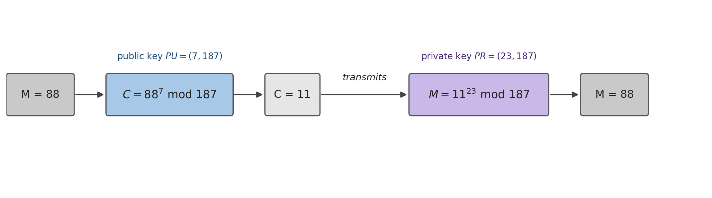

## Introduction {#sec-06-intro .unnumbered}

All the previous chapters, from the classical ciphers to HMAC, share a structural limitation: they require a secret key **shared in advance** between sender and receiver. But how do two strangers, who have never met and have no secure channel between them, combine that key in the first place? This is the **key distribution problem**, and for decades it had no satisfactory answer. The solution, proposed by Diffie and Hellman in 1976 and made concrete by Rivest, Shamir and Adleman in 1977 with the algorithm that gives this chapter its name, is radical: instead of a shared key, each participant now has **two mathematically related keys**, one that can be freely disclosed and another that is never revealed to anyone.

## Asymmetric Cryptography: the Concept {#sec-06-conceito}

A public-key system rests on six components [@Stallings2020]: an encryption algorithm, a decryption algorithm, a plaintext message, a ciphertext message, and each participant's two keys, the **public key** ($PU$), freely distributed, and the **private key** ($PR$), kept secret by its owner. The property that makes this useful is purely mathematical: whatever is encrypted with one key of a pair can only be decrypted with the other, never with the same one.

This simple inversion of "which key to use for what" gives rise to two distinct schemes, with opposite purposes:

{#fig-06-confid-autent width=100%}

**Confidentiality.** To send Bob a confidential message, Alice encrypts it with **Bob's public key** ($PU_b$), which anyone knows:

$$Y = E[PU_b, X] \qquad X = D[PR_b, Y]$$

Only Bob can decrypt $Y$, because only he has $PR_b$. Note that this solves exactly the problem identified in the introduction: Alice never needed to combine any secret with Bob beforehand, she only needed to know one of his public keys.

**Authentication.** To prove that a message really comes from Alice, she encrypts it with her own **private key** ($PR_a$):

$$Y = E[PR_a, X] \qquad X = D[PU_a, Y]$$

Anyone can decrypt $Y$ with Alice's public key, $PU_a$, which is also freely known, but that is precisely why this scheme provides no confidentiality at all. What it provides is the guarantee that **only Alice** could have produced $Y$, since only she possesses $PR_a$: this is the conceptual basis of the digital signature, taken up again in a later chapter.

Nothing prevents combining both schemes to obtain both properties at once: Alice first encrypts with her own private key (signs), and then encrypts the result with Bob's public key (guarantees confidentiality):

$$Z = E[PU_b,\, E[PR_a, X]]$$

Bob inverts the two operations in reverse order, $X = D[PU_a,\, D[PR_b, Z]]$, simultaneously obtaining the certainty that the message could only have come from Alice, and the guarantee that no one else was able to read it along the way.

## Categories and Applications {#sec-06-categorias}

Not all public-key algorithms serve the three possible uses (encryption, digital signature, key exchange) equally well:

| Algorithm | Encryption/Decryption | Digital Signature | Key Exchange |
|---|---|---|---|
| RSA | Yes | Yes | Yes |
| Elliptic Curve | Yes | Yes | Yes |
| Diffie-Hellman | No | No | Yes |
| DSS | No | Yes | No |

: Applications of the main public-key algorithms [@Stallings2020] {#tbl-06-aplicacoes}

RSA, presented in this chapter, is the only algorithm, alongside elliptic curve cryptography, capable of serving all three roles. Diffie-Hellman, in the next chapter, serves only to combine a shared key; DSS exists only to sign.

## RSA: Key Generation {#sec-06-rsa-geracao}

**RSA** (Rivest, Shamir and Adleman, 1977) remains the most widely used public-key algorithm in practice, despite resting on a single hard mathematical problem: the **factorization of very large integers**. Generating the key pair follows five steps:

{#fig-06-rsa-infografico width=100%}

1. Choose two large, random prime numbers, $p$ and $q$.
2. Compute $n = p \cdot q$ (the **modulus**, which will be public) and $\phi(n) = (p-1)(q-1)$ (Euler's totient function, which must remain secret).
3. Choose $e$ such that $1 < e < \phi(n)$ and $\gcd(e, \phi(n)) = 1$ (this guarantees that $e$ is invertible modulo $\phi(n)$).
4. Compute $d$, the modular inverse of $e$: $d \cdot e \equiv 1 \pmod{\phi(n)}$.
5. The **public key** is the pair $(e, n)$; the **private key** is the pair $(d, n)$. The modulus $n$ is public, but $p$, $q$, $\phi(n)$ and $d$ are never revealed.

## RSA: Encryption and Decryption {#sec-06-rsa-cifra}

With the keys generated, encrypting and decrypting a block $M$ (a number, $0 \le M < n$) comes down to a single modular exponentiation:

$$C = M^e \bmod n \qquad\qquad M = C^d \bmod n = (M^e)^d \bmod n = M^{e \cdot d} \bmod n$$

This works because $e$ and $d$ were chosen to be **multiplicative inverses modulo $\phi(n)$** ($e \cdot d \equiv 1 \bmod \phi(n)$), just as, in ordinary arithmetic, $3$ and $\frac{1}{3}$ are inverses because $3 \cdot \frac{1}{3} = 1$: raising to $e$ and then to $d$ (or vice versa) always returns the original value.

A complete example, with small numbers used purely to illustrate the mechanism:

1. Choose $p=17$ and $q=11$.
2. $n = 17 \times 11 = 187$; $\phi(n) = 16 \times 10 = 160$.
3. Choose $e=7$ (relatively prime to 160).
4. Compute $d=23$, because $(23 \times 7) \bmod 160 = 161 \bmod 160 = 1$.
5. Public key $= \{7, 187\}$; private key $= \{23, 187\}$.

{#fig-06-rsa-exemplo width=100%}

To send the message $M=88$: $C = 88^7 \bmod 187 = 11$. To recover it: $M = 11^{23} \bmod 187 = 88$.

## Security: What Makes RSA Hard to Break — and Easy to Misuse {#sec-06-rsa-seguranca}

The example in the previous section uses small numbers only to make the arithmetic tractable by hand, but that has a cost: with $n=187$ (8 bits), factorizing $n$ back into $p=17$ and $q=11$ is trivial, which completely destroys the security of the scheme. In practice, $n$ is recommended to have at least 2048 to 4096 bits, making factorization computationally infeasible with the methods and computing power currently known — the **integer factorization problem**, on which all of RSA's security depends.

It is worth understanding why this key size is so much larger than that of a symmetric cipher (128 or 256 bits, chapters 3 and 4) for a comparable security level. The best known algorithm for factorizing large integers, the *general number field sieve* (GNFS), has **subexponential** complexity: it grows more slowly than an exhaustive search (which would cost $2^n$ operations for an $n$-bit value), but faster than a polynomial algorithm, which makes it significantly faster than pure brute force, even though it remains impractical for moduli of thousands of bits [@Stallings2020]. It is precisely the existence of this shortcut, faster than brute force but not polynomial, that forces RSA to compensate with keys much larger than those of a symmetric cipher: a 3072-bit modulus is needed to achieve the same practical security level as a symmetric key of only 128 bits (Table [-@tbl-08-tamanhos], Chapter 8).

Even with a sufficiently large $n$, using RSA exactly as described above, so-called **textbook RSA**, is not secure: it is deterministic (the same message always produces the same ciphertext, allowing an attacker to recognize repeated messages) and offers no semantic security. For this reason, no serious cryptographic library implements raw RSA:

- For **encryption**, a padding scheme such as **RSA-OAEP** (*Optimal Asymmetric Encryption Padding*) is used, which introduces randomness before encrypting, guaranteeing that the same message never produces the same ciphertext twice.
- For **signatures**, **RSA-PSS** (*Probabilistic Signature Scheme*) is used, which guarantees security against signature forgery, a property that the simple scheme of Section 6.2 does not offer on its own.

On the performance side, it is common to replace $\phi(n)$ with $\lambda(n) = \text{lcm}(p-1, q-1)$ (the condition $e \cdot d \equiv 1 \bmod \lambda(n)$ is also sufficient, and typically produces a smaller $d$), and to use the **Chinese Remainder Theorem** to speed up decryption, solving $M = C^d \bmod n$ separately modulo $p$ and modulo $q$, and combining the results — an operation several times faster than direct exponentiation modulo $n$.

## Chapter Summary {#sec-06-sintese}

This chapter introduced the second great family of modern cryptography:

1. **Asymmetric cryptography** solves the key distribution problem: each participant has a public key, freely distributed, and a private key, never shared
2. Encrypting with the recipient's **public key** guarantees **confidentiality**; encrypting with one's own **private key** guarantees **authentication**; combining both guarantees both
3. RSA, elliptic curve, Diffie-Hellman and DSS do not all serve the same purposes: only RSA and elliptic curve serve encryption, signing and key exchange simultaneously
4. **RSA** generates its keys from two large primes $p$ and $q$: $n=pq$, $\phi(n)=(p-1)(q-1)$, $e$ coprime with $\phi(n)$, and $d$ its modular inverse; it encrypts and decrypts by modular exponentiation, $C=M^e \bmod n$ and $M=C^d \bmod n$
5. RSA's security depends entirely on the difficulty of **factorizing** $n$ into $p$ and $q$; with a small $n$ (as in the didactic example $n=187$), factorization is trivial, which is why the current standard requires $n$ of at least 2048 to 4096 bits
6. **Textbook RSA** is not secure on its own: real-world use requires **RSA-OAEP** for encryption and **RSA-PSS** for signatures

## Discussion Question {#sec-06-reflexao}

The worked example in Section 6.4 uses $n=187$ (8 bits), trivially factorizable, which destroys its security; the current standard recommends $n$ of 2048 to 4096 bits. In real RSA implementations, the public exponent $e$ is usually a small, fixed number (the value $e=65537$ is the most common), the same across millions of different keys worldwide, without this compromising the security of any of them. Given where all of RSA's security actually comes from (Section 6.5), why would increasing the size of $e$, while keeping $n$ small, not make the example in Section 6.4 more secure?

## References {#sec-06-referencias .unnumbered}

::: {#refs}
:::
