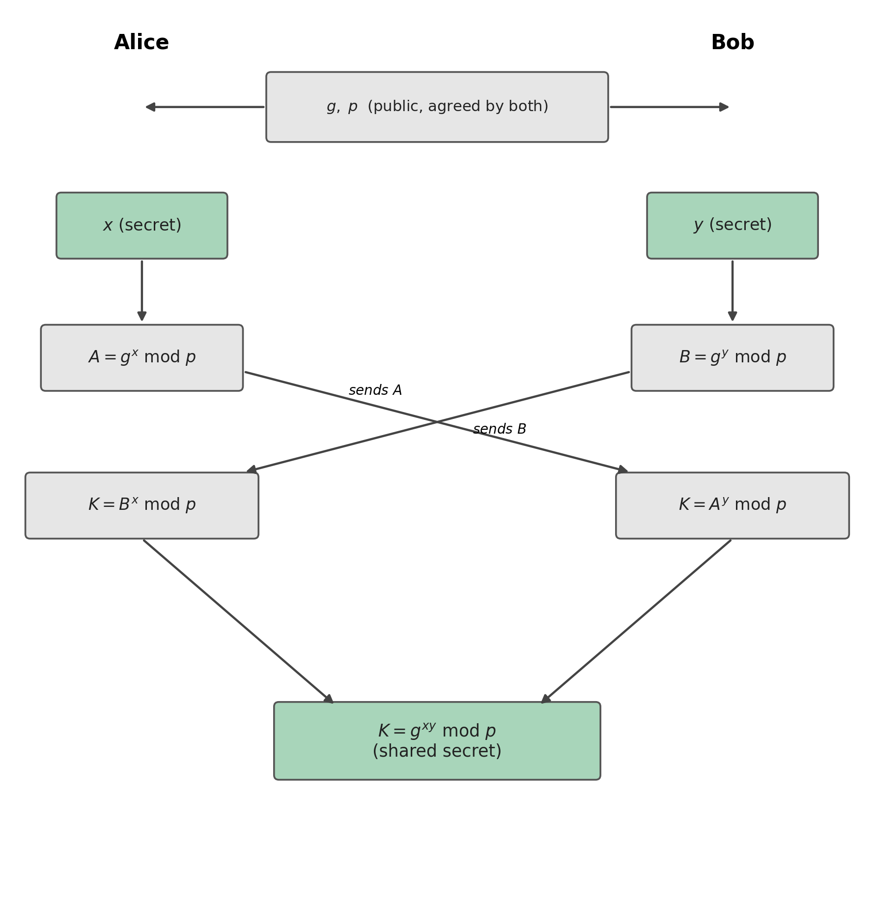
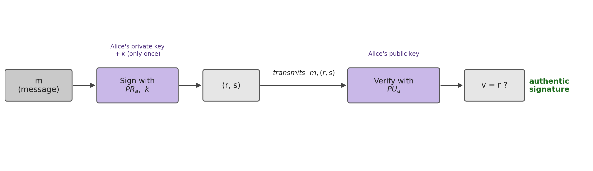

## Introduction {#sec-07-intro .unnumbered}

The previous chapter solved confidentiality and authentication by assuming that each participant already has an RSA key pair. This chapter deals with two related but distinct problems. First, how to combine a **shared symmetric key** between two people who have never met, without it being exposed to anyone intercepting the communication — the problem that **Diffie-Hellman** solves. Second, how to prove, in a way verifiable by anyone, that a document was really produced by whoever claims to have produced it, with no possibility of later denial — the problem of **digital signatures**.

## Diffie-Hellman: Combining a Key in Public {#sec-07-dh-conceito}

**Diffie-Hellman** is a method for securely combining a shared key, intended for a **symmetric** cipher system, even over a completely open channel observed by third parties. This method is itself a public-key system, although it is not used for the function of encryption or signing [@Du2022].

## The Mathematical Problem: Discrete Logarithms {#sec-07-dh-matematica}

The security of Diffie-Hellman rests on a concrete mathematical problem. Suppose a number of the form $A = g^x$. Finding $x$ from $A$ and $g$ is, in principle, trivial: just compute $\log_g A = \log_g g^x = x$. But if instead one has $g^x \bmod n$, with $g$ and $n$ sufficiently large, this computation stops being feasible, even for a powerful computer. This is called the **discrete logarithm problem**, and it is on this that the security of the method rests.

Like the integer factorization on which RSA depends (Section 6.5), the discrete logarithm modulo a prime also admits an attack faster than pure brute force: a variant of the *general number field sieve* solves it in **subexponential** time [@Stallings2020]. It is for this reason, and not merely because it is "large", that the modulus $p$ of classical Diffie-Hellman needs, just like the $n$ of RSA, at least 2048 to 3072 bits for a reasonable practical security level.

## The Algorithm {#sec-07-dh-algoritmo}

Alice and Bob publicly agree on two values, $g$ and $p$ (a large prime number), which need not be secret. Each then chooses a secret number, which is never revealed: Alice chooses $x$, Bob chooses $y$.

{#fig-07-dh width=85%}

Each then computes a value from their secret, $A = g^x \bmod p$ (Alice) and $B = g^y \bmod p$ (Bob), and sends it to the other, in the clear, over the open channel: these are Alice's and Bob's **public keys**. On receiving the other's value, each raises it to their own secret:

$$K = B^x \bmod p = (g^y)^x \bmod p = g^{xy} \bmod p \qquad \text{(Alice)}$$
$$K = A^y \bmod p = (g^x)^y \bmod p = g^{xy} \bmod p \qquad \text{(Bob)}$$

Both arrive at exactly the same value, $K = g^{xy} \bmod p$, the **shared secret key**, without $x$, $y$, or $K$ itself ever having crossed the channel. An attacker who intercepts $g$, $p$, $A$ and $B$, everything that is exchanged in the clear, would have to solve the discrete logarithm problem to recover $x$ or $y$ from that, exactly the problem that Section 7.2 has already identified as infeasible.

## Digital Signatures: the Concept {#sec-07-assinaturas-conceito}

The previous chapter already introduced the essential idea of a digital signature: encrypting with the sender's **private key**, so that anyone can verify it with their public key, but only the owner of the private key can produce it. The most direct way to apply this to a message is to encrypt its **hash** with the private key, rather than the whole message (which would be much slower): using, for example, RSA to encrypt $H(m)$.

There is also an algorithm designed specifically for this single purpose, without serving for encryption, the **DSA** (*Digital Signature Algorithm*). Like Diffie-Hellman, it uses public-key cryptography based on the properties of modular exponentiation and the discrete logarithm problem, is computationally complex, and provides three guarantees simultaneously: **authentication** (the recipient can verify the message's origin), **integrity**, and **non-repudiation** (the author cannot credibly deny having signed it).

## DSA: Parameters and Keys {#sec-07-dsa-parametros}

Defining the initial parameters of DSA follows these steps:

1. Choose an **approved hash function** $H$ (for example, SHA-512).
2. Choose a key length $L$ and a modulus length $N$, with $N<L$ and $L \le$ the output length of $H$. The standardized $(L,N)$ pairs are $(1024,160)$, $(2048,224)$, $(2048,256)$ or $(3072,256)$.
3. Choose $q$, an $N$-bit prime.
4. Choose $p$, an $L$-bit prime, such that $p-1$ is a multiple of $q$.
5. Choose a random integer $h$ between $2$ and $p-2$, and compute $g = h^{(p-1)/q} \bmod p$ (if $g=1$, choose another $h$).

The three values $p$, $q$ and $g$ are **shared publicly**, just like the $g$ and $p$ of Diffie-Hellman. From them, each participant generates their own key pair: the **private key** is a random number $x$, between $1$ and $q-1$; the **public key** is $y = g^x \bmod p$. The same pair $(x,y)$ can be reused for any number of signatures.

## DSA: Signing and Verifying {#sec-07-dsa-assinar}

To sign a message $m$, one first chooses $k$, a random number between $1$ and $q-1$. Unlike $x$, this $k$ is **ephemeral**: secret, and used **only once**, for that signature alone, for exactly the same reason a stream cipher can never reuse the (key, *nonce*) pair — reusing it would allow an attacker to recover $x$ from two distinct signatures. One then computes:

$$r = (g^k \bmod p) \bmod q \qquad\qquad s = k^{-1}(H(m) + xr) \bmod q$$

and the signature is the pair $(r,s)$. The value $s$ has to satisfy demanding requirements simultaneously: depend on the message $m$, prove the use of the private key $x$, never reveal either $x$ or $k$, and still allow verification without the verifier needing to know either of them.

{#fig-07-dsa-verificar width=100%}

To verify, the recipient knows $p$, $q$, $g$ and the public key $y$, and receives $m$ and $(r,s)$:

1. Confirm that $r$ and $s$ are positive and less than $q$.
2. Compute $w = s^{-1} \bmod q$.
3. Compute $u_1 = H(m) \cdot w \bmod q$ and $u_2 = r \cdot w \bmod q$.
4. Compute $v = (g^{u_1} y^{u_2} \bmod p) \bmod q$.
5. If $v = r$, the signature is valid.

## An Open Problem: Trusting the Public Key {#sec-07-confianca}

Alice sends a message to Bob, signed with her private key; Bob verifies the signature with Alice's public key, and the computation confirms it is valid. But this raises a question that neither Diffie-Hellman nor DSA answers on its own: **how does Bob know that this public key really belongs to Alice, and not to someone else impersonating her?**

The problem is general, and affects any public-key exchange carried out without further guarantees, including Diffie-Hellman itself: an attacker positioned at any point on the network between Alice and Bob, for example on a compromised router, can intercept $g$, $p$ and the exchanged values, and substitute themselves for each party in front of the other, a **man-in-the-middle attack** (MITM). The victim never notices, because each side keeps receiving values that look legitimate, only generated by the attacker. This attack breaks any public-key algorithm that has no way of independently confirming that a public key really belongs to whoever claims to own it.

## Chapter Summary {#sec-07-sintese}

This chapter answered two questions left open by asymmetric cryptography:

1. **Diffie-Hellman** allows two parties to combine a shared secret key over a completely open channel, without ever transmitting it directly
2. Its security rests on the **discrete logarithm problem**: computing $g^x \bmod p$ is easy, but recovering $x$ from the result is computationally infeasible for sufficiently large values
3. Each party exchanges a public value ($g^x \bmod p$ or $g^y \bmod p$), computed from a secret it never reveals; both arrive at the same shared secret $g^{xy} \bmod p$
4. A **digital signature** can be built by encrypting the hash of a message with the author's private key (using RSA, for example), or with a dedicated algorithm such as **DSA**
5. DSA signs with a private key $x$ and an ephemeral value $k$, used only once per signature; anyone can then verify with the corresponding public key, without ever having access to $x$ or $k$
6. Neither of these two mechanisms alone solves the problem of **trusting** that a public key really belongs to whoever claims to own it: without that guarantee, an attacker positioned in the middle of the channel (MITM) can substitute themselves for either party

## Discussion Question {#sec-07-reflexao}

In DSA, the ephemeral value $k$ must be secret and used only once per signature, just as the (key, *nonce*) pair of a stream cipher can never repeat. In stream ciphers, reusing the pair exposes the XOR of the two plaintexts (the *two-time pad* attack, Section 4.1). In DSA, $r = (g^k \bmod p) \bmod q$ depends only on $k$, so two signatures with the same $k$ produce the same $r$, and an attacker who recognizes this repetition ends up with two equations, $s_1 = k^{-1}(H(m_1)+xr) \bmod q$ and $s_2 = k^{-1}(H(m_2)+xr) \bmod q$, with only two unknowns, $k$ and $x$. What simple operation between these two equations eliminates $k$ and allows the private key $x$ to be isolated directly?

::: {.callout-note}
#### Solution

The operation is **subtraction** of the two equations:

$$s_1 - s_2 = k^{-1}\big[(H(m_1)+xr) - (H(m_2)+xr)\big] \bmod q = k^{-1}\big(H(m_1)-H(m_2)\big) \bmod q$$

The term $xr$ is the same in both equations (the same $r$, because it depends only on the reused $k$, and the same key $x$), so it cancels out completely in the subtraction, leaving an equation with a single unknown, $k$:

$$k = \big(H(m_1)-H(m_2)\big)\,(s_1-s_2)^{-1} \bmod q$$

With $k$ recovered, it is enough to substitute into one of the original equations to isolate the private key:

$$x = (s_1 k - H(m_1))\, r^{-1} \bmod q$$

This is not merely a theoretical attack: it was exactly this way that Sony Computer Entertainment lost, in 2010, the private code-signing key of the PlayStation 3. Sony's implementation always used the same value of $k$ instead of generating a new, random one for each signature, and a group of researchers (*fail0verflow*, followed by George Hotz) exploited exactly this reuse to recover the console's private key, allowing unauthorized code to be signed and run on any PS3.
:::

## References {#sec-07-referencias .unnumbered}

::: {#refs}
:::
