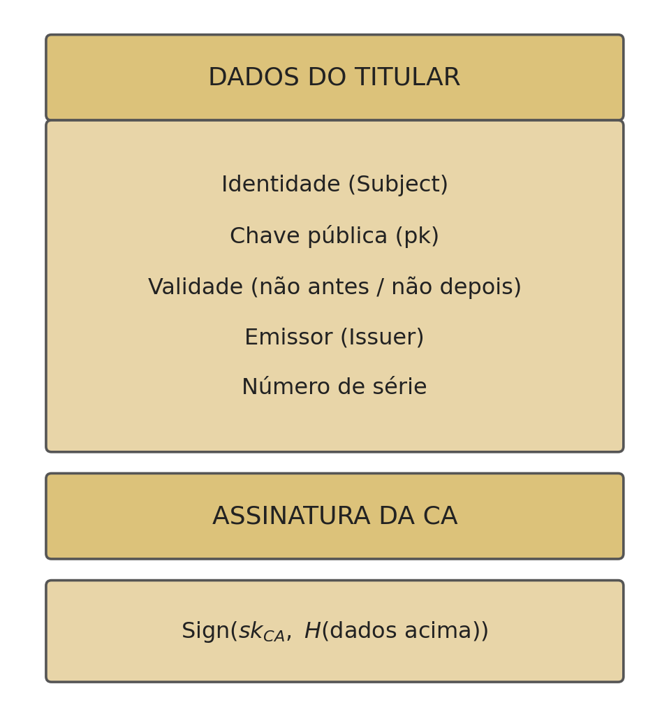
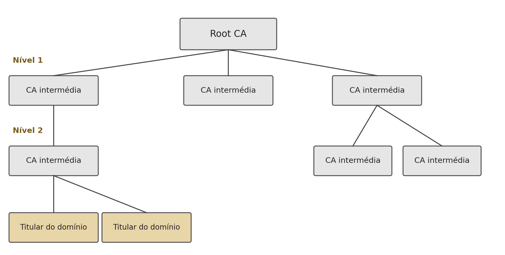

## Introduction {#sec-09-intro .unnumbered}

The previous chapter ended with an open question: how does anyone know that a public key really belongs to whoever claims to own it? Without an answer to this question, the entire edifice of asymmetric cryptography, confidentiality, authentication, signatures, Diffie-Hellman, is exposed to a single type of attack. This chapter examines that attack in detail, and the engineering solution that became the industry standard for solving it: **public key infrastructure**.

## The Man-in-the-Middle Attack in Detail {#sec-09-mitm}

In a **man-in-the-middle attack** (MITM), an attacker positioned at any point in the network between the two parties, for example on a compromised router, intercepts and substitutes the public keys being exchanged, without either victim noticing [@Stallings2020]:

{#fig-09-mitm width=85%}

The attack works because a public key, by definition, has nothing that inseparably ties it to its owner: it is just a number, and a number has no identity of its own. When Alice receives something that looks like Bob's public key, she has, by herself, no way of confirming its origin.

It is worth noting that this attack **breaks any** public-key algorithm, it is not a weakness specific to RSA, Diffie-Hellman, or DSA. In the specific case of Diffie-Hellman (Section 7.3), the attack has a particularly insidious consequence: Mallory establishes **two** distinct key exchanges, one with Alice and one with Bob, and proceeds to decrypt and re-encrypt every message exchanged between them, with neither of them able to detect that the "shared" key they believe they hold is not, in fact, shared with each other, but with Mallory on both sides.

## The Solution: a Trusted Entity {#sec-09-solucao}

The solution is to introduce a third party, a **trusted entity**, recognised in advance by both parties, that vouches for the link between an identity and a public key. If Alice and Bob both trust the same entity, each can ask it, "does this public key really belong to the other party?", without that question having to travel over the potentially compromised channel between the two of them [@Stallings2020; @Martin2017].

This is exactly the function of a **Public Key Infrastructure** (PKI): a set of entities, processes, and standards that formally bind identities to public keys, through **digital certificates**. Unlike a one-off verification, a certificate is a signed object, independently verifiable and reusable by any party that trusts the entity that issued it.

## The X.509 Certificate {#sec-09-x509}

The **X.509** standard, now universal on the Web, defines the structure of a public-key certificate. An X.509 certificate essentially contains the holder's identification data and the signature of whoever certifies it [@RFC5280]:

{#fig-09-x509 width=55%}

- **Identity** (*Subject*): to whom the certificate belongs, typically a domain, an organisation, or a person.
- **Public key**: the key that the certificate attests belongs to that identity.
- **Validity**: a date range outside of which the certificate is no longer considered valid.
- **Issuer**: the identity of the certificate authority that signed it.
- **Serial number**: a unique identifier for the certificate, essential for the revocation process.
- **CA signature**: the **certificate authority** (CA) signs, with its own private key, the hash of all the preceding fields: $\mathrm{Sign}(sk_{CA}, H(\text{holder data}))$.

This last line is what turns the identification data into a verifiable statement: anyone with the CA's public key can confirm that it really was that CA, and not some other entity, attesting to the link between that identity and that public key.

## The Certificate Chain {#sec-09-cadeia}

A single CA key pair directly certifying every site on the Internet would be impractical and fragile (a single point of compromise would compromise everything). Instead, trust is organised into a **certificate chain**: each certificate is signed by another, up to a **Root CA**, whose public key comes pre-installed in the operating system or browser [@Stallings2020]:

{#fig-09-cadeia-ca width=85%}

Trusting only the Root CAs, a relatively small number of carefully audited entities, is enough to validate any certificate issued at any point in the chain, however many intermediaries exist between the root and the final holder.

## How Verification Works {#sec-09-verificacao}

When Bob receives Alice's certificate, he verifies it by following these steps [@Stallings2020]:

1. Read the certificate's **Issuer** field, identifying which CA signed it.
2. Obtain that CA's public key, $pk_{CA}$ (from the CA's own certificate, already known and trusted, or by following the chain up to a root that is).
3. Verify the signature: $\mathrm{Verify}(pk_{CA}, \text{certificate data}, \text{signature}_{CA})$.
4. If the signature is valid, Alice's public key is confirmed as genuine.
5. Also check the **validity period**, the **revocation** status (via a *Certificate Revocation List*, or the real-time *Online Certificate Status Protocol*, OCSP), and the certificate's **permitted use**.

Only once all these steps pass does Bob have a well-founded guarantee that the public key received really is Alice's, and not that of an interposed attacker.

## In Practice: Inspecting a Certificate {#sec-09-pratica}

Any X.509 certificate used on a public server can be inspected directly:

```bash
$ openssl s_client -showcerts -connect www.example.com:443 >> cert.pem
$ openssl x509 -in cert.pem -text -noout
```

The first command establishes a TLS connection and records the certificate chain sent by the server; the second reads the certificate and displays, in readable text, exactly the fields discussed in Section 9.3, including the holder, the issuer, the validity period, and the signature algorithm used.

## Chapter Summary {#sec-09-sintese}

This chapter resolved the problem left open in the previous chapter:

1. The **man-in-the-middle attack** (MITM) breaks any public-key algorithm, substituting the exchanged keys with others controlled by the attacker, without either victim noticing
2. The solution is to introduce a shared **trusted entity**, capable of formally attesting to the link between an identity and a public key
3. An **X.509 certificate** contains the holder's identity, their public key, a validity period, the issuer, and that issuer's signature over a hash of all this data
4. Trust is organised into a **certificate chain**, from the Root CA (pre-installed on the system) down to the final holder, through intermediate CAs
5. Verifying a certificate requires confirming the issuing CA's signature, the validity period, and the revocation status, confirming the signature alone is not enough

## Food for Thought {#sec-09-reflexao}

The certificate chain (Section 9.4) solves the problem of trusting a public key by introducing trust in a Root CA, pre-installed in the operating system or browser. This shifts the original problem (how to trust a public key?) into a slightly different one. What is that new problem, and why is trusting a handful of pre-installed Root CAs a more practicable solution than asking every Internet user to manually confirm the public key of every site they visit?

## References {#sec-09-referencias .unnumbered}

::: {#refs}
:::
