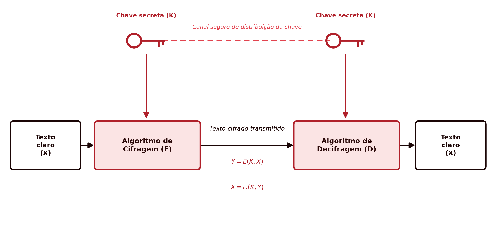
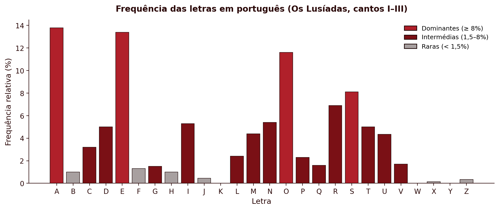
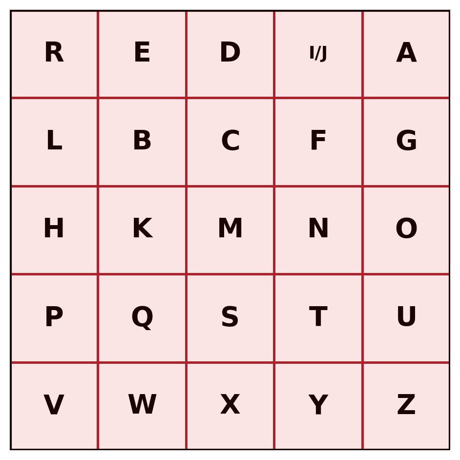
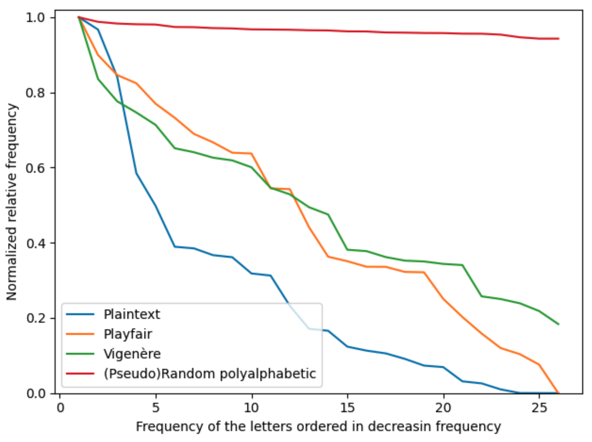
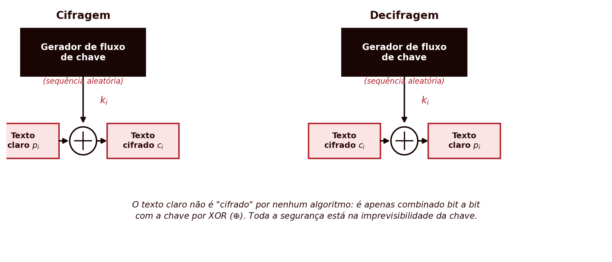
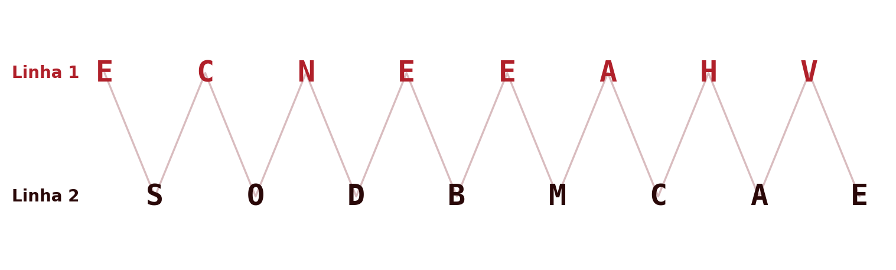
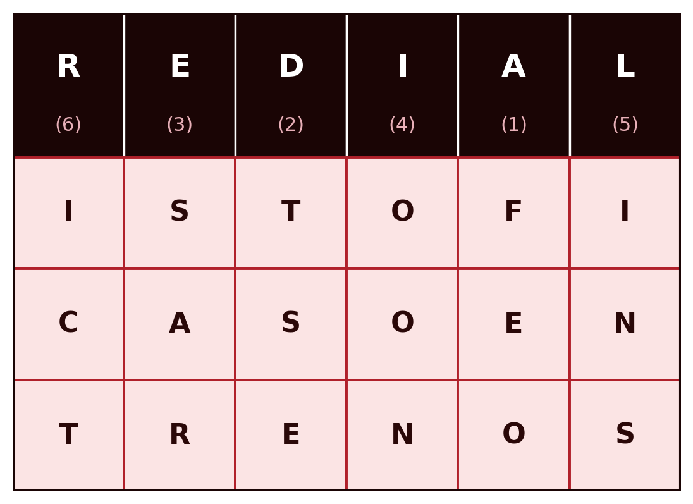

## Introdução {.unnumbered}

<span class="eyebrow">Cifras Clássicas</span>

- A criptografia estuda técnicas de proteção da informação através da sua transformação numa forma ilegível a quem não possua a chave
- Conceitos fundamentais: modelo de cifra simétrica, princípio de Kerckhoffs, força bruta versus criptanálise
- Cifras clássicas: sistemas de substituição e de transposição anteriores ao computador

Hoje obsoletas para uso prático, mas com valor pedagógico: introduzem os conceitos de chave, espaço de chaves e ataque, comuns aos sistemas modernos

## Classificação dos Sistemas Criptográficos {.unnumbered}

<span class="eyebrow">Fundamentos</span>

- **Número de chaves:** simétrica (uma única chave partilhada) ou assimétrica (chave pública e chave privada)
- **Tipo de operação:** substituição (cada símbolo é trocado por outro) ou transposição (os símbolos mantêm-se, muda a ordem)
- **Processamento do texto:** cifra de bloco (blocos de tamanho fixo) ou cifra de fluxo (símbolo a símbolo)

Este capítulo trata apenas sistemas **simétricos**, de **substituição** ou **transposição**

## O Modelo de Cifra Simétrica {.unnumbered}

<span class="eyebrow">Fundamentos</span>

{height="280px"}

- **Texto claro** ($X$), **algoritmo de cifragem** ($E$), **chave secreta** ($K$), **texto cifrado** ($Y$), **algoritmo de decifragem** ($D$)

$$Y = E(K, X) \qquad X = D(K, Y)$$

- Emissor e recetor partilham previamente a mesma chave secreta, por um canal seguro

## O Princípio de Kerckhoffs {.unnumbered}

<span class="eyebrow">Fundamentos</span>

- Formulado em 1883: a segurança de uma cifra deve depender apenas do **segredo da chave**, nunca do segredo do algoritmo
- Assume-se sempre que o atacante conhece perfeitamente o algoritmo, desconhecendo só a chave
- Um algoritmo cuja segurança dependa de permanecer secreto (*security through obscurity*) não é considerado seguro em criptografia séria
- Os algoritmos estudados neste módulo são públicos e amplamente escrutinados

## Força Bruta e Criptanálise {.unnumbered}

<span class="eyebrow">Fundamentos</span>

- **Força bruta:** testar exaustivamente todas as chaves possíveis, até encontrar um texto claro inteligível
- **Criptanálise:** explorar conhecimento adicional (pares texto claro/cifrado, propriedades estatísticas) para deduzir a chave sem a testar exaustivamente
- A criptanálise clássica baseia-se sobretudo em **análise de frequência:** a distribuição estatística das letras numa língua natural sobrevive, de formas variáveis, à cifragem
- Tipos de ataque, consoante a informação disponível: apenas texto cifrado, texto claro conhecido, texto claro escolhido, texto cifrado escolhido

## A Cifra de César {.unnumbered}

<span class="eyebrow">Cifras de Substituição</span>

- Cada letra é substituída pela letra $k$ posições mais à frente no alfabeto

$$C = E(k, p) = (p + k) \bmod 26 \qquad p = D(k, C) = (C - k) \bmod 26$$

- **Espaço de chaves:** apenas 25 valores distintos, trivialmente vulnerável a força bruta
- **Criptanálise:** análise de frequência, ou identificação de blocos repetidos correspondentes a palavras curtas frequentes ("que", "se")

## Criptanálise por Dígrafos e Trígrafos {.unnumbered}

<span class="eyebrow">Cifras de Substituição</span>

Texto cifrado, com dois blocos repetidos:

```
V  XBL  ZL  VBCL  UHV  L  V  XBL  ZL  CL
```

- **XBL** e **ZL** aparecem cada um 2 vezes
- Em português, "QUE" é o trígrafo isolado mais comum, "SE" um dos dígrafos mais comuns: testa-se XBL→QUE, ZL→SE

$$k = (\text{X} - \text{Q}) \bmod 26 = 7 \qquad k = (\text{Z} - \text{S}) \bmod 26 = 7$$

- As duas hipóteses concordam no mesmo $k$: confirma-se sem qualquer força bruta
- Resultado: "O que se ouve não é o que se vê."

## Cifra Monoalfabética {.unnumbered}

<span class="eyebrow">Cifras de Substituição</span>

- Generaliza a César: a chave é uma **permutação arbitrária** das 26 letras, não apenas um deslocamento fixo
- Espaço de chaves: $26! \approx 4 \times 10^{26}$, um ataque de força bruta é computacionalmente inviável
- Ainda assim, cada letra do texto claro corresponde sempre à mesma letra cifrada: a distribuição de frequências transporta-se intacta para o texto cifrado
- Vulnerável a análise de frequência: basta comparar a frequência das letras cifradas com a frequência conhecida da língua

## A Distribuição de Letras em Português {.unnumbered}

<span class="eyebrow">Cifras de Substituição</span>

{height="300px"}

- A, E e O dominam claramente; K, W e Y são praticamente ausentes
- Contagem real sobre os três primeiros cantos d'*Os Lusíadas* (~103.000 caracteres)

## Análise de Frequência: Um Texto Curto {.unnumbered}

<span class="eyebrow">Cifras de Substituição</span>

Texto cifrado (20 letras): `FVQRZQ MTB X ETV YTFRTZX`

| Letra cifrada | Ocorrências | Observado |
|:-:|:-:|:-:|
| T | 4 | 20,0% |
| F, V, Q, R, Z, X | 2 cada | 10,0% |

- T seria candidato a A ou E, mas seis letras empatam logo a seguir, a 10%
- Com apenas 20 letras, cada ocorrência vale 5 pontos percentuais: dados insuficientes para uma análise fiável

## Análise de Frequência: Um Texto Longo {.unnumbered}

<span class="eyebrow">Cifras de Substituição</span>

Mesma chave, agora sobre 221 letras (primeira estrofe d'*Os Lusíadas*, de Camões)

| Letra cifrada | Ocorrências | Observado |
|:-:|:-:|:-:|
| Q | 42 | 19,00% |
| T | 25 | 11,31% |
| Y, R, X | 18-19 | ~8% |

- O par dominante do texto cifrado (Q, T) corresponde de imediato ao par dominante da língua (A, E): a distância ao terceiro colocado é grande o suficiente para não deixar dúvidas
- A partir da 3.ª posição, vários valores ficam muito próximos: 221 letras ainda não bastam para os distinguir com segurança

## Dígrafos, Trígrafos e o Resultado Final {.unnumbered}

<span class="eyebrow">Cifras de Substituição</span>

- Correspondência direta posição a posição: apenas 5 das 14 letras mais frequentes (36%) coincidem com a chave real
- Blocos repetidos no texto cifrado: **CVT** (3×, "que"), **QZXY** (3×, sufixo "-ados"), **QRQB** (3×, sufixo "-aram")
- Sabendo já que Q→A, as três hipóteses confirmam-se pela letra inicial comum: revela 11 letras da chave de uma só vez, sem qualquer força bruta

Resultado: "As armas e os barões assinalados, / Que da ocidental praia Lusitana,"

## Cifra de Playfair {.unnumbered}

<span class="eyebrow">Cifras de Substituição</span>

::: {.columns}
::: {.column width="55%"}
- Cifra **pares de letras** (dígrafos), não letras isoladas, numa grelha $5 \times 5$ construída a partir de uma palavra-chave
- Mesma linha: substitui-se pela letra à direita
- Mesma coluna: substitui-se pela letra abaixo
- Caso contrário: forma-se um retângulo na grelha
- Achata a frequência de letras isoladas, mas os dígrafos continuam com frequência não uniforme
:::
::: {.column width="45%"}
{height="320px"}
:::
:::

## Exemplo: Cifrar com Playfair {.unnumbered}

<span class="eyebrow">Cifras de Substituição</span>

Frase "UTAD É FIXE", dividida em pares (X de enchimento no fim): `UT AD EF IX EX`

- **UT**: mesma linha → PU
- **AD**: mesma linha → RI
- **EF**: sem linha nem coluna comum → forma-se um retângulo → IB
- **IX**, **EX**: também em retângulo → DY, DW

Texto cifrado: `PURIIBDYDW`

## Cifra Polialfabética: Vigenère {.unnumbered}

<span class="eyebrow">Cifras de Substituição</span>

- A palavra-chave define uma sequência de deslocamentos de César, aplicados ciclicamente

$$C_i = (p_i + k_{i \bmod m}) \bmod 26 \qquad p_i = (C_i - k_{i \bmod m}) \bmod 26$$

- A mesma letra do texto claro pode corresponder a letras diferentes no texto cifrado, consoante a posição
- **Exame de Kasiski:** repetições no texto cifrado a distâncias múltiplas do comprimento da chave revelam esse comprimento; cada grupo resultante decifra-se depois como uma César isolada

## Achatamento da Frequência {.unnumbered}

<span class="eyebrow">Cifras de Substituição</span>

::: {.columns}
::: {.column width="55%"}
- Ordenando as letras do texto cifrado da mais para a menos frequente: o texto claro produz uma curva muito inclinada
- A Playfair achata-a moderadamente; a Vigenère achata-a ainda mais
- Uma polialfabética com chave longa e aleatória aproxima-se de uma reta horizontal, sem nenhuma letra a destacar-se
:::
::: {.column width="45%"}
{height="340px"}
:::
:::

## Vigenère na Prática: o Exame de Kasiski {.unnumbered}

<span class="eyebrow">Cifras de Substituição</span>

Chave "REDIAL" (6 letras) sobre "Três tigres tristes dormem":

```
Chave:   R E D I A L R E D I A L R E D I A
Claro:   T R E S T I G R E S T R I S T E S
Cifrado: K V H A T T X V H A T C Z W W M S
```

- O bloco **VHA** repete-se: "RES" aparece em "T**RES**" e "tig**RES**", 6 posições depois, o mesmo comprimento da chave
- Repetições a distâncias múltiplas do comprimento da chave revelam esse comprimento; cada grupo de posições (1,7,13,...; 2,8,14,...) resolve-se depois como uma César isolada

## Cifra de Vernam {.unnumbered}

<span class="eyebrow">Cifras de Substituição</span>

$$C_i = P_i \oplus K_{i \bmod m} \qquad P_i = C_i \oplus K_{i \bmod m}$$

{height="240px"}

- Generaliza a Vigenère: soma modular substituída por **XOR** ao nível dos bits, chave muito mais longa (Gilbert Vernam, 1918)
- Dificulta o exame de Kasiski, mas não elimina o problema: mais cedo ou mais tarde a chave esgota-se e repete-se

## One-Time Pad {.unnumbered}

<span class="eyebrow">Cifras de Substituição</span>

- Chave verdadeiramente aleatória, do mesmo comprimento da mensagem, nunca reutilizada
- Shannon (1949): quando usado corretamente, é **matematicamente inquebrável**, segredo perfeito
- Para qualquer texto cifrado, existe sempre uma chave que o decifra em qualquer texto claro do mesmo comprimento
- Impraticável: chave tão longa quanto a mensagem, genuinamente aleatória, nunca reutilizada nem parcialmente

## Segredo Perfeito: Um Exemplo Concreto {.unnumbered}

<span class="eyebrow">Cifras de Substituição</span>

Texto cifrado fixo (16 letras): `QXBZRPPNMNRSXSNJ`

| Chave | Decifra para |
|:--|:--|
| QFXMKPLVTNZORYWJ | A SENHA ESTÁ SEGURA |
| QVUZWLKZEWDYWSKJ | A CHAVE FOI ROUBADA |
| CENPNCCTZLRGDPZP | O TOKEN NUNCA MUDOU |

- As três decifragens são igualmente válidas: sem a chave, nada no texto cifrado distingue qual é a verdadeira
- É esta impossibilidade que define o segredo perfeito

## A Máquina Enigma {.unnumbered}

<span class="eyebrow">Cifras de Substituição</span>

- Cifra polialfabética: **rotores** eletromecânicos substituem a palavra-chave curta da Vigenère, avançando a cada letra premida
- A chave diária: rotores usados e ordem, posição inicial, ajuste do anel interno, ligações do quadro de fichas
- Não foi quebrada por análise de frequência: caiu por uma falha estrutural (nenhuma letra cifra a si própria) combinada com palavras prováveis (*crib*), testadas em escala pela Bombe de Turing e Welchman

## Cifras de Transposição: Rail Fence {.unnumbered}

<span class="eyebrow">Cifras de Transposição</span>

- Não alteram a identidade dos símbolos, apenas a sua **ordem**
- Rail fence: o texto claro escreve-se em ziguezague por duas linhas; o texto cifrado lê-se linha a linha

{height="220px"}

- A frequência de letras isoladas mantém-se inalterada: continua vulnerável a análise de frequência

## Transposição Colunar {.unnumbered}

<span class="eyebrow">Cifras de Transposição</span>

::: {.columns}
::: {.column width="55%"}
- Grelha com um número de colunas igual ao comprimento da palavra-chave
- O texto cifrado lê-se pelas colunas, na ordem alfabética das letras da chave
- Todas as letras do texto claro persistem no texto cifrado, só a ordem muda
- A letra mais frequente do texto cifrado é diretamente a mais frequente da língua: permite distinguir transposição de substituição
:::
::: {.column width="45%"}
{height="320px"}
:::
:::

## Síntese do Capítulo {.unnumbered}

<span class="eyebrow">Síntese</span>

1. Um sistema simétrico define-se por texto claro, algoritmo de cifragem, chave secreta, texto cifrado e algoritmo de decifragem: $Y = E(K, X)$, $X = D(K, Y)$
2. O **princípio de Kerckhoffs:** a segurança depende só do segredo da chave, nunca do algoritmo
3. **Força bruta** (testar todo o espaço de chaves) e **criptanálise** (explorar informação adicional) são as duas estratégias gerais de ataque
4. As **cifras de substituição** (César, monoalfabética, Playfair, Vigenère) têm vulnerabilidades decrescentes, mas nunca eliminadas, a análise de frequência
5. A **cifra de Vernam** atenua o problema com XOR e chave mais longa; o **One-Time Pad** elimina-o por completo, ao custo de exigências de chave impraticáveis
6. A **Enigma** mecanizou o princípio polialfabético com rotores; caiu por falha estrutural e palavras prováveis, não por análise de frequência
7. As **cifras de transposição** reordenam símbolos sem alterar a sua identidade, base histórica da confusão e difusão modernas

## Para Pensar {.unnumbered}

<span class="eyebrow">Reflexão</span>

Porque é que o One-Time Pad, apesar de matematicamente inquebrável, não é a solução universal para todos os problemas de comunicação segura?

::: {.fragment}
Que outro problema, tão difícil quanto o da própria mensagem, a sua utilização acaba por introduzir?
:::
