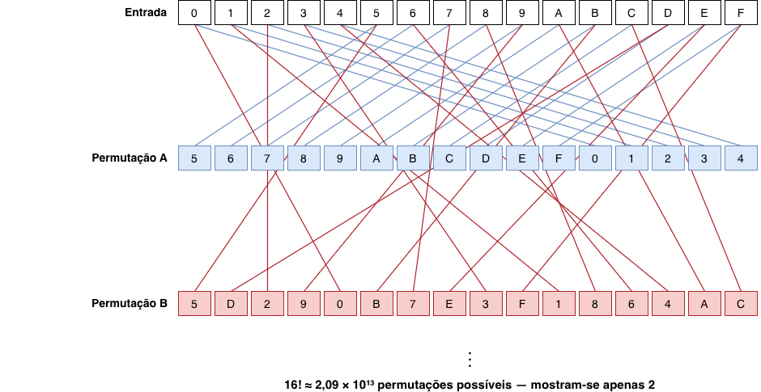
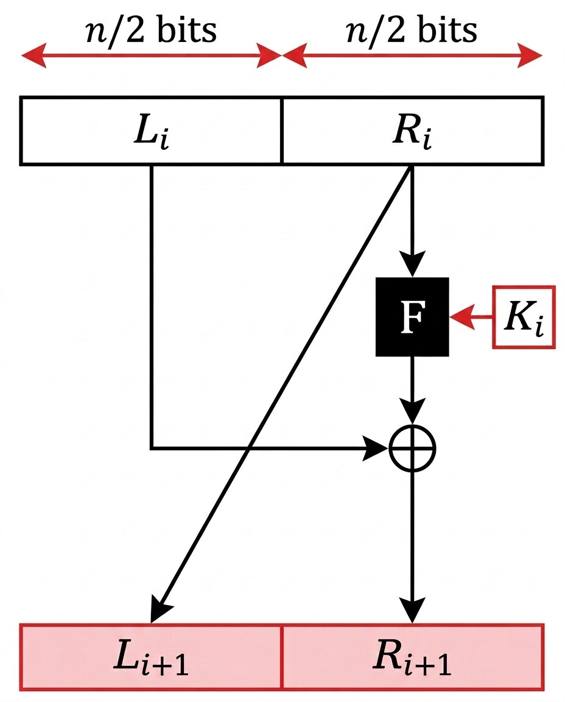
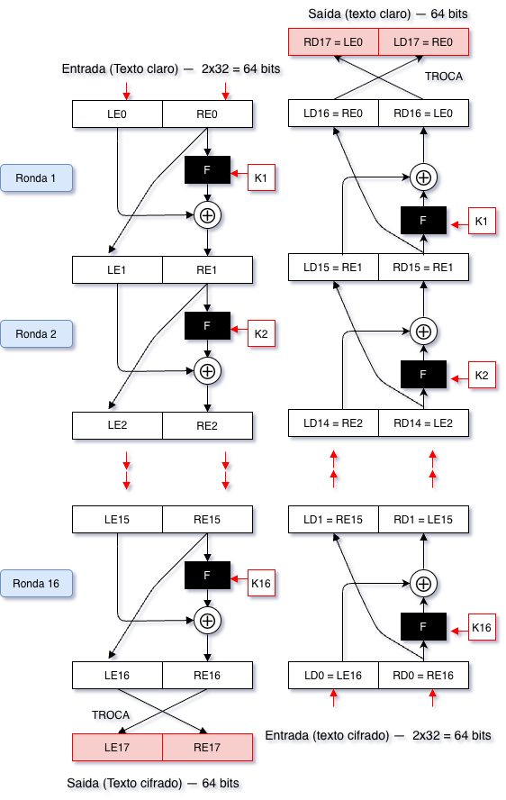
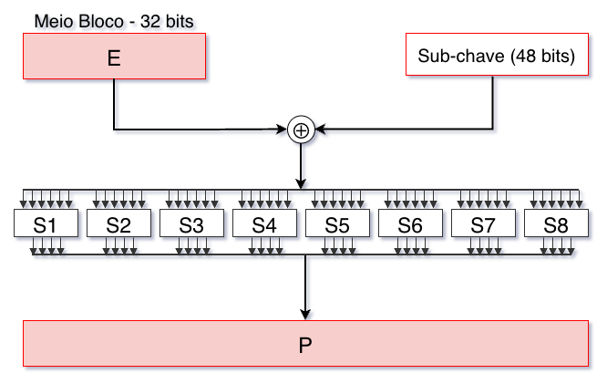

## Introdução {.unnumbered}

De letras a bits

- As cifras clássicas operam sobre letras de um alfabeto natural: substituem-nas ou transpõem-nas
- Um computador lê sequências de bits: texto, imagem ou som são sempre, em última análise, sequências binárias
- As **cifras de bloco** modernas operam diretamente sobre essas sequências binárias

Este capítulo cobre a estrutura geral das cifras de bloco, a rede de **Feistel**, o **DES** e o **3DES**

## O que é uma Cifra de Bloco {.unnumbered}

Fundamentos

- Divide o texto claro em **blocos de tamanho fixo**, tipicamente 64 ou 128 bits
- Cifra cada bloco independentemente, usando sempre a mesma chave
- Para um bloco de $n$ bits e chave $K$, a cifragem $E_K$ é uma **função bijetiva**:

$$E_K : \{0,1\}^n \rightarrow \{0,1\}^n$$

- Cada bloco de texto claro tem exatamente um bloco de texto cifrado correspondente: a decifragem é sempre possível e única
- Generaliza a cifra monoalfabética: em vez de 26 letras, opera sobre $2^n$ blocos possíveis, o que torna a análise de frequência inútil

## A Cifra Ideal, e Porque É Impraticável {.unnumbered}

Fundamentos

- A construção mais segura seria escolher, para cada chave, uma **permutação completamente arbitrária**, sem qualquer estrutura interna que um criptanalista pudesse explorar: a **cifra ideal**
- Para $n=4$ bits, o espaço de blocos tem apenas 16 elementos (`0` a `F` em hexadecimal)
- Uma permutação é qualquer reatribuição bijetiva de cada entrada a uma saída distinta

## Permutações e Tamanho da Chave {.unnumbered}

Fundamentos

{height="340px"}

- Duas permutações possíveis dos 16 valores, escolhidas sem qualquer padrão
- Quantas permutações destas existem ao todo? Quantos bits de chave são precisos para as endereçar todas?

## Tamanho da Chave — Generalização {.unnumbered}

Fundamentos

- Total de permutações de 16 valores: $16! \approx 2{,}09 \times 10^{13}$
- Para um bloco de $n$ bits, a chave da cifra ideal precisa de:

$$n \times 2^n \text{ bits}$$

- $n=4$ &rarr; 64 bits (gerível)
- $n=64$ &rarr; $2^{70} \approx 10^{21}$ bits (impensável)

**Conclusão:** a cifra ideal é impraticável. As cifras reais aproximam-se do seu comportamento por outra via: rondas de confusão e difusão

## Confusão e Difusão {.unnumbered}

Fundamentos

Claude Shannon identificou em 1949 duas propriedades que uma cifra robusta deve garantir:

**Confusão**

: a relação entre a chave e o texto cifrado deve ser o mais complexa e não linear possível. Obtém-se através de operações de **substituição**

**Difusão**

: a influência de cada bit do texto claro deve espalhar-se por muitos bits do texto cifrado. Obtém-se através de operações de **permutação** e mistura de bits

Nenhuma das duas é suficiente isoladamente: as cifras de bloco modernas combinam ambas ao longo de várias rondas

## Uma Ronda de Feistel {.unnumbered}

Rede de Feistel

::: {.columns}
::: {.column width="45%"}
- Proposta por Horst Feistel nos anos 1970 (IBM)
- O bloco de $n$ bits divide-se em duas metades, $L_i$ e $R_i$
- $R_i$ atravessa uma função $F$, parametrizada pela subchave $K_i$
- O resultado combina-se por XOR com $L_i$
- As metades trocam de posição para a ronda seguinte
:::
::: {.column width="55%"}
{width="70%"}
:::
:::

## Estrutura Geral {.unnumbered}

Rede de Feistel

Cada ronda $i$ de uma rede de Feistel aplica:

$$L_{i+1} = R_i$$
$$R_{i+1} = L_i \oplus F(R_i, K_i)$$

**Propriedade fundamental:** a decifragem usa exatamente a mesma estrutura da cifragem, com as subchaves por ordem inversa, independentemente de $F$ ser ou não invertível

O mesmo circuito serve para cifrar e para decifrar

## Cifragem e Decifragem numa Rede de Feistel {.unnumbered}

Rede de Feistel

::: {.columns}
::: {.column width="55%"}
- **Cifragem:** o texto claro entra como $L_0/R_0$; as subchaves $K_1, \dots, K_{16}$ aplicam-se por ordem crescente
- **Decifragem:** parte do texto cifrado e aplica a mesma estrutura, com as subchaves por ordem inversa
- A mesma função $F$, o mesmo circuito: só a ordem das subchaves muda
:::
::: {.column width="45%"}
{height="500px"}
:::
:::

## DES — Data Encryption Standard {.unnumbered}

DES

- Desenvolvido pela IBM, com contributos da NSA; adotado em 1977 como padrão federal dos EUA
- Durante quase duas décadas, foi o algoritmo de cifra simétrica mais usado no mundo

**Características:**

- Bloco de **64 bits**
- Chave de **56 bits** efetivos (representada como 64 bits, dos quais 8 são bits de paridade)
- **16 rondas** de Feistel, cada uma com uma subchave de 48 bits
- Permutação inicial (IP) e final (FP): fixas, sem contribuição criptográfica

## A Função F do DES {.unnumbered}

DES

{height="280px"}

1. **Expansão (E):** a metade de 32 bits é expandida para 48 bits
2. **XOR com a subchave** da ronda (48 bits)
3. **S-boxes (S1–S8):** 8 grupos de 6 bits, cada um devolve 4 bits não lineares: principal fonte de confusão
4. **Permutação (P):** reorganização fixa dos 32 bits resultantes: fonte de difusão

## A Queda do DES por Força Bruta {.unnumbered}

DES

- Espaço de chaves: $2^{56} \approx 7{,}2 \times 10^{16}$: astronomicamente seguro em 1977, vulnerável décadas depois
- S-boxes especificadas pela NSA sem justificação pública: suspeitas nunca confirmadas, nunca inteiramente afastadas

**Cronologia dos ataques:**

- 1997: DESCHALL, 96 dias (ciclos ociosos voluntários)
- 1998: distributed.net, 39 dias; EFF constrói a *Deep Crack* (< 250 mil dólares), quebra o DES em ~56 horas
- 1999: distributed.net + Deep Crack, 22 horas

O DES foi substituído em 1999. Está hoje obsoleto

## 3DES — Triple DES {.unnumbered}

3DES

- Adotado em 1999 como solução de transição enquanto se preparava o AES
- Aplica o DES três vezes, com chaves diferentes, segundo o esquema **EDE**:

$$C = E_{K_3}(D_{K_2}(E_{K_1}(P)))$$

- Com $K_1 = K_2 = K_3$, o 3DES reduz-se a uma única cifragem DES (compatibilidade)

**Variantes:**

- Três chaves distintas: segurança efetiva de ~112 bits (não 168, por ataque *meet-in-the-middle*)
- Duas chaves distintas: segurança efetiva de ~80 bits, hoje insuficiente

O NIST recomenda, desde 2023, a descontinuação do 3DES em aplicações novas

## Síntese do Capítulo {.unnumbered}

Síntese

1. Uma cifra de bloco é uma permutação de blocos de bits, parametrizada pela chave
2. A cifra ideal exigiria uma chave de $n \times 2^n$ bits: impraticável
3. Confusão e difusão (Shannon, 1949): as duas propriedades combinadas ao longo de rondas
4. A rede de Feistel permite que a decifragem use a mesma estrutura da cifragem, mesmo com $F$ não invertível
5. O DES (1977): 64 bits de bloco, 56 bits de chave, 16 rondas; quebrado por força bruta em 1999
6. O 3DES (1999): três aplicações do DES (EDE), ~112 bits efetivos; descontinuação recomendada desde 2023

## Para Pensar {.unnumbered}

Reflexão

Na rede de Feistel, a função $F$ não precisa de ser invertível para que todo o sistema seja reversível.

Que vantagem prática traz isto a quem desenha o algoritmo, comparando com uma cifra em que a função central tivesse de ser, ela própria, invertível?

::: {.fragment}
**Dica:** pensa no que significa garantir que uma função não linear é invertível, e no que isso implicaria para a escolha das S-boxes do DES
:::
