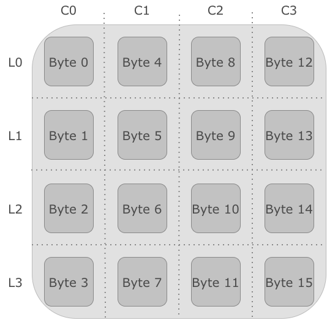
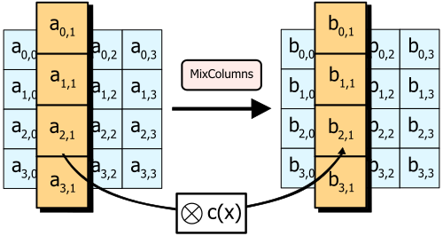
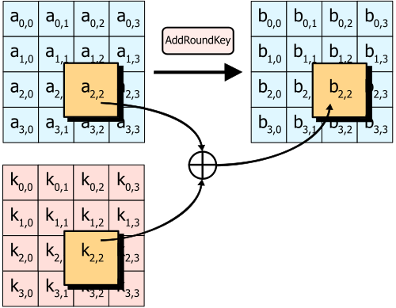
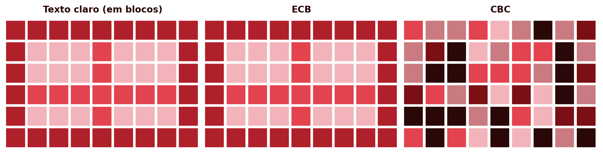
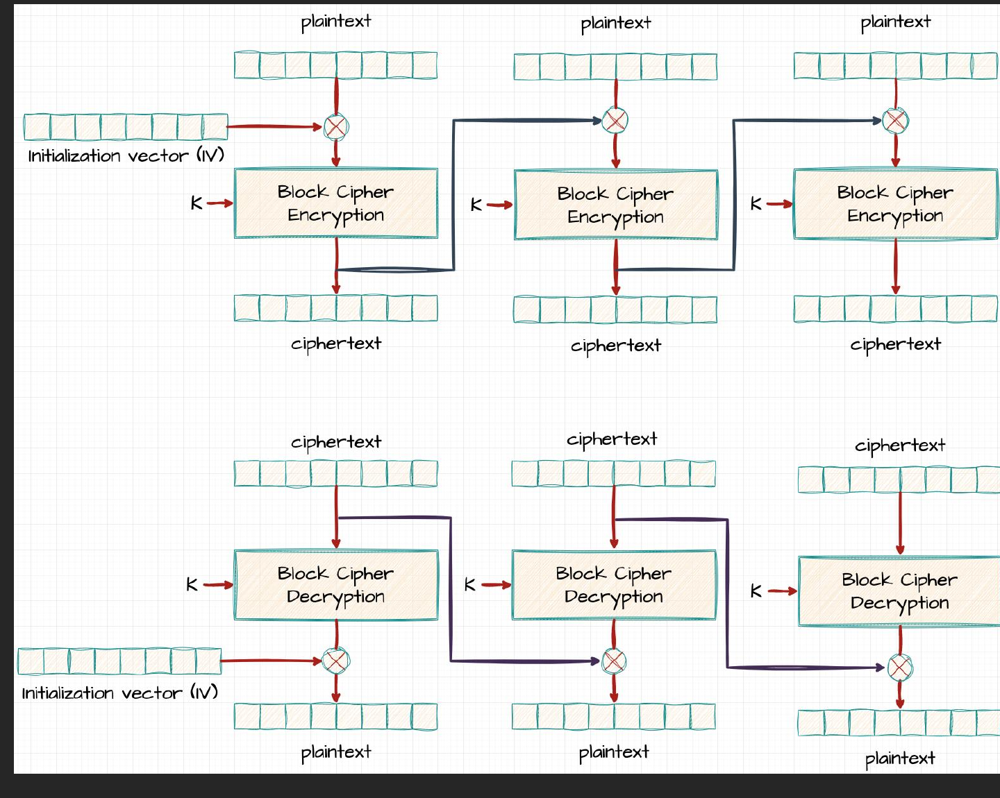
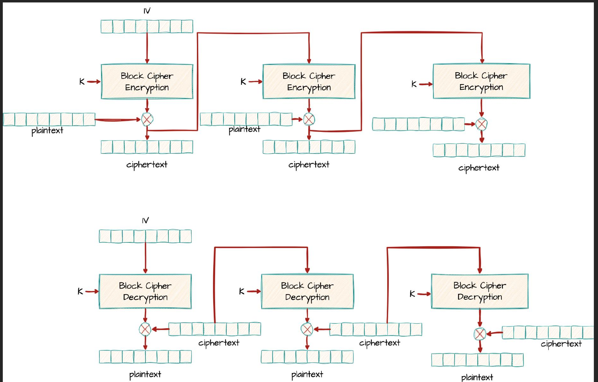
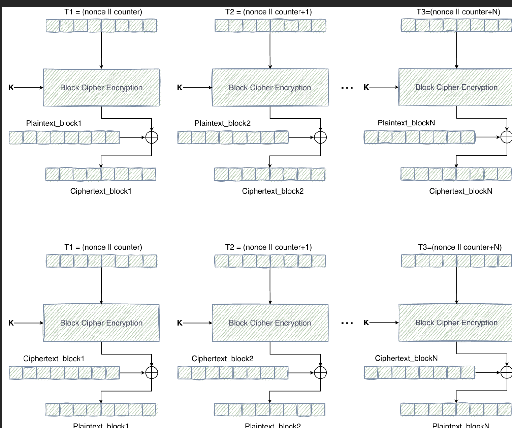

## Introdução {.unnumbered}

AES

- O DES está obsoleto; o 3DES é lento e continua limitado pelo bloco de 64 bits
- Era necessário um sucessor desenhado de raiz: o **AES** (*Advanced Encryption Standard*), hoje universalmente adotado
- Segunda parte do capítulo: como cifrar uma mensagem maior do que um único bloco

## Do DES ao AES: um Novo Paradigma {.unnumbered}

AES

- 1997: o NIST lança um concurso público e aberto para escolher o sucessor do DES
- Quinze algoritmos submetidos, cinco finalistas; vencedor em 2000: **Rijndael**, de Joan Daemen e Vincent Rijmen
- **Diferença estrutural fundamental:** o DES é uma rede de Feistel (só metade do bloco atravessa $F$ por ronda); o AES é uma **rede de substituição-permutação (SPN)**, em que o **bloco inteiro** é transformado em cada ronda

## Estrutura Geral do AES {.unnumbered}

AES

{height="320px"}

- **Bloco:** sempre 128 bits (16 bytes), independentemente da chave
- **Chave:** 128, 192 ou 256 bits (AES-128/192/256)
- **Rondas:** 10, 12 ou 14, consoante o tamanho da chave
- O bloco organiza-se numa matriz $4 \times 4$ de bytes, o **estado**, preenchida coluna a coluna

## As Quatro Transformações de Ronda {.unnumbered}

AES

- Cada ronda intermédia aplica, por ordem: `SubBytes`, `ShiftRows`, `MixColumns`, `AddRoundKey`
- Antes da primeira ronda: um `AddRoundKey` inicial; a última ronda omite o `MixColumns`
- Objetivo: uma alteração mínima na mensagem ou na chave produz alterações imprevisíveis no texto cifrado, o **efeito avalanche**

## SubBytes {.unnumbered}

AES

{height="260px"}

- Única operação não linear do AES: fornece a **confusão**
- Cada byte do estado é substituído pelo byte correspondente numa **S-box** fixa, construída a partir do inverso multiplicativo em $GF(2^8)$
- Ao contrário do DES (oito S-boxes diferentes), o AES usa uma **única S-box**, reaplicada a todos os bytes

## ShiftRows {.unnumbered}

AES

{height="220px"}

- Desloca ciclicamente cada linha da matriz de estado para a esquerda: linha 0 fica igual, linha 1 desloca 1, linha 2 desloca 2, linha 3 desloca 3
- Garante que os bytes de uma coluna deixam de pertencer todos à mesma coluna, espalhando a influência de cada byte pelas rondas seguintes

## MixColumns {.unnumbered}

AES

{height="260px"}

- Multiplica cada coluna, tratada como polinómio de grau 3 sobre $GF(2^8)$, por um polinómio fixo $c(x)$, módulo $x^4+1$
- Cada byte de saída de uma coluna passa a depender dos quatro bytes de entrada dessa coluna: é a **difusão** do AES
- Omite-se na última ronda

## AddRoundKey {.unnumbered}

AES

{height="300px"}

- Única transformação que envolve a chave: cada byte do estado combina-se por XOR com o byte correspondente da subchave da ronda
- Isoladamente, seria trivial de inverter sem conhecer a chave: a segurança do AES depende da combinação das quatro transformações, não de nenhuma isoladamente

## A Ronda Completa e a Expansão de Chave {.unnumbered}

AES

{height="320px"}

- Um AES de $N_r$ rondas precisa de $N_r+1$ subchaves de 128 bits, geradas por um **esquema de expansão de chave**
- Todas as subchaves derivam de uma única chave secreta, por um processo determinístico e público
- A segurança reside inteiramente na chave, nunca no segredo do desenho (princípio de Kerckhoffs)

## Segurança do AES {.unnumbered}

AES

- Nenhum ataque prático conhecido mais rápido do que a força bruta desde a normalização em 2001; $2^{128}$ torna a força bruta pura inviável
- As vulnerabilidades reais são de **implementação**: ataques de **canal lateral** (tempo de execução, consumo energético), não do algoritmo em si
- O AES-NI executa as transformações em tempo constante, eliminando esta classe de ataques
- O algoritmo de Grover reduziria o AES-128 a ~64 bits de segurança efetiva: por isso o **AES-256** é recomendado para dados de longo prazo

## Modos de Operação {.unnumbered}

Modos de Operação

- Uma cifra de bloco cifra sempre exatamente um bloco de cada vez
- Uma mensagem real quase nunca tem exatamente o tamanho de um bloco
- Um **modo de operação** define como aplicar repetidamente a mesma cifra de bloco a uma sequência de blocos, para cifrar mensagens de qualquer tamanho

## ECB — Electronic Codebook {.unnumbered}

Modos de Operação

{height="300px"}

- $C_i = E_K(P_i)$: cada bloco cifra-se independentemente, com a mesma chave
- Simples e paralelizável, mas **blocos de texto claro idênticos produzem sempre blocos de texto cifrado idênticos**
- Qualquer padrão estrutural da mensagem original permanece visível no texto cifrado

## ECB vs. CBC: o Padrão Visual {.unnumbered}

Modos de Operação

{height="260px"}

Um texto claro com um padrão estrutural óbvio, cifrado em ECB e em CBC: sob ECB o padrão original mantém-se perfeitamente visível; sob CBC desaparece por completo

## CBC — Cipher Block Chaining {.unnumbered}

Modos de Operação

::: {.columns}
::: {.column width="55%"}
- Antes de cifrar cada bloco, combina-se por XOR com o bloco de texto cifrado anterior

$$C_i = E_K(P_i \oplus C_{i-1}) \qquad P_i = D_K(C_i) \oplus C_{i-1}$$

- O primeiro bloco usa um **vetor de inicialização (IV)**, único e imprevisível, não secreto
- A decifragem é paralelizável; a cifragem não é
:::
::: {.column width="45%"}
{height="380px"}
:::
:::

## CFB — Cipher Feedback Mode {.unnumbered}

Modos de Operação

::: {.columns}
::: {.column width="55%"}
- Cifra-se o bloco de texto cifrado anterior, nunca o texto claro diretamente

$$C_i = P_i \oplus E_K(C_{i-1}) \qquad C_0 = \text{IV}$$

- Comporta-se como uma **cifra de pseudo-fluxo**: pode operar sobre segmentos mais pequenos que um bloco
- A cifragem não é paralelizável; a decifragem é
:::
::: {.column width="45%"}
{height="400px"}
:::
:::

## CTR — Counter Mode {.unnumbered}

Modos de Operação

::: {.columns}
::: {.column width="55%"}
- Cifra-se um contador (com um *nonce*), combinado por XOR com o texto claro

$$C_i = P_i \oplus E_K(\text{nonce} \mathbin\Vert i)$$

- Transforma a cifra de bloco numa cifra de fluxo
- Cifragem **e** decifragem são inteiramente paralelizáveis
- Reutilizar o *nonce* é catastrófico; e o CTR é **maleável**: não protege a integridade
:::
::: {.column width="45%"}
{height="400px"}
:::
:::

## GCM — Galois/Counter Mode {.unnumbered}

Modos de Operação

- Nenhum dos modos anteriores (ECB, CBC, CFB, CTR) protege a **integridade** da mensagem
- O **GCM** estende o CTR com um mecanismo de autenticação sobre um corpo finito, o **GHASH**
- Produz uma **cifra autenticada (AEAD)**: texto cifrado mais uma marca de 128 bits, também sobre dados associados (AAD) não cifrados
- Reutilizar o *nonce* continua catastrófico; é hoje o modo **recomendado** (TLS 1.3, SSH, IPsec, QUIC)

## Comparação dos Modos de Operação {.unnumbered}

Modos de Operação

| Modo | Paralelizável (cifra/decifra) | Autenticação | Uso recomendado |
|---|---|---|---|
| ECB | Sim / Sim | Não | Nunca (revela padrões) |
| CBC | Não / Sim | Não | Legado; substituir por AEAD |
| CFB | Não / Sim | Não | Fluxos de comprimento variável |
| CTR | Sim / Sim | Não | Alto débito, sem autenticação |
| GCM | Sim / Sim | Sim (GHASH) | Recomendado (TLS 1.3, SSH, IPsec, QUIC) |

## Padding {.unnumbered}

Modos de Operação

- Quando o último bloco de uma mensagem não está completo, o **padding** acrescenta bytes extra antes da cifragem
- **PKCS#7:** se faltam $n$ bytes, preenchem-se com o valor $n$; a decifragem lê o último byte para saber quantos remover
- Só os modos que cifram diretamente bloco a bloco (**ECB**, **CBC**) precisam de padding; **CTR** e **GCM** dispensam-no
- **Ataque de oráculo de padding:** se uma implementação revelar, por uma mensagem de erro ou por uma diferença de tempo de resposta, se o padding recebido era válido, um atacante explora essa fuga para decifrar a mensagem inteira, byte a byte, sem nunca conhecer a chave

## Síntese do Capítulo {.unnumbered}

Síntese

1. O **AES** venceu um concurso público do NIST (Rijndael), normalizado em 2001
2. Ao contrário do DES, é uma **rede de substituição-permutação (SPN)**: cada ronda transforma o bloco inteiro
3. Bloco de **128 bits**; chave de 128/192/256 bits, com 10/12/14 rondas
4. Quatro transformações por ronda: **SubBytes** (confusão), **ShiftRows**/**MixColumns** (difusão), **AddRoundKey** (mistura com a chave)
5. Sem ataques práticos conhecidos; as vulnerabilidades reais são de implementação (canal lateral)
6. Um **modo de operação** aplica a cifra a mensagens maiores que um bloco: ECB revela padrões; CBC/CFB encadeiam blocos mas não paralelizam a cifragem; CTR paraleliza tudo, mas é maleável
7. O **GCM** combina CTR com autenticação (GHASH): é hoje o modo AEAD recomendado
8. O **padding** (PKCS#7) permite a ECB/CBC processar mensagens de qualquer comprimento

## Para Pensar {.unnumbered}

Reflexão

O DES combina confusão e difusão através de uma única função $F$, aplicada só a metade do bloco por ronda. O AES separa estas propriedades em transformações distintas, aplicadas ao bloco inteiro.

::: {.fragment}
Que vantagens pode trazer esta separação explícita, tanto para a análise de segurança do algoritmo como para o seu desempenho em hardware?
:::
