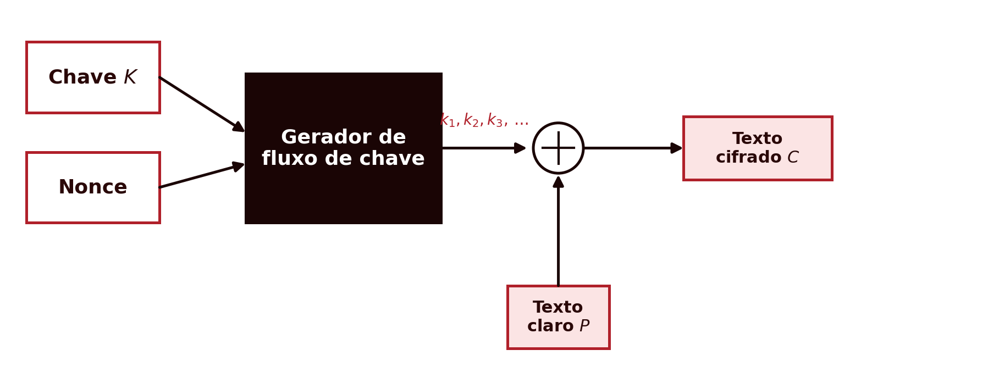
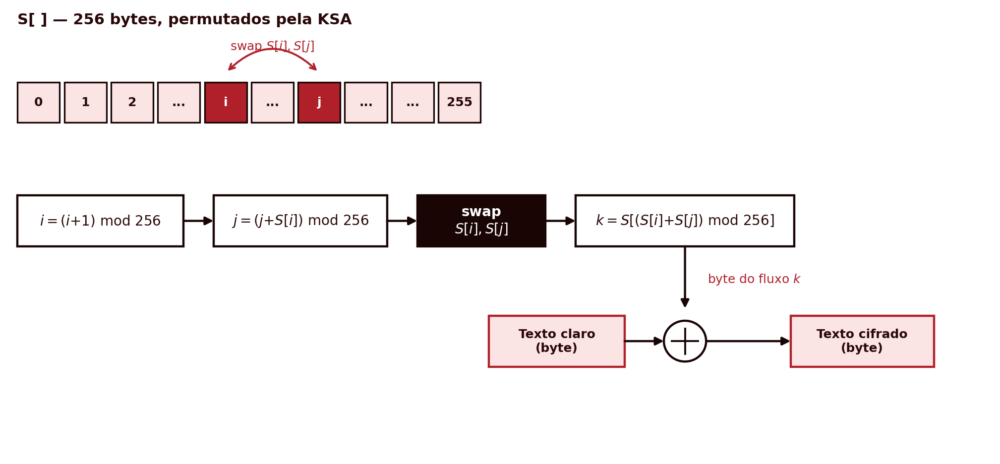
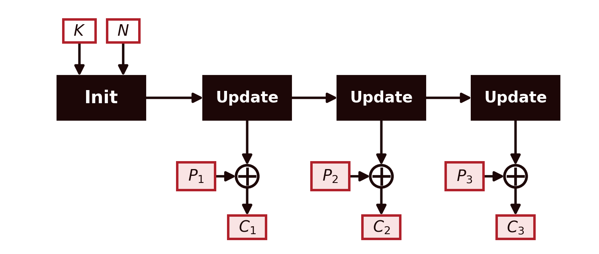
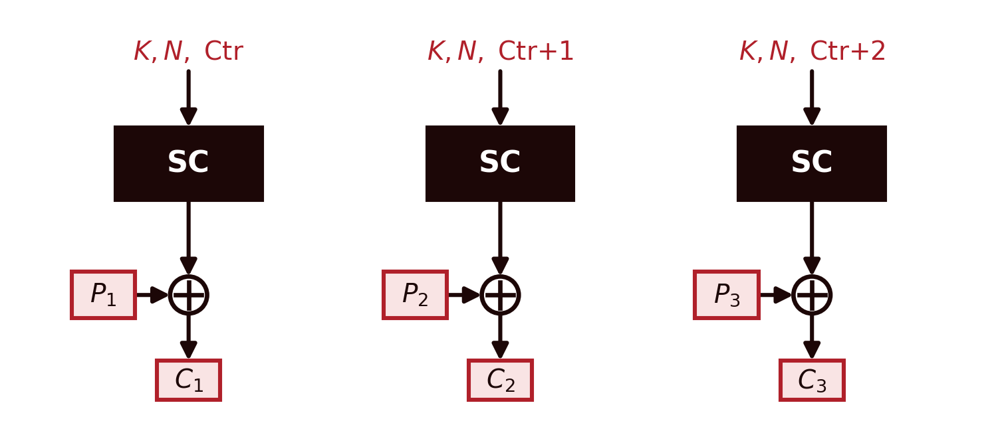
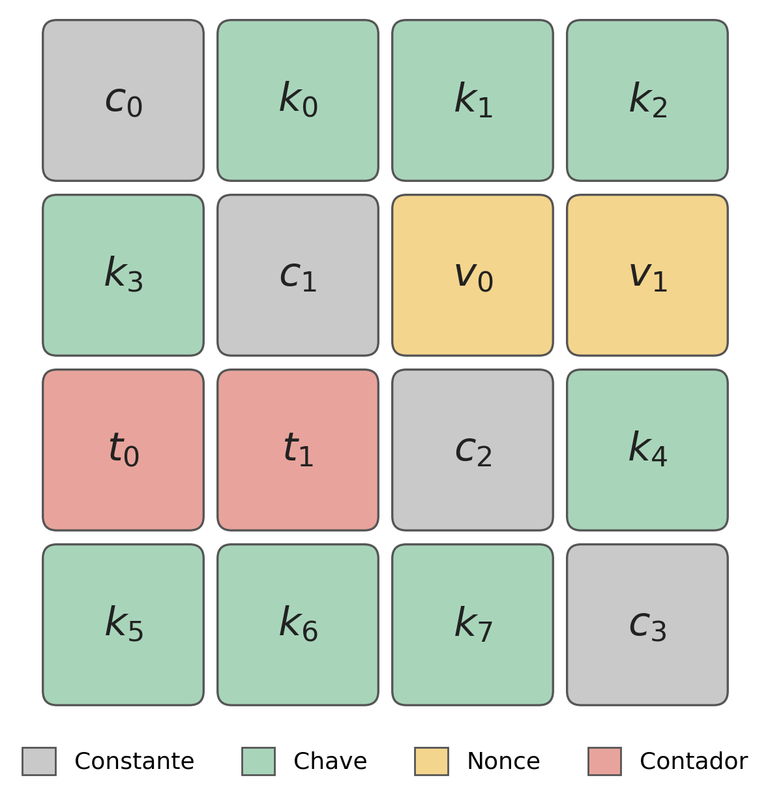
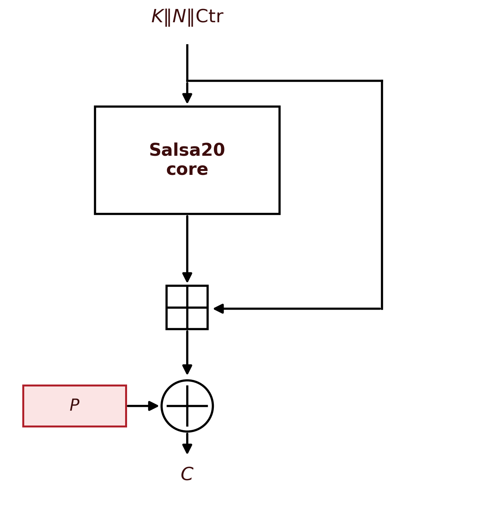
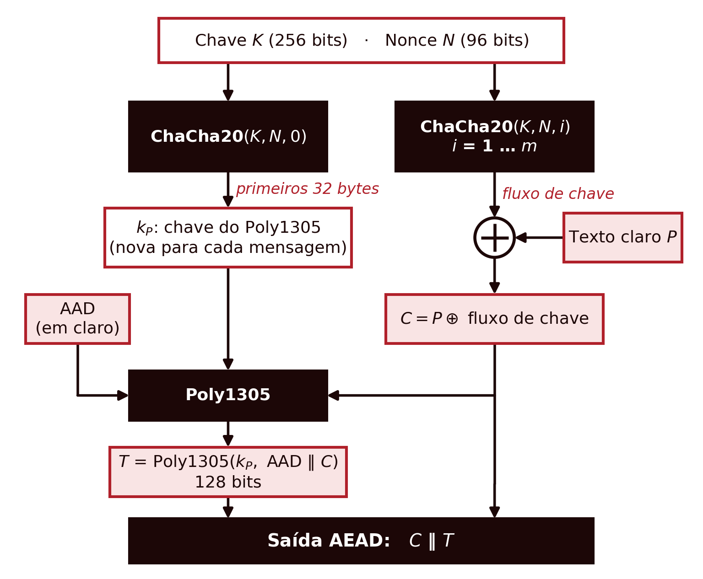

## Introdução {.unnumbered}

Cifras de Fluxo

- DES e AES são **cifras de bloco**: processam a mensagem em fragmentos de tamanho fixo, precisando de um modo de operação
- As **cifras de fluxo** geram uma sequência pseudo-aleatória de bits, byte a byte, e combinam-na com o texto claro por XOR, sem noção de bloco
- Relevantes por serem rápidas em fluxos contínuos e em dispositivos com poucos recursos (sensores, RFID, IoT)
- O descrédito das cifras de bloco em modo CBC (ataques de oráculo de padding) também empurrou muitos sistemas para cifras de fluxo

## Cifras de Fluxo: o Conceito Geral {.unnumbered}

Cifras de Fluxo

{height="280px"}

- Recebe dois valores: a chave $K$ (secreta) e o *nonce* $N$ (não secreto, único por chave)
- Um **gerador de fluxo de chave** produz $k_1, k_2, k_3, \dots$, tão longo quanto necessário

$$C_i = P_i \oplus k_i$$

- É o **equivalente pseudo-aleatório do One-Time Pad**: troca a chave genuinamente aleatória e do tamanho da mensagem por uma chave curta e reutilizável, perdendo o segredo perfeito

## O Ataque do Two-Time Pad {.unnumbered}

Cifras de Fluxo

- O par (chave, *nonce*) **nunca pode ser reutilizado**: reutilizar $K_1$ com um $N_1$ diferente é seguro; reutilizar exatamente o mesmo par $(K_1, N_1)$ não é
- Se o mesmo par se repetir, o gerador produz o mesmo fluxo de chave para duas mensagens diferentes

$$C_1 \oplus C_2 = (P_1 \oplus k) \oplus (P_2 \oplus k) = P_1 \oplus P_2$$

- O resultado já não depende da chave e é frequentemente suficiente para recuperar ambas as mensagens por análise estatística
- Foi exatamente este tipo de falha que tornou o protocolo **WEP** praticamente inútil

## RC4 {.unnumbered}

RC4

{height="280px"}

- Desenhado por Ron Rivest em 1987; chaves de 40 a 2048 bits; estado interno de 256 bytes
- **KSA** (*Key Scheduling Algorithm*): constrói e permuta o *array* $S$ a partir da chave
- **PRGA** (*Pseudo-Random Generation Algorithm*): a cada iteração, troca $S[i]$ com $S[j]$ e produz um byte do fluxo de chave

## RC4: Fragilidades e Fim de Vida {.unnumbered}

RC4

- **Não existe nenhum mecanismo de *nonce* incorporado**: tem de ser adicionado externamente
- O WEP prefixava a chave com um *nonce* curto e previsível: vulnerável ao **ataque de Fluhrer, Mantin e Shamir** (2001)
- Os primeiros bytes do fluxo de chave não são estatisticamente uniformes (o segundo byte vale zero com probabilidade $1/128$, não $1/256$)
- Um segundo ataque prático contra o TLS foi publicado em 2013; o RC4 foi banido do TLS pela IETF em 2015

## Duas Arquiteturas: Cifra com Estado {.unnumbered}

Arquiteturas

{height="320px"}

- Inicializa um estado interno a partir da chave e do *nonce* (fase `Init`)
- Cada `Update` seguinte modifica esse estado, de forma **sequencial**: cada atualização depende da anterior
- O RC4 é exatamente disto: a KSA inicializa $S$, cada iteração da PRGA atualiza-o

## Duas Arquiteturas: Cifra por Contador {.unnumbered}

Arquiteturas

{height="320px"}

- Não mantém nenhum estado secreto entre blocos, além do valor de um contador público
- Cada bloco calcula-se de novo, diretamente a partir da chave, do *nonce* e do contador, **sem depender do bloco anterior**
- Pode calcular-se **em paralelo**; o Salsa20 e o ChaCha20 seguem esta arquitetura

## Salsa20 {.unnumbered}

Salsa20

{height="300px"}

- Desenhado por Daniel J. Bernstein em 2005, submetido ao concurso *eSTREAM*
- Construção **ARX** (*Add-Rotate-XOR*): sem S-boxes nem tabelas de substituição
- Estado interno: matriz $4 \times 4$ de palavras de 32 bits (4 constantes fixas, 8 de chave, 2 de *nonce*, 2 de contador)

## Salsa20: Função de Ronda e Segurança {.unnumbered}

Salsa20

::: {.columns}
::: {.column width="50%"}
- 20 rondas de uma função de quarto de ronda $Q_R$ (10 sobre linhas, 10 sobre colunas)

$$b \mathrel{\oplus}= (a+d) \lll 7 \qquad c \mathrel{\oplus}= (b+a) \lll 9$$
$$d \mathrel{\oplus}= (c+b) \lll 13 \qquad a \mathrel{\oplus}= (d+c) \lll 18$$

- O resultado soma-se (módulo $2^{32}$) ao estado inicial: adição modular, não linear, torna a transformação difícil de inverter
- Cada bloco é gerado de forma independente: inteiramente **paralelizável**
- O melhor ataque conhecido reduz-se a 15 das 20 rondas; a versão completa é considerada segura
:::
::: {.column width="50%"}
{height="420px"}
:::
:::

## ChaCha20 {.unnumbered}

ChaCha20

- Também de Bernstein (2008): variante do Salsa20 com melhor difusão por ronda

$$a \mathrel{+}= b;\ d \mathrel{\oplus}= a;\ d \lll 16 \qquad c \mathrel{+}= d;\ b \mathrel{\oplus}= c;\ b \lll 12$$
$$a \mathrel{+}= b;\ d \mathrel{\oplus}= a;\ d \lll 8 \qquad c \mathrel{+}= d;\ b \mathrel{\oplus}= c;\ b \lll 7$$

- Constantes de rotação e ordem das operações diferentes do Salsa20, para conseguir difusão mais rápida
- *Nonce* de 96 bits (RFC), contador de 32 bits; hoje a cifra de fluxo de referência (TLS 1.3, QUIC, WireGuard, SSH)

## ChaCha20-Poly1305 {.unnumbered}

ChaCha20

{height="300px"}

- **Poly1305:** não cifra nada, só calcula uma marca de autenticação de 128 bits: um **autenticador de utilização única**
- O bloco 0 do ChaCha20 deriva a chave do Poly1305; os blocos 1 a $N$ fornecem o fluxo de chave
- Resulta numa **cifra autenticada (AEAD)**, mais rápida que o AES-GCM em software puro, sem hardware dedicado

## Síntese do Capítulo {.unnumbered}

Síntese

1. Uma **cifra de fluxo** gera um fluxo de chave pseudo-aleatório combinado por XOR com o texto claro, o equivalente pseudo-aleatório do One-Time Pad
2. **Nunca reutilizar o mesmo par (chave, *nonce*)**: fazê-lo permite o ataque do *two-time pad*
3. O **RC4**, sem *nonce* incorporado e estatisticamente enviesado, está hoje banido de normas como o TLS
4. **Salsa20** e **ChaCha20**, construções ARX de Bernstein, não têm fragilidades práticas conhecidas; o ChaCha20 é hoje a referência, frequentemente com Poly1305 numa construção AEAD

## Para Pensar {.unnumbered}

Reflexão

O RC4 não tem nenhum mecanismo de *nonce* incorporado; o ChaCha20 exige um *nonce* de 96 bits para cada mensagem.

::: {.fragment}
Tendo em conta o ataque do *two-time pad*, que consequência prática tem esta diferença de desenho para quem implementa um protocolo de comunicação com qualquer uma destas duas cifras?
:::
