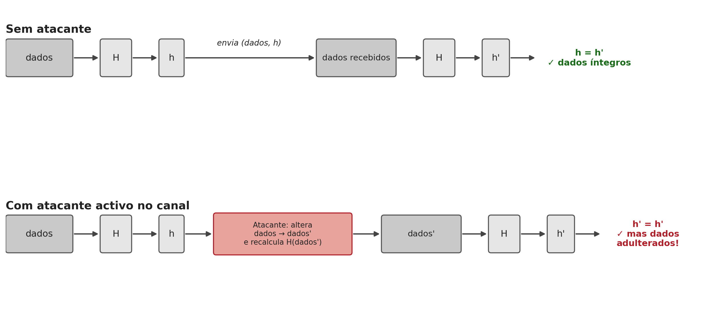
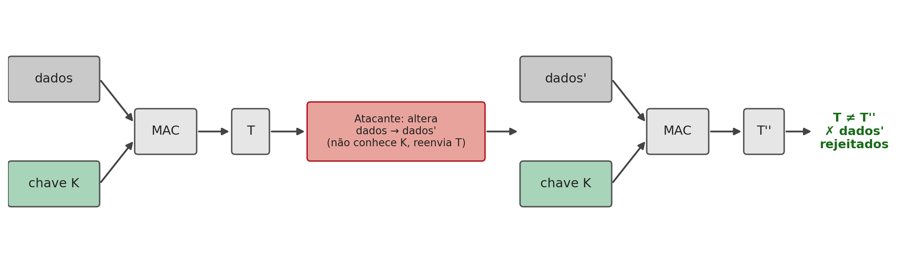
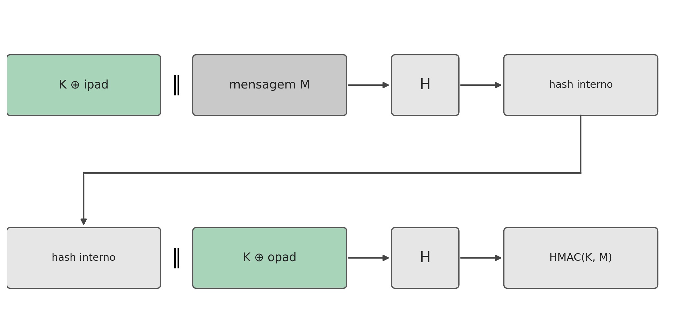

## Introdução {.unnumbered}

Hashing

- Os capítulos anteriores trataram de **confidencialidade**
- Uma mensagem pode viajar cifrada e, ainda assim, ser alterada ou não vir de quem diz vir
- Este capítulo trata da **integridade** e da **autenticação**, e da ferramenta que serve de base a ambas: a **função de hash**

## O Que É uma Função de Hash {.unnumbered}

Hashing

$$h = H(x)$$

- $x$ é a **pré-imagem**; $H$ é a função de hash; $h$ é o **valor de hash** (*digest*)
- **Determinística:** a mesma entrada produz sempre a mesma saída
- **Função de compressão:** entradas de qualquer tamanho produzem uma saída de tamanho fixo (128 a 512 bits)
- Como o domínio é infinito e o contradomínio finito, **têm de existir colisões**: o objetivo é torná-las computacionalmente impossíveis de encontrar deliberadamente

## Propriedades de uma Função de Hash {.unnumbered}

Hashing

- Um **hash fraco** exige apenas: entrada de tamanho variável, saída fixa, eficiência e determinismo
- Um **hash forte**, o único adequado a usos criptográficos, acrescenta:
  - **Resistência a pré-imagem:** dado $h$, é inviável encontrar $y$ tal que $H(y)=h$
  - **Resistência a segunda pré-imagem:** dado $x$, é inviável encontrar $y \neq x$ com $H(y)=H(x)$
  - **Resistência a colisões:** é inviável encontrar qualquer par $(x,y)$ com $H(x)=H(y)$
  - **Pseudoaleatoriedade**

## Segunda Pré-imagem vs. Colisão {.unnumbered}

Hashing

- **Segunda pré-imagem:** o atacante já tem um $x$ específico (por exemplo, um contrato original) e quer encontrar outro $y$ com o mesmo hash
- **Colisão:** o atacante não tem nenhum documento de partida fixo, só quer um par $(x,y)$ qualquer que colida: estruturalmente mais fácil
- **Paradoxo do aniversário:** encontrar uma colisão custa, em média, apenas $2^{n/2}$ tentativas, não $2^n$
- Por isso o tamanho da saída deve ser o dobro do nível de segurança pretendido: 256 bits dá apenas $2^{128}$ de segurança contra colisões

## A Família SHA {.unnumbered}

Hashing

- **MD4/MD5** (Rivest, 1990/1992), 128 bits: Wang e Yu geraram colisões práticas em 2005; hoje só para verificações não adversariais
- **SHA-1** (160 bits, 1995): fragilidades teóricas desde 2005; primeira colisão prática em 2017 (ataque **SHAttered**, Google/CWI Amsterdam); formalmente desaconselhado
- **SHA-2** é a família recomendada: **SHA-256** é hoje a escolha por omissão (TLS, Git, Bitcoin), com variantes até SHA-512

## Verificar a Integridade — e os Seus Limites {.unnumbered}

Hashing

{height="280px"}

- O emissor calcula $h=H(\text{dados})$ e envia os dois; o recetor recalcula e compara
- Detecta erros acidentais, mas **não resiste a um atacante ativo**: $H$ é pública, qualquer pessoa a calcula
- Um atacante que altere os dados recalcula também um hash válido; falta um **segredo partilhado**

## Autenticação de Mensagens: o MAC {.unnumbered}

Hashing

{height="240px"}

$$T = \text{MAC}_K(\text{dados})$$

- Introduz uma chave secreta $K$ no cálculo do resumo: só quem a conhece calcula ou verifica a marca corretamente
- Garante **duas** propriedades: integridade **e** autenticidade
- Exige uma chave previamente combinada, tal como as cifras simétricas

## HMAC: o Problema de Concatenar Ingenuamente {.unnumbered}

Hashing

- **Prefixo, $H(K \Vert M)$:** vulnerável a **ataque de extensão de comprimento**, o valor de hash final é literalmente o estado interno, permitindo continuar o cálculo sem conhecer $K$
- **Sufixo, $H(M \Vert K)$:** evita esse ataque, mas uma colisão encontrada **antes** de $K$ ser processado já basta para forjar uma marca válida
- Ambas as formas óbvias falham por razões diferentes

## HMAC: a Construção {.unnumbered}

Hashing

::: {.columns}
::: {.column width="55%"}
$$\text{HMAC}(K, M) = H\big((K' \oplus \text{opad}) \Vert H((K' \oplus \text{ipad}) \Vert M)\big)$$

- Aplica $H$ **duas vezes**, numa estrutura aninhada com duas chaves derivadas
- Nenhum dos dois ataques anteriores se aplica: o hash exterior nunca expõe o seu estado a partir de dados conhecidos do atacante
- A segurança do HMAC **não depende** da resistência a colisões de $H$: por isso o HMAC-SHA1 continua sem ataques práticos conhecidos
:::
::: {.column width="45%"}
{height="420px"}
:::
:::

## Síntese do Capítulo {.unnumbered}

Síntese

1. Uma **função de hash** comprime qualquer entrada numa saída fixa; colisões existem sempre, o objetivo é dificultar encontrá-las
2. Um hash **forte** exige resistência a pré-imagem, segunda pré-imagem e colisões; esta última cai ao fim de $2^{n/2}$ tentativas
3. A família **SHA** é a referência; MD5 e SHA-1 têm colisões práticas conhecidas e estão desaconselhados
4. Um hash **sem chave** não resiste a um atacante ativo; um **MAC** resolve isto com uma chave secreta partilhada
5. Concatenar ingenuamente a chave (`H(K‖M)` ou `H(M‖K)`) tem problemas conhecidos; o **HMAC** resolve ambos aplicando $H$ duas vezes

## Para Pensar {.unnumbered}

Reflexão

O SHA-1 já não é seguro contra colisões, mas o HMAC-SHA1 continua em uso sem ser considerado uma falha crítica.

::: {.fragment}
Porque é que a quebra da resistência a colisões de uma função de hash não implica automaticamente a quebra do MAC construído sobre ela?
:::
