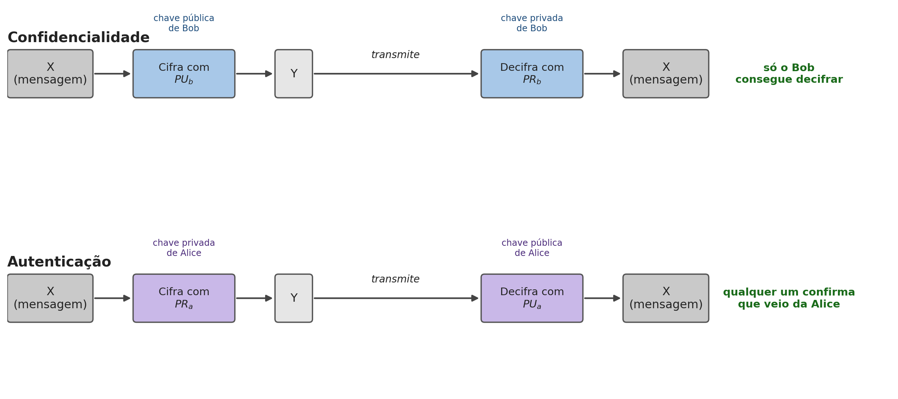
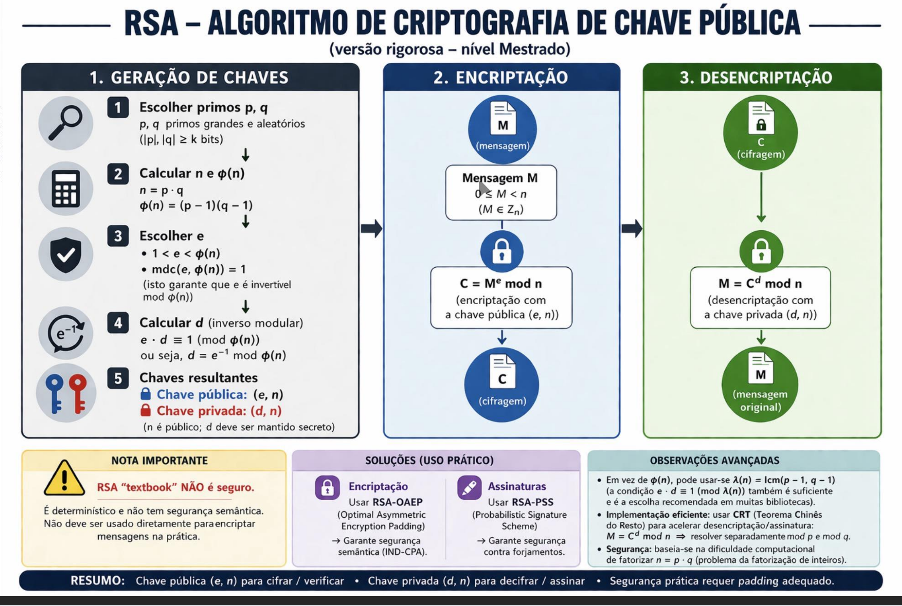
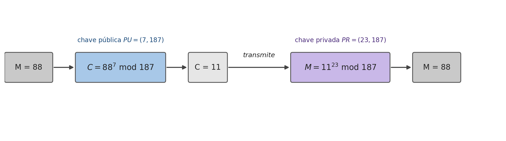

## O Problema da Distribuição de Chaves {.unnumbered}

Criptografia Assimétrica

- Todos os capítulos anteriores exigem uma chave secreta **partilhada previamente** entre emissor e recetor
- Como combinam essa chave dois desconhecidos, que nunca se encontraram e não têm nenhum canal seguro entre si?
- Durante décadas, o **problema da distribuição de chaves** não teve resposta satisfatória

## A Solução: Duas Chaves Relacionadas {.unnumbered}

Criptografia Assimétrica

- Proposta por Diffie e Hellman em 1976, concretizada por Rivest, Shamir e Adleman em 1977 com o RSA
- Cada participante passa a ter **duas chaves matematicamente relacionadas**: uma que divulga livremente, outra que nunca revela a ninguém

## Criptografia Assimétrica: o Conceito {.unnumbered}

Fundamentos

{height="280px"}

- Seis componentes: cifragem, decifragem, texto claro, texto cifrado, **chave pública** ($PU$) e **chave privada** ($PR$)
- O que se cifra com uma das chaves de um par só se decifra com a outra, nunca com a mesma

## Confidencialidade {.unnumbered}

Fundamentos

- Para enviar uma mensagem confidencial a Bob, Alice cifra-a com a **chave pública de Bob** ($PU_b$), que qualquer pessoa conhece

$$Y = E[PU_b, X] \qquad X = D[PR_b, Y]$$

- Só Bob consegue decifrar $Y$, porque só ele tem $PR_b$: Alice nunca precisou de combinar nenhum segredo com Bob antecipadamente

## Autenticação {.unnumbered}

Fundamentos

- Para provar que uma mensagem vem mesmo de Alice, ela cifra-a com a sua própria **chave privada** ($PR_a$)

$$Y = E[PR_a, X] \qquad X = D[PU_a, Y]$$

- Qualquer pessoa decifra $Y$ com a chave pública de Alice: não dá confidencialidade, mas garante que **só Alice** podia ter produzido $Y$

## Combinando os Dois: Confidencialidade e Autenticidade Juntas {.unnumbered}

Fundamentos

- Alice cifra primeiro com a sua própria chave privada (assina), depois cifra o resultado com a chave pública de Bob (confidencialidade):

$$Z = E[PU_b,\, E[PR_a, X]]$$

- Bob inverte as duas operações pela ordem inversa: $X = D[PU_a,\, D[PR_b, Z]]$
- Obtém simultaneamente a certeza de que a mensagem só podia vir de Alice, e a garantia de que mais ninguém a leu pelo caminho

## Categorias e Aplicações {.unnumbered}

Fundamentos

| Algoritmo | Encriptação | Assinatura | Troca de Chaves |
|---|---|---|---|
| RSA | Sim | Sim | Sim |
| Curva Elíptica | Sim | Sim | Sim |
| Diffie-Hellman | Não | Não | Sim |
| DSS | Não | Sim | Não |

Só o RSA e a curva elíptica servem os três papéis em simultâneo

## RSA: Escolher os Primos {.unnumbered}

RSA

{height="300px"}

1. Escolhem-se dois números primos grandes e aleatórios, $p$ e $q$
2. Calcula-se $n = p \cdot q$ (o **módulo**, público) e $\phi(n) = (p-1)(q-1)$ (secreto)

## RSA: Escolher $e$ e Calcular $d$ {.unnumbered}

RSA

3. Escolhe-se $e$ tal que $1<e<\phi(n)$ e $\text{mdc}(e,\phi(n))=1$
4. Calcula-se $d$, o inverso modular de $e$: $d \cdot e \equiv 1 \pmod{\phi(n)}$
5. **Chave pública:** $(e,n)$; **chave privada:** $(d,n)$ — $p$, $q$, $\phi(n)$ e $d$ nunca são revelados

## RSA: Cifragem e Decifragem {.unnumbered}

RSA

$$C = M^e \bmod n \qquad M = C^d \bmod n = M^{e \cdot d} \bmod n$$

- Funciona porque $e$ e $d$ são **inversos multiplicativos módulo $\phi(n)$**
- Elevar a $e$ e depois a $d$ (ou vice-versa) devolve sempre o valor original

## Porque Funciona: Inversos Modulares {.unnumbered}

RSA

- Tal como, na aritmética normal, $3$ e $\frac{1}{3}$ são inversos porque $3 \times \frac{1}{3} = 1$
- $e$ e $d$ foram escolhidos para serem inversos módulo $\phi(n)$: $e \cdot d \equiv 1 \bmod \phi(n)$
- É essa relação que garante que cifrar e depois decifrar devolve sempre a mensagem original

## RSA: Gerar as Chaves do Exemplo {.unnumbered}

RSA

- $p=17$, $q=11$ (números pequenos, só para ilustrar o mecanismo)
- $n = 17 \times 11 = 187$; $\phi(n) = 16 \times 10 = 160$
- $e=7$ (coprimo com 160); $d=23$, porque $(23 \times 7) \bmod 160 = 1$
- Chave pública $=\{7,187\}$; chave privada $=\{23,187\}$

## RSA: Cifrar e Decifrar o Exemplo {.unnumbered}

RSA

{height="260px"}

- Para enviar $M=88$: $C = 88^7 \bmod 187 = 11$
- Para recuperar: $M = 11^{23} \bmod 187 = 88$

## Segurança: Porque a Factorização Importa {.unnumbered}

RSA

- Com $n=187$ (8 bits), factorizar de volta em 17 e 11 é trivial: anula a segurança
- Na prática recomenda-se $n$ com pelo menos **2048 a 4096 bits**
- Toda a segurança do RSA depende do **problema da factorização de inteiros**

## Porque o RSA Precisa de Chaves Tão Grandes {.unnumbered}

RSA

- O melhor algoritmo conhecido de factorização, o *general number field sieve* (GNFS), tem complexidade **subexponencial**: mais rápido que a força bruta ($2^n$), mas não polinomial
- Este atalho obriga o RSA a compensar com chaves muito maiores do que uma cifra simétrica
- Um módulo de **3072 bits** é necessário para atingir o mesmo nível de segurança prático de uma chave simétrica de apenas **128 bits**

## RSA "Textbook": Porque Não Basta {.unnumbered}

RSA

- Usar o RSA exatamente como descrito, o chamado **RSA "textbook"**, não é seguro
- É **determinístico**: a mesma mensagem produz sempre o mesmo texto cifrado, permitindo a um atacante reconhecer mensagens repetidas
- Não oferece **segurança semântica**: nenhuma biblioteca criptográfica séria implementa o RSA cru

## RSA-OAEP e RSA-PSS {.unnumbered}

RSA

- **Encriptação:** usa-se **RSA-OAEP** (*Optimal Asymmetric Encryption Padding*), que introduz aleatoriedade antes de cifrar: a mesma mensagem nunca produz o mesmo texto cifrado duas vezes
- **Assinaturas:** usa-se **RSA-PSS** (*Probabilistic Signature Scheme*), que garante segurança contra falsificação de assinaturas

## RSA: Otimizações de Desempenho {.unnumbered}

RSA

- Substituir $\phi(n)$ por $\lambda(n) = \text{mmc}(p-1,q-1)$: a condição $e \cdot d \equiv 1 \bmod \lambda(n)$ também é suficiente, e produz um $d$ tipicamente mais pequeno
- **Teorema Chinês do Resto:** resolve $M = C^d \bmod n$ separadamente módulo $p$ e módulo $q$, combinando os resultados — várias vezes mais rápido que a exponenciação direta

## Síntese do Capítulo {.unnumbered}

Síntese

1. A **criptografia assimétrica** resolve a distribuição de chaves: chave pública livremente distribuída, chave privada nunca partilhada
2. Cifrar com a **chave pública** do destinatário garante confidencialidade; com a **chave privada** do próprio, autenticação
3. Só o RSA e a curva elíptica servem encriptação, assinatura e troca de chaves em simultâneo
4. O **RSA** gera as chaves a partir de dois primos $p$, $q$; cifra e decifra por exponenciação modular
5. A segurança depende da dificuldade de **factorizar** $n$; a norma exige 2048 a 4096 bits
6. O RSA "textbook" não é seguro: usos reais exigem **RSA-OAEP** e **RSA-PSS**

## Para Pensar {.unnumbered}

Reflexão

O expoente público $e$ é normalmente um número pequeno e fixo ($e=65537$ é o mais comum), reutilizado em milhões de chaves diferentes, sem comprometer a segurança de nenhuma.

::: {.fragment}
Tendo em conta de onde vem toda a segurança do RSA, porque é que aumentar o tamanho de $e$, mantendo $n$ pequeno, não tornaria o exemplo anterior mais seguro?
:::
