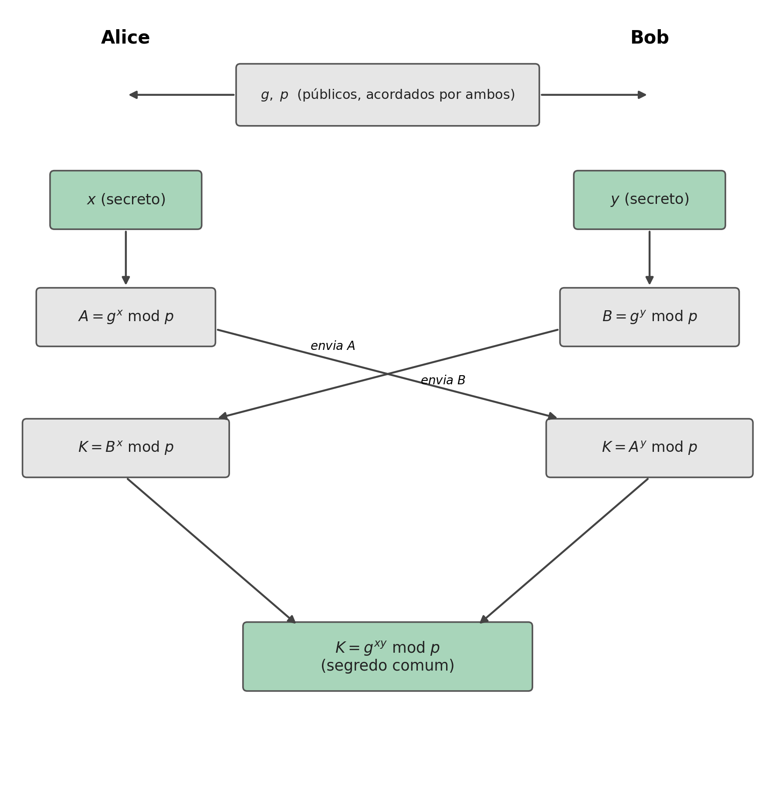
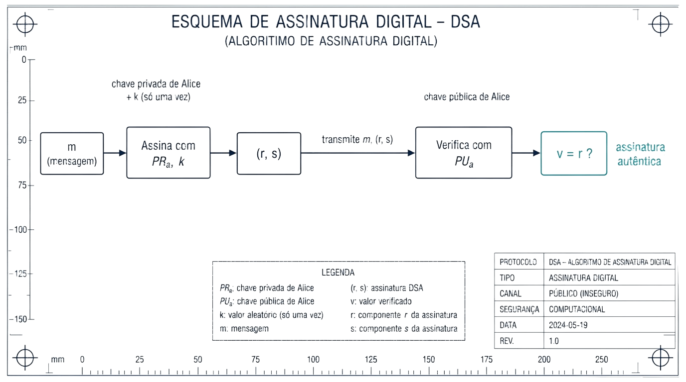

## O Problema da Chave Partilhada {.unnumbered}

Diffie-Hellman e Assinaturas

- O capítulo anterior resolveu confidencialidade e autenticação assumindo que cada participante já tem um par de chaves RSA
- Como combinar uma **chave simétrica partilhada** entre duas pessoas que nunca se encontraram, sem a expor a quem intercete a comunicação?

## O Problema da Prova de Autoria {.unnumbered}

Diffie-Hellman e Assinaturas

- Como provar, de forma verificável por qualquer pessoa, que um documento foi mesmo produzido por quem diz tê-lo produzido, sem possibilidade de negação posterior?
- É o problema das **assinaturas digitais**

## Diffie-Hellman: o Conceito {.unnumbered}

Diffie-Hellman

- Método para combinar em segurança uma chave partilhada, destinada a uma cifra **simétrica**, mesmo através de um canal completamente aberto e observado por terceiros
- É um sistema de chave pública, embora não sirva para encriptação nem para assinatura

## O Problema Matemático: Logaritmos Discretos {.unnumbered}

Diffie-Hellman

- Para $A=g^x$, encontrar $x$ a partir de $A$ e $g$ é trivial: basta calcular $\log_g A$
- Mas com $g^x \bmod n$, e $g$ e $n$ suficientemente grandes, esse cálculo deixa de ser viável, mesmo para um computador poderoso
- **Problema do logaritmo discreto:** é nele que assenta toda a segurança do método

## Porque o Módulo Tem de Ser Grande {.unnumbered}

Diffie-Hellman

- Tal como a factorização de que depende o RSA, o logaritmo discreto módulo um primo também admite um ataque mais rápido que a força bruta: uma variante do *general number field sieve*, em tempo **subexponencial**
- Por isso o módulo $p$ precisa de, pelo menos, **2048 a 3072 bits** para um nível de segurança prático razoável

## O Algoritmo Diffie-Hellman {.unnumbered}

Diffie-Hellman

{height="300px"}

- Alice e Bob combinam publicamente $g$ e $p$; cada um escolhe um segredo, $x$ (Alice) e $y$ (Bob), nunca revelado
- Trocam $A=g^x \bmod p$ e $B=g^y \bmod p$, em claro

$$K = B^x \bmod p = g^{xy} \bmod p = A^y \bmod p$$

## Porque um Atacante Não Consegue Recuperar K {.unnumbered}

Diffie-Hellman

- Um atacante que intercete $g$, $p$, $A$ e $B$ (tudo o que é trocado em claro) teria de resolver o problema do logaritmo discreto para recuperar $x$ ou $y$
- Esse cálculo é exatamente o que já se identificou como computacionalmente inviável para valores suficientemente grandes
- $x$, $y$ e o próprio $K$ nunca atravessam o canal

## Assinaturas Digitais: Cifrar o Hash {.unnumbered}

Assinaturas Digitais

- Cifrar com a **chave privada** do emissor, verificável por qualquer pessoa com a chave pública
- Na prática, cifra-se o **hash** da mensagem, não a mensagem inteira (muito mais rápido): por exemplo, usar o RSA para cifrar $H(m)$

## O DSA: um Algoritmo Dedicado {.unnumbered}

Assinaturas Digitais

- Existe também um algoritmo desenhado especificamente para este propósito, sem servir para encriptação: o **DSA** (*Digital Signature Algorithm*)
- Tal como o Diffie-Hellman, baseia-se no problema do logaritmo discreto
- Garante três propriedades em simultâneo: **autenticação**, **integridade** e **não repúdio**

## DSA: Escolher os Parâmetros Públicos {.unnumbered}

DSA

1. Escolher uma função de hash aprovada $H$ (por exemplo, SHA-512)
2. Escolher $(L,N)$: pares normalizados $(1024,160)$, $(2048,224)$, $(2048,256)$ ou $(3072,256)$
3. Escolher $q$ (primo de $N$ bits) e $p$ (primo de $L$ bits, com $p-1$ múltiplo de $q$)
4. Calcular $g = h^{(p-1)/q} \bmod p$

## DSA: Gerar o Par de Chaves {.unnumbered}

DSA

- $p$, $q$ e $g$ são **partilhados publicamente**, tal como o $g$ e o $p$ do Diffie-Hellman
- **Chave privada:** um número aleatório $x$, entre $1$ e $q-1$
- **Chave pública:** $y = g^x \bmod p$
- O mesmo par $(x,y)$ pode ser reutilizado para qualquer número de assinaturas

## DSA: Assinar {.unnumbered}

DSA

{height="280px"}

- Escolhe-se $k$, **efémero**: secreto e usado uma única vez, pela mesma razão que uma cifra de fluxo nunca reutiliza o par (chave, *nonce*)

$$r = (g^k \bmod p) \bmod q \qquad s = k^{-1}(H(m) + xr) \bmod q$$

## DSA: Verificar {.unnumbered}

DSA

O recetor conhece $p$, $q$, $g$ e a chave pública $y$, e recebe $m$ e $(r,s)$:

1. Confirma que $r$ e $s$ são positivos e menores que $q$
2. Calcula $w = s^{-1} \bmod q$
3. Calcula $u_1 = H(m) \cdot w \bmod q$ e $u_2 = r \cdot w \bmod q$
4. Calcula $v = (g^{u_1} y^{u_2} \bmod p) \bmod q$
5. Se $v = r$, a assinatura é válida

## Um Problema em Aberto: Confiar na Chave Pública {.unnumbered}

Confiança

- Bob verifica a assinatura de Alice com a chave pública dela: mas como sabe que essa chave é mesmo de Alice?
- O problema é geral e afeta qualquer troca de chaves públicas feita sem mais garantias, incluindo o próprio Diffie-Hellman

## O Ataque do Intermediário (MITM) {.unnumbered}

Confiança

- Um atacante posicionado em qualquer ponto da rede entre Alice e Bob (por exemplo, num router comprometido) pode intercetar $g$, $p$ e os valores trocados
- Substitui-se a cada uma das partes perante a outra: cada lado recebe valores que parecem legítimos, mas foram gerados pelo atacante
- A vítima nunca percebe: quebra qualquer algoritmo de chave pública sem forma de confirmar, de forma independente, a quem pertence uma chave

## Síntese do Capítulo {.unnumbered}

Síntese

1. O **Diffie-Hellman** combina uma chave secreta comum através de um canal aberto, sem nunca a transmitir
2. A sua segurança assenta no **problema do logaritmo discreto**
3. Cada parte troca um valor público calculado a partir de um segredo nunca revelado; ambas chegam ao mesmo $K=g^{xy} \bmod p$
4. Uma **assinatura digital** cifra o hash de uma mensagem com a chave privada do autor, com RSA ou com um algoritmo dedicado, o **DSA**
5. O DSA assina com $x$ e um valor efémero $k$, usado uma única vez
6. Nenhum dos dois resolve, sozinho, o problema de **confiar** numa chave pública: sem isso, o MITM continua possível

## Para Pensar: o Perigo de Reutilizar k {.unnumbered}

Reflexão

No DSA, reutilizar o mesmo $k$ em duas assinaturas produz o mesmo $r$ (depende só de $k$)

- Um atacante fica com duas equações, $s_1 = k^{-1}(H(m_1)+xr) \bmod q$ e $s_2 = k^{-1}(H(m_2)+xr) \bmod q$, e duas incógnitas, $k$ e $x$

::: {.fragment}
Que operação simples entre estas duas equações elimina $k$ e permite isolar diretamente a chave privada $x$?
:::

## Resolvendo: Isolar k por Subtração {.unnumbered}

Reflexão

- Subtrair as duas equações cancela o termo $xr$, comum a ambas (mesmo $r$, mesma chave $x$):

$$s_1 - s_2 = k^{-1}\big(H(m_1)-H(m_2)\big) \bmod q$$

- Isola-se $k$:

$$k = \big(H(m_1)-H(m_2)\big)(s_1-s_2)^{-1} \bmod q$$

## Resolvendo: Isolar a Chave Privada x {.unnumbered}

Reflexão

- Com $k$ recuperado, basta substituir numa das equações originais:

$$x = (s_1 k - H(m_1))\, r^{-1} \bmod q$$

- Duas assinaturas com o mesmo $k$ bastam para recuperar a chave privada por completo

## O Caso Real: a PS3 e o fail0verflow {.unnumbered}

Reflexão

- Este não é um ataque só teórico: foi exatamente desta forma que a Sony perdeu, em 2010, a chave privada de assinatura de código da PlayStation 3
- A implementação da Sony usava sempre o mesmo valor de $k$, em vez de gerar um novo, aleatório, para cada assinatura
- O grupo *fail0verflow*, seguido por George Hotz, explorou esta reutilização para recuperar a chave privada, permitindo assinar e executar código não autorizado em qualquer PS3
