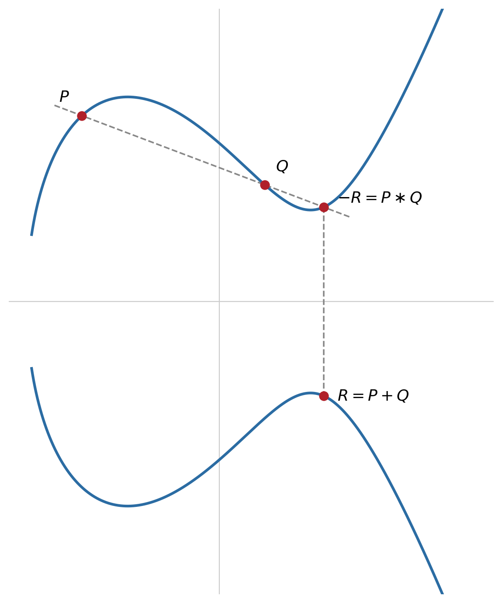

## RSA e Diffie-Hellman: os Limites Atuais {.unnumbered}

Curva Elíptica

- RSA e Diffie-Hellman assentam em problemas com ataques **subexponenciais** (factorização, logaritmo discreto módulo um primo)
- Isto obriga a chaves cada vez maiores à medida que o poder de computação cresce: hoje tipicamente 2048 a 4096 bits

## A Alternativa: Curvas Elípticas {.unnumbered}

Curva Elíptica

- A **criptografia de curva elíptica (ECC)**, proposta por Koblitz e Miller, resolve o mesmo tipo de problema (troca de chaves e assinatura) assente num problema matemático diferente
- Não é conhecido nenhum ataque subexponencial contra ele
- Resultado: segurança equivalente com chaves ordens de grandeza mais pequenas, decisivo em dispositivos com poucos recursos (telemóveis, cartões inteligentes, IoT)

## Curvas Elípticas sobre Corpos Finitos {.unnumbered}

Fundamentos

$$y^2 = x^3 + ax + b$$

- $a$ e $b$ definem a curva, com $4a^3+27b^2 \neq 0$ (sem singularidades)
- Para uso criptográfico, resolve-se sobre um **corpo finito** $\mathbb{Z}_p$: $x$ e $y$ são inteiros entre 0 e $p-1$, toda a aritmética é módulo $p$
- Junta-se um elemento especial, o **ponto no infinito** $\mathcal{O}$, que funciona como elemento neutro

## A Soma de Pontos: Geometricamente {.unnumbered}

Fundamentos

{height="320px"}

- Traça-se a reta que passa por $P$ e $Q$; interseta a curva num terceiro ponto; refletindo-o obtém-se $R=P+Q$
- Os pontos de uma curva elíptica, com esta soma, formam um **grupo abeliano**

## A Soma de Pontos: as Fórmulas {.unnumbered}

Fundamentos

Para $P=(x_1,y_1)$ e $Q=(x_2,y_2)$, com $P \neq Q$:

$$\lambda = \frac{y_2-y_1}{x_2-x_1} \pmod p$$

$$x_3 = \lambda^2 - x_1 - x_2 \pmod p \qquad y_3 = \lambda(x_1-x_3) - y_1 \pmod p$$

## Duplicar um Ponto {.unnumbered}

Fundamentos

- Para somar um ponto a si próprio, usa-se o declive da tangente à curva em $P$:

$$\lambda = \frac{3x_1^2+a}{2y_1} \pmod p$$

- As mesmas fórmulas de $x_3$ e $y_3$ da soma normal aplicam-se depois

## O Ponto no Infinito e o Simétrico {.unnumbered}

Fundamentos

- O ponto no infinito $\mathcal{O}$ comporta-se como o zero desta soma: $P+\mathcal{O}=P$
- O simétrico de $P=(x_1,y_1)$ é $-P=(x_1,-y_1)$, com $P+(-P)=\mathcal{O}$

## Porque Importa Ser um Grupo Abeliano {.unnumbered}

Fundamentos

- Fechado, associativo, com elemento neutro ($\mathcal{O}$), inverso e **comutativo**
- A comutatividade garante diretamente a igualdade central do ECDH: $d_A(d_B G) = d_B(d_A G)$
- A associatividade permite calcular $kP$ eficientemente por duplicações sucessivas

## Multiplicação Escalar {.unnumbered}

Segurança

- A operação fundamental é a **multiplicação escalar:** $kP = P+P+\dots+P$ ($k$ vezes)
- Tal como a exponenciação modular, calcula-se eficientemente por duplicações e somas sucessivas, em cerca de $\log_2 k$ operações

## O Problema do Logaritmo Discreto em Curvas Elípticas {.unnumbered}

Segurança

- A segurança de toda a construção assenta no **ECDLP** (*Elliptic Curve Discrete Logarithm Problem*): dados $P$ e $Q=kP$, recuperar $k$
- No sentido inverso não há nenhum equivalente de "dividir": um grupo só garante soma e inverso aditivo, nunca divisão entre elementos

## Porque é Difícil Inverter {.unnumbered}

Segurança

- Não há nenhuma manipulação algébrica direta capaz de "desfazer" $kP$ e devolver $k$, ao contrário do que aconteceria ao inverter uma multiplicação normal
- Um atacante fica reduzido a métodos de **pesquisa dentro do grupo**

## O Algoritmo Rho de Pollard {.unnumbered}

Segurança

- O melhor ataque genérico conhecido contra o ECDLP, com complexidade $O(\sqrt{n})$, sendo $n$ a ordem do grupo de pontos
- Mecanismo: gera sequências de pontos a partir de $P$ e de $Q$, numa pesquisa aleatória inteligente à procura de uma colisão entre elas
- Encontrada a colisão, é possível resolver as equações e recuperar $k$

## O Cálculo de Índice: Porque Não Se Aplica ao ECC {.unnumbered}

Segurança

- O **cálculo de índice** quebra a factorização e o logaritmo discreto módulo um primo em tempo subexponencial, explorando a decomposição de inteiros em fatores primos pequenos
- Os pontos de uma curva elíptica **não têm** nenhuma noção equivalente: não existe uma "base de pontos primos" natural em que expressar $P$ e $Q$
- É esta ausência de estrutura extra que deixa o atacante sem alternativa melhor do que a pesquisa genérica $O(\sqrt{n})$

## Comparação de Tamanhos de Chave {.unnumbered}

Segurança

| Nível de segurança (bits) | RSA / Diffie-Hellman | ECC |
|---|---|---|
| 80 | 1024 | 160 |
| 112 | 2048 | 224 |
| 128 | 3072 | 256 |
| 192 | 7680 | 384 |
| 256 | 15360 | 521 |

Para 256 bits de segurança, o RSA exigiria uma chave 30 vezes maior do que a ECC

## Porque Isto Importa na Prática {.unnumbered}

Segurança

- Chaves mais pequenas significam menos dados a transmitir e armazenar
- Operações de assinatura e troca de chaves significativamente mais rápidas
- Vantagem decisiva em ligações TLS de alto débito ou em dispositivos com pouca capacidade de computação

## ECDH: Diffie-Hellman em Curva Elíptica {.unnumbered}

ECDH

- Mesma lógica do Diffie-Hellman clássico, substituindo exponenciação modular por multiplicação escalar de pontos
- Alice escolhe $d_A$, calcula $Q_A=d_A \cdot G$; Bob escolhe $d_B$, calcula $Q_B=d_B \cdot G$

$$K = d_A \cdot Q_B = (d_A d_B) \cdot G = d_B \cdot Q_A$$

- A dificuldade de recuperar $d_A$ ou $d_B$ a partir de $Q_A$, $Q_B$ e $G$ é o ECDLP

## ECDSA: a Versão em Curva Elíptica do DSA {.unnumbered}

ECDSA

- Equivalente em curva elíptica do DSA: a assinatura continua a ser um par $(r,s)$
- Calculado a partir de uma chave privada e de um valor efémero de utilização única
- $r$ deriva agora da coordenada $x$ de um múltiplo escalar de $G$, em vez de uma exponenciação modular

## Curvas Usadas na Prática: P-256 e Curve25519 {.unnumbered}

ECDSA

- **P-256** (*secp256r1*), normalizada pelo NIST: a mais usada em certificados TLS e assinaturas ECDSA
- **Curve25519**, de Daniel J. Bernstein (o mesmo autor do Salsa20, ChaCha20 e Poly1305): construída para evitar classes inteiras de erros de implementação
- Curva de referência para troca de chaves (**X25519**) no TLS 1.3, Signal e SSH

## Síntese do Capítulo {.unnumbered}

Síntese

1. Uma **curva elíptica** é o conjunto de pontos que satisfazem $y^2=x^3+ax+b$ sobre $\mathbb{Z}_p$, mais o ponto no infinito
2. Os seus pontos formam um **grupo abeliano** sob uma soma definida geometricamente
3. A segurança assenta no **ECDLP**: o melhor ataque genérico é $O(\sqrt{n})$, sem atalho subexponencial conhecido
4. A ECC atinge o mesmo nível de segurança do RSA/DH com chaves muito mais pequenas
5. **ECDH** e **ECDSA** replicam o Diffie-Hellman e o DSA com multiplicação escalar de pontos
6. Na prática predominam a **P-256** e a **Curve25519**

## Para Pensar {.unnumbered}

Reflexão

O melhor ataque genérico conhecido contra o ECDLP tem complexidade $O(\sqrt{n})$, em que $n$ é a ordem do grupo de pontos.

::: {.fragment}
Porque é que uma curva com pontos de ordem $n \approx 2^{256}$ corresponde a um nível de segurança de 128 bits, e não de 256?
:::
