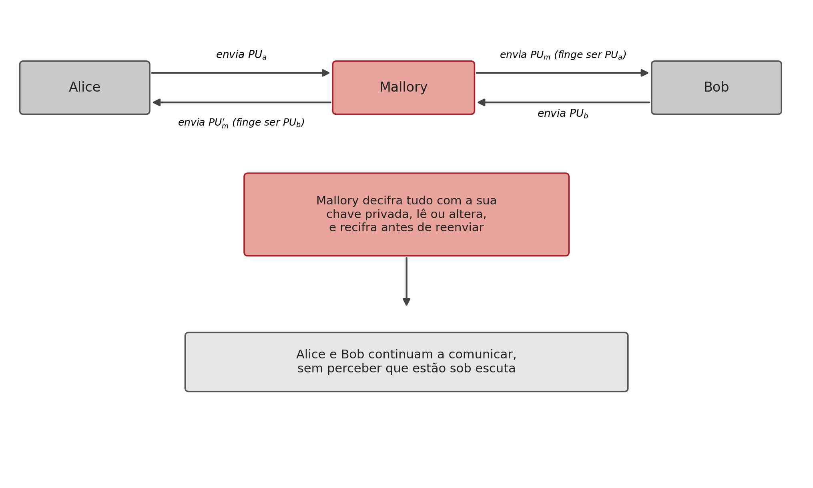
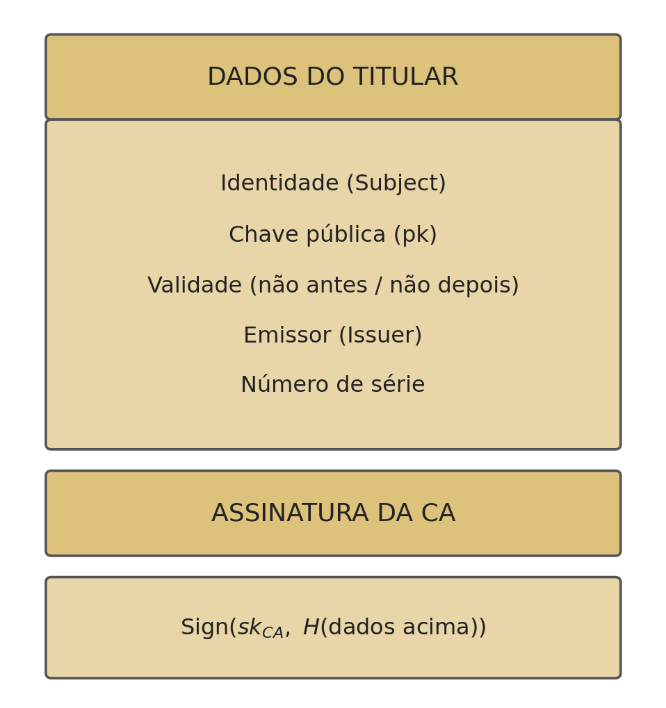
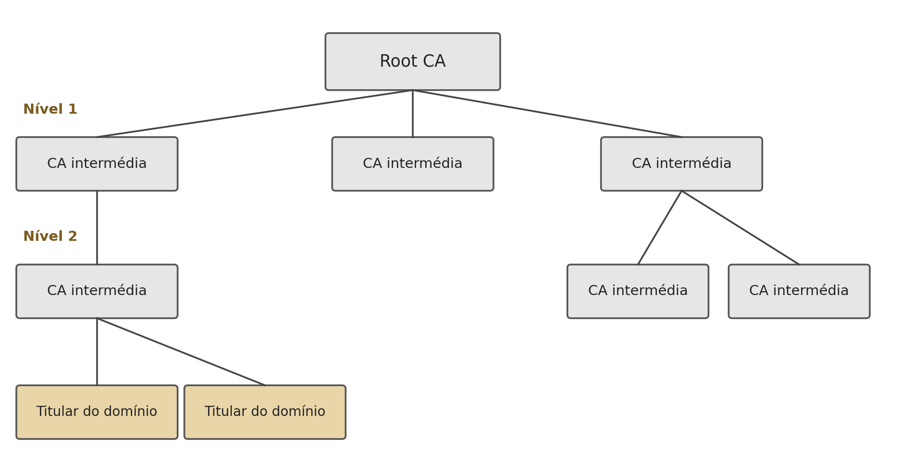

## O Problema Deixado em Aberto {.unnumbered}

<span class="eyebrow">PKI</span>

- Como sabe alguém que uma chave pública pertence mesmo a quem diz pertencer?
- Sem resposta, todo o edifício da criptografia assimétrica, confidencialidade, autenticação, assinaturas, Diffie-Hellman, fica exposto a um único tipo de ataque

## O Que Este Capítulo Resolve {.unnumbered}

<span class="eyebrow">PKI</span>

- Examina esse ataque em detalhe
- E a solução de engenharia que se tornou o padrão da indústria: a **infraestrutura de chave pública**

## O Ataque do Intermediário: o Mecanismo {.unnumbered}

<span class="eyebrow">MITM</span>

{height="300px"}

- Um atacante posicionado em qualquer ponto da rede entre as duas partes (por exemplo, num router comprometido) intercepta e substitui as chaves públicas trocadas
- Nenhuma das vítimas se apercebe

## Porque uma Chave Pública Não Tem Identidade Própria {.unnumbered}

<span class="eyebrow">MITM</span>

- Uma chave pública é apenas um número; um número não tem identidade própria
- Quando Alice recebe algo que parece ser a chave pública de Bob, não tem, por si só, nenhuma forma de confirmar essa origem
- Quebra **qualquer** algoritmo de chave pública: não é uma fraqueza específica do RSA, do Diffie-Hellman ou do DSA

## MITM contra o Diffie-Hellman: Duas Trocas Falsas {.unnumbered}

<span class="eyebrow">MITM</span>

- Mallory estabelece **duas** trocas de chave distintas: uma com Alice, outra com Bob
- Passa a decifrar e recifrar cada mensagem trocada entre eles
- Nenhum dos dois consegue detetar que a chave "comum" que pensam partilhar é, na verdade, partilhada com Mallory de ambos os lados

## A Solução: uma Entidade de Confiança {.unnumbered}

<span class="eyebrow">PKI</span>

- Introduzir uma **entidade de confiança**, reconhecida antecipadamente por ambas as partes
- Que testemunhe a ligação entre uma identidade e uma chave pública
- Se Alice e Bob confiarem na mesma entidade, cada um pode perguntar-lhe "esta chave pertence mesmo à outra parte?", sem passar pelo canal comprometido

## O Que É uma Infraestrutura de Chave Pública {.unnumbered}

<span class="eyebrow">PKI</span>

- Uma **PKI** (*Public Key Infrastructure*) é um conjunto de entidades, processos e normas que ligam formalmente identidades a chaves públicas, através de **certificados digitais**
- Um certificado é um objeto assinado, verificável de forma independente e reutilizável por qualquer parte que confie na entidade que o emitiu

## O Certificado X.509: os Campos {.unnumbered}

<span class="eyebrow">PKI</span>

{height="280px"}

- **Identidade** (*Subject*): a quem pertence o certificado
- **Chave pública**: a chave que o certificado atesta pertencer a essa identidade
- **Validade**: intervalo de datas fora do qual o certificado deixa de ser válido
- **Emissor** (*Issuer*) e **número de série**: identificam quem certificou e o próprio certificado

## A Assinatura da CA {.unnumbered}

<span class="eyebrow">PKI</span>

- A **entidade certificadora** (*Certificate Authority*, CA) assina, com a sua própria chave privada, o hash de todos os campos anteriores:

$$\mathrm{Sign}(sk_{CA}, H(\text{dados do titular}))$$

- É esta assinatura que transforma os dados de identificação numa afirmação verificável: qualquer pessoa com a chave pública da CA confirma que foi mesmo aquela CA a certificar aquela ligação

## A Cadeia de Certificação: Como Funciona {.unnumbered}

<span class="eyebrow">PKI</span>

{height="300px"}

- A confiança organiza-se numa **cadeia**: cada certificado é assinado por outro
- Até chegar a uma **CA raiz** (*Root CA*), cuja chave pública vem pré-instalada no sistema operativo ou no navegador

## Porque Não Certificar Diretamente {.unnumbered}

<span class="eyebrow">PKI</span>

- Um único par de chaves de CA a certificar diretamente cada site da Internet seria impraticável e frágil
- Um único ponto de compromisso comprometeria tudo

## Confiar na Raiz Basta {.unnumbered}

<span class="eyebrow">PKI</span>

- Confiar apenas num número relativamente pequeno de CAs raiz, cuidadosamente auditadas, é suficiente
- Basta para validar qualquer certificado emitido em qualquer ponto da cadeia, por mais intermediários que existam entre a raiz e o titular final

## Verificação: Identificar a CA e Confirmar a Assinatura {.unnumbered}

<span class="eyebrow">PKI</span>

1. Lê o campo **Emissor** do certificado, identificando qual CA o assinou
2. Obtém a chave pública dessa CA (a partir do certificado da própria CA, já conhecido, ou seguindo a cadeia até uma raiz confiada)
3. Verifica a assinatura: $\mathrm{Verify}(pk_{CA}, \text{dados do certificado}, \text{assinatura}_{CA})$

## Verificação: Validade e Uso Permitido {.unnumbered}

<span class="eyebrow">PKI</span>

- Se a assinatura for válida, a chave pública está confirmada como genuína
- Verifica-se ainda o **período de validade** do certificado
- E o **uso permitido**: para que fins aquele certificado foi emitido

## CRL: a Lista de Revogação {.unnumbered}

<span class="eyebrow">PKI</span>

- *Certificate Revocation List*: uma lista, publicada periodicamente pela CA, com os números de série de todos os certificados revogados antes do fim da validade
- O verificador descarrega a lista e confirma que o número de série do certificado não consta dela

## OCSP: Verificação em Tempo Real {.unnumbered}

<span class="eyebrow">PKI</span>

- *Online Certificate Status Protocol*: em vez de descarregar uma lista inteira, o verificador pergunta diretamente à CA, em tempo real, "este certificado ainda é válido?"
- Só depois de todos estes passos passarem é que se tem uma garantia fundamentada de que a chave pública recebida é mesmo genuína

## Na Prática: Obter o Certificado {.unnumbered}

<span class="eyebrow">PKI</span>

```bash
$ openssl s_client -showcerts -connect www.exemplo.com:443 >> cert.pem
```

Estabelece uma ligação TLS e regista a cadeia de certificados enviada pelo servidor

## Na Prática: Ler o Certificado {.unnumbered}

<span class="eyebrow">PKI</span>

```bash
$ openssl x509 -in cert.pem -text -noout
```

Apresenta, em texto legível, o titular, o emissor, o período de validade e o algoritmo de assinatura usado

## Síntese do Capítulo {.unnumbered}

<span class="eyebrow">Síntese</span>

1. O **ataque do intermediário (MITM)** quebra qualquer algoritmo de chave pública
2. A solução é introduzir uma **entidade de confiança** partilhada
3. Um **certificado X.509** liga uma identidade a uma chave pública, assinado por um emissor
4. A confiança organiza-se numa **cadeia de certificação**, da CA raiz até ao titular final
5. Verificar um certificado exige confirmar a assinatura, a validade **e** o estado de revogação

## Para Pensar {.unnumbered}

<span class="eyebrow">Reflexão</span>

A cadeia de certificação resolve o problema de confiar numa chave pública introduzindo confiança numa CA raiz pré-instalada.

::: {.fragment}
Isto desloca o problema original para um problema ligeiramente diferente. Qual é esse novo problema, e porque é que confiar numa dezena de CAs raiz é mais praticável do que pedir a cada utilizador que confirme manualmente a chave pública de cada site?
:::
