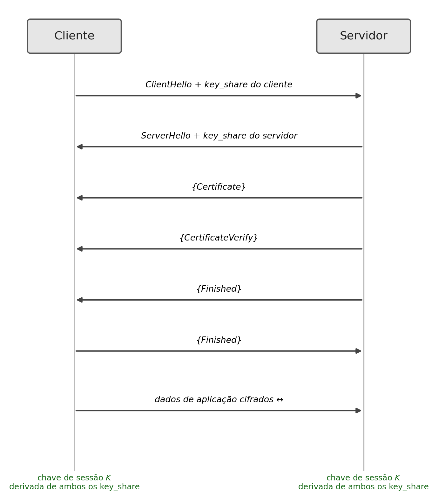
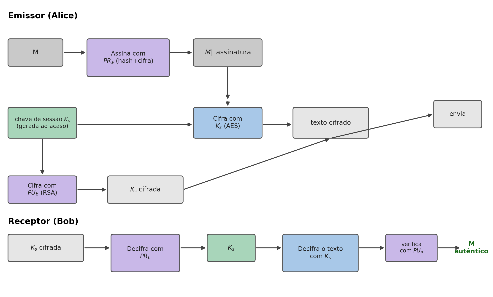

## Introdução {.unnumbered}

TLS e PGP

- Como se combinam as ferramentas do livro (cifras simétricas, hash, MACs, RSA, Diffie-Hellman, curva elíptica, certificados) em protocolos reais?
- O **TLS**, que protege praticamente todo o tráfego web
- O **PGP**, um dos primeiros sistemas de criptografia de utilização generalizada para correio eletrónico

## TLS: Objetivos e Camadas {.unnumbered}

TLS

- Protege uma ligação em três frentes: **confidencialidade**, **integridade** e **autenticação** (pelo menos do servidor, via certificado X.509)
- **Protocolo de acordo (*handshake*):** negoceia os parâmetros da sessão e estabelece uma chave partilhada
- **Protocolo de registo:** usa essa chave para cifrar e autenticar o tráfego, com uma construção AEAD (AES-GCM ou ChaCha20-Poly1305)

## O Handshake do TLS 1.3 {.unnumbered}

TLS

{height="380px"}

- Reduzido a uma única volta de ida e volta (**1-RTT**) na generalidade dos casos
- `ClientHello`/`ServerHello` já trocam um *key_share* (tipicamente ECDH sobre Curve25519)
- O servidor prova a sua identidade com um certificado X.509 e uma assinatura sobre o histórico do *handshake*

## Sigilo Perspetivo {.unnumbered}

TLS

- O *key_share* de cada lado é gerado **efemeramente**, em cada *handshake*, e nunca reutilizado
- Esta propriedade chama-se **sigilo perspetivo** (*forward secrecy*)
- Comprometer a chave privada de longo prazo do servidor permite fazer-se passar por ele no futuro, mas **não** decifrar sessões passadas já terminadas

## Cifras Modernas em TLS {.unnumbered}

TLS

- `TLS_AES_128_GCM_SHA256`: AES-GCM com SHA-256, beneficia de aceleração de hardware (AES-NI)
- `TLS_CHACHA20_POLY1305_SHA256`: preferido em dispositivos sem aceleração de hardware para AES, como muitos telemóveis

## PGP: Cifra Híbrida para Correio Eletrónico {.unnumbered}

PGP

{height="280px"}

- Protege mensagens assíncronas, entre emissor e destinatário cujas chaves públicas já são conhecidas
- A mensagem é **assinada** com a chave privada do emissor e **cifrada** com uma chave de sessão gerada ao acaso, usada uma única vez
- Essa chave de sessão é cifrada com a chave pública do destinatário (RSA)
- Confiança organizada numa **rede de confiança** (*Web of Trust*), descentralizada, não numa hierarquia de CAs

## Síntese do Capítulo {.unnumbered}

Síntese

1. O **TLS** combina um *handshake* (chave de sessão, tipicamente por ECDH) com um protocolo de registo (AEAD)
2. O TLS 1.3 reduziu o *handshake* a 1-RTT, com sigilo perspetivo garantido por chaves efémeras
3. As cifras combinadas modernas usam **AES-GCM** ou **ChaCha20-Poly1305**
4. O **PGP** protege mensagens assíncronas com cifra **híbrida** (sessão simétrica cifrada por RSA), numa rede de confiança descentralizada

## Para Pensar {.unnumbered}

Reflexão

O sigilo perspetivo do TLS 1.3 garante que comprometer a chave de longo prazo do servidor não permite decifrar sessões passadas. O PGP usa sempre o mesmo par de chaves RSA de longo prazo para cifrar a chave de sessão de cada mensagem.

::: {.fragment}
Que consequência tem, para as mensagens PGP já enviadas no passado, a eventual descoberta futura da chave privada de longo prazo de um destinatário, e em que é que isto se distingue da garantia do TLS 1.3?
:::
